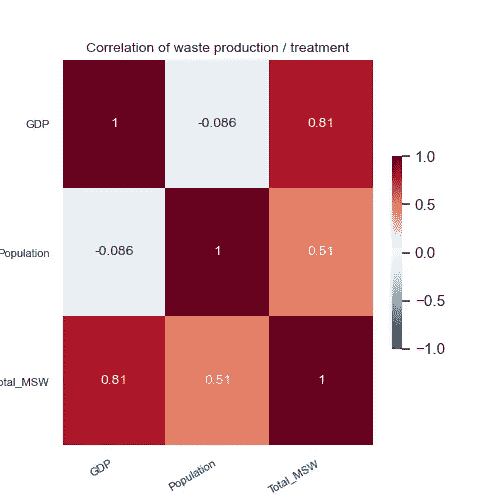
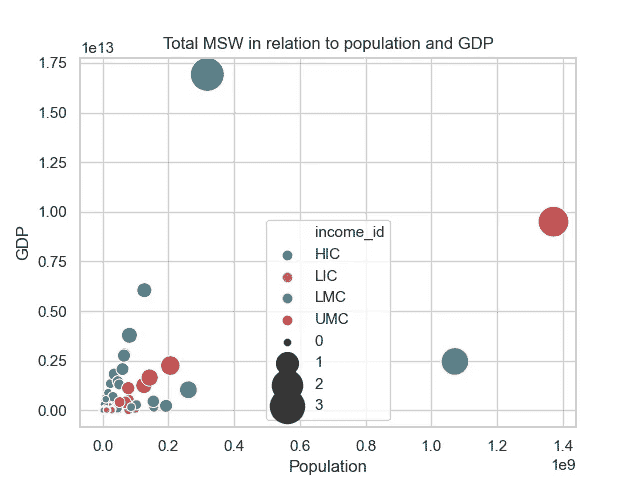
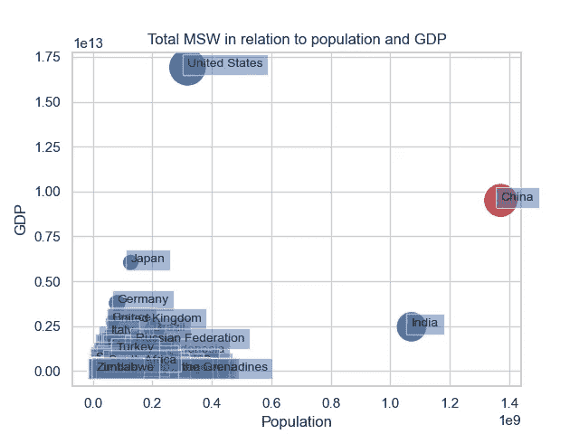
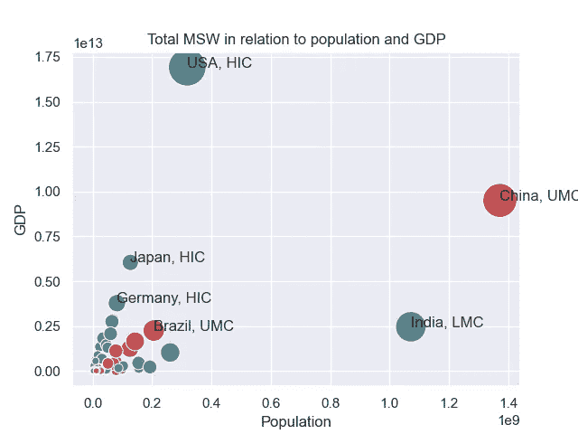

# 魔镜魔镜，谁是最大的垃圾虫？

> 原文：<https://medium.com/codex/mirror-mirror-on-the-wall-who-is-the-biggest-litterbug-of-all-36be24db77e0?source=collection_archive---------4----------------------->

## [法典](http://medium.com/codex)

## *使用 Seaborn 散点图，根据三个特征(国内生产总值、人口和城市固体废物总量)对产生更多废物的国家进行排名*


照片由[安德烈·木桐](https://unsplash.com/@andremouton?utm_source=unsplash&utm_medium=referral&utm_content=creditCopyText)在 [Unsplash](https://unsplash.com/s/photos/mirror?utm_source=unsplash&utm_medium=referral&utm_content=creditCopyText) 上拍摄

我上一篇[文章](/datadriveninvestor/trends-in-waste-mismanagement-an-exploratory-data-analysis-of-the-worlds-waste-d412fe179f93)的探索性数据分析，让我一窥世界的浪费。然而，我做这个项目是为了磨练我的编程技能、可视化以及最终的机器学习。这个项目激起了我的兴趣，我想知道哪些国家是世界垃圾的最大来源。

我的第一个想法是使用 rank()函数，但是它只会根据所选择的一个特性进行排名，而不会考虑相关的方面。例如，GDP、人口和产生的城市垃圾总量是相互关联的，这是我从之前的项目中学到的。抱着这种想法，我意识到我已经为[](/datadriveninvestor/trends-in-waste-mismanagement-an-exploratory-data-analysis-of-the-worlds-waste-d412fe179f93)**文章做了一个关联矩阵(图 1)。结果如下:**

*   **国内生产总值和城市固体废物总量密切相关，相关系数为 0.8。**
*   **GDP 与人口不相关，相关系数为~-0.09**
*   **人口与城市固体废物总量的相关系数为 0.5。**

****

**图 1:关联矩阵**

**现在，我清楚地知道，x、y 和 z 轴上的 GDP、人口和总垃圾量散点图将捕捉这三个特征之间的关系，进而向我展示世界上最大的垃圾虫。**

**所以，我去寻找密码。当我遇到这个 [Kaggle](https://www.kaggle.com/tklimonova/gapminder-graph-using-python) 条目时，我所要做的就是稍微调整它以获得这个输出(图 2)。**

```
# Store population as a numpy array: np_pop
np_pop = np.array(Total_MSW.total_msw_total_msw_generated_tons_year)#Use seaborn scatterplot for better customization
sns.scatterplot(Total_MSW['population_population_number_of_people'], 
                Total_MSW['gdp'], 
                hue = Total_MSW['income_id'],
                #legend = False,
                size = np_pop, sizes=(20,900))plt.grid(True)
# plt.xscale('log')
#plt.yscale('log')
plt.xlabel('Population in billions')
plt.ylabel('GDP in billions')
plt.title('Total MSW in relation to population and GDP')
#plt.savefig('Scatter_plot_Ranking_1.png')
plt.show()
```

****

**图 2:带图例的散点图**

**等一下…..这些更大更远的泡沫对应哪些国家？**

**是时候进行更多代码搜索了…**

**在这个阶段， [Abhijith Chandradas](https://medium.com/u/18e4c0f348aa?source=post_page-----36be24db77e0--------------------------------) 的一步一步的指导帮助了我。首先，我决定找出所有与使用这个代码的国家相对应的气泡，这就产生了这个图(图 3)。**

```
for i in range(Total_MSW.shape[0]):                      
 plt.text(x=Total_MSW.population_population_number_of_people[i]
  +0.3,y=Total_MSW.gdp[i]+0.3,s=Total_MSW.country_name[i],
  fontdict=dict(size=10),bbox=dict(alpha=0.5))
```

****

**图 3:所有国家的散点图**

**下一步是使用以下代码删除除美国、中国、印度、日本、德国和巴西之外的所有标签:**

```
plt.text(Total_MSW.population_population_number_of_people[Total_MSW.country_name=='UnitedStates'],Total_MSW.gdp[Total_MSW.country_name=='United States'],"United States", color='black', alpha=0.8) 
```

****

**图 4:选定国家的散点图**

**顺便说一下，HIC 是指高收入国家，UMC 是指中高收入国家，LMC 是指中低收入国家。**

***你可以在这里* *找到数据和代码* [*。*](https://github.com/ShilpaMuralidhar/WasteManagement)**

*****感谢阅读！*****

**[](https://medium.datadriveninvestor.com/trends-in-waste-mismanagement-an-exploratory-data-analysis-of-the-worlds-waste-d412fe179f93) [## 废物管理不善的趋势——世界废物的探索性数据分析

### 废物管理为人们的集体习惯和生活方式提供了一个迷人的快照。从它的…

medium.datadriveninvestor.com](https://medium.datadriveninvestor.com/trends-in-waste-mismanagement-an-exploratory-data-analysis-of-the-worlds-waste-d412fe179f93)**