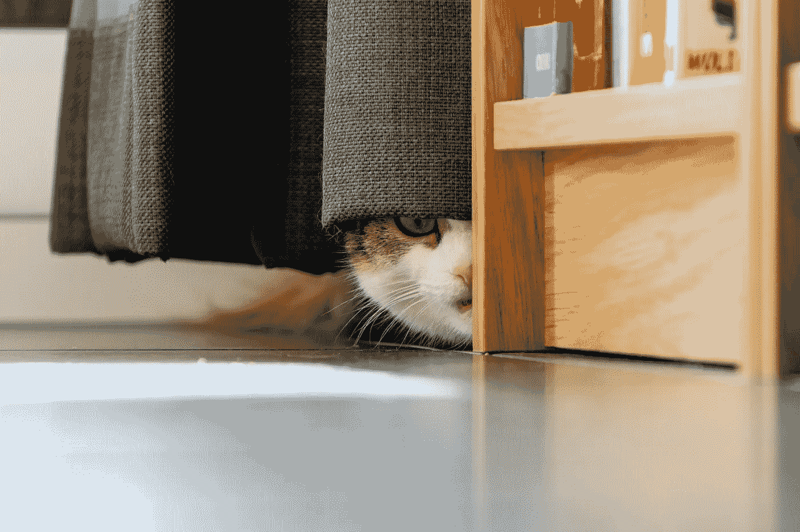

# 工作场所的不信任，家庭的不信任

> 原文：<https://medium.com/codex/mistrust-in-the-workplace-mistrust-at-home-d77a318b4dc9?source=collection_archive---------4----------------------->

工作监控正迅速变得无处不在，尤其是对于远程工作人员，这是完全不可接受的。

托马斯·博尔曼斯在 [Unsplash](https://unsplash.com/s/photos/hidden?utm_source=unsplash&utm_medium=referral&utm_content=creditCopyText) 上拍摄的照片

一些现代工作场所仍然坚持不合时宜的独裁信念，即效率与你整天坐在办公椅上盯着屏幕的时间直接相关。