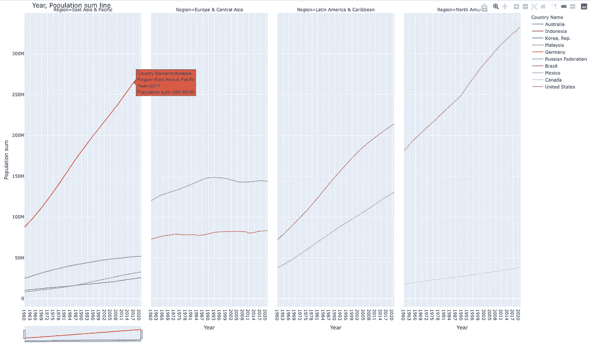

# 米托:将 Python 变成强大的电子表格

> 原文：<https://medium.com/codex/mito-turn-python-into-powerful-spreadsheets-45c5f9b04d4?source=collection_archive---------4----------------------->

## 以前所未有的速度加快您的分析

米托图表|作者图片| [来自世界银行的数据](https://data.worldbank.org/indicator/SP.POP.TOTL)

无论您是 Python 新手还是已经是 Python 专家，这个库绝对值得一试。米托是一个 Python 库，它在 Jupyter Notebook 中运行电子表格，同时生成相应的 Python 代码，用于生成在电子表格上完成的操作。