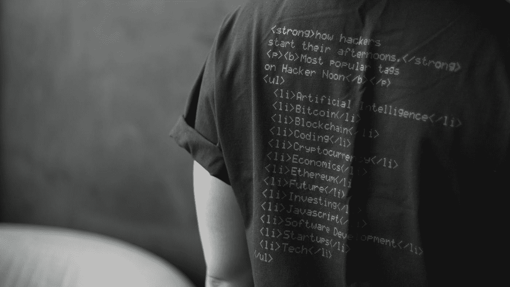

# 米特 ATT 和 CK 框架

> 原文：<https://medium.com/codex/mitre-att-ck-framework-ead9ec083928?source=collection_archive---------1----------------------->

[黑客正午](https://unsplash.com/@hackernoon?utm_source=medium&utm_medium=referral)在 [Unsplash](https://unsplash.com?utm_source=medium&utm_medium=referral) 上的照片

**简介**

根据行业标准，对手的平均驻留时间为六个月，这表明从渗透(进入网络)到被检测到大约需要六个月的时间。六个月是一段很长的时间。

即使你是一个成功进入网络的初级攻击者，你也可以在六个月内完成大量工作。当它来的时候…