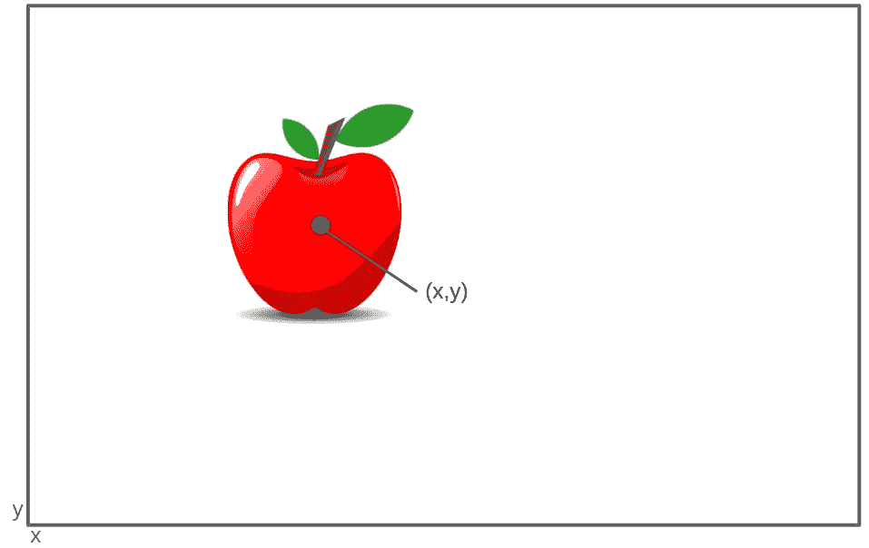

# MLP 的应用与结构上的调整

> 原文：<https://medium.com/codex/mlps-applications-with-tweaks-in-its-structure-c9aa3f05578?source=collection_archive---------7----------------------->

MLP 与其他方法不同的一点是，我们可以调整许多参数，这些参数可以分为两个用途。第一，执行不同的分析，第二，产生更好的性能。在本帖中，我们将探讨第一个问题。但是在我们进入细节之前，让我们回顾一下 MLP 的结构。

MLP 结构

# 调整回归结构

***TL；*博士**

应如何针对回归调整参数的摘要

## 对输出图层中的变化执行不同的回归

当你考虑一个回归问题时，你首先想到的可能是预测一个单一的数字。例如，它可以预测房价或工资。这类问题称为单变量回归问题。

但是有时候，你需要一次预测多个数值。例如，如果您对图像中苹果的位置感兴趣，

多元回归问题的例子

你需要一个同时预测两个数值的模型:x 和 y，这类问题称为多元回归问题。

根据输出图层的形状，您可以执行其中一项操作。基本规则是 MLP 预测的每个值对应一个输出神经元。因此，对于单变量回归，MLP 的输出层只需要一个输出神经元。为了预测苹果的位置，MLP 需要两个输出神经元。

一元和多元回归的 MLP 结构

## 输出神经元的激活功能取决于你想要哪个输出

当你在输出神经元中使用激活函数时，你就限制了输出的范围。所以一般来说，你不会在输出神经元中包含激活函数。

但是，有些情况下你需要它们。例如，如果你在预测一个价格，那么输出为负是没有意义的。在这种情况下，您可以使用 Relu 或 softplus 来确保每个输出都是正的。

Relu 和 softplus 图

另一方面，在预测概率时，您可能希望输出范围从 0 到 1 或 0 到 100。在这种情况下，您可以使用 logistic 或 tanh 并相应地缩放以获得所需的输出边界。

逻辑和双曲正切图

## 培训期间的回归评估指标

常规指标是计算(实际-预测)平均值的均方误差。但是，如果存在大量异常值，即使模型非常适合非异常值，对实际值和预测值之间的差值求平方也不可避免地会得到较高的值。所以在这种情况下，你可以用平均绝对误差来代替。

# 调整分类结构

***TL；*博士**

应如何为分类调整参数的摘要

## 随着输出层的变化执行不同的分类

最基本的分类类型是二元分类，它将输出分为两类。例如，对图像是苹果还是橘子进行分类就属于这种分类。在这种情况下，使用逻辑激活函数产生输入属于正类的概率的一个输出神经元就足够了。

二元分类的 MLP 结构

有时，您可能希望同时对两个二进制类进行分类。例如，作为前面示例的扩展，您还可以同时对水果是大还是小进行分类。在这种情况下，这个问题就变成了一个多标签二进制分类，你需要做的只是简单地添加另一个输出神经元来分类大小。所以每种标签对应一个输出神经元。

多标记二元分类的 MLP 结构

或者你可能想对更多的水果进行分类，而不仅仅是苹果和橘子。这种分类称为多类分类。如果您尝试使用与上述相同的激活函数，那么网络将必须比较每一对类，因为逻辑激活函数一次只能比较两个类。因此，如果你的目标是对 9 种水果进行分类，这将需要 36 个输出神经元，因为有 36 种组合。这似乎是一个很小的数字，但是当你想对越来越多的类进行分类时，这就成了一个问题，因为这个数字呈指数增长。

因此，您应该为每个使用 softmax 激活函数的类使用一个输出神经元，而不是一个具有逻辑激活函数的输出神经元。

多类分类的 MLP 结构

但是什么是 softmax 函数呢？

## 输出每个类的概率**s-soft max 函数**

简单地说，您可以将 softmax 函数视为逻辑函数的扩展版本。如上所述，逻辑函数给出了观察值属于两个类之间的正类的概率。与逻辑函数不同，softmax 函数给出所有类的概率。所以，如果它输出[0.2，0.7，0.1]，就说明这个观测值极有可能属于第二类。这背后的数学原理是使用下面的等式将隐藏层提供的数字向量转换为概率向量。

softmax 函数的等式

例如，如果给定[1，2，3]，您可以将 1 转换为概率，如下所示。

给定[1，2，3]时的 Softmax 函数示例

当同样的等式应用于 2 和 3 时，它产生大约 0.2447 和 0.665，这些输出最终都加起来是 1。

## 培训期间的分类评估指标

由于 logistic 和 softmax 函数都输出概率分布，最常见的损失函数是交叉熵，它使用以下公式来测量实际和预测概率分布之间的差异。

p(x)代表真实概率分布，q(x)代表预测概率分布

一个例子可以帮助你理解它的计算是如何工作的，以及一个网络如何在训练中使用它。例如，假设我们有三个类，称为 a、b、c，以及一个属于 b 类的观察值。由于该观察值只能标记为 b，因此真实的概率分布可以描述如下。

真实概率分布

当这个观察值被传递到网络 A 中时，该网络产生下面的预测概率分布。

预测概率分布 A

既然我们有了真实的和预测的概率分布，我们可以计算它的交叉熵。

给定[0.2，0.7，0.1]时计算交叉熵

但是当观察结果被传入网络 B 时，就会产生一个不同的预测概率分布。

预测概率分布 B

利用这个概率分布，我们得到如下所示的交叉熵值 0.693。

给定[0.4，0.5，0.1]时计算交叉熵

在两个网络之间，A 的交叉熵值比 B 低。当我们研究概率分布时，A 的预测概率分布比 B 的更接近真实概率分布。这意味着给出较低交叉熵值的网络更能描述真实的关系。因此，它更有可能在训练中被选中。所以在我们的例子中，更好的网络是 a。

# 参考

[1]j .布朗利(2020 年 12 月 22 日)。*机器学习交叉熵的温和介绍*。机器学习精通。检索于 2021 年 10 月 27 日，来自[https://machinelingmastery . com/cross-entropy-for-machine-learning/。](https://machinelearningmastery.com/cross-entropy-for-machine-learning/.)

[2]j .布朗利(2020 年 6 月 23 日)。*用 python 实现 Softmax 激活功能*。机器学习精通。检索于 2021 年 10 月 27 日，来自[https://machinelementmastery . com/soft max-activation-function-with-python/。](https://machinelearningmastery.com/softmax-activation-function-with-python/.)

[3]杰龙，A. (2017)。*用 Scikit-Learn、Keras & TensorFlow 进行动手机器学习:构建智能系统的概念、工具和技术*。奥赖利。

[4] stackoverflowuser2010。(2017 年 2 月 1 日)。*什么是交叉熵？*堆栈溢出。2021 年 10 月 27 日检索，来自[https://stack overflow . com/questions/41990250/what-is-cross-entropy/41990932。](https://stackoverflow.com/questions/41990250/what-is-cross-entropy/41990932.)