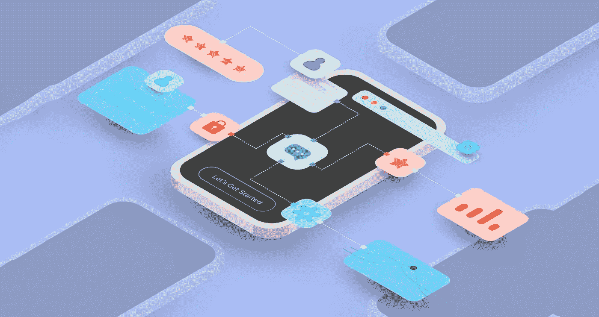
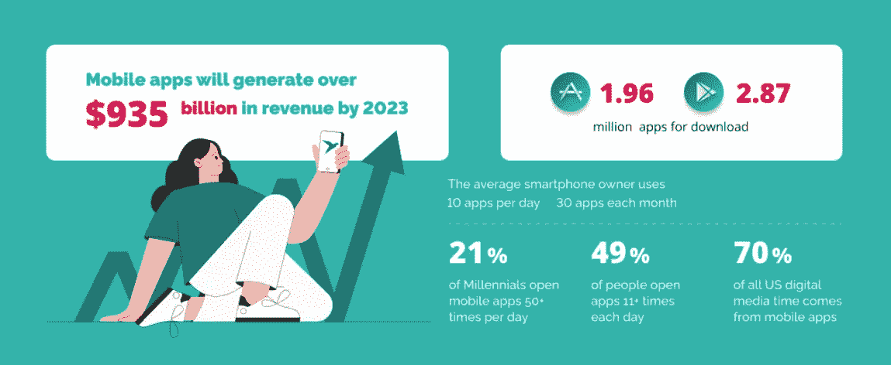
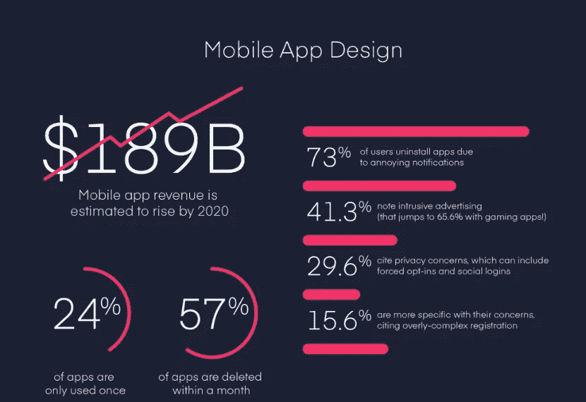
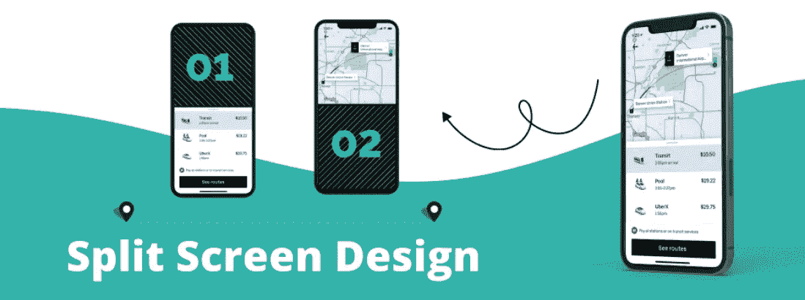
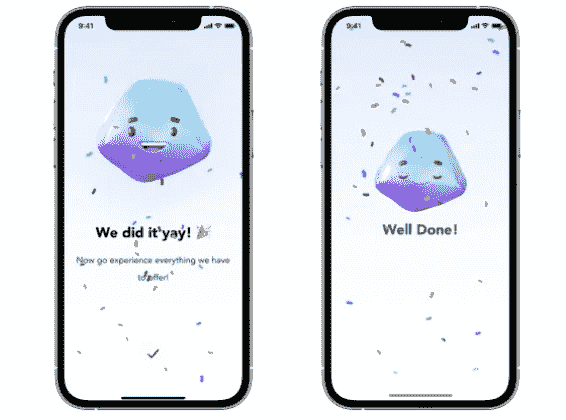
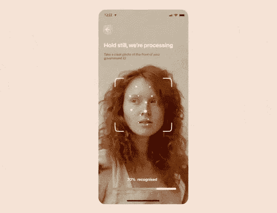
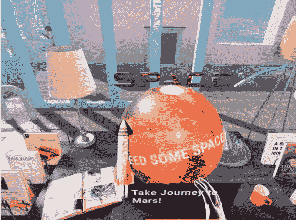
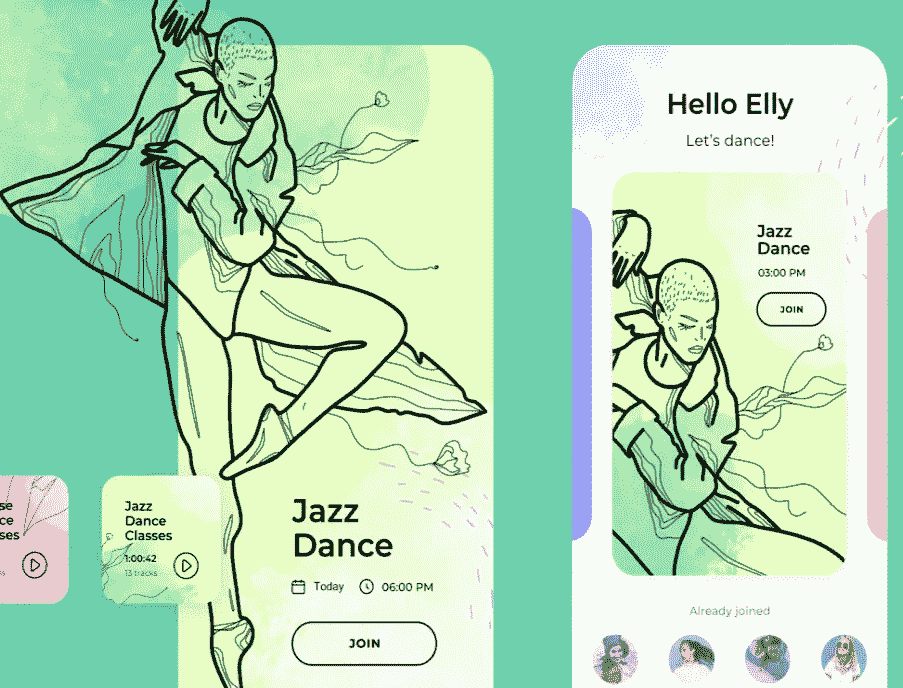
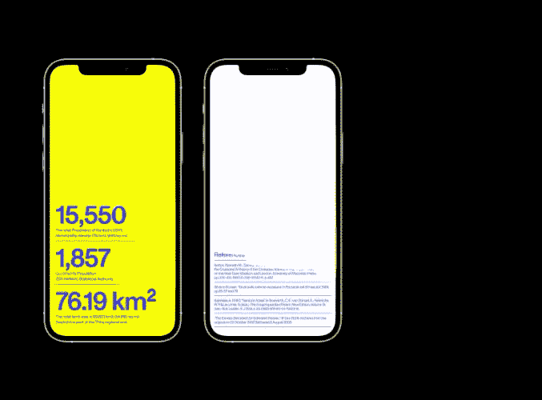
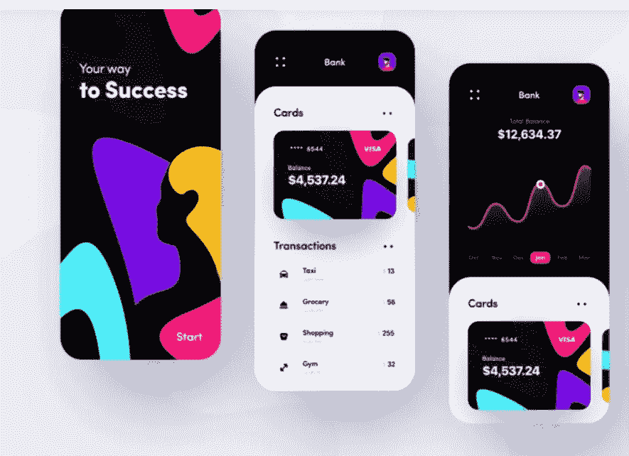

# 2022 年你应该知道的革命性 7 大移动应用设计趋势

> 原文：<https://medium.com/codex/mobile-app-design-trends-8db3eec5fd26?source=collection_archive---------6----------------------->

> **“如果你认为好的设计很昂贵，你应该看看坏设计的成本”** —捷豹路虎首席执行官 Ralf Speth 博士

这句话清楚地表明，好的设计有助于企业无缝地超越竞争对手。根据设计管理研究所进行的一项研究，那些关注这一领域(设计)的人观察到有 50%以上的忠诚客户。因此，这足以描述很多范围，特别是在企业构思的移动应用程序中。

换句话说，把重点放在 [**手机 app 设计上是极其关键的。**](https://www.xongolab.com/blog/how-to-create-stunning-mobile-app-design/) 这不仅有助于确保最大限度地吸引客户。同时，它也将让位于帮助应用程序尽可能无缝和完美地工作。

在下面的几行中，我们将更详细地解释这个领域。

让我们开始吧。

> ***手机 App 设计的意义***

请看下图。

图片来源:techmagic.co

看看这张图，你就能理解一个移动应用对一个企业的整体盈利范围。它包括每天使用应用程序的客户的百分比。

这些数字清楚地表明，如果一个应用程序是成功的，这是很自然的，设计也是直观和互动的。换句话说，在一个应用程序中，直观性和交互性的百分比很高，该应用程序将在短时间内捕获最大用户。

因此，最重要的是理解移动应用程序的设计需要尽可能简单。

这同样会在许多方面帮助应用程序。我们将在下面的几行中向您详细解释。

在此之前，我们想让你看看下面这张图片。

图片来源:invisionapp.com

上图有助于你理解由于糟糕的设计导致的应用卸载的百分比。它还可以让你很容易地洞察到一个手机应用程序通过整合一个好的设计策略所能获得的总收入。

***它给他们提供了以下好处。***

*   保持用户参与应用程序，因为它不拥有任何错误或异常等等。
*   通过设计良好的应用程序，直观的功能变得易于交付。换句话说，如果界面是交互式的；用户可以在应用程序中无缝导航，并通过它执行他们希望执行的功能。
*   帮助企业无缝地扩大用户群，从而使他们更容易在短时间内赚取更多利润。

了解这些好处；我们相信你能理解移动应用设计的 [**元素**](https://www.uxmatters.com/mt/archives/2022/04/10-elements-to-consider-when-designing-a-mobile-app.php) 对于一个移动应用的成功是多么的重要。

然而，重要的是在这里添加；移动应用程序设计不能停滞在一个地方。开发者需要了解当前的趋势，以便设计尽可能的独特。

所以，废话不多说，让我们向你展示 2022 年的移动应用设计趋势，这将有助于你的应用吸引最大比例的用户的注意。

## 1.分屏设计

图片来源:techmagic.co

老是金。对于分屏设计趋势来说，这句话没错。尽管目前这是一种流行趋势，但它的相关性一直在健康增长，尤其是在最近几年。

这是因为它为应用程序实现高效提供了支持。换句话说，在与应用程序交互的同时，用户可以很容易地从分屏中选择他们想要的东西。

你可以在优步和许多流行的驾驶应用中观察到这种趋势。它帮助用户获得与旅行相关的详细信息，使获取这些信息变得容易。

## 2.运动和动画设计

图片来源:appssemble.com

这是开发人员应该了解的另一个趋势。这是其中存在的交流元素的结果。

更详细地解释这一点，运动和动画设计在帮助应用程序为微交互提供微妙反馈方面充当了应用程序的救星。这有助于无缝地吸引用户的注意力。

同时，这也将大大有助于确保应用程序的可用性不断增长。所有这些都将有助于你的应用获得更多的用户，从而帮助你获得长期的可见性。

## 3.Face ID

图片来源:fireart.studio

我们相信你一定知道 Face ID 科技。如果没有，这是一项让用户能够瞥一眼移动设备屏幕的技术。一旦他们这么做了，屏幕就会解锁。

虽然这项技术在 2017 年首次崭露头角，但现在几乎所有的移动应用程序都在使用这项技术。这对于提高应用程序特性的安全级别大有帮助。这是为了确保用户在使用时更有安全感。

## 4.增强现实

图片来源:fireart.studio

了解 UI 中的增强现实如何使设计看起来更具交互性？因此，这一趋势值得关注。

它将帮助用户与应用程序无缝互动；使用其中的产品或服务。

因此，总的来说，它将帮助用户了解他们是否应该继续使用该应用程序的服务。

因此，你需要在 2022 年利用这个趋势。这将有助于产生更多的销售和吸引更多的线索，最终将证明是一个非常好的商业主张。

## 5.插图

图片来源:fireart.studio

插图是另一个你应该知道的移动应用设计趋势。这将有助于你让你的企业脱颖而出，并帮助你完美地展示你的品牌。同时，这也有助于以最清晰、最简单的方式传达你想要传达的信息。

它也将帮助你实现这些领域-

*   加快用户与方法的交互
*   简化决策

***注:*** *要做到这一点，你需要保持对一种风格的专注。这将有助于用户了解你使用的设计，从而无缝地增强他们的识别能力。*

## 6.不寻常的排版

图片来源:bootcamp.uxdesign.cc

你是那种相信多走一步就能脱颖而出的人吗？如果是的话，你应该在你的应用程序中使用不寻常的字体。这将有助于你的应用在其他应用中脱颖而出，并确保更多的用户被你的应用所吸引。

因此，尽可能地尝试使用字体。这将有助于立刻抓住用户的注意力。

然而，重要的是要尽可能保持字体的响应性和可读性。这将有助于确保你的用户长期被你的应用程序所吸引。

## 7.未来派色彩

图片来源:dribbble.com

看看这些颜色给应用程序带来的吸引力。这有助于使它看起来更有吸引力。

于是，利用这种趋势来 [**打造一款杀手级的手机 app 设计**](https://javascript.plainenglish.io/ui-ux-design-trends-to-build-mobile-app-bba6562b6f04) 。这将有助于应用程序在相当长的时间内吸引用户的注意力。同时，它还将增强整体用户体验。

这两个同时将有助于企业获得更广泛的用户基础，并最大限度地提高他们的投资回报率。

除了上面提到的趋势，你也可以在你的移动应用程序设计中使用它们。这将使你的应用程序有一个突出的外观，使应用程序很容易抓住最大比例的客户的注意力，并获得良好的投资回报。

*   根据[苹果开发者论坛](https://developer.apple.com/forums/)的黑暗模式有用户更喜欢这个。所以，其实还是挺有帮助的！这不仅有助于你的应用看起来时髦。此外，它将帮助用户在操作应用程序时防止眼睛疲劳。
*   语音交互改善整体用户体验。Siri 和 Alexa 已经利用了这一趋势，这将帮助用户无缝地与应用程序交互，获得快速帮助等。

此外，您可以将这些趋势包括在内，供那些可能有特殊能力的用户使用。

*   尽量避免在网站或应用程序元素中包含精确点击。
*   创建图像地图。
*   使用相关大小的文本，以便信息易于处理。
*   对于有视觉障碍的人，请在图像中使用替代文本。

***片尾语***

业务增长依赖于对新趋势的完美利用。随着移动应用占领市场，预测设计的相关性变得很容易。事实上，设计需要尽可能直观，以确保用户长时间的注意力。

因此，它也要求纳入一些趋势。这将增强外观，使应用程序更具视觉吸引力。

因此，如果你想让你的应用程序驱动最大的投资回报率，确保你知道有助于无缝实现这一目标的趋势，而不会面临任何障碍。