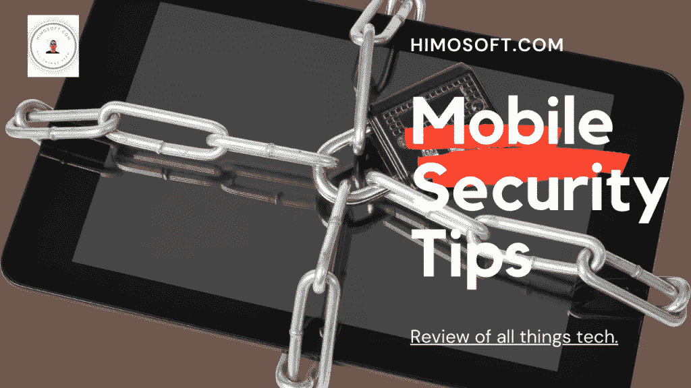

# 移动安全:用这 8 个技巧保护你的智能手机

> 原文：<https://medium.com/codex/mobile-security-protect-your-smartphone-with-these-8-tips-ff084b11ee09?source=collection_archive---------25----------------------->

移动安全可以定义为保护移动设备免受网络攻击和未授权访问的防御措施。一些攻击包括病毒、恶意软件、特洛伊木马、蠕虫和黑客攻击。虽然移动恶意软件可以影响所有设备，但移动网络钓鱼攻击是最突出的攻击之一。随着智能手机的加入，您的计算机面临的安全威胁也成倍增加。

如果你正在读这篇文章，你可能有一部智能手机。你现在应该知道，我们生活在一个数字世界，没有什么比你的个人信息对黑客更有价值。

电话窃听是一件非常可怕的事情，当我们有电话窃听时，我们很多人都会时不时地忘记它。无论你认为你的手机数据是安全和隐私的，或者如果你真的认为你的手机数据是不安全和隐私的，它永远不可能是完全安全的。然而，通过几个步骤和安全措施，你可以让你的手机更加安全。因此，这里有一个移动安全和隐私的快速指南:

## 移动安全:安全和密码保护您的手机

首先，确保你的手机有密码保护并且安全是很重要的。有了强密码，你就可以打安全电话了。虽然有几种方法可以进行安全通话，如使用指纹、面部识别、蓝牙、触控 ID 或 Face ID，但您的主要选择应该是密码。您可以使用类似于 [Vaultor](https://play.google.com/store/apps/details?id=com.netqin.ps&hl=en&gl=US) 或 [Duo Security](https://play.google.com/store/apps/details?id=com.duosecurity.duomobile&hl=en) 的安全应用程序，或者使用 Passguard 进行单因素认证来保护您的手机。

## 启用位置设置

这是很多用户忘记的一件事。如果你在追踪一家餐馆或一个约会，你可以只检查手机上的位置设置，找到你要去的地方。这可能是有用的，尤其是如果你在出差，因为你不必在迷路的情况下寻求同事的帮助。

## 获取密码管理器

你可能会使用一个应用程序来跟踪你的密码或保持跟踪你的密码，但你也应该使用密码管理器以更安全的方式存储你的密码。密码管理器还可以让您将密码保存在网站或应用程序上，这样您就不必每次都输入密码，从而节省时间和能源。大多数密码管理器也支持 2FA(双因素认证)。

## 使用一个应用程序保护所有其他应用程序

如果你在不同的设备上运行同一个应用程序(比如你的 Android 手机和 iPad)，你应该确保同一个应用程序可以保护所有的设备。

## 移动安全:禁用位置设置

请务必仅在需要 It 服务时使用您的位置设置，并且在不需要时禁用位置服务。所以，如果你不需要定位服务，那就禁用它们，但如果你确实需要，那就启用它们。

## 停止不安全的应用

而且，如果你不需要这个应用程序，你也不使用它，那么禁用它。例如，如果你在找一个公共厕所，你可能不需要分享你的位置来找到它，但是如果你在市场上找一套公寓，那么你可能也不想分享这些信息。

## 阻止所有应用

因为让你的电话一直响或者不断被不想要的通知打扰是很烦人的。您可以阻止来自特定应用程序的通知或阻止所有通知。

## 移动安全:禁用无线共享

最后，你应该禁用手机上的 Wi-Fi 共享。使用 Wi-Fi 共享将使附近的任何设备(如您的平板电脑)都能轻松访问您的 Wi-Fi 互联网接入。但是，这也会邀请其他设备连接到您的家庭网络，这可能会侵犯您的个人空间和隐私。因此，您可以删除共享的 Wi-Fi 连接，或者关闭正在使用 Wi-Fi 共享的设备。

这些是一些基本的预防措施，可以让你的手机更安全，保护你的隐私，你不必买一个更昂贵的手机来做到这一点，而是，这些预防措施可以在你拥有的任何手机上采取。

在当今世界，几乎所有智能手机的软件中都带有某种形式的移动安全和隐私功能。但是，其中一些功能是默认禁用的，我们大多数人甚至不知道这些功能。在我们的现代生活中，很难避免风险。互联网是当今最大的信息资源，但也让人们变得脆弱。

保护您的手机并确保您的信息只供您自己使用是一项重要的任务，需要您的关注和重视。使用这些提示来保护您的手机，提高手机的整体安全性。

感谢您今天访问 Himosoft.com。请在评论中分享你对此的想法。