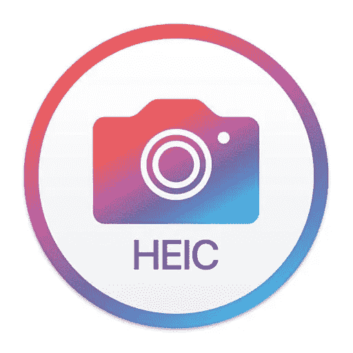
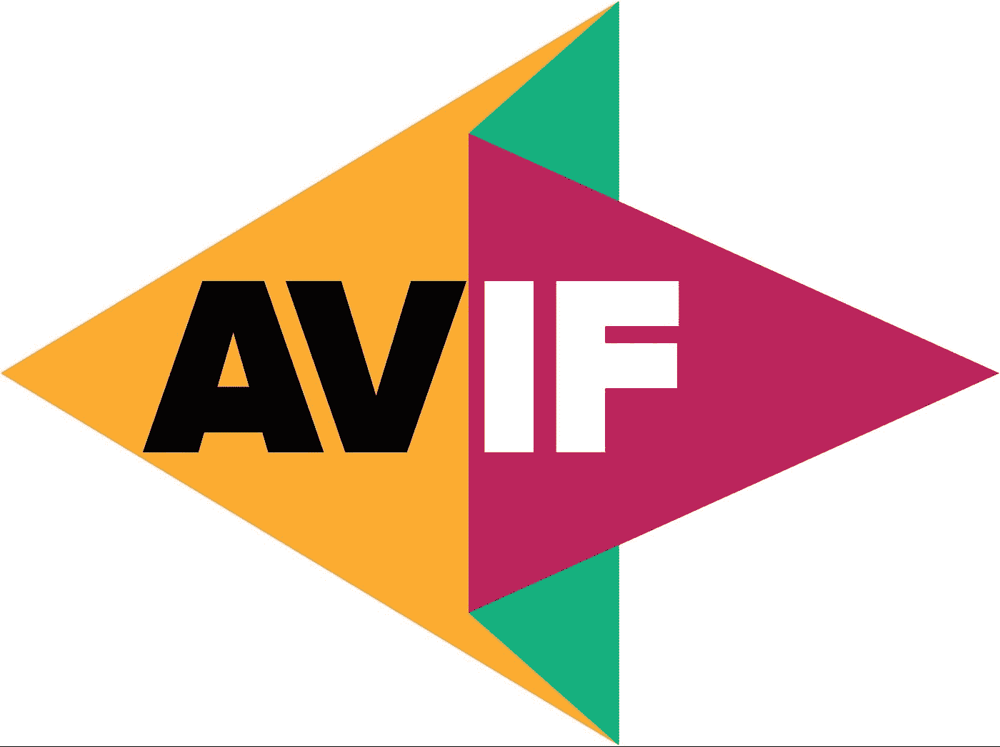
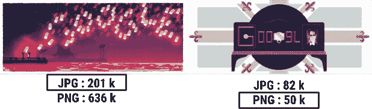
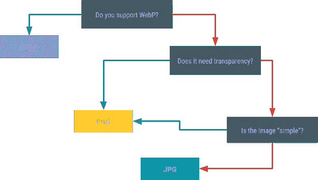

# 移动应用程序的最佳图像格式

> 原文：<https://medium.com/codex/mobile-what-image-format-should-i-use-39b44e9f86fc?source=collection_archive---------5----------------------->

Karolina Grabowska 的照片:[https://www . pexels . com/photo/photo-of-a-person-hang-an-empty-picture-frame-8947560/](https://www.pexels.com/photo/photo-of-a-person-hanging-an-empty-picture-frame-8947560/)

在多年的应用程序开发中(在 iOS 和 Android 平台上)，我遇到了同样的问题，我应该使用什么格式，这种操作系统(Android 或 iOS)的最佳格式是什么，这种操作系统版本，以及设备拥有的硬件，它能运行我构建的性能吗？我决定写这个问题。在下面的文字中，我将描述各种格式，以及如何和何时使用它们。

# ios

iOS 11+ —从 iOS 11 开始，苹果推出了一种新的 iPhone 照片格式，`HEIC`格式，适用于 iOS 设备。与`JPG`相比，`HEIC`在保持相同图像质量的同时，在文件大小方面更高效。

iOS 10 —在 iOS 11 之前，推荐的图像格式是`PNG`。

## HEIC vs 巴布亚新几内亚

与常用图像文件格式(即`PNG`)相比，新文件格式`HEIC`存储的图像文件更小。

尽管`HEIC`图像的大小小于`PNG`图像文件，但图像质量与`PNG`格式相似。

与`PNG`文件相比，`HEIC`文件更加灵活，因为它可以存储单个图像或图像序列。而另一方面，`PNG`文件只能保存一幅图像。

除此之外，`HEIC`文件还包含一个图像及其元数据。

## HEIC 与 JPEG

**压缩**
`HEIC`提供了比旧的`JPEG`格式更高效、更现代的压缩方法。`HEIC`在不影响质量的情况下，将图像分割成更小的文件。

**存储空间** 在电脑、平板电脑或智能手机上，大多数`HEIC`文件占用的空间都比`JPEG`小得多。他们创新的压缩流程意味着`HEIC`可以使用的空间只有`JPEG`文件的一半。

**画质** 在压缩和画质两方面，`HEIC`文件都胜过`JPEG`。`HEIC`格式可以通过透明度和更宽的动态范围功能来提高照片的质量。

**兼容性**
虽然`JPEG`几乎具有普遍兼容性，`HEIC`文件则没有。`HEIC`近年来变得越来越常见，但它的主要用途是在苹果设备上。将照片从 iPhone 传输到 PC 时，你甚至可能需要将你的`HEIC`文件转换成`JPEG`。

**透明**
`HEIC`支持图像透明的方式与`PNG`文件类似，另一方面，`JPEG`格式不支持透明。

## 额外注释

但这并不是结束，在仍然支持 iOS 11 的旧设备(例如 iPhone 6)上，`HEIC`可能仍然可以工作，但由于缓慢的硬件，它可能需要很长时间来渲染一个`HEIC`格式的图像。
这意味着 iOS 版本并不是决定图片格式的唯一参数，它也应该来自于设备本身。

# 机器人

Android 4.2.1- —旧 Android 版本的推荐图像格式为`PNG`

Android 4.2.1 (API level 17)+ —增加了对`webp`的支持。

Android 12+—Android 12+上增加了对`AVIF`的支持。

## WebP vs PNG

这种格式为图像提供了卓越的无损和有损压缩。使用`webp`，开发者可以创建更小、更丰富的图像。`webp`无损图像文件平均比`PNG`小 26%。这些图像文件还支持透明度(也称为 alpha 通道),成本只是多 22%的字节。作为一种格式，WebP 可以支持有损和无损两种模式，这使它成为 PNG 和 JPG 的理想替代品。唯一需要记住的是，它只在运行 Android 4.2.1 (API level 17)及更高版本的设备上有原生支持。幸运的是，大多数设备都满足这一要求。

## WebP 与 JPEG

根据这项[研究](https://developers.google.com/speed/webp/docs/webp_study)，我们看到，与 JPEG 文件相比，WebP 文件的平均大小要小 25%-34%，研究结果表明，与 JPEG 相比，WebP 可以提供显著的压缩改进。

## 背景

`AVIF`是使用`AV1`编码的图像和图像序列的容器格式。`AVIF`利用视频压缩中的帧内编码内容。与旧的图像格式(如`JPEG`或`PNG`)相比，这极大地提高了相同文件大小的图像质量。

## AVIF 对巴布亚新几内亚

作为一种无损压缩文件格式，`PNG`图像因其较大的文件大小而臭名昭著。`AVIF`支持有损和无损压缩。正是这种多功能性给了`AVIF`在文件大小方面的优势。

解码一个`PNG`是即时的，由于缺乏复杂性，`AVIF`往往更复杂，因此较慢的系统可能会更难解码图像。

目前，`PNG`仍然是无损压缩的最佳格式，具有更小的文件大小和更好的平台支持。如果您愿意使用有损压缩来减小文件大小，那么`AVIF`是一个很好的交付替代方案，但是它的复杂性可能会让使用旧硬件的旧平台难以渲染。

## AVIF vs JPEG

**质量** `JPEG`今天在压缩质量方面遭受损失。事实上，即使是更现代的 JPEG 2000 也能提供更好的整体压缩效果。
另一方面,`AVIF`倾向于提供一些我们可以用有损的非摄影图像实现的最佳效果。
那些处理低保真度图像的人`AVIF`会比`JPEG`表现得更好。但是也有缺点，`AVIF`图像不支持渐进式渲染，所以文件必须完全下载后才能显示。

**速度对比** `JPEG`已经过时，写于多核 CPU 芯片发明之前。它不是为处理多个内核的顺序进程而设计的。
`AVIF`可以与多个内核并行工作，这使其成为更适合的图像压缩形式。

**动画** `JPEG`是一种图像格式。这意味着它被设计成显示静止图像。
`AVIF`是基于一个实际的视频编解码器，并提供动画能力，这意味着它可以支持动画和`JPEG`不能。

**总的来说** 尽管`JPEG 2000`比最初的`JPEG`格式有了很大的改进，但它在许多方面仍然无法与 AVIF 竞争:
`AVIF`已经成为那些需要在低带宽设置中管理编码的人的理想选择，尽管`JPEG`支持渐进式渲染，但它仍然缺乏`AVIF`提供的许多功能。

## 额外注释

一些硬件较慢/较旧的设备可能能够获得基于其 Android 版本的`AVIF`或`webp`，但其硬件可能无法呈现这些格式(由于内存不足)或可能需要很长时间(由于处理器/图形处理器较慢)。
与 iOS 相同，Android 的最佳格式不能仅基于 Android 版本来确定，我们还必须考虑 Android 设备。

# 旧版本格式

## PNG vs JPEG

我想在这里提出另一点，对于旧版本，我确实说过 PNG 将是最佳图像格式，但这并不总是正确的，`PNG`与`JPEG`的决定应该基于图像的复杂性，而不仅仅是基于它们运行的平台。
例如:

[https://developer . Android . com/develop/ui/views/graphics/reduce-image-sizes](https://developer.android.com/develop/ui/views/graphics/reduce-image-sizes)

上面的图片显示了两张图片，根据开发者应用的压缩方案不同，它们会有很大的不同。左边的图像有许多小细节，因此用`JPG`压缩更有效。右边的图像具有相同的颜色，使用`PNG`可以更有效地压缩。

# 安卓如何选择一种格式？

下图提供了一个简单的可视化效果，帮助您决定使用哪种压缩方案，这是应该考虑的一件事，如果设备支持 Android 12+您应该考虑(基于我在这里描述的限制)使用`AVIF`。

[https://developer . Android . com/develop/ui/views/graphics/reduce-image-sizes](https://developer.android.com/develop/ui/views/graphics/reduce-image-sizes)

# 如何为 iOS 选择一种格式？

考虑到我之前提到的限制，决定应该很容易，iOS 11+应该总是使用`HEIC`较低的 iOS 版本应该选择`PNG`。

# 结论

选择图像格式不是一件容易的事情，你必须考虑许多参数，如操作系统版本、设备和图像复杂性。
我们总是可以选择简单的方法，将`JPG`设置为一切，但是如果我们想要更好的性能、更快的加载时间和更好的用户体验，我们需要为每个用例选择正确的格式。

进一步阅读可以点击下面的链接:
[HEIC](https://en.wikipedia.org/wiki/High_Efficiency_Image_File_Format)
[Avif](https://en.wikipedia.org/wiki/AVIF)
[WebP](https://en.wikipedia.org/wiki/WebP)