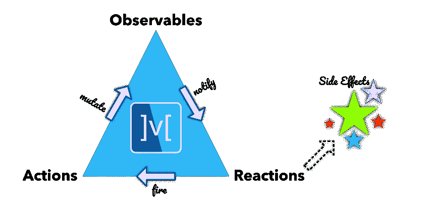

# 颤动中的 MobX

> 原文：<https://medium.com/codex/mobx-in-flutter-51dbd984ace6?source=collection_archive---------2----------------------->

## MobX 的核心是三个重要的概念:可观察性、动作和反应。


## Dart 语言的 MobX。

> *通过透明函数式反应式编程(TFRP)增强 Dart 应用的状态管理*
> 
> MobX 是一个状态管理库，它使应用程序的反应数据与 UI 的连接变得简单。这种布线是完全自动化的，感觉非常自然。作为应用程序开发人员，您只需关注 UI(和其他地方)中需要使用哪些反应性数据，而不必担心保持两者同步。
> 
> 这不是真正的魔术，但它确实有一些关于什么被消费(可观察)和哪里(反应)的智能，并自动为您跟踪它。当*观察值*改变时，所有*反应*重新运行。有趣的是，这些反应可以是任何事情，从简单的控制台日志、网络调用到重新呈现 UI。
> 
> 对于 JavaScript 应用程序来说，MobX 是一个非常有效的库，这个 Dart 语言的移植旨在带来相同水平的生产力。

# 核心概念



> 在 IDE 中打开项目后，导航到您的`/pubspec.yaml`文件以添加依赖项。用以下代码片段替换`dependencies`部分:

```
dependencies:
  flutter:
    sdk: flutter
  mobx: ^0.3.5
  flutter_mobx: ^0.3.0+1
  shared_preferences: ^0.5.3+4
```

> 然后用这段代码替换`dev_dependencies`部分:

```
dev_dependencies:
  flutter_test:
    sdk: flutter
  build_runner: ^1.6.5
  mobx_codegen: ^0.3.3+1
```

> 现在，在项目的根目录下运行这个命令来下载依赖项:

```
$ flutter packages get
```

## MobX 的核心是三个重要的概念:可观察性、动作和反应。

> 一个简单的反应式计数器由以下可观察值表示:

```
**import** 'package:mobx/mobx.dart';**final** counter = Observable(0);
```

> 乍一看，这确实像是一些样板代码，很快就会失控！这就是为什么我们将 [mobx_codegen](https://github.com/mobxjs/mobx.dart/tree/master/mobx_codegen) 添加到组合中，允许您用以下代码替换上面的代码:

```
**import** 'package:mobx/mobx.dart';**part** 'counter.g.dart';**class** **Counter** = **CounterBase** **with** **_**$**Counter**;**abstract** **class** **CounterBase** **with** **Store** {
  **@observable**
  int value = 0; **@action**
  **void** increment() {
    value++;
  }
}
```

# 计算可观测量

> *能衍生的，就应该衍生。自动地。*

您的应用程序的状态由*核心状态*和*派生状态*组成。核心状态是你正在处理的领域所固有的状态。例如，如果您有一个`Contact`实体，`firstName`和`lastName`构成了`Contact`的*核心状态*。然而，`fullName`是*派生状态*，由`firstName`和`lastName`组合而成。

这种*派生状态*，依赖于*核心状态*或*其他派生状态*被称为计算可观测。当它的潜在可观测量发生变化时，它会自动保持同步。

> *MobX 中的状态=核心状态+派生状态*

```
**import** 'package:mobx/mobx.dart';**part** 'counter.g.dart';**class** **Contact** = **ContactBase** **with** **_**$**Contact**;**abstract** **class** **ContactBase** **with** **Store** {
  **@observable**
  String firstName; **@observable**
  String lastName; **@computed**
  String **get** fullName => '$firstName, $lastName';}
```

在上例中，如果`firstName`和/或`lastName`发生变化，则`fullName`会自动保持同步。

# 观察者

> 应用程序中最直观的反应之一是用户界面。Observer 小部件(是`[flutter_mobx](https://github.com/mobxjs/mobx.dart/tree/master/flutter_mobx)`包的一部分)提供了一个在`builder`函数中使用的可观察对象的粒度观察器。每当这些可观的变化，`Observer`重建和渲染。
> 
> 下面是*计数器*的完整示例。

```
**import** 'package:flutter/material.dart';
**import** 'package:flutter_mobx/flutter_mobx.dart';
**import** 'package:mobx/mobx.dart';**part** 'counter.g.dart';**class** **Counter** = **CounterBase** **with** **_**$**Counter**;**abstract** **class** **CounterBase** **with** **Store** {
  **@observable**
  int value = 0; **@action**
  **void** increment() {
    value++;
  }
}**class** **CounterExample** **extends** **StatefulWidget** {
  **const** CounterExample({Key key}) : **super**(key: key); **@override**
  _CounterExampleState createState() => _CounterExampleState();
}**class** **_CounterExampleState** **extends** **State**<**CounterExample**> {
  **final** _counter = Counter(); **@override**
  Widget build(BuildContext context) => Scaffold(
        appBar: AppBar(
          title: **const** Text('Counter'),
        ),
        body: Center(
          child: Column(
            mainAxisAlignment: MainAxisAlignment.center,
            children: <Widget>[
              **const** Text(
                'You have pushed the button this many times:',
              ),
              Observer(
                  builder: (_) => Text(
                        '${_counter.value}',
                        style: **const** TextStyle(fontSize: 20),
                      )),
            ],
          ),
        ),
        floatingActionButton: FloatingActionButton(
          onPressed: _counter.increment,
          tooltip: 'Increment',
          child: **const** Icon(Icons.add),
        ),
      );
}
```

# 自动运行

Autorun 将在每次特定的可观察到的变化时运行。例如，如果我们想在每次计数器值改变时打印它，我们可以这样做:

```
autorun((_) {
  print(counter.value);
});
```

# 反应

Reaction 类似于 autorun，但是它在跟踪可观察值时给了我们更多的控制。它接收两个参数:第一个是一个简单的函数，返回第二个参数中使用的数据。

第二个参数是效果函数；这个效果函数只会对第一个函数参数中传递的数据做出反应。只有当您在第一个参数中传递的数据发生变化时，才会触发这个效果函数。

```
reaction((_) {
  return counter.value;
}, (_) {
  print('Counter changed to ${counter.value}');
});
```

# 当...的时候

When 与 reaction 非常相似，但更具体。这个函数只会对与第一个参数中传递的数据相匹配的数据做出反应。

```
when((_) {
  return counter.value == 0;
}, (_) {
  print('Counter is zero');
});
```

## 在 [MobX](https://pub.dev/packages/mobx) 中查看深层驱动

# 源代码

[](https://github.com/inamhusain/mobX_flutter.git) [## GitHub - inamhusain/mobX_flutter

### 一个新的颤振项目。这个项目是颤振应用的起点。一些帮助您入门的资源…

github.com](https://github.com/inamhusain/mobX_flutter.git)