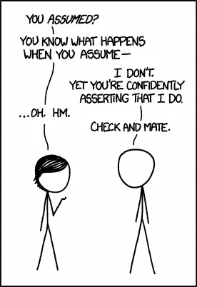

# 模仿 Spring 模板

> 原文：<https://medium.com/codex/mocking-spring-resttemplate-f38ef464d1de?source=collection_archive---------5----------------------->

就是不做。

我已经看过下面这行代码(或者其他语言中的相应版本)太多次了，以至于无法适应它。

```
val mockRestTemplate = mockk<RestTemplate>()
```

我认为这是个糟糕的主意。


Volodymyr Hryshchenko 在 [Unsplash](https://unsplash.com?utm_source=medium&utm_medium=referral) 上的照片

# 不要嘲笑你没有的东西。

为什么模仿框架元素的测试被认为是不好的？

## 它们对重构没有帮助

模拟库组件的测试通常**不能用于重构**。这样做的主要原因是因为这类测试通常“遵循代码”。由于这个原因，我们最终不得不在每次重构代码时改变测试期望，即使逻辑没有改变。

因此，进行 TDD 的一个主要好处被抛到了九霄云外。

让我举一个例子。

假设您有一个使用包含在 in 中的`RestTemplate`实例对外部端点进行 GET 调用的`APIClient`类。当测试`APIClient`类时，`RestTemplate`被模拟出来，并对其设定了期望。

```
*every* **{** template.postForEntity(
            "/customers/4520", 
            any(), 
            CustomerDetailsResponse::class.java
      )
**}** throws HttpServerErrorException("5xx from server")
```

模拟的设置使得每个对`/customers/4520`端点的`POST`调用都将模拟服务器响应 500 内部服务器错误。

然后使用模拟的`RestTemplate`实例测试处理这个 5xx 响应的`APIClient`代码。今天一切都很好，代码已经签入，管道是绿色的，是时候去当地的酒吧喝一杯了。

然而，如果由于某种原因，我们改变了实现，但是逻辑保持不变，会发生什么呢？

说我们用`RestTemplate#exchange`代替`RestTemplate#postForEntity`？

现在我们看到我们必须更新测试期望，即使逻辑上没有变化。测试不再是即将进行的变革的安全网。

## 限制未来的升级

同样——如果不重写测试，我们不能用另一个做完全相同事情的库来替换这个库。同样，这意味着这种变化没有安全网，这并不比一开始就没有编写测试更好。

## 关于外部代码的假设



[https://xkcd.com/1339/](https://xkcd.com/1339/)

在前面的例子中，我们假设 RestTemplate 抛出一个特定的异常意味着远程服务器用 HTTP 500 内部服务器异常进行响应。

这是关于应用程序和库之间的语义和契约的假设。

如果该库的未来升级要改变这些语义，就不再有安全网了，一个 bug 会悄悄溜走而不被发现。

如果这种假设在代码库中的许多地方被提出，那影响就大得多了。

# 有什么选择？

## 由图书馆提供的模拟服务器

大多数库提供了一个 web 服务器的假实现，这样你就可以测试你的 API 客户端类。

然而，我最终对它们的看法有所不同，因为它们最终“绑定”到了库上。在用一个库替换另一个库的情况下，这种测试可能没有帮助。

## **WireMock**

这是我目前首选的方法，主要是因为工具的成熟度而选择的。由于它们完全独立于实现细节，我相信它们在未来会更有弹性。

您将能够找到详细介绍如何在 JVM 中使用 WireMock 的指南，我建议您看看它是否符合您的需要。我在底部添加了官方的*6 月 5 日入门参考*。

# 结论

在进行测试时，不要忘记值。

如果测试只是在编写代码时帮助我们进行复式记账，而没有为未来的变化提供安全网，我相信价值是在你所能拥有的低端。

因此，选择更有弹性的方法来测试 API 客户端。

## 参考

1.  [https://8 thlight . com/blog/Eric-Smith/2011/10/27/thas-not-yours . html](https://8thlight.com/blog/eric-smith/2011/10/27/thats-not-yours.html)
2.  不要嘲笑你不拥有的类型[https://testing . Google blog . com/2020/07/testing-on-toilet-don-Mock-Types-you . html](https://testing.googleblog.com/2020/07/testing-on-toilet-dont-mock-types-you.html)
3.  将 Wiremock 与 JUnit 5[http://wiremock.org/docs/junit-jupiter/](http://wiremock.org/docs/junit-jupiter/)一起使用