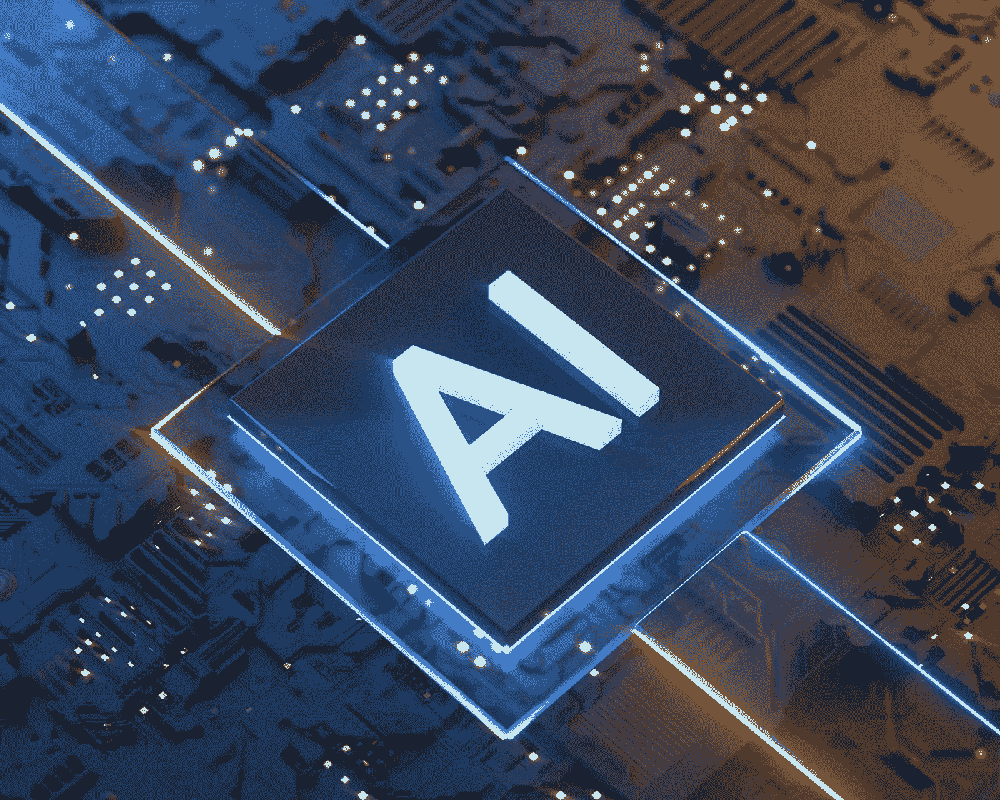
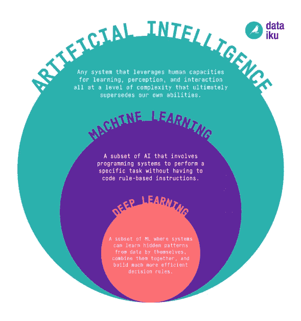
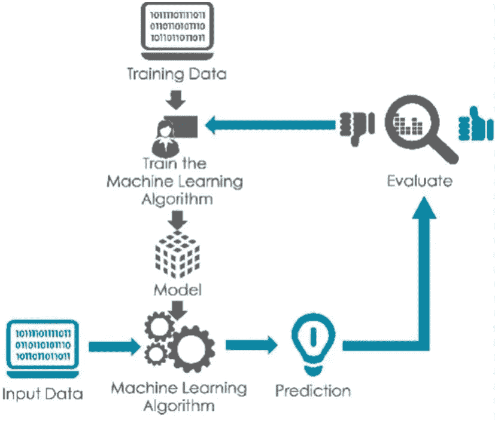
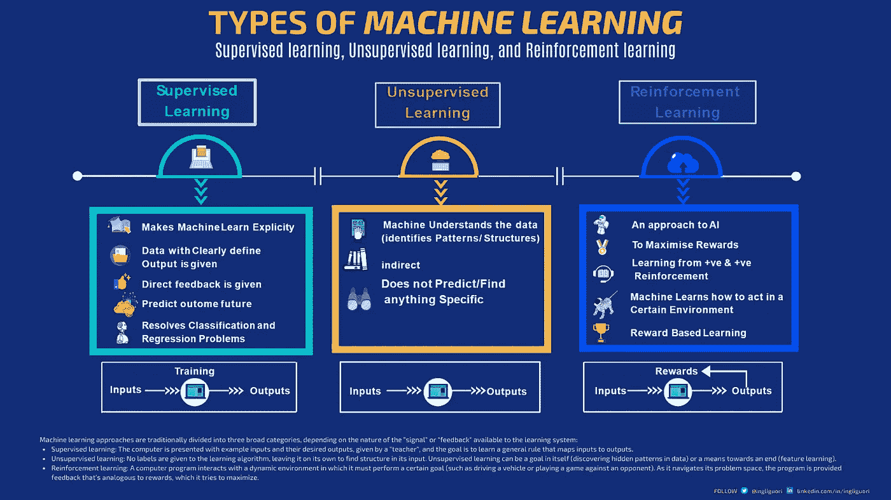
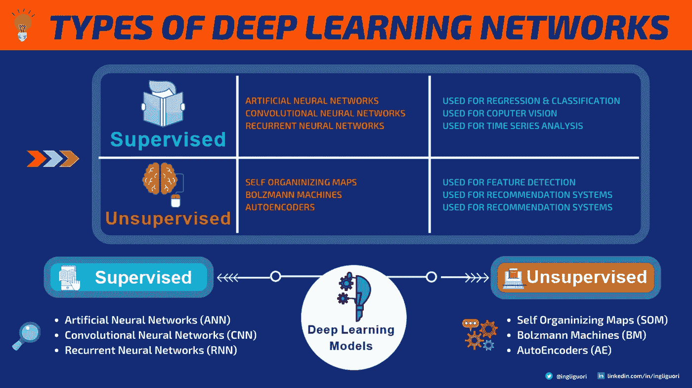
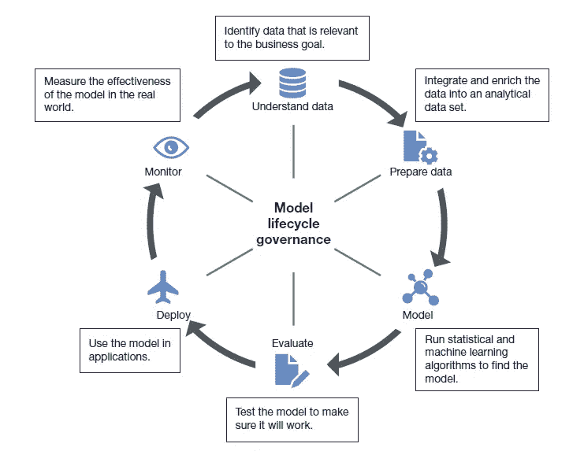
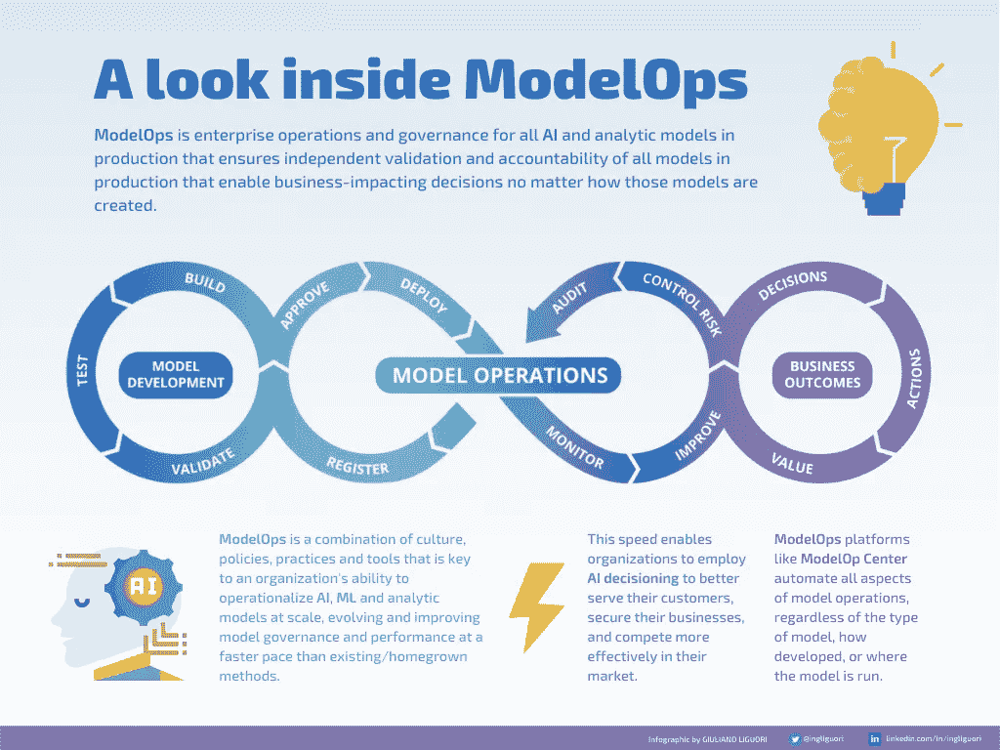
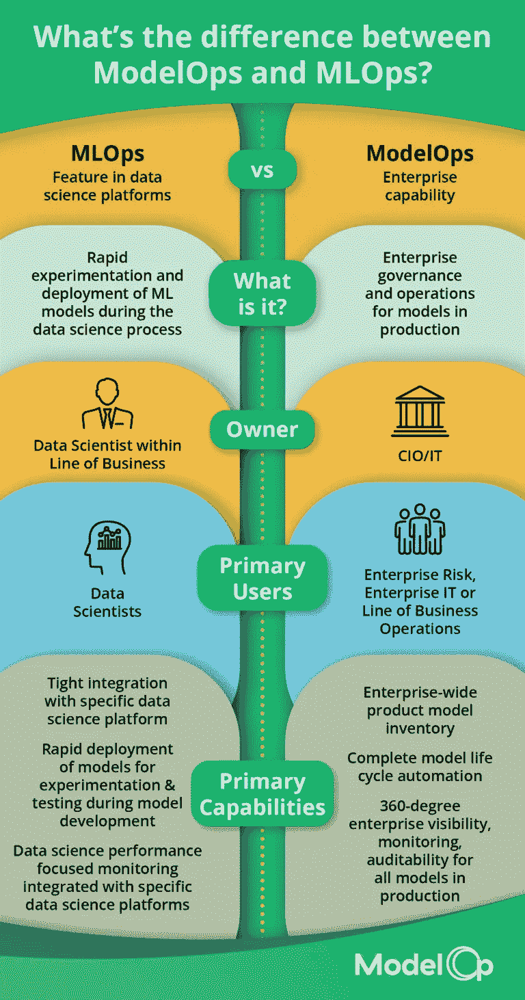
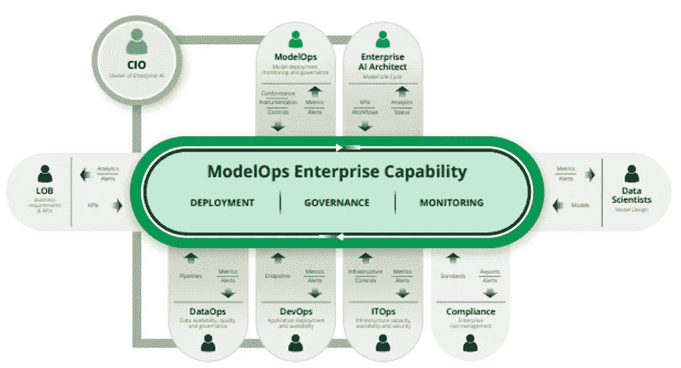
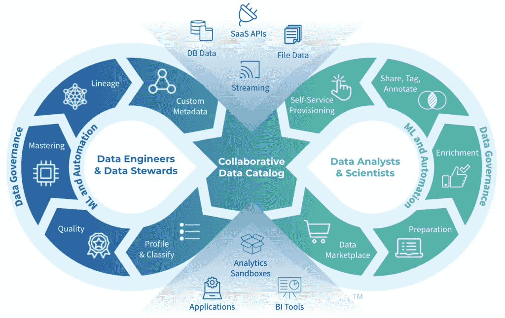

# 安全可靠的人工智能模型操作

> 原文：<https://medium.com/codex/model-operations-for-secure-and-reliable-ai-2cf0ced9945b?source=collection_archive---------2----------------------->

人工智能技术| By [Just_Super](https://www.canva.com/p/gettysignature/)

## 人工智能和机器学习正在各个应用领域表现出不可思议的潜力；然而，很少有参与 4.0 过渡的公司能够在业务流程中成功实现这些技术。要让这类应用盈利，需要做些什么？

# **人工智能为什么重要？**

**人工智能**代表一套研究和技术，典型的信息技术，但具有重要的哲学和社会意义，其目的是实现能够解决问题和执行任务的程序和技术系统，这些任务通常归因于大脑和人类的能力。鉴于最近的进展，可以将人工智能定义为创造能够自主运行的机器(硬件和软件)的学科。

这一学科受到越来越多的关注，这是由于技术的成熟所带来的成果，无论是在计算计算方面，还是在实时和短时间内分析任何形式的大量数据的能力方面[ **大数据分析** ]。

> *人工智能是计算机科学的一个热门分支，它涉及构建能够执行智能任务的“智能”智能机器。随着深度学习和机器学习的快速发展，科技行业正在发生根本性的转变。*

学习系统和算法已经变得越来越有效和高效，与神经架构(甚至在多个层中)相关的技术有了很大的改进，具有递增的且不一定受监督的学习；例如，自动学习已经成功地应用在文档的分类和处理、自然语言的理解、生物信息学和图像处理中。越来越多有效的语音识别和图像分类方法被开发出来，成功应用于机器人和计算机视觉；我们日常使用的许多网络搜索算法、翻译器、语音识别器、图像和照片分类器都利用了这些不断发展的技术。

人工智能可以帮助快速发展的新技术，无论是在最合适工具的设计方面，还是在方法贡献方面(例如，复杂的传感器需要开发能够智能和实时处理其产生的信息的高级系统，以自动理解感兴趣的情况并在动态环境中规划行动)。

人工智能技术的使用允许广泛的应用，例如用于监视、监控和诊断的集成系统、远程协助系统和物流运输规划、自动驾驶车辆等。家庭自动化技术工具的出现为解决人口老龄化问题提供了可能性。

另一个非常有趣的应用领域是所谓的“未来互联网”，其特征是由自组织和智能实体组成的开放网络，如软件(代理、web 服务、软件机器人、虚拟角色)、硬件(对象、传感器、机器人)。或者人类。

# **弱强 AI**

以人脑的功能为起点，人工智能可以执行一些功能:

*   人性化地行动(例如，模糊地关注一个人)；
*   人性化思考(用认知功能解决一个问题)；
*   理性思考(即运用逻辑，像人类一样)；
*   理性行动(根据可用信息启动一个过程以获得最佳预期结果)。

这些考虑将人工智能分为两种主要类型，弱和强:

*   **弱人工智能** : *它识别能够模拟人类的一些认知功能，但却没有达到人类典型的真正智能的技术系统(解决问题的数学程序，通过它来解决问题或让机器做出决定)。*
*   **强 AI** : *在这种情况下，我们说的是‘智慧系统’，即能够开发它们的智能，而不像人类那样模仿思维过程或认知能力。*

> *另请参阅* [使用 ModelOps](https://towardsdatascience.com/scale-and-govern-ai-initiatives-with-modelops-afdc33ce1171) 扩展和治理人工智能计划

# ***机器学习 e 深度学习***

弱人工智能和强人工智能之间的区别形成了定义'**机器学习**和'**深度学习**'的基础，这两个研究领域属于更广泛的人工智能学科。

从技术和方法的角度来看，人工智能的特征是智能在一项任务或行动中变得熟练的学习方法。这些学习模型表征并区分了机器学习和深度学习。下图说明了人工智能、机器学习和深度学习之间的区别

AI vs ML vs DL |来源数据台库

机器学习是应用统计学的一种形式，旨在使用计算机对复杂函数进行统计估计。它是一套技术(如计算统计学、**模式识别、**人工神经网络、自适应滤波、动态系统理论、图像处理、**数据挖掘、**、自适应算法等)。)允许机器从数据中“学习”,然后做出决策或做出预测。

机器学习:监督学习方案| [来源](https://www.researchgate.net/figure/Supervised-learning-scheme_fig1_337517556)

> 机器学习是一种人工智能，使机器能够从数据中学习并提供预测模型

机器学习系统可以应用于来自多个来源的知识库，以解决不同的任务:面部分类、语音识别、对象识别等。与启发式算法不同，启发式算法是那些遵循特定指令集来解决给定问题的算法，机器学习使计算机能够学习如何自己识别“感知配置”，并对它们做出预测。

机器学习可以适用于三种不同类型的任务:

*   分类。
*   回归。
*   聚类。

机器学习的特征是学习模型；基于这些模型，可以对算法进行分类:

*   **监督学习** : *通过输入和输出的例子进行学习，以允许 AI 理解如何表现*；
*   **无监督学习** : *通过结果分析学习；在这种情况下，软件理解如何行动，并且学习模型基于输出而适应，该输出允许映射软件将被要求执行的某些行动和任务的结果；*
*   **强化学习** : *AI 在达到目标、结果、执行一个动作等时会得到奖励……这样，它就能从错误的动作中识别出正确的动作。*

机器学习的种类|作者[朱利亚诺李果里](https://medium.com/u/e20098f1f3fc?source=post_page-----2cf0ced9945b--------------------------------)

深度学习以学习模型为代表，其灵感来自生物大脑的结构和功能，因此也是人类思维的结构和功能。如果机器学习可以被定义为“训练”人工智能的方法，深度学习就是让你模仿人类思维的方法。

深度学习是机器学习的一个子领域，它利用了“**深度神经网络**”，即配备了许多层和新的算法，用于对模型进行正则化的数据预处理。深度学习的灵感来自于**神经科学** ( **神经网络**是大脑神经元活动的模型)。与生物大脑中任何神经元都可以在某些物理约束下连接到任何其他神经元不同，**人工神经网络** ( **ANN** )具有有限的层数和连接数，以及预定的信息传播方向。

深度学习的类型|作者[朱利亚诺李果里](https://medium.com/u/e20098f1f3fc?source=post_page-----2cf0ced9945b--------------------------------)

训练深度学习模型的第一个要求是要有非常大的训练集可用；这使得深度学习极其适合面对**大数据**时代。深度学习流行背后的原因与大数据和**GPU**的出现有关。参考大量数据，网络通过训练算法“学习”如何实现目标。深度学习对所谓的“偏见”非常敏感:在监督模型中，如果标签创建不正确，模型将从错误的数据中学习。

# ***深度学习与产业应用***

深度学习极大地影响了工业应用:它可以处理大量数据，并识别一些歧视性特征。基于文本的搜索、欺诈或垃圾邮件检测、文字识别、图像搜索、**语音识别**、 **NLP** ( **自然语言处理**)系统、推荐系统、街景变化检测和语言翻译只是深度学习能够处理的一些任务；在谷歌，深层网络已经取代了几十个“规则系统”。

> 深度学习是机器学习的一个子领域，涉及由大脑结构和功能激发的算法，称为人工神经网络。可以使用深度学习来训练计算机模型，以使用图片、文本或声音作为输入来运行分类动作

今天，**计算机视觉**的深度学习表明，它拥有已经优于人类的技能，从识别普通图形到识别肺部断层图像中的癌结节。

# ***各行业人工智能***

所有大型跨国公司都在竞争，不仅要将人工智能领域的创新创业公司纳入自己的领域，还要启动和资助已经到位的研究项目(如图像识别、人脸、语音应用、翻译和语言学等)。).在商业领域，技术解决方案的成熟(和可用性)为许多细分市场带来了人工智能的潜力；以下是一些最重要的例子:

## 营销和人工智能

虚拟助手(聊天机器人、苹果的 Siri、微软的 Cortana、亚马逊的 Alexa)的扩散，这些助手使用人工智能进行自然语言识别，并学习和分析用户习惯和行为；对大量数据进行实时分析，以了解人们的“情绪”和需求，改善客户服务、用户体验、援助和支持服务，同时创建和完善复杂的参与机制，包括预测购买行为，并从中得出沟通策略和新服务提案。AI 在营销方面的应用已经取得了显著的成果。主要的使用领域是管理与用户的关系。一门真正的学科最近蔓延开来，即人工智能营销，这是市场营销的一个分支，它使用人工智能领域最现代的技术，如机器学习和自然语言处理，集成了数学、统计和行为技术。它是利用人工智能和机器学习来说服人们执行某个动作，例如购买产品或访问服务；在持续学习和改进过程中对数据(即使是非结构化的和基于自然语言的数据)进行汇总和分析，以不时地确定行动、策略、沟通和销售技巧(对单个目标用户具有最大潜在效力/成功的技巧)。

## 医疗保健中的人工智能

人工智能的优势在于改善了残疾人已经在使用的许多技术系统(例如，语音系统已经改善到甚至可以与无法说话的人进行完全自然的交流)，但人工智能的潜力将在肿瘤和罕见疾病的诊断和治疗领域显现出来。目前，市场上可以买到能够从无限的数据池(科学出版物、研究、医疗记录、药物数据等)中提取、分析和学习的认知系统。)，以人类难以想象的速度，加速罕见疾病的非常关键的诊断过程，或在肿瘤或特定疾病的情况下建议最佳治疗途径。不仅如此，基于人工智能的虚拟助理开始在手术室中更频繁地相互见面，以支持接待人员或提供急救服务的人。

## 网络犯罪和风险管理

*欺诈预防是最成熟的应用之一，其中人工智能通过技术上所谓的“高级分析”实现，这是一种非常复杂的分析，能够将数据、事件、行为和习惯关联起来，以提前了解任何欺诈活动(如克隆信用卡或执行未经授权的交易)；这些系统还可以在其他商业环境中得到应用，例如减轻风险、保护信息和数据、打击网络犯罪。*

## 人工智能和供应链管理

*供应和分销链的优化和管理现在需要复杂的分析，在这种情况下，人工智能代表了连接和监控整个供应链和所有相关行为者的有效系统；将人工智能应用于供应链管理部门的一个非常重要的案例与订单管理有关(在这种情况下，利用人工智能的技术不仅旨在简化流程，还旨在实现流程的全面整合，从采购到库存、从仓库到销售，甚至与营销整合，以便根据促销活动或宣传活动对供应进行预防性管理)。*

## 公共安全的人工智能

*能够实时分析大量数据，并通过事件、习惯、行为、态度、系统和数据的相关性进行推断，以进行地理定位并监控物品和人员的移动，这为提高公共安全的效率和有效性提供了巨大的潜力，例如机场、火车站和大都市的安全和犯罪预防，或者在发生地震和海啸等自然灾害时的危机预防和管理。*

# ***人工智能与商业价值创造***

人工智能和深度学习在数据分析方面带来的加速可以转化为商业价值，前提是克服多重挑战。最复杂的是为人工智能提供数据的准备工作，因为这些数据来自多个来源，转换这些数据需要时间。

人工智能的潜力每天都有新的非凡应用带来惊喜。然而，将人工智能投入运营，并以持续和广泛的方式将其引入业务流程，这是一个挑战，迄今为止很少有优秀企业能够成功应对。事实上，如今，仅仅十分之一的组织就能推动超过 75%的人工智能模型开发进入生产。由 **Gartner** 分析师做出的预测认为，从现在到 2023 年，至少 50%的数据分析部门主管将难以让他们的人工智能项目通过概念验证(PoC)阶段。

工业 4.0 范式鼓励公司现代化和优化其流程，并在人工智能的背景下。然而，如果一方面每个行业都有大量的试点计划，另一方面，仍然很少有项目转化为数字产品或服务投放市场或在生产中发布，以改变数字渠道上的客户体验。

复杂背后的原因各不相同。安全性和隐私、数据量和质量不足、可访问性限制、对使用案例和相关优势的理解有限、内部技能不足等等。

# ***可操作化:待开发的工作实践***

如何管理这种复杂性？相互依赖背后的共同元素是数据。不仅需要在技术方面下功夫，还需要考虑工作实践和**运营模式**方面。这是在运营和业务流程中以工业化方式集成数据和人工智能所必需的。

有一些工作流程和实践需要改进。它们现在被定义为 **XOps** (主要是 **ModelOps** 和 **DataOps** )，并且由于实现规模经济、可靠性、重用和可重复性的需要而结合在一起，而不考虑底层的技术基础设施。

# **模型操作**

ModelOps 的名字来源于人工智能模型操作化的概念，无疑是人工智能战略的核心。这些实践将政府和生命周期管理方法带到了人工智能的世界，即人工智能决策模型的整个生命周期的管理。

*模型生命周期治理|来源:* [*福瑞*](https://2s7gjr373w3x22jf92z99mgm5w-wpengine.netdna-ssl.com/wp-content/uploads/2020/09/Forrester_ModelOps.png)

ModelOps 是文化、政策、实践和工具的组合，是组织大规模运营人工智能、ML 和分析模型的能力的关键，以比现有/自主开发的方法更快的速度发展和改善模型治理和性能。这种速度使组织能够采用人工智能决策来更好地服务他们的客户，保护他们的业务，并在他们的市场上更有效地竞争。

一窥 ModelOps |作者[朱利亚诺·李果里](https://medium.com/u/e20098f1f3fc?source=post_page-----2cf0ced9945b--------------------------------)

除了 ModelOps，我们还经常听说 **MLOps** 。这两个术语可以互换使用。然而，它们之间有关键的区别，这取决于每种技术提供的功能和特性，当然，AI 的价值和可扩展性取决于它们。

最近， [ModelOp，Inc.](https://www.modelop.com/modelops-and-mlops/) 发布了一份全面的指南，旨在了解 MLOps 和 ModelOps 之间的差异“[关于 MLOps 和 ModelOps 的十大问题](https://www.modelop.com/wp-content/uploads/2021/10/Top_10_Questions.pdf)

*MLOps 和 ModelOps | Source:*[ModelOp](modelop.com)

> 正如 ModelOp 的联合创始人兼首席企业人工智能架构师 Stu Bailey 所言:*理解并重视 ModelOps 和 MLOps 之间的区别非常重要，因为虽然两者都是必需的，但只有一个完全解决了阻碍近三分之二企业人工智能项目的运营和治理流程问题(ModelOps 2021 年状态报告* *)。*”

> *也可阅读* [用 ModelOps](https://towardsdatascience.com/unlocking-the-value-of-artificial-intelligence-in-business-applications-with-modelops-92379965f87c) 解锁 AI 在商业应用中的价值

基本上，ModelOps 是一种企业范围的能力，它确保生产中所有模型的有效性和责任性。这包括在模型的整个生命周期中管理所有的 IT、风险、合规性和业务需求，以及模型投入生产后的运行状况和运营效率。ModelOps 包含所有模型(不仅仅是 ML ),而不管模型的类型、开发方式或运行位置(内部、云、边缘)。

*ModelOps 企业能力|来源:* [ModelOp](modelop.com)

它基于 **DevOps** 的概念，但经过调整以确保 AI/ML 模型的良好质量。一般来说，模型操作包括:

*   模型管理、知识库和模型库；
*   模型版本化(允许模型的演化，而没有通常由回归引起的缺陷)；
*   模型培训(即模型学习过程的管理)；
*   持续集成和持续交付(CI/CD)；
*   开发环境；
*   转出/回退；
*   测试等。

自动化和协调[模型生命周期](https://www.modelop.com/wp-content/uploads/2021/03/modelop_ebook_4-Steps-1.pdf)的所有方面确保了可靠的模型操作和大规模治理。企业中的每个模型都可以采用多种多样的生产路径，具有不同的监控模式和各种持续改进或淘汰的需求。

# ***数据操作***

**数据运营**必须确保数据从源头到使用和消费点的有序流动。最终目标是尽可能简单快速地从数据中产生价值。数据操作在管道日期运行，在此日期定义数据架构、数据建模、数据配置、数据质量和数据集成的各个方面。

*数据操作周期|* [来源](https://www.zaloni.com/resources/what-is-dataops-and-what-is-it-not/)

DataOps 结合了**精益**、**敏捷**和 **DevOps** 。它始于一系列最佳实践，并已发展成为一种方法。越来越多的数据管理、集成、仓储、商业智能、云供应商开始接受 DataOps。

模型操作和数据操作有一个共同的元素，即治理。它必须在数据使用的控制、可访问性、问责制和可追溯性之间实现适当的平衡。

# ***最终想法***

我们正处于数字化转型的加速阶段。能够掌握人工智能的跨职能和多学科性质的组织，通过抓住这些技术的变革机会，将传统职业(例如，数据架构师、数据建模师、数据管家)和新职业(例如，数据工程师、人工智能工程师、数据科学家、ML 验证者)结合起来，实施可操作化，将有最大的机会提取价值。

**关注我的每日技术和创新更新**

https://bit.ly/m/ingliguori

# 参考

 [## 首席信息官|数据科学家|首席信息官

### ModelOps 是一个管理整个企业人工智能计划的过程。MLOps 是为数据设计的流程…

www.modelop.com](https://www.modelop.com/modelops-and-mlops/) 

[ModelOp，“ModelOps 2021 年状态”报告。2021 年 4 月 15 日](https://www.modelop.com/resources/ai-transformation-with-modelops/state-of-modelops-2021-report/)

[Gartner，“ModelOps 创新洞察”，Farhan Choudhary、Shubhangi Vashisth、Arun Chandrasekaran、Eric Brethenoux，2020 年 8 月 6 日](https://www.gartner.com/account/signin?method=initialize&TARGET=http%253A%252F%252Fwww.gartner.com%252Fdocument%252F3988487)

[Forrester，“引入模型运算以实现人工智能”，Kjell Carlsson 博士和 Mike Gualtieri，2020 年 8 月 13 日。](https://www.forrester.com/report/Introducing-ModelOps-To-Operationalize-AI/RES160698)

 [## 什么是 ModelOps，它与 MLOps 有什么不同？- neptune.ai

### 在过去的几年里，我们已经看到现实生活中人工智能和机器学习解决方案的增加…

海王星. ai](https://neptune.ai/blog/modelops)  [## 什么是数据操作，什么不是？

### 苏珊·库克是 Zaloni 公司的首席执行官，在企业软件销售、战略…

www.zaloni.com](https://www.zaloni.com/resources/what-is-dataops-and-what-is-it-not/)