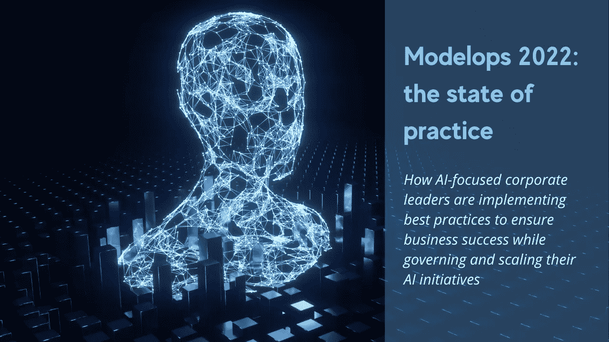
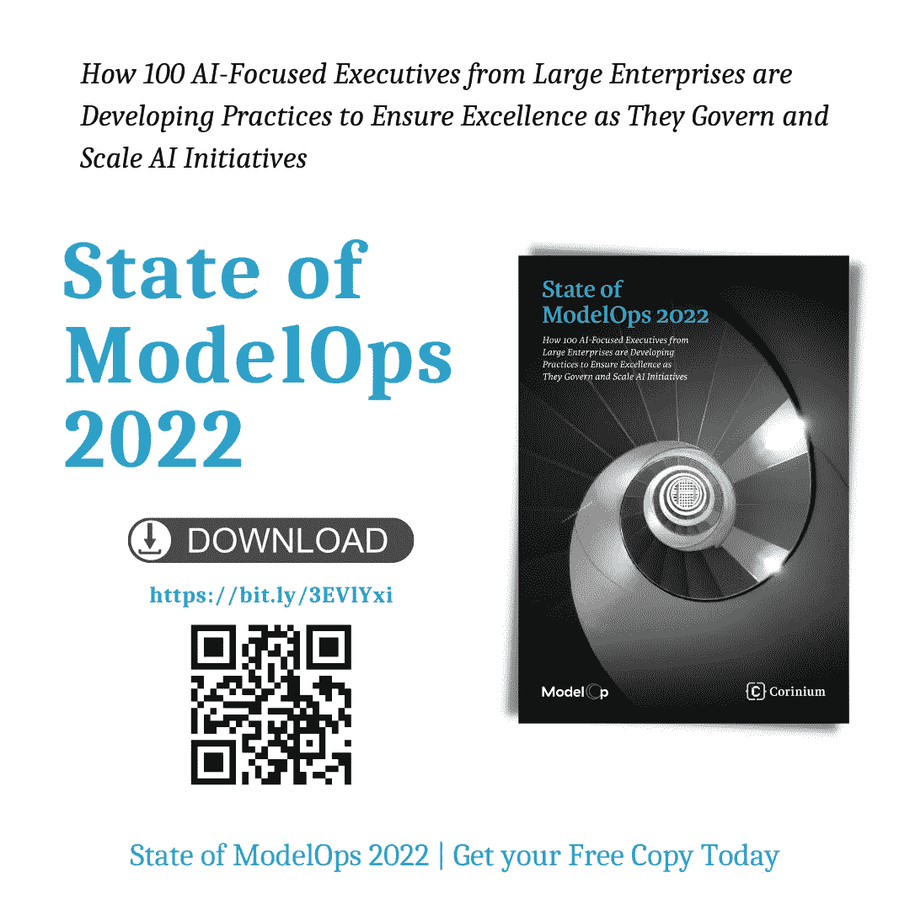

# 2022 年模型操作:实践状态

> 原文：<https://medium.com/codex/modelops-2022-the-state-of-practice-966b676e6063?source=collection_archive---------9----------------------->

## 专注于人工智能的企业领导者如何实施最佳实践来确保业务成功，同时管理和扩展他们的人工智能计划

# ModelOps 简介

ModelOps 帮助组织实施人工智能解决方案，组织大规模运营人工智能的途径，以及整合数据操作、ITOps 和 DevOps 熟练程度。作为核心企业能力，ModelOps 包括公司可以用来部署以监控甚至管理其机器学习模型的过程、操作、工具和技术。

在 ModelOps 中，预测分析和机器学习工作流变得可操作，投入工作并用于影响组织，以便团队在应该在其他地方完成的任务上浪费更少的时间，而是专注于对他们真正重要的事情。Modelops 无疑是一种企业能力，允许整个组织的每个人都参与到人工智能和机器学习解决方案的协作中，目的是共同努力，最大限度地发挥人工智能的潜力。

> 没有 ModelOps，你的人工智能转型注定要失败

根据 Gartner 的定义，ModelOps 是一组实践，旨在自动化数据科学项目中出现的一组常见操作，包括模型培训管道、版本控制、数据管理、实验监控、测试和分发。它旨在使所有预测分析、机器学习和人工智能模型都可以运行。

简而言之，ModelOps 涉及将预测分析和机器学习工作流付诸实践，让它们真正发挥作用，并利用它们对日常运营产生影响，而不仅仅是提供见解。这实际上是拥有静态洞察力与成为一个四处活动并影响事情发生方式的组织的一部分之间的区别。

> 您可能还想阅读[工业 4.0 中的预测性维护:应用和优势](/codex/predictive-maintenance-in-industry-4-0-applications-and-advantages-72bd7383823e?source=user_profile---------3----------------------------)

# 模型操作:企业级能力

人工智能正在成熟，并成为企业范围的功能，需要一致和可靠的支持能力来帮助它取得成功。数据科学和高级分析是我们已经讨论了很长时间的话题。传统上，数据科学主要被认为是创建和部署单个模型，但是，如果我们后退一步，看看整个画面，我们可能会惊讶地发现，模型开发只是拼图中非常小的一块。

*   *未部署车型的增加最终会对公司的发展产生负面影响；*
*   *模特需要复杂的再培训；*
*   *每个新的业务领域都需要一组新的数据。*

现在，随着我们进行数据科学的规模扩大，对监控和管理这些模型有着巨大的需求，这就是 ModelOps 适合的方式。

Gartner 表示，到 2023 年，至少有 50%的 IT 领导者将努力将他们的人工智能预测项目从概念验证转移到生产成熟。

> 你可能也想读读《人工智能法案:基于风险的政策方法，追求卓越和信任人工智能

为了进行业务创新，企业需要将模型操作作为其人工智能战略的核心，因为它有助于融合不同的人工智能产品、平台和解决方案，并确保可扩展性和治理。本质上，ModelOps 和 DevOps 一样，无疑是另一种同样强大的新兴能力，它也可以给所谓的企业 AI 的组织带来竞争优势。

因此，24/7 的操作环境是必要的，因为大多数数据科学家使用开源建模工具，如 Jupyter notebook 或 R studio。此外，大多数数据科学家不知道或无法访问可以观察到延迟的环境。只有当您能够制定统一的战略，使业务的每个领域都能使用最适合其需求的工具，同时确保输出以高效、可靠且符合所有法规的方式流入业务时，才能将人工智能嵌入企业系统。

> “与传统软件相比，模型对业务负有更大的责任。他们必须接受监管审查和合规。一个适当的运营模式可以极大地改变特定业务部门的总体业绩。因此，业务部门和合规部门之间的整合至关重要。”——福布斯

ModelOps 允许人们扩展数据科学，同时跟踪、监控、管理数据科学等等。为了实现这一点，模型操作必须由首席信息官负责，这对于跨部门和业务部门的任何人工智能操作化流程(包括相关流程和工具)形成共识是必要的，拥有一个模型数据科学不仅有价值，而且对他们未来的竞争地位甚至生存都是必不可少的。

> *你可能也喜欢阅读* [*安全可靠的 AI*](/codex/model-operations-for-secure-and-reliable-ai-2cf0ced9945b?source=user_profile---------2-------------------------------) 模型操作

# 2022 年模型运行状态

2022 年，寻求将人工智能投入运营的企业对 ModelOps 的需求变得显而易见，因为人工智能领域的领导者已经达到了他们 ModelOps 旅程的“意识”阶段。意识到 ModelOps 的价值，以及它如何帮助组织克服实施人工智能解决方案的挑战，我们知道这并不容易。

许多组织仍然未能扩展人工智能，而且我们生活在一个不断发展和变化的世界中，因此数据也在不断变化，因此需要不断发布新的解决方案和新的机器学习模型，反过来，它们必须不断更新和修订，并实时可用。在这种高度复杂的场景中，如果组织要应对这些挑战，将机器学习投入生产，并克服所有这些耗费时间、技能和资源的数据科学活动，ModelOps 就变得必不可少。

Corinium 与 ModelOp 合作，最近对专注于人工智能的高管进行了调查，以了解团队的位置和市场的走向。ModelOps 报告深入探讨了正在出现的重大挑战、趋势和战略。

这是关于模型运行状况的第二次年度调查。它给出了有效操作人工智能所需的实践和能力的独立观点。该研究揭示了企业模型操作功能的当前状态，以及在治理和扩展企业人工智能计划时导致卓越的实践。

> *你可能也喜欢阅读* [*用 ModelOps*](https://towardsdatascience.com/unlocking-the-value-of-artificial-intelligence-in-business-applications-with-modelops-92379965f87c?source=user_profile---------3-------------------------------) 释放 AI 在商业应用中的价值

# 研究中使用的方法

这项调查是在 2022 年 2 月和 3 月进行的，涉及 100 名专注于人工智能的领导者，他们来自美国(70%)和欧洲(30%)的公司。

受访者从金融服务(35)、保险(35)、制造(15)和食品零售(15)行业年收入至少 18 亿美元的企业中选出。其中包括安联、法国巴黎银行、CNH 工业、德意志银行、摩根大通和沃尔玛。

他们的工作角色从 C 级到总监、副总裁或部门负责人不等，包括数据科学副总裁、全球风险负责人、人工智能负责人和其他专注于人工智能的高管。

该调查包括 18 个问题，涉及组织的人工智能成熟度和模型操作能力，以及公司面临的模型操作障碍和他们在哪里投资以克服这些挑战。

然后，将这些发现与七位行业专家的评论相结合，将这些对企业模型操作化状态的独特见解放入上下文中。

以下是一些重要的亮点:

*   86%的受访者表示，公司高管要求得到关于其人工智能投资回报的答案——但只有 38%的人表示他们可以提供答案。
*   只有 5%的受访者表示，他们完全了解整个企业中正在生产的模型。
*   100%的受访者现在有专门的模型操作预算，而 2021 年这一比例为 51%。
*   80%的受访者表示，缺乏具备合适技能的员工带来了挑战，这一数字比上一年增长了 10%。

# 如何获取和阅读整个报告

ModelOps 被视为促进不同团队之间协调和合作的关键工具。

支持人工智能的公司已经意识到，他们必须标准化和自动化他们的模型操作流程，他们已经采用了允许他们有效地这样做的工具。因此，他们可以更清楚地看到他们的人工智能投资，减少他们的曝光率，获得更好的投资回报，并降低他们运营人工智能的成本。仍然处于成熟度曲线上的组织现在对他们的成功之路有了更好的理解。

ModelOps 报告的状态为新出现的挑战、趋势和策略提供了令人信服的见解。来自大型企业的 100 名专注于人工智能的高管如何开发实践，以确保他们治理和扩展人工智能计划时的卓越性。

完整的报告可以下载，你可以在这里免费得到一份[https://bit.ly/3EVlYxi](https://bit.ly/3EVlYxi)

作者提供的信息图

# 结论

在“2022 年 ModelOps 状态报告”中，围绕更好的企业 ModelOps 实践的需求的意识有了显著提高，这些实践被定义为治理和管理基于人工智能的决策模型以及传统统计模型的能力。它包括从模型投入生产到最终报废(以及之后)发生的所有事情。

> *你可能也想阅读*[*ModelOps 如何帮助你执行你的人工智能战略*](/codex/how-modelops-helps-you-execute-your-ai-strategy-a8c007d49623?source=user_profile---------1-------------------------------) **关注我的每日技术和创新更新**

[https://bit.ly/m/ingliguori](https://bit.ly/m/ingliguori)

# 参考

*   [2022 年模型运行状态报告](https://bit.ly/3EVlYxi)
*   [Modelop 的网站](https://www.modelop.com/)
*   [假人模型操作](https://bit.ly/MdlOpsB)
*   Gartner“ModelOps 创新洞察”报告
*   [使用 ModelOps 扩展和管理人工智能计划](https://towardsdatascience.com/scale-and-govern-ai-initiatives-with-modelops-afdc33ce1171)