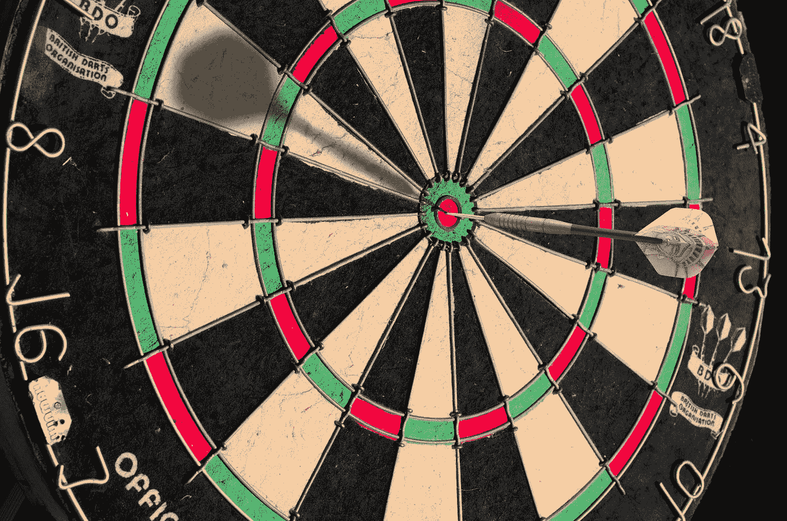

# 你的模特比你表现得更好

> 原文：<https://medium.com/codex/models-of-you-perform-better-than-you-eb2b3313df59?source=collection_archive---------16----------------------->

照片由[伊莫·威格曼](https://unsplash.com/@macroman?utm_source=medium&utm_medium=referral)在 [Unsplash](https://unsplash.com?utm_source=medium&utm_medium=referral) 上拍摄

Daniel Kahnemin(《T4》的作者，思考快与慢)有一本关于决策中的噪音的新书(恰当地命名为[噪音](https://www.amazon.com/Noise-Human-Judgment-Daniel-Kahneman-ebook/dp/B08KQ2FKBX/ref=sr_1_5?dchild=1&keywords=Noise&qid=1628008169&s=books&sr=1-5))。他将导致人类判断错误的两个方面描述为偏差(判断相对于期望目标的一致变化)和噪声(相对于目标的不一致变化，通常是随机的)。