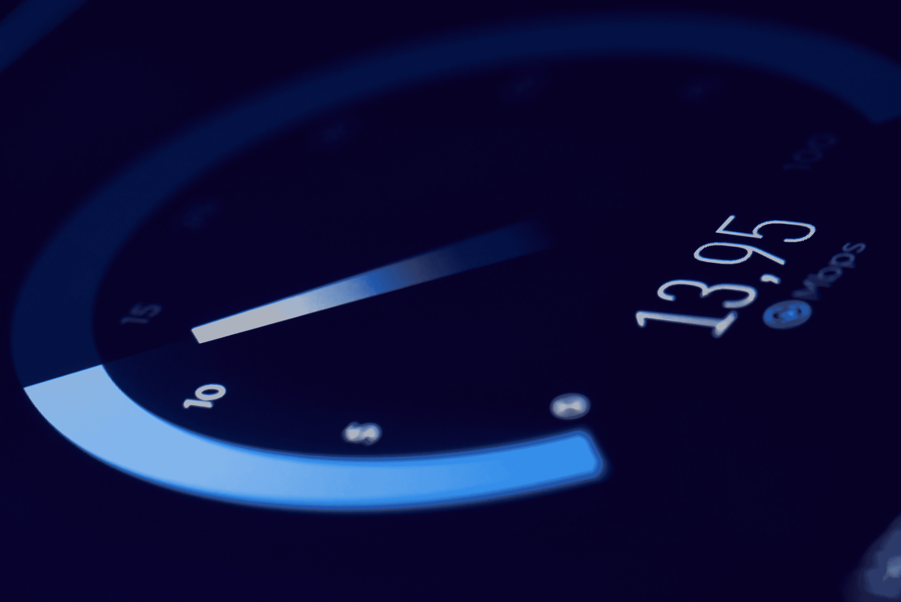
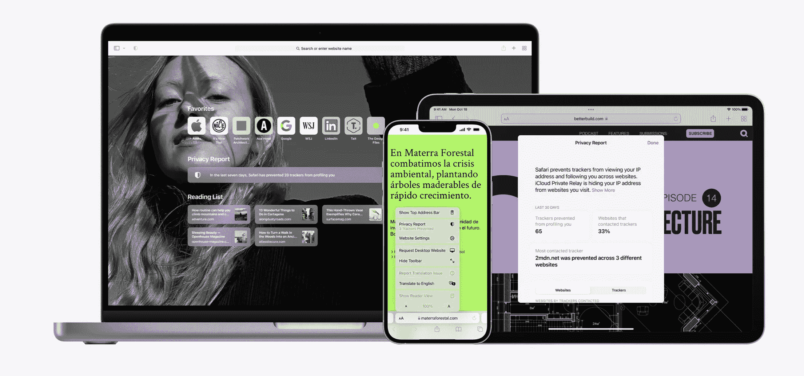
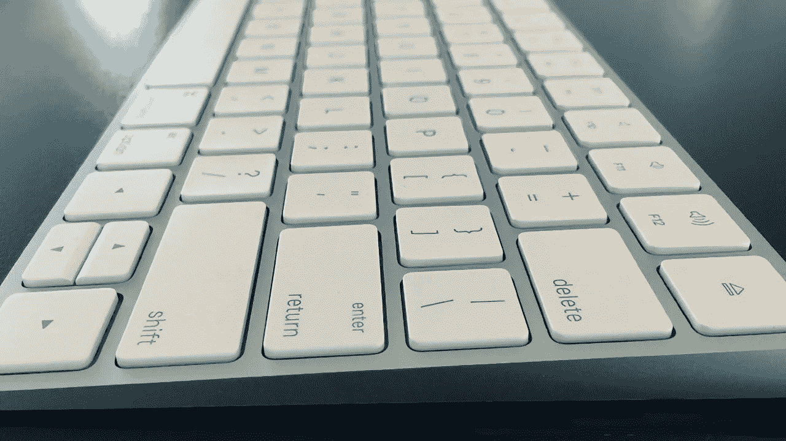
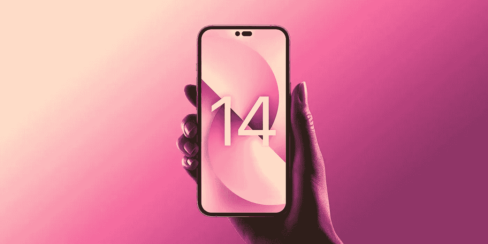
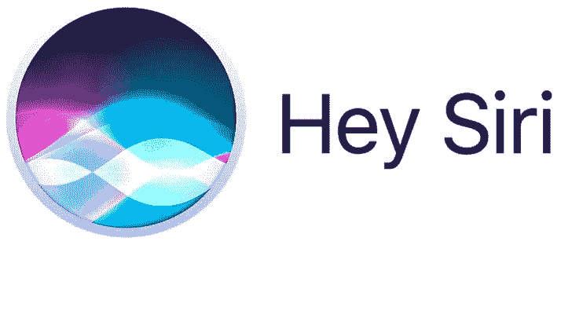
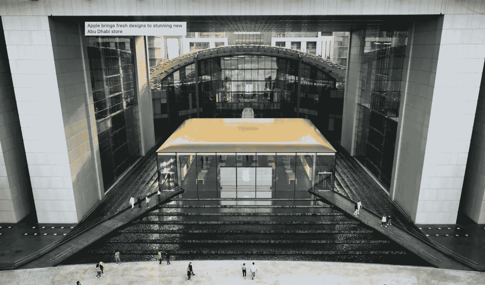
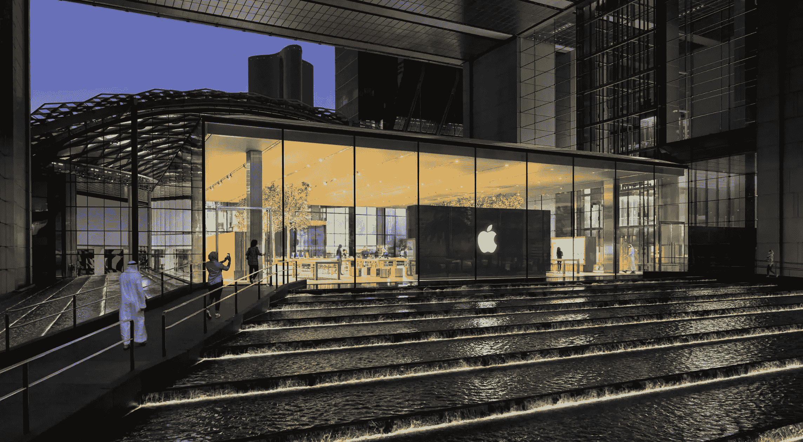
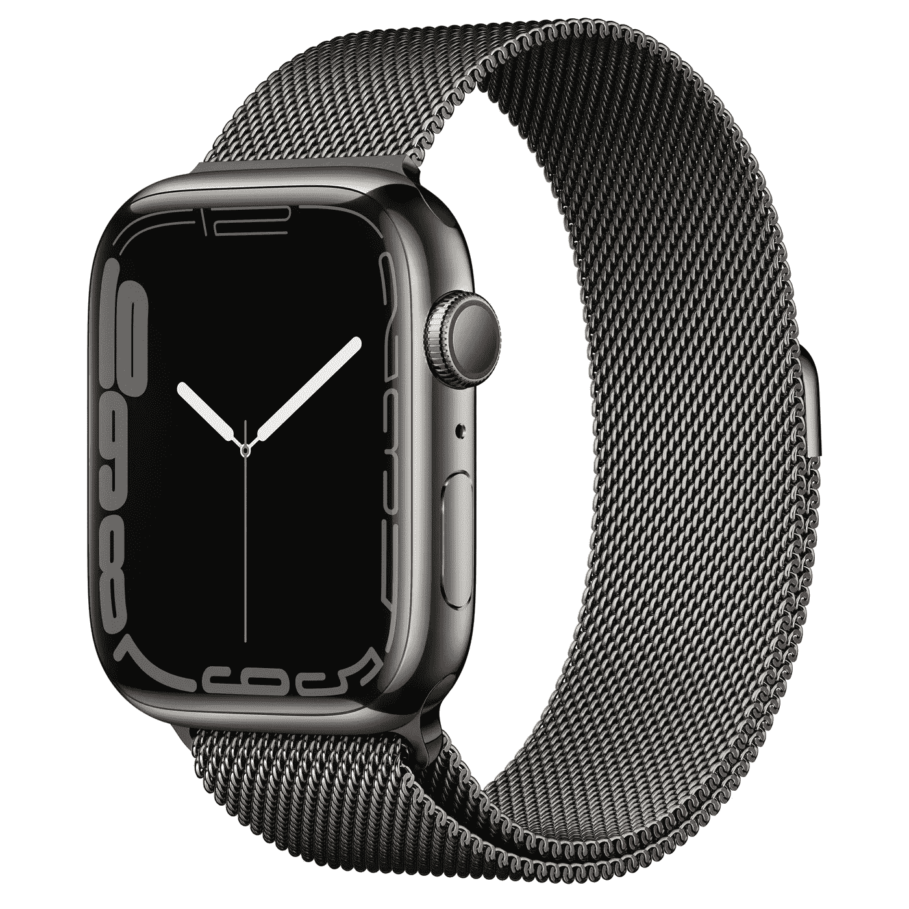
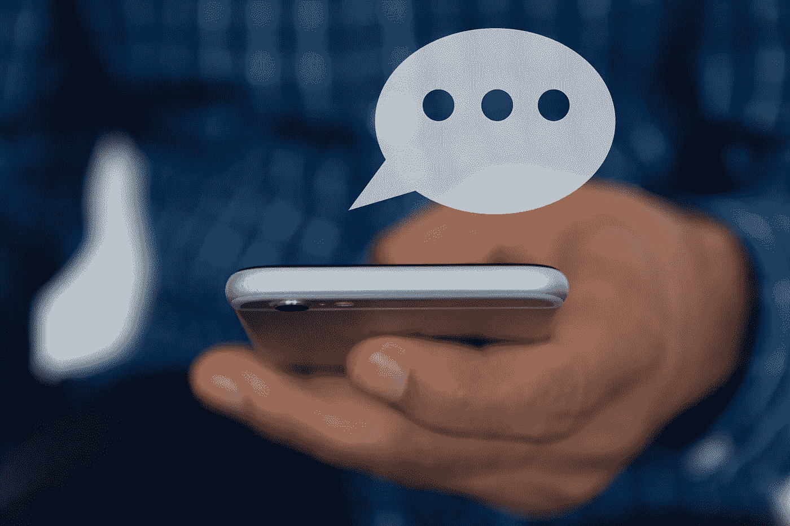
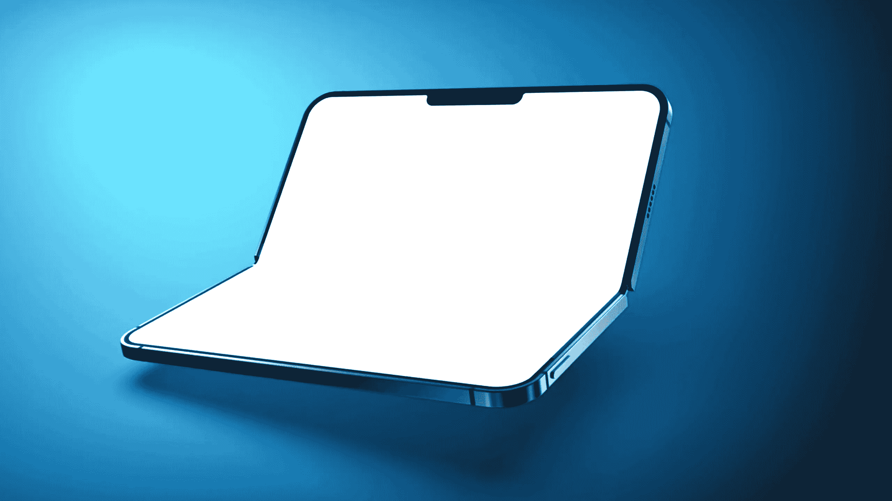

# 调制解调器、Safari、Siri 和键盘

> 原文：<https://medium.com/codex/modems-safari-siri-keyboards-d29943cf475d?source=collection_archive---------10----------------------->

## 苹果新闻综述

## 2022 年 2 月 21 日至 2 月 25 日

## 苹果公司在调制解调器市场

没错。苹果公司热衷于放弃高通作为他们的调制解调器供应商，这已经不是什么秘密了。本周的一份新报告表明，这种转变最早可能在 2023 年发生，并且正在与一家公司进行谈判，以帮助他们开展这个项目。几年前，苹果和高通的关系恶化(因为“二次浸渍”事件)。然而，在这一最新发展之前，苹果严重依赖高通和三星的调制解调器来提供移动数据功能，以及 Wi-Fi 和蓝牙。*5G 真的是未来吗？*

## 浏览不再是过去的样子了

赢得新浏览器的竞争和以往一样激烈。尽管 Chrome 如此耗电，但它仍以惊人的 65.38%的市场份额在浏览器市场占据着巨大的主导地位。Safari 目前位居第二，但也仅仅是第二。微软 Edge 拥有 9.84%的市场份额，紧随其后的是 9.54%的市场份额和 Firefox，在去年取得了不错的成绩，现在的市场份额为 8.1%。*这都是为了游猎而玩的……*

## 你能走多低？

你还记得著名的史蒂夫·乔布斯在发布 Mac Mini 时的主题演讲吗？他使用了 **BYODKM 的缩写**，代表*自带显示器、键盘和鼠标*。本周来自库比蒂诺的一项专利申请似乎表明，他们的目标是进一步配对。如果这项专利是可信的，那么苹果的目标是你只带你的显示器，因为整个*电脑，可能很快就会在一个更厚的魔法键盘内。这当然符合我的极简主义原则——我喜欢它的声音。*

## iPhone 14 谣言

多年来，Android 手机已经超过了内置大量内存的 iPhones。数字并不总是真实的，完全有可能机器人在处理数据时效率不高。但即使有了 A15 仿生芯片，苹果也要将 iPhone 14 Pro 的内存范围提高到 8 GB。本周在韩国博客网站上发现的谣言很可能是真的，因为将于今年秋季发布的手机将拥有有史以来最高的百万像素摄像头传感器。

在其他与 iPhone 14 相关的新闻中，它的发布看起来会如期进行，因为本周它进入了试产阶段。第一次，生产单位将被检查，寻找任何生产问题。他们还希望提高生产效率，并验证每小时可以生产多少单位。

## 耳机上也有更多

在上述生产测试的同一周，苹果的 VR 耳机进入了下一个发展阶段。可靠的消息来源告诉我们，耳机已经从原型阶段前进，现在在 EVT2(工程验证测试 2)。在此之后，它将通过 DVT(设计验证测试)，在那里将生产 50-100 个单位。最后，它会通过 PVT(生产验证测试)，以确保所有严格的质量控制可以满足全面生产。需求将再次高涨。早点下单！

## 嘿 Siri

在本周的 iOS 15.4 测试版中，大约两年来第一次，一种新的说英语的美国语音成为 Siri 的选项之一。在设置菜单中被简称为*【声音 5】*，苹果只透露了这是*“由 LGBTQ+社区的一名成员录制的”。*

## 新奇特商店的图片

最近，我为您带来了阿布扎比新的 Al Maryah Island 商店的消息。直到本周，人们对苹果商店的外观知之甚少，也就是说，直到展示苹果商店前所未见的设计元素的图片可以在网上看到。它们包括由纯黑色花岗岩制成的长廊和坡道。这是苹果专卖店首次使用这种花岗岩。该零售店将于阿联酋时间今天(星期五)下午 5 点开业。如果要去任何地方，那一定是在阿布扎比，对吗？

## 阿姆斯特丹围城

本周早些时候，阿姆斯特丹的苹果商店被包围了好几个小时，警察在场。最严重的时候，围困发生时店内有数十人躲藏起来。他们被允许离开，没有人受到伤害。阿姆斯特丹警方补充说*“不能分享有关情况和/或警方采取的行动的信息”*。苹果公司尚未对此事发表评论。苹果公司在其网站上表示，商店将至少关闭到今天(星期五)。[https://youtu.be/cbFzcjvgFRc](https://youtu.be/cbFzcjvgFRc)

 [## 我是苹果粉丝还是仅仅是逻辑上的？

### 看来我注定再也不会使用装有 Windows 系统的电脑了。为什么不呢，我想知道？

medium.com](/codex/am-i-an-apple-fanboy-or-just-logical-5bb91e895127) 

## 更公平的工作条件

苹果的许多零售员工抱怨店内条件的时间最长。现在，苹果公司已经*‘大幅提高员工福利’*，重点关注兼职员工。全职兼职员工现在似乎可以享受更多的假期。他们现在将有 12 天假期，允许的休假理由包括家庭和精神健康。服务三年后将增加更多的假期，而不是现在的五年。还将考虑为儿童和老年亲属提供打折的紧急备用护理。这对我们最喜欢的球队来说似乎更公平。

## 卷起，卷起

如果你有一只苹果手表，并想卖掉它，那么你很幸运。苹果公司将向所有本月以旧换新的苹果手表客户提供高达 235 美元的额外以旧换新优惠，以鼓励旧款苹果手表的用户升级到最新款。额外的以旧换新价值适用于 Apple Watch Series 6、SE、Series 5、Series 4、Series 3 和 Series 2，并且需要购买新的 apple 手表系列，具体视供货情况和限量而定。限时优惠在美国、加拿大、英国、意大利、西班牙、德国和阿联酋的有效期至 2 月 28 日。时间不多了，快点！

## 欺凌仍在继续

你还记得美国*实际上是*的青少年因为没有 iPhone 而无法使用 iMessage，从而导致蓝色泡泡的整个新闻故事吗？事实证明，即使是富人和名人也不能幸免。本周，NBA 球星贾勒特·艾伦(Jarrett Allen)放弃了他的安卓系统，因为他的队友无法将他加入 iMessage 聊天。*我的心真的流血了！*

## 算了吧…

忘记什么？苹果*曾经*制造可折叠手机的想法。屏幕分析师罗斯·杨(Ross Young)本周报道称，这款手机将于明年 2023 年发布。苹果似乎并不急于加入可折叠的行列，现在正在讨论对 2025 年的初步预测。苹果从来不喜欢当穷亲戚，老实说，我看不出他们会在主要竞争对手 7、8 年后发布可折叠手机。反正不是我真正想念的东西。

 [## 但我注定要成为一名音响发烧友！

### 然而在这里，我喜欢我的 AirPods

medium.com](/codex/but-i-am-meant-to-be-an-audiophile-a1b127da535f) 

## 这是我这周的全部。下周一定要关注我的更多新闻！你想过订阅 Medium 吗？我喜欢，而且它也很有价值。

## 在你走之前

[**加入我的幕后邮件列表**](https://www.talkingtechandaudio.com)

**原载于 2022 年 2 月 25 日 https://www.talkingtechandaudio.com/blog******。****

****

**查看并订阅我的负十六播客。每两周在 Spotify、苹果播客和谷歌播客上发布新剧集。[https://podcast . apple . com/GB/podcast/the-MINUS-16-podcast/id 1608899642？i=1000550310853](https://podcasts.apple.com/gb/podcast/the-minus-sixteen-podcast/id1608899642?i=1000550310853)**