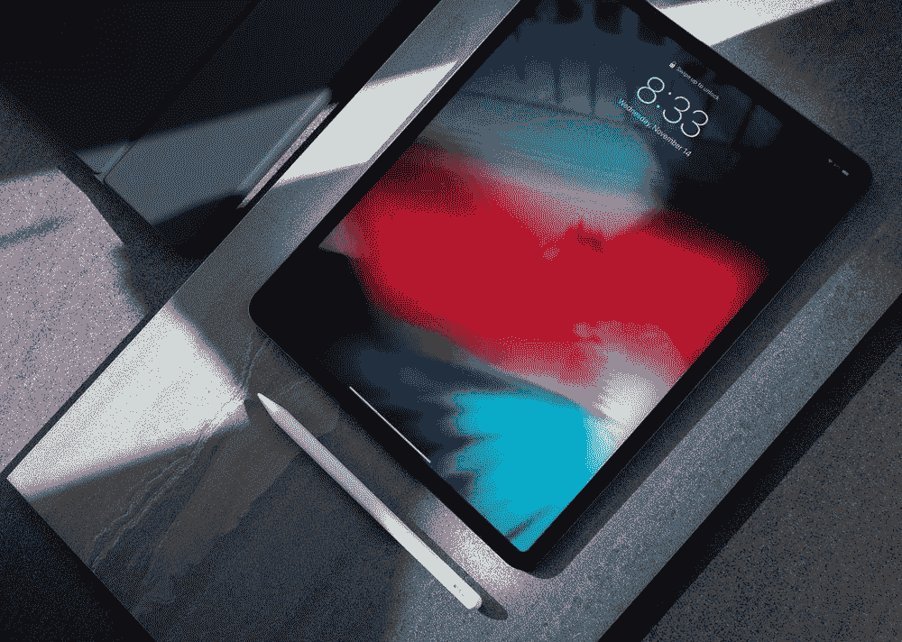

# 现代复杂性:苹果公司对现代计算机的设想将很快成为现实

> 原文：<https://medium.com/codex/modern-complexity-apples-vision-of-the-modern-computer-will-soon-become-reality-75e67b57ae58?source=collection_archive---------0----------------------->

图片来源: [Francois Hoang via Unsplash](https://unsplash.com/@aoirostudio)

成长的过程是一件有趣的事情。从我们都是孩子的时候，我们就有关于我们想要从生活中得到什么的想法。上小学的时候，我和一个叫杰西卡的女生是同班同学。杰西卡很受欢迎，并在年初表示，她想成为一名宇航员。到了年底，她已经…