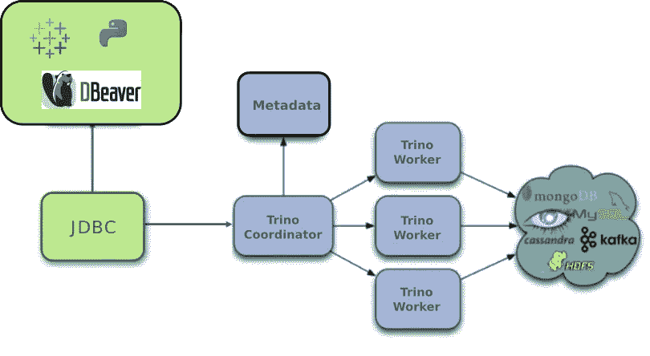
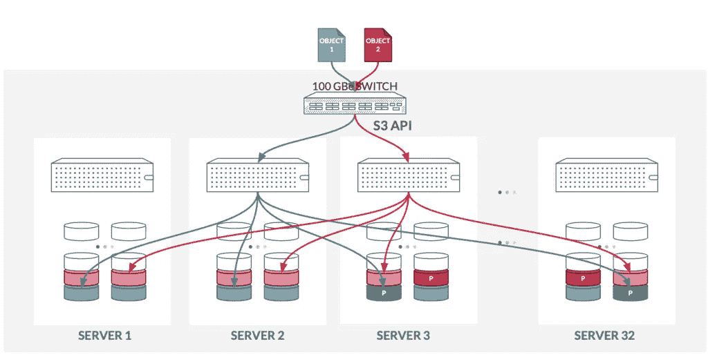

# 使用开源技术的现代数据平台

> 原文：<https://medium.com/codex/modern-data-platform-using-open-source-technologies-212ba8273eab?source=collection_archive---------0----------------------->

## [法典](https://medium.com/codex)

您是否希望为您的组织构建一个现代化的数据仓库或数据湖？如果是，您应该从头开始构建还是使用市场上现成的？这是一个很难回答的问题。在本文中，我将分享一些关于开源技术的细节，这些技术包括 [Trino](https://trino.io/) 和 [MinIO](https://min.io/) ，它们可以用来在本地或公共云上构建这个现代数据仓库。在我的上一篇文章([如何用 MinIO](https://tmarvadi.medium.com/how-to-build-a-modern-data-lake-with-minio-db0455eec053) 构建数据湖)中，我简单地分享了如何建立数据湖的一步一步的过程。这两个功能强大、轻量级且可伸缩的工具提供了如此多的功能。在你决定付钱给一家基于云的数据仓库公司之前，看看它们是值得的。本文将向您介绍 Trino 和 MinIO 的概况，并且还涉及到一旦您将它们作为一个数据平台一起实现，它们可以提供的一些特性。


# Trino 是什么？

Trino 的速度非常快，并且在性能方面得到了大规模验证。它是一个分布式 SQL 查询引擎，旨在处理异构数据源上的大量数据。它可以执行跨平台查询，这意味着您可以跨位于不同服务器上的多个数据库连接数据，并且它们不需要在同一个数据中心内。它支持结构化和半结构化数据。这为数据分析师和数据科学家提供了优势，因为他们可以随时使用这些数据。

Trino 架构与 MPP(大规模并行处理)数据库管理系统非常相似。



特里诺建筑

它有一个与多个工作节点同步工作的协调节点。当用户向协调器提交他们的 SQL 查询时，协调器使用定制的查询和执行引擎来解析、计划和调度跨工作节点的分布式查询计划。它旨在支持标准 ANSI SQL 语义，包括复杂查询、聚合、连接、子查询、窗口函数、非重复计数和近似百分位数。

无论您的数据位于何处，Trino 都统一允许通过其 SQL 抽象层访问数据。由于内存中的处理，查询结果的返回速度非常快。中间数据以 MPP 的方式跨节点进行管道传输，因此它带来了高度交互的查询性能。Trino 允许查询数据所在的位置，这适用于 NoSQL 和 SQL 数据库。单个查询可以组合来自多个来源的数据，从而允许您分析整个组织的数据。Trino 提供了各种各样的连接器，如 MySQL、Oracle、SQL Server、Redshift、Kafka、Elasticseach 等等(见[完整列表](https://trino.io/docs/current/connector.html))。

# **什么是 MinIO？**

MinIO 是一个高性能的分布式对象存储服务器，它与亚马逊 S3 兼容。它可以存储照片、视频、日志文件、备份和容器图像等非结构化数据。它可以部署在不同的硬件上。当您将 MinIO 作为一个集群部署在多个节点中时，它的威力就会释放出来。它被设计成最小和可扩展的。它足够轻，可以与其他应用程序堆栈捆绑在一起。它使用[擦除代码](https://docs.min.io/docs/minio-erasure-code-quickstart-guide)和[比特腐蚀保护](https://github.com/minio/minio/blob/master/docs/erasure/README.md#what-is-bit-rot-protection)来防止数据损坏和硬件故障。它提供了广泛的认证集成，如 Active Directory 和 Okta。它为所有 I/O 操作提供了高性能和严格的写后读一致性。它是一个运行在商用服务器上的开源分布式对象存储解决方案。



迷你建筑

# Trino + MinIO =现代数据平台

Trino 和 MinIO 一起可以创建一个现代数据平台，或者您可以称之为现代数据仓库。MinIO 的实现提供了一个存储解决方案，而 Trino 充当了一台计算机。存储和计算的分离提供了一个无任何中断的可扩展平台。通过这种实现，您可以完全灵活地横向扩展 MinIO 集群，而不会影响 Trino 集群，反之亦然。您甚至可以在 Kubernetes 的公共云平台或托管服务 Kubernetes 上部署 Trino 和 MinIO，它将为您的数据平台提供终极解决方案。

Trino 和 MinIO 的结合提供了与基于云的数据仓库公司所能提供的基本相似的功能。使用这种设置，您不必担心数据进出成本。它还消除了供应商锁定，并为我们提供了急需的灵活性。如果您的团队中有合适的人员和专业知识，那么探索这些技术是值得的。其好处包括，如果您决定在内部部署数据，您可以将所有数据保存在您的私有云中。

下面是一些任意的例子，展示了在使用 Trino 和 MinIO 构建数据平台时可以执行的一些操作。

*   在 MinIO 桶中的数据文件之上创建一个读取模式。实际上，您可以在各种文件类型上创建读取模式，包括 ORC、Parquet、JSON 等等。

```
CREATE TABLE datalake.first_schema.customer 
(customer_id VARCHAR, 
 name VARCHAR, 
 full_name VARCHAR
)
WITH (external_location='s3a://raw-data/',format = 'csv', skip_header_line_count=1);
```

*   跨不同的源系统运行查询，而不将任何数据移动到 MinIO 集群中。有了谓词下推支持，查询的性能将会非常快。

```
SELECT erp_account.id, erp_account_name, sum(crm_customer.amount) 
FROM 
oracle_erp.erp_schema.account erp_account,   # Oracle
mysql_crm.crm_schema.customer crm_customer,  # MySQL datalake.first_schema.customer csv_customer  # CSV File
WHERE erp_account.cmr_id = crm_customer.id
  AND crm_customer.id = csv_customer.id
GROUP BY erp_account.id, erp_account_name;
```

*   机器学习插件提供 ML 功能，可以训练基于支持向量机(SVM)的分类器和回归器，用于使用 SQL 的监督学习问题。

```
SELECT
classify(features(2.9, 3, 5.1, 1.8), model) AS predicted_label
FROM 
(SELECT learn_classifier(species, features(sepal_length, sepal_width, petal_length, petal_width)) AS model 
FROM 
datalake.data_analytics.iris
) t;
```

*   Trino 提供了不同语言的客户端接口如 [Python](https://github.com/trinodb/trino-python-client) 和 [GO](https://github.com/trinodb/trino-go-client) 来连接 Trino。更多详情请参考他们的 [Github](https://github.com/trinodb) 。下面是一个使用基本身份验证连接到 Trino 的 Python 代码示例。

```
import trino
conn = trino.dbapi.connect(
    host='coordinator url',
    port=8443,
    user='the-user',
    catalog='the-catalog',
    schema='the-schema',
    http_scheme='https',
    auth=trino.auth.BasicAuthentication("principal id", "password"),
)
cur = conn.cursor()
cur.execute('SELECT * FROM system.runtime.nodes')
rows = cur.fetchall()
```

# 结论

在本文中，我分享了两种强大的开源技术的细节——Trino 和 MinIO。它们共同支持您在内部或公共云上构建现代数据平台。如果您的团队中有合适的资源，我建议考虑这种设置，因为它提供了灵活性和对数据的完全控制。

如果你有兴趣搭建这个平台，可以参考我上一篇文章的分步基础实现指南([如何用 MinIO](https://tmarvadi.medium.com/how-to-build-a-modern-data-lake-with-minio-db0455eec053) 构建数据湖)。

希望这篇文章对你有用。请在下面留下你对这篇文章的评论。