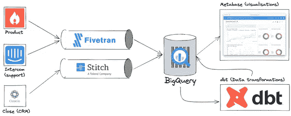

# 面向初创企业的现代数据堆栈

> 原文：<https://medium.com/codex/modern-data-stack-for-startups-f4ca4693b2db?source=collection_archive---------0----------------------->

如今，对高绩效公司来说，轻松获取数据是重中之重。

然而，轻松访问并不是免费的:它需要投资和仔细选择工具。对于我们这样的年轻公司，问题是多少？你什么时候进行投资？

发展到 10 个人，其中几个没有工程背景，但有强烈的数据需求，我们决定 2022 年就是那个时候。

经过两周的实验和几次公司研讨会后，我们对自己的成果非常满意。如果您是一家有类似需求的公司，并且关心所有人的数据访问，请遵循本指南，我们保证您会获得很好的结果。

*   架构概述
*   提取:Fivetran 和 Stitch
*   为什么是两个工具？
*   转换:dbt
*   我应该使用什么数据？
*   维度(dim)和事实(fct)表
*   临时(stg)表
*   使用 dbt
*   可视化:元数据库
*   将 dbt 模式同步到元数据库
*   入职和推广
*   离别的思绪

# 架构概述

随着数据仓库解决方案( [BigQuery](https://cloud.google.com/bigquery) 、[雪花](https://www.snowflake.com/)、[红移](https://aws.amazon.com/redshift/))成为主流，现代数据堆栈变得越来越乏味——如果你是从零开始，这是个好消息！

一般来说，您需要:

*   从各种工具(您的 CRM、会计平台等)中提取数据到数据仓库中
*   对源数据集执行数据清理和转换
*   找到一个可以利用仓库进行探索和洞察的可视化工具

找到互补的工具是困难的，我们与几家公司的数据工程师进行了交谈，以找出哪些工具适合他们(哪些不适合)。我们到达了下面的堆栈:



在左边，你会看到数据源(只是一个例子，我们有更多的数据)，我们生成和处理数据的工具。其中一个是 Product，Postgres 数据库支持 [incident.io](https://incident.io/) ，而 [Intercom](https://www.intercom.com/) 和 [Close](https://close.com/) 是我们用来运营业务的 SaaS。

[Fivetran](https://fivetran.com/) 和 [Stitch](https://www.stitchdata.com/) 都是 ETL 工具，用于将数据从各种来源传输到目的地。我们使用这两者将数据加载到我们的数据仓库 BigQuery 中。

在 BigQuery 中，我们使用一个叫做 [dbt](https://www.getdbt.com/) 的工具清理和转换数据。这使我们能够将原始源数据转换成理想的“数据仓库原生”格式，以便于分析。

最后， [Metabase](https://www.metabase.com/) 提供了一个可视化和分析层，针对 BigQuery 运行查询。

就是这样，整个数据堆栈。我们认为这些工具是我们将 incident.io 发展成为一个更大的公司所需要的，并且给出了我们的一个目标(总是，为了一切！)很简单，我们很高兴列表很小。

让我们更详细地看看这是如何工作的。

# 提取:Fivetran 和 Stitch

现代公司通过越来越多的工具产生大量数据。

虽然每个工具都提供了其数据的自定义视图，但我坚信组合数据集比其各部分的总和释放出更多的价值。我们通过将数据整合到一个仓库中来实现这一点，这意味着我们可以跨所有工具进行查询，并构建以有趣的方式组合数据的洞察力。

过去，公司会编写他们自己的 hacky 脚本来执行这种提取——我在过去遇到过 ETL 数据库触发器引起的可怕事件，甚至[自己也构建了一些](https://github.com/lawrencejones/pgsink)通用 ETL 工具。

从经验来看，相信我，当我说你不想建立这些。谢天谢地，ETL 产品如 [Fivetran](https://fivetran.com/) 和 [Stitch](https://www.stitchdata.com/) 为您运行和维护这些提取过程。

在 Fivetran 和 Stitch 中，过程是相同的:

*   选择连接器以访问源数据(您的 Postgres 数据库或 CRM)
*   使用身份验证对其进行配置，并选择要同步的数据
*   将数据推入仓库，通常在特定于源的数据集下

这是我们在 Fivetran 中配置的连接器的视图:


值得注意的是来源的多样性。如果您正在构建一个 SaaS 产品，最重要的数据源之一将是为您的产品提供支持的数据库。 [incident.io](http://incident.io/) 有一个由 Postgres 支持的单片应用程序，我们在其中存储如下表格:

*   `organisations`，使用产品的每个组织占一行
*   `users`，一个组织的每个用户
*   `incidents`，管理产品中的每一个事件

这些数据实际上是我们的产品，而你的同类产品可能是你仓库中价值最高的数据资产。

你的数据库将限制你如何复制这些数据，但是 Fivetran 提供了覆盖大多数情况的连接器——例如，我们的 [Heroku Postgres 缺乏逻辑复制支持](https://fivetran.com/docs/databases/postgresql#logicalreplication)，所以 Fivetran 退回到[定期扫描表并使用 xmin 作为光标](https://fivetran.com/docs/databases/postgresql#xminsystemcolumn)，而不是读取 WAL。

Fivetran 将代表您自动管理仓库模式，在目标数据集中为源中的每个表创建表。例如，下面是我们生产数据库中 BigQuery 数据集的视图:


像 CRM 这样的其他数据源将由 API 访问该工具来提供支持。对于这些连接器，Fivetran 将使用每次运行时设置的游标对 API 资源进行分页，获取这些响应并将它们推送到目的地。

如果不做一些额外的工作，这些数据的质量会很低，或者很难使用。将 API 资源转换成数据仓库格式需要一些人力，这就是我们的转换步骤。

# 为什么是两个工具？

到目前为止，您可能想知道为什么我们有两个 ETL 工具。Fivetran 看起来很棒，我们就不能用那个吗？

答案是我们愿意，因为 Fivetran 在我们能够使用它的地方非常出色，价格也非常惊人——我认为我们的所有这些连接器的账单大约是每月 100 美元，对于我们从中获得的价值来说，这是一笔划算的交易。

然而，我们受到连接器可用性的限制。Stitch 是一个类似于 Fivetran 的产品，但是它是建立在开源的 Singer 项目上的，这是一个巨大的数据抽头(源)和目标(目的)的集合。

以 Singer 为基础技术，Stitch 拥有比 Fivetran 更全面的连接器产品。在这两个工具中，只有 Stitch 支持 [Close](https://close.com/) (我们的 CRM)，这意味着我们不得不同时运行这两个产品，即使只是针对一个连接器。

抛开不便不谈，我认为这是一个不错的策略。ETL 工具的目标是将您的数据放入仓库，如果这是以可靠的方式发生的，那么它是如何到达那里的就不太重要了。

出于这个原因，我们的政策是“优先选择 Fivetran，否则选择 Stitch”。这对我们有用！

# 转换:dbt

现在我们在仓库中有了数据，我们需要将它转换成适当的形式以便查询和分析。这意味着将原始的源数据转化为可识别的业务概念，同时整理 ETL 过程的工件(删除删除的行等)。

现阶段有一个明显正确的工装选择，就是 [dbt](https://www.getdbt.com/) 。dbt 已经建立了一个庞大的 avid 数据工程师社区，是处理数据仓库的解决方案，应该与行业的其他部分保持一致。

虽然工具选择是显而易见的，但如何使用 dbt 将是一个更有争议的问题。关于 dbt 最佳实践，有很多[很棒的](https://docs.getdbt.com/docs/guides/best-practices) [资源](https://github.com/dbt-labs/corp/blob/master/dbt_style_guide.md)，但是正如你可以从我的[松弛问题](https://getdbt.slack.com/archives/CBSQTAPLG/p1641890699324300)中看到的，有足够的模糊性来束缚你。

我们已经实现了一种结构，它最大限度地减少了 dbt 模型(及其模式文件，这是真正的维护负担)的数量，并根据质量和预期用途对表进行分类。

以下内容摘自我们的“数据简介”教程:

# 我应该使用什么数据？

并非所有的数据都是相同的，了解可以从元数据库查询的不同类型的模型是很有用的，这样您就可以充分利用它。

首先，我们希望人们查询的数据是我们从 dbt 中产生的。dbt 生成的所有表都位于元数据库的`All (dbt)`数据集中。

该数据集包含许多表，每个表将是:

*   Dim 尺寸表
*   Fct 事实表
*   Stg 暂存表

一般来说，更喜欢使用(按此顺序):

# 维度(dim)和事实(fct)表

这些表通常被描述为“集市”，代表关键的业务数据，并且在查询时易于使用。

尺寸表的一个例子是`dim_organisations`。一般来说，维度表为它们描述的每个实体(例如，一个组织)提供了一个单独的行，并且有大量的列可以用来过滤和分组这些实体。

我们的`dim_organisations`表有如下几列:

*   `id`和`name`，识别组织
*   `in_setup_flow`，是否已完成设置
*   `is_paying`，如果存在有效的条带订阅
*   `lead_id`，关闭的潜在客户的 ID(CRM)

请注意，用来自其他来源(如 Close)的数据充实组织的大部分艰苦工作已经完成，这使得过滤任何可用维度变得容易，而无需复杂的连接。

事实表是维度表的补充，可以看作是发生的事情的列表(也称为“事件流”)。在维度表中每个实体有一行的情况下，您会发现事实表中每个实体都有许多行(事件),并且您需要连接相关的维度表来执行过滤。

例如，我们有一个`fct_organisation_statistics`表。这包含一个组织存在的每一天的一行，以及一些度量，如总空闲用户、事件数、创建事件的用户数等。

这些是我们提供的最高质量的数据表，当它们存在时，您应该更喜欢使用它们。

# 临时(stg)表

Fivetran 和 Stitch 生成的源数据是不稳定的，通常难以使用。

例如，源关闭数据没有机会的概念，因为这些机会存在于主数据模型中，并且没有被建模为一级对象。

我们没有让人们查询笨拙的源表，而是选择从源数据构建临时表，这些表:

*   将列重命名为一致的(所有真/假列都以`is_`或`has_`开头)
*   将列转换为正确的类型(时间戳字符串被解析为时间戳)
*   将深度嵌套的数据提取为合适的形式(自定义字段成为列)

以及将源数据转换成查询的“理想”数据所需的任何其他东西。

回到我们最近的例子，我们有以下表格:

*   `stg_close__leads`清理源销售线索数据，使定制字段易于使用
*   `stg_close__opportunities`它完全由销售线索来源中的嵌套业务机会数据构建而成，在您想要查询时显示

当没有可以更好地服务于您的用例的维度或事实表时，退回到暂存数据。

# 使用 dbt

最后几节来自我们的数据教程，也是我们如何教授选择正确的数据表。

这反映了我们构建 dbt 存储库的方式，这很正常:

```
dbt/models
├── marts
│   └── core
│       ├── core.yml
│       ├── dim_incidents.sql
│       ├── dim_organisations.sql
│       ├── dim_users.sql
│       ├── fct_organisation_statistics.sql
│       └── fct_user_incident_graph.sql
└── staging
    ├── close
    │   ├── README.md
    │   ├── src_close.yml
    │   ├── stg_close.yml
    │   ├── stg_close__activities.sql
    │   ├── stg_close__leads.sql
    │   └── stg_close__opportunities.sql
    └── product
        ├── README.md
        ├── src_product.yml
        ├── stg_product.yml
        ├── stg_product__actions.sql
        ├── stg_product__announcement_rules.sql
        ├── ...
        └── stg_product__workflows.sql
```

当我在快速运行 dbt 教程时，我很想看看这个结构，给我们朝着正确的方向前进提供一些信心。

我只是一个业余 dbt'ist，有必要注意一下这个结构中的一些决定:

*   您将在 dbt 文献中看到提到的[“基础”表](https://discourse.getdbt.com/t/how-we-structure-our-dbt-projects/355#but-what-about-base-models-3)，被描述为源之后的第一次转换，出现在登台之前。我们选择不创建这些，而是直接使用 staging 表——这避免了维护另一层 dbt 模式，而且我们的许多数据(尤其是产品)在源代码中接近 staging 格式。
*   除非我们跨模式连接它们(就像维度表一样)或者对它们执行复杂的转换(事实表)，否则我们不会从阶段模型中产生集市。同样，这是为了减少 dbt 模式的数量。
*   我们现在只有核心市场。在我们添加更多的集市之前，实施更复杂的结构(例如将集市归入业务部门)是没有意义的，这样可以更好地适应我们的发展。

在针对 dbt 开发方面，每个工程师都有一个单独的 BigQuery 数据集(即。他们的目标是在本地开发进行测试。运行一个完整的构建(`dbt build`)现在很快，使得本地开发变得愉快。

虽然这种设置使折衷适合于 incident.io 的上下文，但我认为任何设置数据堆栈的人都可以毫无问题地采用这种设置，而且一旦您更熟悉该工具，就很容易进行调整。

# 可视化:元数据库

现在，我们的数据已经被清理、转换并成形为用于分析的理想格式，是时候选择一个可视化工具了。

这一选择至关重要，因为无论我们选择什么，人们都将如何与我们的数据互动。我们这个堆栈的关键目标之一是让非技术培训人员受益，过去使用 Looker 等工具的经验表明，只有在 BI 团队的大力帮助下才有可能实现这一点，这是我们希望避免的。

我们选择了[元数据库](https://www.metabase.com/)作为最直观的选项，其可视化无需任何 SQL 知识即可构建。

一个工具是否直观是主观的，但 Metabase 对我来说肯定是这样的。例如，让我们尝试绘制每月创建的事件时间线项目的数量，并看看该流程是什么样的:


注意事项:

*   不需要 SQL，即使我们从头开始构建可视化(不是从现有的问题)。
*   将 Stg Product Timeline Items 表与 Stg Product Organisations 连接起来非常容易，部分原因是 Metabase 可以自动确定连接键(稍后将详细介绍)。
*   界面非常干净，比传统的数据工具链更接近向导或现有的电子表格工具。

所有这些都对入职有很大帮助，特别是对于非技术人员。

# 将 dbt 模式同步到元数据库

元数据库确实有助于降低访问数据的障碍，但是它受限于对模式的了解程度。

在前面的屏幕记录中可以看到一个例子，其中将 Stg 产品时间表项目与 Stg 产品组织连接时，会预填充连接键(组织 ID)。如果元数据库知道 Stg 产品时间表项目上的组织 ID 是 Stg 产品组织的外键，以及它引用哪个字段，元数据库只能默认此项。

碰巧的是，我们的 dbt 模式已经通过列测试知道了这些信息。以下是 Stg 产品时间表项目的`organisation_id`字段的模式:

```
---
models:
  - name: stg_product__timeline_items
    columns:
      - name: organisation_id
        description: "Organisation ID"
        tests:
          - not_null
          - relationships:
              to: ref('dim_organisations')
              field: organisation_id
```

每当我们有一个指定关系测试的列时，我们就可以根据父表推断出一个外键关系。

那么我们如何将它放入元数据库呢？有一个叫做 [dbt-metabase](https://github.com/gouline/dbt-metabase) 的工具，它可以从 dbt 模式中推断元数据库语义类型信息，并将其推送到元数据库中——每当完成 dbt 构建时，我们都会运行这个工具，帮助将元数据库与我们可能添加的任何新字段同步。

不过，推断外键只是该工具的一种用途——您也可以手动指定列类型。

作为有用例子，将列注释为“名称”允许元数据库通过名称值为实体主键提供类型头，例如在客户 ID 过滤器中使用客户名称。

下面是一个设置类型的示例:

```
columns:
  - name: name
    decription: "Name of the organisation"
    meta:
      metabase.semantic_type: type/Name
  - name: archived_at
    decription: "When the resource was archived"
    meta:
      metabase.semantic_type: type/DeletionTimestamp
  - name: opportunity_annual_value
    meta:
      metabase.semantic_type: type/Currency
    description: "If an opportunity event, annual value in in normal currency denomination"
```

# 入职和推广

覆盖了整个堆栈。综合报道:

*   [Fivetran](https://fivetran.com/) 和 [Stitch](https://www.stitchdata.com/) 将数据提取到 [BigQuery](https://cloud.google.com/bigquery) 仓库中
*   [dbt](https://www.getdbt.com/) 执行清理和转换以帮助分析
*   [用于可视化的元数据库](https://www.metabase.com/)，带有用于同步模式的[dbt-元数据库][工具/dbt-元数据库]

花了大约两周的时间才弄清楚这一切，并使用 dbt 公开了我们的大部分数据源，并在元数据库中公开。那是一个以前从未使用过 dbt 的工程师，他不得不匆忙做出许多这样的决定。我希望有人按照这个指南可以做得更快。

一旦我们建立并运行了堆栈，我们就针对不同的受众举办了两次研讨会:

*   dbt 简介，面向将构建 dbt 模型的工程师。
*   我们还不能雇佣一个全职的 BI 团队，我们认为我们可以让工程师通过在 dbt 中定义它们来将更复杂的数据特性呈现给元数据库。这个会议讨论了我们的 dbt 设置，我们集中讨论了向 dbt 模型添加一个特性，手动将模式同步到元数据库中。
*   面向整个公司的数据介绍。
*   每个人都应该在工作中使用数据，所以每个人都需要熟悉元数据库。本次会议包括一个堆栈的纲要，然后作为一个小组工作，以可视化一些关键的业务指标。
*   最后，我们拿出一份我们渴望回答的问题清单，并在我们之间进行分配，让人们两人一组回答这些问题。

两个研讨会都很棒，但整个公司会议是我最喜欢的。在像我们这样的公司里，两周是漫长的，我的大部分决定都有明确的目标，但经验很少。

这是一个重要的时刻，当一个没有 SQL 经验的人向我展示我们产品教程的转换漏斗时，这是完全正确的:

# 离别的思绪

在大多数公司中，数据是一种货币，每个人都能平等地访问数据是非常重要的。很容易——尤其是当公司以高度技术化的团队开始时——以少数知道所有答案的人结束，破坏了那些团队之外的人的所有权和自主权。

我真的很满意我们目前的设置，主要是因为它提供了我以前从未见过的平等访问。

最后，值得重申一点，这一点很容易被忽视:这一堆栈可以轻松地将来自不同来源的数据整合到一个仓库中，这意味着您可以将它组合起来，以释放比数据单独提供时更多的价值。

连接这些数据意味着您的产品活动可以与您的销售工具相结合，并且您的客户成功报告可以考虑客户通过对讲机联系的频率，或者他们是否拖欠 Stripe 的款项。

这篇文章所描述的是利用这一全行业变化的基础。如果你是一家小公司，想要超越自己的能力，不抓住这个机会就是疯了。