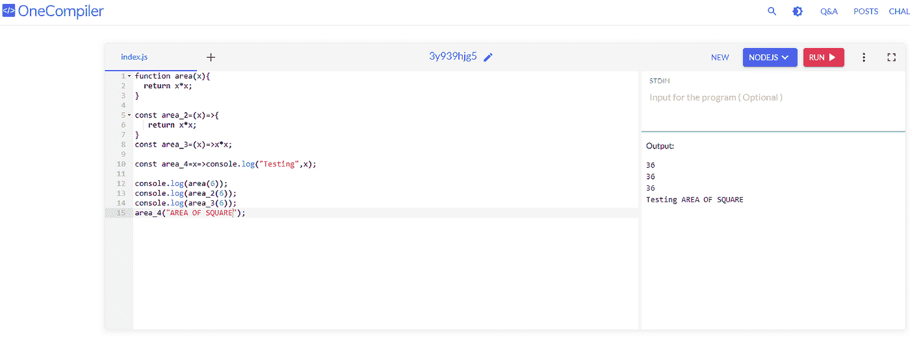
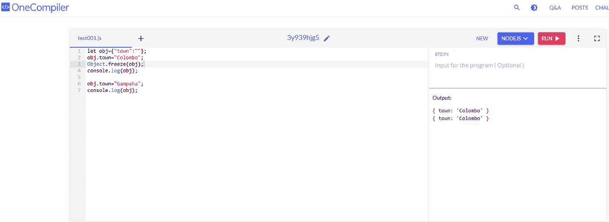

# 现代 JavaScript

> 原文：<https://medium.com/codex/modern-javascript-e78bfae8bea5?source=collection_archive---------19----------------------->

假设一个变量隐藏在它定义的边界之外。在这种情况下，k 变量的范围仅限于循环的。访问变量 k 会导致如下所示的错误。

如果我们在这种情况下使用 var，它将正确地打印，没有任何错误，但是，var 的范围使得很难在长代码中看到错误。字母确保在{}代码内部产生效果。

如果用 const 代替 var，那么在 for 循环中声明变量也会出现同样的问题。当在循环外使用 const 时，为了避免错误，我们必须在声明行中初始化 const 变量。

因为 const 被初始化了两次，一次在第 1 行，另一次在第 3 行，所以下面的代码会产生一个错误。

由于范围影响从第 1 行到第 8 行的整个代码，所以在循环外使用 allow 不会导致错误。

**Const 只为不是对象或数组的变量提供保护。**

正如你在下面看到的，在一个常量变量被赋值后，我们不能给它一个新的值。

但是我们可以使用一个常量数组并添加 2 个或更多的值。

不管是对象还是数组。它可以增加或修改常量变量的值。

**JavaScript 中的箭头函数**

使用箭头，我们可以使函数更简单。如果我们传递两个参数，那么括号是必需的；如果我们只是传递一个参数，那么就不需要括号。

如果编写了调用函数，那么正则函数中的这个关键字表示调用函数。但是，如果我们使用的是箭头函数，这个术语并不表示调用者。

提示-:这不代表呼叫者。

**对象处理**

如果我们在执行的时候不确定这个键，由于动态属性，我们可以使用一个占位符作为键。

Key 有时候挺活泼的。当我们通过服务传输一个项目时，我们不确定密钥是什么。服务提供的任何内容都可以分配给占位符，如下所示。

如您所见，第 1 行已经有一个值，因此 SQRT2 不需要值。启用动态属性时，会出现一条错误消息。

如果我们在执行时不确定值，我们可以使用一个占位符作为键，如下所示。

**冻结物体**

我们可以很容易地给一个对象重新赋值，如下所示。

但是，如果我们使用 freeze 方法，第二个对象的值不会改变，因为在冻结后，该对象保留其原始值。

该项目将因此冻结，使其不可更改。

如果希望对象从一个服务移动到另一个服务或从一个函数移动到另一个函数，但不想修改其值，请使用 freeze 方法。

此冻结仅影响一级值；它对内部级别的对象没有影响。

Name 是一级变量，而 t1 和 t2 是二级变量，如你所见。只有一级变量，比如名字，会被冻结。因此，该名称没有被更改。T1 改变，因为冻结方法在那里没有影响。

**模板**

**超驰功能**

当通过对象调用函数时，我们可以用任何东西覆盖它。类可能有函数，但在运行时，我们可能会选择在覆盖函数中覆盖它们，例如。

**自毁**

不用在这里演示，我们可以像在数学课上学到的那样写 PI 和 SQRT2。

计算面积时，我们只需要一个基础；不需要额外的变量。我们传递对象的同时提供参数，但是它计算面积没有任何问题。

正如您所看到的，当执行这个操作时，创建了两个文本文件。在这里，我们可以选择忽略 fs，在使用 destruct 时只写它。

**承诺**

Http GET 偶尔会连接到服务器并请求响应，代码必须包装在承诺中，如下所示。这将触发承诺，当它完成时，如果它被包裹在一个承诺。

如果使用 below 函数代替 catch finally 块，这将导致 undefined。这包含在 promise 对象中，但是我们首先声明长度。通常，在这种情况下，我们不会等待结果。这并不等待诺言的实现。

这将返回一个 promise 对象，并等待直到通过使用 fetch web 页面解析该承诺。一旦承诺兑现，它就转移到下一个。如果 await 关键字被删除，它将变成未定义的。

术语“await”只在异步函数中有效。删除 async 关键字会使 await 无效。