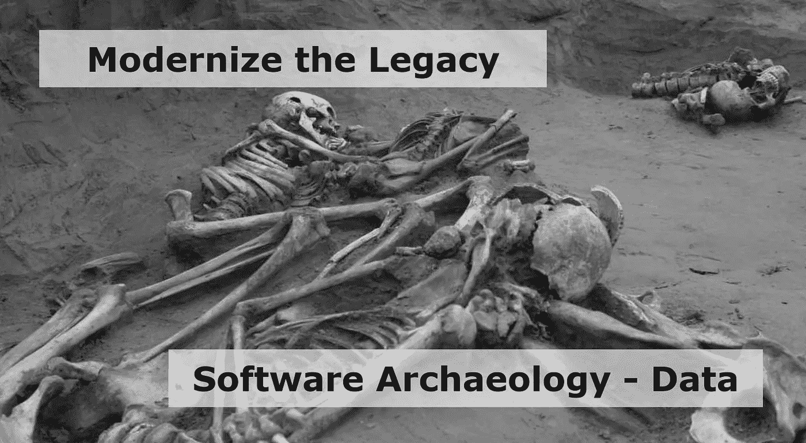

# 现代化遗产-软件考古-数据

> 原文：<https://medium.com/codex/modernize-the-legacy-software-archaeology-data-7ce7df61b2f6?source=collection_archive---------14----------------------->

正如我在上一篇关于“软件考古学”的博客中已经提到的(参见[链接](https://thilo-hermann.medium.com/modernize-the-legacy-software-archaeology-a3e7e5942ec3))，我将更仔细地看看另一个维度:数据！

考古学家通常研究过去的物质遗迹，以了解人们是如何生活的。要做到这一点，考古学家，提出问题，发展假设。他们选择一个挖掘地点，观察、记录、分类并解释他们所发现的东西。

对于 IT 中的遗留数据，也是一样，您必须分析和解释数据模型以及实际数据中的隐含语义，以充分理解持久化数据的含义。为此，你可以进行采访，对数据模型进行逆向工程，并在此基础上进行解释。由于数据通常是许多企业的财富，因此在处理数据时必须非常小心！

在用新应用程序替换旧应用程序的过程中，数据迁移(将数据从 A 移动到 B)是一个重要步骤。

综上所述，我们可以看看数据迁移过程中的典型挑战。

# **挑战**

*   **不明确的范围:**一旦开始迁移，随着时间的推移，发现几个额外的数据源是很常见的。这导致了额外的复杂性和工作量。最重要的是，数据的依赖性和主权没有得到很好的理解，这可能会导致额外的、计划外的任务。
*   缺乏关于遗留数据模型的知识:逆向工程通常是了解遗留系统中现有数据模型的唯一方法。因此，知识非常有限，隐含的假设很难发现。另一种可能是询问遗产专家他们是否已经退休或者不在你的范围内。
*   **数据质量不够高:**在遗留应用程序中，持久化数据的质量通常是一个挑战。随着时间的推移，需求会发生变化，这通常会导致质量问题，因为实施了临时解决方案(例如，将现有数据字段重新用于不同目的，在文本字段中对结构化数据进行编码等等)。
*   **语义依赖没有很好的理解:**现有的数据模型往往包含隐式语义。文档很差，甚至不存在，专家可能不记得所有的细节。在这种情况下，逆向工程既棘手又耗时。通常，数据会随着时间的推移而演变，例如，隐式语义只适用于部分持久数据。
*   **新的合理性检查是严格的:**在新的应用中，通常指定并实施对数据的严格验证。这可能会导致在导入新数据库的过程中出现问题。旧数据必须符合这些规则，并且自动增强/校正并不总是可能的。这可能会中断导入，从而停止迁移！
*   **运行时:**迁移会造成停机，因此需要提前安排。ETL 过程需要时间，通常会超出给定的时间范围。您需要知道您的时间框架，并相应地实现、度量和优化 ETL 过程。

基于这些挑战，我们确定了以下关键成功因素:

# **关键成功因素**

*   **早期匹配差距分析:**必须了解新旧数据模型之间的差异，包括合理性检查。必须确定差距，并用数据清理方法填补。
*   **早期数据清理以提高数据质量:**要提高遗留系统中的数据质量，越早开始越好。这可以通过应用程序或数据库级别的脚本来完成。请注意，直接在数据库上工作是危险的，需要大量的测试和有效的测试策略。
*   **遗留系统的早期变更:**有时需要修复遗留系统并填补现有的数据缺口。此外，实施增量协议以支持增量迁移将有助于执行迁移并减少停机时间。
*   **早期系统的和可重复的测试:**因为我们在公司的金库工作，所以进行广泛的测试是很关键的。您应该尽可能地自动化，因为您通常需要多次重复测试。此外，关注性能等非功能性需求也很重要。

正如你可能已经注意到的，尽早开始这一切是很关键的。我看到许多迁移失败，因为他们开始晚了，并且不可能在剩余的时间内正确地迁移数据。为了克服这些挑战，我建议仔细研究以下最佳实践:

# **最佳实践**

*   **尽早开始:**别拿这个话题等。最好从订婚的第一天开始。它需要得到相应的规划和人员配备。迁移的数据也有利于新应用程序的测试(如果足够早的话)。
*   **敏捷和迭代:**由于需求会随着时间的推移而变化，所以在迭代中多次执行迁移是最佳实践。在敏捷项目中，这是成功的唯一途径。一个人可以通过多次执行这些过程学到很多东西，尤其是在早期阶段。
*   **使用完整的生产数据:**对于测试来说，尽早使用生产数据是关键。这有助于预测运行时间并检查给定的时间框架是否足够。此外，该数据可用于新应用的功能测试，作为合成测试数据的补充。
*   **尽可能降低复杂性:**数据转换会给迁移增加很多复杂性。因此，应该尽量减少这种情况。KISS 原则也适用于数据。有时有必要减少新应用程序中的真实性检查，以保护数据迁移。
*   **合适的环境:**使用类似的生产环境或特殊环境进行迁移。这有助于保护非功能性需求(主要是性能和安全性)。由于停机时间通常非常严格，因此您必须计划在哪个环境中执行迁移。请注意，数据的访问和移动可能会受到安全要求的限制。
*   **提前计划:**使用几个缓冲区和迭代的逆向计划(从实际迁移数据开始)是关键。您应该将此与“新”应用程序的项目计划联系起来。要意识到这两个方面的紧密联系。如果一方失败了，另一方也不会成功。
*   **搭载遗留专家:**如果您有机会搭载遗留系统的专家(例如业务&技术架构师、测试人员、开发人员)，您应该毫不犹豫地这样做。他们带来的知识是无价的。不要对他们太苛刻，因为你说的是他们的“孩子”。

如前所述，在软件考古学的上下文中还有其他的维度。请继续关注围绕软件考古学的更多博客！