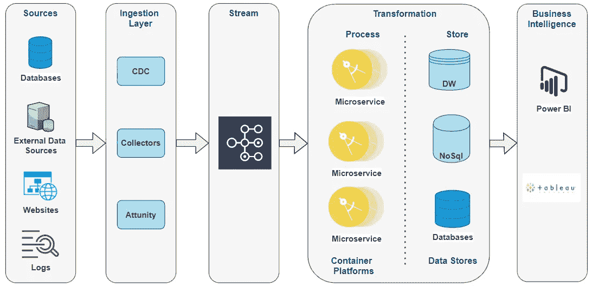

# 现代化您的 ETL 过程，释放更好的商业智能

> 原文：<https://medium.com/codex/modernize-your-etl-processes-to-unleash-better-business-intelligence-6f9f3abe9328?source=collection_archive---------9----------------------->

*图片由*Atos.com 提供

在本文中，我们将讨论 ETL 过程(提取、转换和加载)，现代化 ETL 工具/平台的需求，并开始他们的现代化之旅。

随着企业数据环境的指数级增长，传统的 ETL 工具已经无法处理当今数据的数量和复杂性。

ETL 现代化可以帮助我们克服这些限制，但没有直接的方法将这些遗留 ETL 工作负载转换和迁移到新方法，如 Apache Spark 和基于微服务的处理框架。

# 传统 ETL 工具面临的挑战

正如我们所知，传统的 ETL 工具正被广泛用于跨组织的各种 ETL 用例。使用 ETL 工具，业务流程通常以一种高度窒息的方式实现，导致高度抽象的整体，并且随着数据量和质量的长期变化，存在获得性能不佳的结果的风险。

此外，ETL 工具仅支持批处理、结构化和半结构化数据，缺乏有效的元数据管理和法规遵从性需求，并且许可证成本和供应商锁定始终存在。

在进入 ETL 现代化方法之前，让我们快速浏览一下 ETL 过程…

**ETL 概述**

如今，许多组织都明白存储和管理数据对于优化其性能和保持市场竞争力的价值。大多数企业都有大量的数据，但是组织这些数据以便于访问并推动业务洞察始终是一项挑战，这不仅仅需要将数据存储在数据仓库中。

这是我们拥有 ETL 工具的地方…

**ETL 过程**

ETL 在组织中的重要性与组织对数据仓库的依赖程度成正比。ETL 工具收集、读取和转换数据，然后将数据加载到数据存储或数据仓库中以便于访问。ETL 工具帮助我们处理数据，使其有意义。最后，我们可以使用这些数据通过图形界面提供商业智能。

这些 ETL 工具是为少量数据和流程设计的，不符合现代数据环境的要求。

话虽如此，传统的 ETL 工具也正在赶上处理半结构化和非结构化数据，并实时提供商业智能。他们提出了 ELT 实施概念，即提取、加载，然后转换，这与大数据管道非常相似。

***图片来自*xplenty.com**

# ETL 现代化如何帮助解决这些挑战？

让我们看看 ETL 现代化如何帮助我们解决这些挑战，以及我们能从中获得什么好处。

ETL 现代化…

*   支持批处理和实时处理
*   低成本数据湖存储。
*   快速开发以构建复杂的转换任务
*   并行处理缩短了时间。
*   支持结构化、半结构化和非结构化数据。
*   支持流和数据科学任务。

让我们快速浏览一下各种 ETL 现代化方法…

## **使用 Apache Spark / Azure 数据块的大数据管道**

在我们进入大数据管道方法之前，让我们快速概述一下大数据和 Apache Spark…

**大数据**是一个描述大量数据的术语，这些数据包括结构化数据和非结构化数据，每天充斥着企业。但重要的不是数据量。重要的是组织如何处理数据。

下图描述了大数据管道的高级场景…

**大数据管道**

**Apache Spark** 是用于大规模数据处理的统一分析引擎。它提供了 Scala、Java、Python 和 R 中的高级 API，以及一个支持用于数据分析的通用计算图的优化引擎。它还支持一组丰富的高级工具，用于机器学习的 MLlib 和用于流处理的结构化流。

在这种方法中，摄取层将数据摄取到原生数据-Lake/Hadoop 和 Spark with Scala 作业读取数据，应用转换，并将数据存储到 DB 或 Hive 文件系统中进行分析。Spark 在其驱动程序/执行器架构中使用内存处理，以获得最佳性能。

下图描述了使用 Apache Spark Cluster 的 ETL 现代化…

**火花簇**

类似地，我们可以使用 Azure Databricks 服务(managed spark cluster)来完成 ETL 现代化。

> **Azure Databricks** 是一个快速、简单、协作的基于 Apache Spark 的大数据分析服务，专为数据科学和数据工程而设计。Azure Databricks 提供了最新版本的 Apache Spark，并允许您与开源库无缝集成。无需监控即可设置、配置和微调集群，以确保可靠性和性能。**资料来源-azure.databricks.com**

下图描述了使用 Azure Databricks 的 ETL 现代化…

**使用数据块集群**

## **使用容器&无服务器平台(Kubernetes/AWS Lambda/Azure 函数)**

让我们快速概述一下容器和无服务器平台…

Kubernetes 是一个开源的容器编排系统，用于自动化计算机应用程序的部署、扩展和管理。

在这种方法中，可以使用 CDC 工具获取原始数据，部署在 Kubernetes 集群上的微服务可以处理转换部分。Kafka streams 可以处理间歇性持久化&维护作业状态，转换后的数据可以持久化到数据存储中，最终由商业智能工具用于分析目的。

下图描述了使用容器平台的 ETL 现代化…

**使用集装箱平台**

**公共云中可用的 AWS Lambda/Azure 功能**是事件驱动的按需计算体验，它扩展了现有的应用程序平台，使其能够实现由第三方服务和内部系统中发生的事件触发的代码。

在这种方法中，可以使用无服务器函数来处理转换部分，对象存储用于间歇性持久化，调度器用于维护作业状态。这种方法仅推荐用于短期和低复杂性的 ETL 作业。

下图描述了使用无服务器功能的 ETL 现代化…

**使用无服务器平台**

## **使用雪花数据仓库**中的“流&任务”特性

> **Streams & Tasks** 雪花中的特性提供了 ETL 引擎。雪花中的任务提供了对过程的控制，以便按照您希望的顺序执行它们。对于一次性加载，只需启动主任务作业，它就会按照您设置的方式以连锁反应的方式运行。但是对于每天运行的增量负载，您希望一收到任务和作业就运行它们。
> 
> 资料来源-snowflake.com

流和任务特性可以帮助我们处理这些场景。这种方法更适合迁移到雪花平台的工作负载。

***图片由 snowflake.com***提供

# 结论

**ETL 现代化**正在成为一个组织的 IT 生态系统的关键策略，以一种实时、更灵活和可扩展的方式重新构建其业务流程并与外部系统集成。

话虽如此，我还想在这里声明，现代化每个 ETL 用例是不可取的，我们应该进行适当的评估和分类，以决定 ETL 现代化方面。甚至 ETL 工具的未来版本也在处理半结构化和非结构化数据，并实时提供商业智能。

与企业的数字战略、IT 系统合理化路线图、实施框架和具有适当技能资源的执行方法相一致的正确 ETL 现代化战略可能是 ETL 现代化之旅的关键成功因素。

一定要让我知道你对 ETL 现代化的看法。

感谢阅读！！！