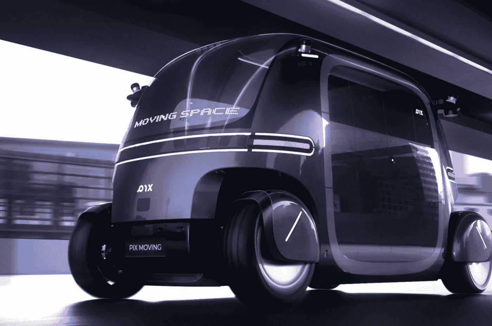

# 面向大众的模块化可配置移动空间！

> 原文：<https://medium.com/codex/modular-configurable-mobile-spaces-for-the-masses-490e47fdc06a?source=collection_archive---------2----------------------->

## 改变是必然的，适应吧！-机器人巴士

[Robobus(通过 PIX 移动的媒体)](https://www.pixmoving.com/robobus)

在过去的十年里，自动驾驶一直是每个汽车制造商的想法，尽管他们已经走过了漫长的道路，但仍有相当多的事情需要解决。Pix Moving 相信自动驾驶的黎明比我们想象的更近，他们有[机器人巴士](https://www.pixmoving.com/robobus)原型来证明这一点。这个…