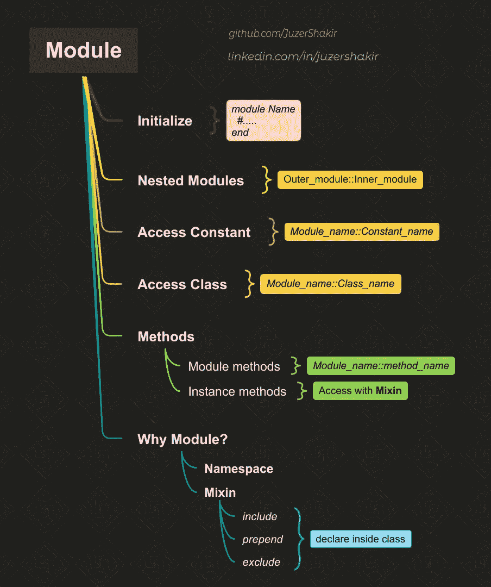

# Ruby 中的模块

> 原文：<https://medium.com/codex/modules-in-ruby-72263d88b9af?source=collection_archive---------3----------------------->

## 不能像类那样实例化的那个！

# 先决条件

为了更好地理解这个主题，我建议您对 Ruby **中的** [**类有扎实的**知识。****](https://juzer-shakir.medium.com/class-and-its-different-methods-in-ruby-ea8e919c87a4)

# 目录

↦ [**定义**](#aa20)

↦ [**嵌套模块**](#ee3b)

↦ [访问常数**访问常数**访问常数](#cf38)

↦ [模块中的**方法**模块](#edd9)

↦ [模块中的**类**模块](#0f43)

↦ [**为什么要使用模块？**](#e06c)

↦ [**命名空间**](#cafc)

↦ [**米欣**](#4472)↪ [包括](#26b6)
↪ [前置](#9277)
↪ [延伸](#90b9)

↦ [**从不同的文件中访问一个模块**](#cf1d)

# 定义

> 模块是容器中常量、方法、类和变量的集合。



本文涵盖的主题

它类似于一个*类*，但关键区别在于 ***模块*不能像*类*那样被实例化**。

```
# module begins
module Test
 # end of scope
end
```

模块由关键字`*module*`初始化，后跟' *module_name'* ，`*Test*`，首字母大写，因为它们是常量。最后通过`*end*`关键字结束它的范围。

# 嵌套模块

是啊！模块也可以嵌套，就像嵌套类或嵌套方法一样。

我们可以直接访问内部模块`Inner`，方法是调用它的父模块`Outer`，后跟一个双冒号操作符`::`，后跟内部模块的名称。(线 *#9* )

我们也可以像重新打开 Rubys 的内置类或者我们自己定义的类一样重新打开模块，直接访问内部模块，如第 *#12* 行所示。这种风格有利于程序员将缩进的数量从两行减少到一行。

# **模块中的常量**

我们通过给 *module_name* 、`*Test*`，后跟双冒号运算符、`::`，再后跟 *constant_name、*、`Module_constant`来访问模块的*常量*。

`Module_constant`是一个常量对象，可以被模块`Test`中定义的方法、类和模块访问。然而，常量在模块`Test`的范围之外是不可访问的。

# 模块中的方法

定义和访问*实例*和*模块*方法类似于我们对*类*所做的。

由于我们不能将*模块*实例化为*类*，访问*实例方法*将在本文后面的 [**Mixin**](#4472) 部分讨论。

# 模块中的类

正如我们可以从*模块*中访问*常量*一样，我们也可以访问*模块*范围之外的*类*。

# **为什么要用模块而不是类？**

出于这两个原因:

1.  **命名空间**
2.  **Mixin**

我们来讨论一下:

# 命名空间

> 命名空间是将逻辑上相关的对象捆绑在一起的一种方式。它允许名称冲突的类或模块共存，同时避免冲突。

这方面的一个例子是*导轨*模块。

这里的`*Application*`类是在`*Rails*`模块的范围内定义的。

由于`*Application*`类是一个很常见的类名，我们可能会在另一个 gem 中遇到，所以为了避免相似名称的冲突，`*Application*`类被封装在`*Rails*`模块中。

这意味着类`*Rails::Application*`永远不会与在其他地方定义的`*Application*` 类或`*Other_gem::Application*`类冲突。

# 米欣

> Mixin 是一种工具，通过使用`include`、`prepend`和`extend`关键字，可以在另一个模块或类中调用一个模块。

## 包括:

这里，我们在模块`*Mod*`的范围之外创建了一个类`*Klass*` ，我们将`*Mod*`模块的实例方法作为实例提供给类 `***Klass***` **。**

当我们对类`Klass`调用`.*ancestors*`方法时，它给出了类`*Klass*` 从*继承的类和模块的列表。*

在之前，我们调用`*include*`，类`*Klass*`直接从`*Object*` *，*继承，但是在`*include*`调用之后，类`*Klass*`现在直接从模块`*Mod*`继承。

**`**include**`**关键字将声明的模块的方法添加到声明为实例方法的类中。****

**换句话说:**

****`***include***`**关键字使*模块*成为*类的父模块，它在祖先链中声明了*。******

****因此，当我们将一个*实例方法*调用到类`*Klass*` *，*时，它们会在它们的父模块`*Mod*`中找到一个*实例方法*并给出输出。****

******但是，模块方法只对** `***Mod***` **模块本身可用。******

****现在，如果我们在一个*类*中`*include*`两个不同的模块具有相同的“*method _ name”*会怎么样呢？****

****从第一个模块直接导入的第二个模块。****

****所以当我们调用`*method_1*`时，它将首先查看它是否在类`*Klass*`中可用，然后它将在层次结构中向上一步到模块`*Mod_2*`以找到*方法*，它在那里找到它并给出输出。****

****如果我们从`*Mod_1*`中移除`*method_1*`，这不会给出任何不同的输出，因为它不会去那里寻找*方法*，然而，如果我们从`*Mod_2*`中移除`*method_1*`，那么它会在`*Mod_1*`中找到`*method_1*`并给出它的输出。****

## ******前置******

******`***prepend***`**关键字使*模块*成为*类的子模块，它在祖先链中被声明为*。********

****或者，****

******声明** `**prepend**` **关键字的类是被声明模块的父类。******

****因此，当我给出一个在*模块*和*类*中都可用的*方法*时，它将首先在*模块*中查找，作为其祖先链中的第一个成员。****

## ******延长******

******`**extend**`**关键字将声明模块的实例方法添加到声明为类方法的类中。********

****或者，****

******`**extend**`**关键字使 m *模块*的*实例方法*成为*实例方法*到*单例类*的一个实例方法，其中** `**extend**` **在*中声明。*********

****换句话说，****

******`**extend**`**关键字带来了*实例方法*中的一个**`**Mod**`**，作为*单体方法*的** `**Klass**` **。********

```
**Klass.singleton_methods  
# => [:method_1]**
```

****类`*Klass*`的祖先链没有受到影响，但是*单例类*的祖先链受到影响...****

```
**p Klass.singleton_class.ancestors[#<Class:Klass>, Mod, #<Class:Object>, #<Class:BasicObject>, Class, Module, Object, Kernel, BasicObject]**
```

****模块`*Mod*` 是单例类`*Class:Klass*`的父类。所以当我们调用`*Klass.method_1*`时，我们正在从单例类、`Class:Klass.`中访问`*method_1*`****

# *****从不同文件访问模块*****

*****这个我在这篇[文章](https://juzer-shakir.medium.com/accessing-module-in-root-in-ruby-8eb46dbb38e1)里已经详细解释过了。*****

# *****额外资源*****

*******前置的真实例子:*******

*****[](https://chunksofco.de/rubys-prepend-how-is-it-useful-d3bba8d11a95) [## Ruby 的 Prepend:它是如何有用的？

### 用一个真实的例子

chunksofco.de](https://chunksofco.de/rubys-prepend-how-is-it-useful-d3bba8d11a95) 

**Rubys 的内置模块有:**

[](https://juzer-shakir.medium.com/enumerable-module-in-ruby-7cb0e42d4b3f) [## Ruby 中的一个可枚举模块

### Ruby 提供了丰富的方法资源，可供类使用。

juzer-shakir.medium.com](https://juzer-shakir.medium.com/enumerable-module-in-ruby-7cb0e42d4b3f) [](/kode-art/everything-is-comparable-in-ruby-cf9ab5e8252f) [## 在 Ruby 中，一切都是“可比的”

### 欢迎😉

medium.com](/kode-art/everything-is-comparable-in-ruby-cf9ab5e8252f) 

欢迎对本文提出任何建议或编辑！谢谢大家！

**我上一篇:**[Ruby 中的一个类](https://juzer-shakir.medium.com/class-and-its-different-methods-in-ruby-ea8e919c87a4)
**我下一篇:**[Ruby 中的一个可枚举模块](https://juzer-shakir.medium.com/enumerable-module-in-ruby-7cb0e42d4b3f)

[**GitHub**](https://github.com/JuzerShakir)|[**领英**](https://www.linkedin.com/in/juzershakir/)*****