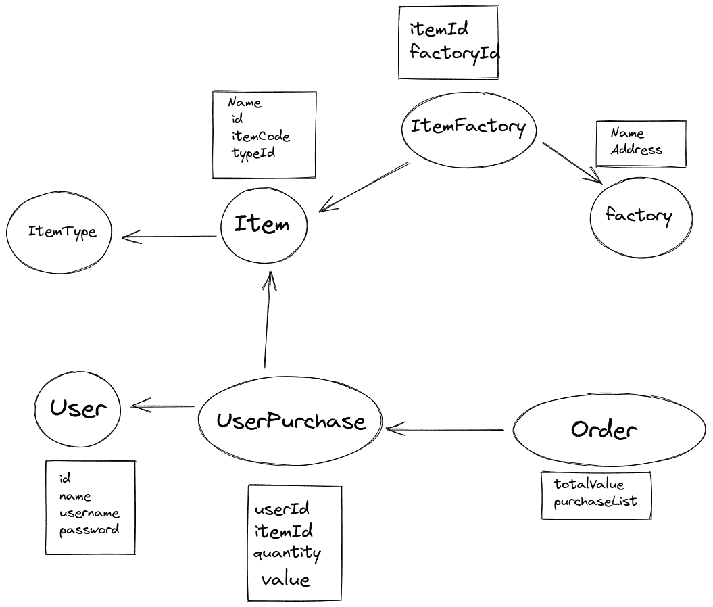
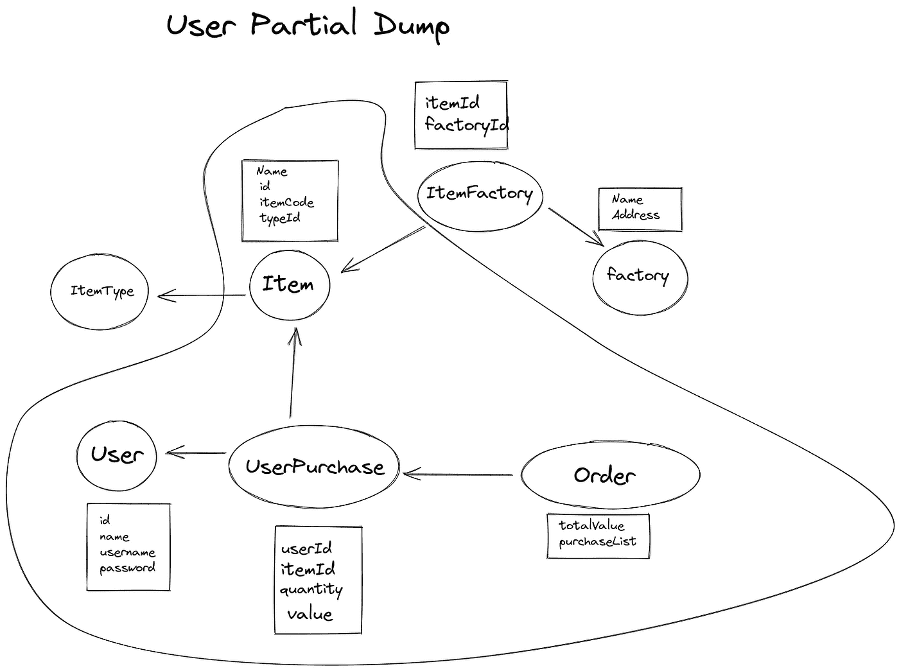
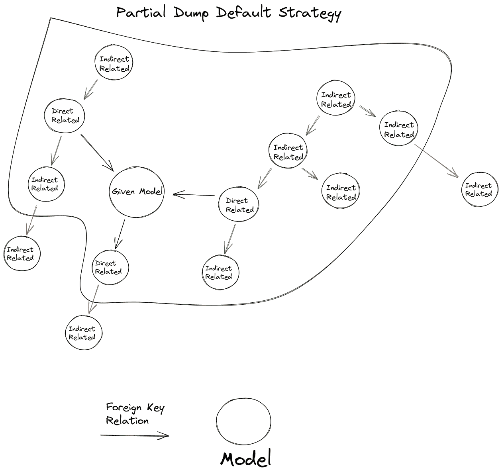
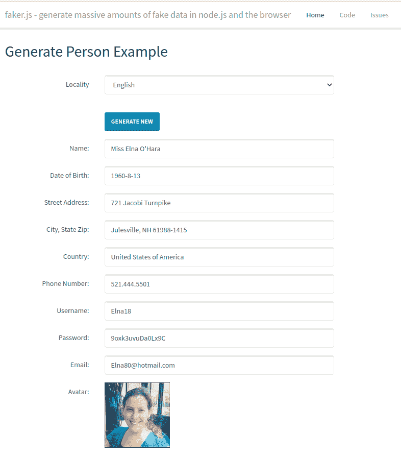

# 猫鼬部分倾倒

> 原文：<https://medium.com/codex/mongoose-partial-dump-607432cbf204?source=collection_archive---------20----------------------->

## 复制生产缺陷

大家好，我叫 Afonso Araújo Neto，是 Entria 公司的一名软件工程师。自从 Sibelius Seraphini 开始与我讨论如何在本地环境中重现生产错误以来，已经有一段时间了。为此，我们需要调试它，然后在本地数据库中引入错误的数据，最后将软件本地行为与生产行为进行比较。这是确保 bug 消失的常用方法。您至少需要在您的本地环境中重现它，修复它，然后将新的行为与旧的错误进行比较。

# 解决办法

在我们讨论的一会儿，他提出了一个关于“部分转储”的想法。我想，他以前已经想过这件事了，我从来没有顺便问过。这种“部分转储”可以解决使用公共转储来重现 bug 的问题。每当一个奇怪的错误出现时，复制整个数据库的成本很高，需要大量时间，并且创建和共享大量生产数据也不安全。但是，如果我们能够只提取出我们知道的产生漏洞的有限数量的数据呢？

例如，以用户详细信息页面为例。有一天，在一天开始的时候，你和你的团队正在开发一个新功能，分享一些信息。然后突然一个客户在他的用户页面上报告了一个错误，它无法加载。所以你在他的页面上发现了一个“无法读取未定义的空属性”的错误。作为一名有经验的开发人员，您已经知道在用户详细信息页面上代码的某个地方可以有一个动态对象属性，如下所示:

```
const property = getProperty();
console.log(property) // nullconst user = getUser();
console.log(user) // undefinedconst userPropertyValue = user[property] // <- error. user is undefined
```

在前端字段上，如果用户*未定义*，您可以很容易地提前返回。但这只会隐藏你的 bug。为什么后端会发送一个未定义的用户？为什么只有那个客户的用户页面有 bug？**为什么这里的用户是未定义的？**有一件事可以回答所有这些问题，那就是我们的部分转储。仅导入构成此用户详细信息页面的数据关系。

> *当然“属性”变量为空也是一个错误。对于我们的研究案例，让我们关注用户未定义。“属性为空”也可能是用户未定义的结果。就像我们可以认为这段代码的上下文在 sanitize 函数内部。该函数删除未定义的用户对象的****undefined/null/NaN****。*

# 数据关系策略

为了开始开发部分转储，我需要解决如何正确提取与我想要再现的模块相关的数据。让我们更深入地了解用户详细信息示例。我想采取一个用户详细信息页面，显示一些细节分析加上其他信息转储。如果用户页面是一个电子商务，它将显示所有用户的采购订单，价值支出等..

让我们用这张图片来代表所有相关的模型示例:



数据库集合关系

> *也许这不是这种情况下的最佳关系，但让我们把重点放在我们的研究案例上*

正确导出用户页面详细信息业务规则的可用转储。我们需要提取一个用户文档，所有相关的用户购买文档，所有相关的订单和最终项目。ItemType、ItemFactory 和 Factory 是与项目相关的集合，因此它们对于项目部分转储是有用的，而不是对于用户。

如果项目类型与业务规则中的用户页面相关，将创建一个新的集合用户项目(用户 Id、项目 Id、数量等..)或用户项目类型(用户标识、项目类型标识、数量购买等..).但是在这种情况下，我们的 use details 页面只显示所有用户订单。因此，用户部分转储应该是:



用户部分转储

开始时，我们使用部分转储来接收要转储的 collectionName 列表。比如:

```
const collectionNameList = ['User', 'UserPurchase', 'Order', 'Item'];
```

但是当我们使用它时，我们注意到这种关系模式重复了很多次。这太频繁了，所以我决定将其抽象为默认的“转储策略”。

# 转储策略

在**mongose-partial-dump**中,“转储策略”是一个代码块，用于按照某种关系模式从数据库文档中提取数据。**默认**策略是基于以下规则列表制定的:

*   提取给定的模型(**主集合**)
*   提取给定模型的所有外键文档
*   用给定模型的外键提取所有文档( **secondaryCollections** )
*   对于所有 secondaryCollections 文档，我们递归地重复这个列表的步骤 1 和 2，找到 secondaryCollection。

这些规则的结果是数据库**图**的**子图**:



默认转储策略图

# 数据匿名化

随着该软件包不断得到升级和新功能，在投入生产使用之前，它还需要一个新功能。因为巴西的 LGPD 法律，我们不能操纵生产数据库。这条法律不允许操纵个人数据，就像我们使用部分转储那样。

为了解决这个问题，我们实现了匿名功能。该功能使用 [FakerJS](https://www.npmjs.com/package/faker) 在转储导出之前更改生产数据(名称、地址、头像图像等)。就像包里说的:“在浏览器和 node.js 里产生海量的假数据”。

这样，我们就可以无所畏惧地生成我们的转储，知道我们不会弄乱人们的个人数据。



Faker 示例页面位于[https://raw git . com/Marak/faker . js/master/examples/browser/index . html](https://rawgit.com/Marak/faker.js/master/examples/browser/index.html)

# 性能

# 不变性

软件行为不会改变。不管环境如何，如果任何特征发生了变化，所有的行为都将是一样的。您甚至可以复制/粘贴功能 url。在我们的例子中，我们使用来自文档 **_id** 的 base64 转换，例如(用户示例):

```
**User:613514b8d5ae0e081ca7cd2d // value
VXNlcjo2MTM1MTRiOGQ1YWUwZTA4MWNhN2NkMmQ= // base64 encode**
```

因此，如果一个生产 url 是`<domain>/user/VXNlcjo2MTM1MTRiOGQ1YWUwZTA4MWNhN2NkMmQ=/details`，8080 端口 url 中的一个相关的[本地主机](http://localhost)将是:`localhost:8080/user/VXNlcjo2MTM1MTRiOGQ1YWUwZTA4MWNhN2NkMmQ=/details`。因为在 MongoDB 中，我们可以通过预先创建的唯一标识符(ObjectId)创建新文档，所以相同的用户页面将存在相同的 url。

# 最小工作示例(MWE)

MWE 是:"*源代码和其他数据文件的集合，它允许一个错误或问题被演示和重现。*”([维基](https://en.wikipedia.org/wiki/Minimal_working_example))。哪些数据文件可以使用部分转储。

# 结论

我们的部分转储成为我们日常调试流程中的一个有用工具。有了它，我们不需要额外的时间来试图重现错误，所以我们可以花更多的时间来为我们的错误修复创造更好的解决方案。因为**时间**对我来说是一个关键的资源，它变得如此有价值，以至于我决定将其开源。您可以在以下位置访问它:

*   [https://github.com/Streeterxs/mongoose-partial-dump](https://github.com/Streeterxs/mongoose-partial-dump)(代码)
*   https://www.npmjs.com/package/mongoose-partial-dumper(包)

试试看。=)