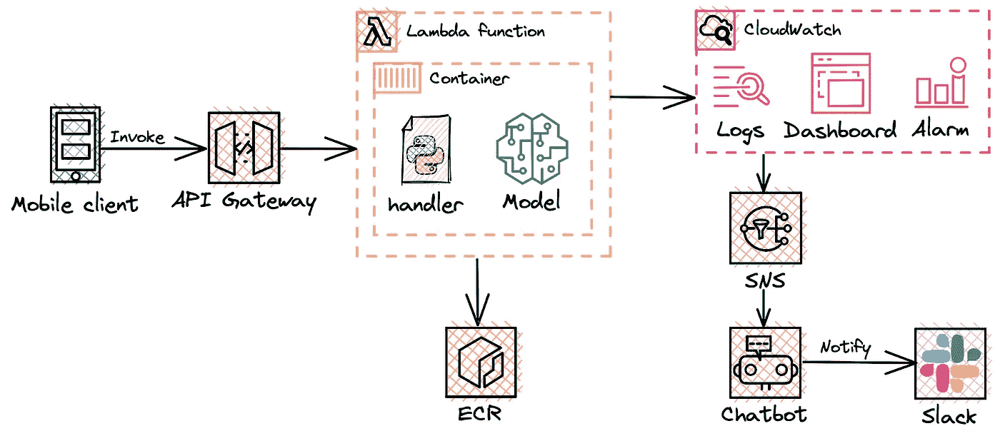
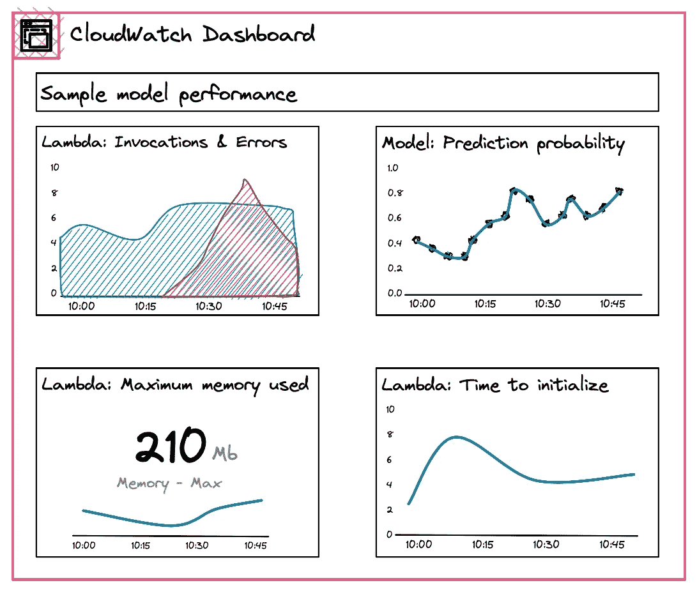
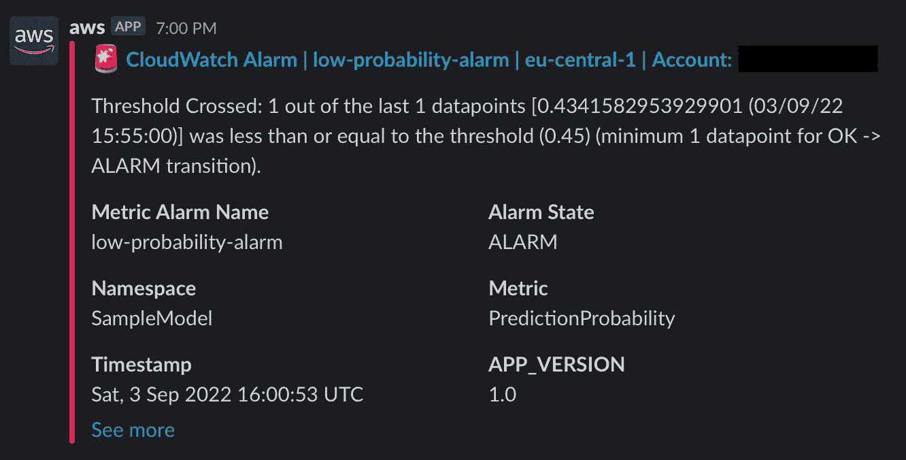

# 使用 AWS CDK (Python)通过 CloudWatch Dashboard 监控 Lambda ML 推理

> 原文：<https://medium.com/codex/monitor-lambda-ml-inference-with-cloudwatch-dashboard-using-aws-cdk-python-a874520af230?source=collection_archive---------11----------------------->

## 使用 CloudWatch dashboard 监控机器学习推理，并向 Slack channel 发出警报



配置图

# 语境

数据科学团队希望使用 **Lambda 函数**作为模型的无服务器推断。它将被连接到移动前端的 **API 网关**调用。此外，团队希望在 **CloudWatch** 仪表板中监控推理和模型指标，并在 **Slack** 中接收警报。

要显示的指标:

*   Lambda:调用和错误的数量(计数)
*   模型:模型预测概率
*   Lambda:使用的最大内存(MB)
*   λ:初始化时间(毫秒)



CloudWatch 仪表盘

# 履行

## 引导步骤

1.  安装 AWS CLI[并设置凭证。](https://docs.aws.amazon.com/cli/latest/userguide/getting-started-install.html)
2.  [安装 NodeJS](https://nodejs.org/en/download/) 以便能够使用 CDK。
3.  使用命令`sudo npm install -g aws-cdk`安装 CDK。
4.  为您的项目创建一个新目录，并将您的当前工作目录更改为该目录。
5.  运行`cdk init --language python`启动 CDK 项目。
6.  使用 CDK 资源运行`cdk bootstrap`来引导 AWS 帐户。
7.  [安装 Docker](https://docs.docker.com/engine/install/) 在 Lambda 内部运行 Docker 容器。

## CDK 堆栈

这是项目目录的最终外观。我将提供一个分步指南，指导您完成其中的每个组件。

```
InferenceMonitoring
├── assets
│   ├── lambda
│   │   ├── dockerfile
│   │   ├── sample_model.json
│   │   └── processing.py
├── cdk.out
│   └── ...
├── stack
│   ├── __init__.py
│   └── inference_monitoring_stack.py
├── app.py 
├── cdk.json
└── requirements.txt
```

你的起点是`stack`目录。它包含一个强制空的`__init__.py`文件来定义一个 Python 包和`inference_monitoring_stack.py`文件，您将在其中定义堆栈。

您需要打开后者，导入所有需要的库并声明继承了`Stack`类的`InferenceMonitoringClass`类。

接下来，您需要使用`[DockerImageFunction](https://docs.aws.amazon.com/cdk/api/v2/python/aws_cdk.aws_lambda/DockerImageFunction.html)`构造创建 **Lambda 函数**。请参考下面的代码，看看使用了什么参数。我认为它们是不言自明的，但是如果有问题，请参考文档。您还需要将**内联策略**附加到 Lambda，以允许它向 CloudWatch 发送指标。

接下来，您需要使用`[Dashboard](https://docs.aws.amazon.com/cdk/api/v2/python/aws_cdk.aws_cloudwatch/Dashboard.html)`构造创建一个 **CloudWatch dashboard** ，这个 dashboard 又使用了`[TextWidget](https://docs.aws.amazon.com/cdk/api/v2/python/aws_cdk.aws_cloudwatch/TextWidget.html)`构造。`[TextWidget](https://docs.aws.amazon.com/cdk/api/v2/python/aws_cdk.aws_cloudwatch/TextWidget.html)`定义仪表板表头，支持降价语法，除表头外，还可以提供模型自由格式描述。

接下来，您需要创建**指标**:

*   `PredictionProbability` metric 是 Lambda 函数运行时报告的自定义 CloudWatch 指标。自定义度量定义以及`dimension_map`参数在以下段落中提供。
*   `memory_utilization`和`init_duration`指标属于 Lambda Insights 指标，它们由运行在容器中的 CloudWatch 代理报告。

接下来，您需要将创建的指标作为小部件放在仪表板上。我使用了两种`[GraphWidget](https://docs.aws.amazon.com/cdk/api/v2/python/aws_cdk.aws_cloudwatch/GraphWidget.html)`和`[SingleValueWidget](https://docs.aws.amazon.com/cdk/api/v2/python/aws_cdk.aws_cloudwatch/SingleValueWidget.html)`小部件类型来显示指标，但是还有许多其他的小部件——请参见文档*。您需要为每个小部件明确指定宽度/高度，以达到完美的匹配。对于`SingleValueWidget`,您也可以指定`sparkline`参数，以在一个小部件中组合一个图形和整个周期的总值。*

*接下来，使用`[Alarm](https://docs.aws.amazon.com/cdk/api/v2/python/aws_cdk.aws_cloudwatch/Alarm.html)`构造，您需要创建 CloudWatch 警报，通知模型的低预测概率。它的参数是不言自明的:你应该定义度量的`threshold`，在`evaluation_period`期间必须突破的`datapoints_to_alarm`的数量，并通过`comparison_operator`。*

*接下来，您需要创建 SNS 主题来向 Slack 发送通知。为此，我们应该使用`[Topic](https://docs.aws.amazon.com/cdk/api/v2/python/aws_cdk.aws_sns/Topic.html)`构造并添加`[add_alarm_action](https://docs.aws.amazon.com/cdk/api/v2/python/aws_cdk.aws_cloudwatch/Alarm.html#aws_cdk.aws_cloudwatch.Alarm.add_alarm_action)`来报警。稍后，其他型号的性能警报可以使用相同的主题。*

*最后，您需要使用`[SlackChannelConfiguration](https://docs.aws.amazon.com/cdk/api/v2/python/aws_cdk.aws_chatbot/SlackChannelConfiguration.html?highlight=slackchannelconfiguration#slackchannelconfiguration)`构造创建与 Slack 中特定工作空间/通道的集成。为了获得`slack_channel_id`的值，您需要右键单击频道名称并复制 URL 的最后九个字符。要获得`slack_workspace_id`参数的值，您需要使用 [AWS 聊天机器人指南](https://docs.aws.amazon.com/chatbot/latest/adminguide/getting-started.html)。*

*在配置了 Slack integration 并部署了堆栈之后，当模型的预测概率低于阈值时，您将会收到这样的通知。*

**

*现在你需要切换到`assets`目录并创建`processing.py`文件和`dockerfile`。*

*`processing.py`脚本包含数据转换逻辑。总体而言，示例代码由几个部分组成:*

*   *库导入，*
*   *CloudWatch 会话创建，*
*   *模型负载。*

*我应该注意，在提供的例子中，我使用了`data = pd.Dataframe(event)`，因为我的事件有一个可以直接加载到 dataframe 中的结构。通常应用程序在事件中传递附加信息，因此您可能需要额外准备代码来解析事件和提取特征。*

*当预测准备就绪时，我使用`context.log()`方法实现日志记录，并将`PredictionProbability`自定义指标发送到 CloudWatch 中的`SampleModel`名称空间。此时，您还可以为模型/数据漂移检测添加其他定制指标。*

**名称空间*是一个将指标分组在一起的“目录”。通常，应用程序报告的所有指标都报告给同一个名称空间。*维度*是分配给指标的键值对。它可能描述应用程序的版本、开发环境等，即它用于存储指标的元数据。有关名称空间和维度的更多信息，请参考[文档](https://docs.aws.amazon.com/AmazonCloudWatch/latest/monitoring/cloudwatch_concepts.html)。*

*`dockerfile`用于定义要在 Lambda 函数中运行的图像，它由以下部分组成:*

*   *对基础图像的引用，在此基础上构建我们的图像。您使用了`public.ecr.aws/lambda/python:3.9`基本映像，但是您也可以使用 Lambda 支持的任何其他 Python 版本，以及您的代码语义所需要的版本。*
*   *python 库的安装。*
*   *Lambda Insights 扩展包的安装。*
*   *复制包含 Lambda 处理程序和`sample_model.json`人工制品的`processing.py`。*

*现在你需要移动到父目录并打开`app.py`。在里面，您使用`[App](https://docs.aws.amazon.com/cdk/api/v2/python/aws_cdk/App.html)`构造来声明 CDK app，使用`[synth()](https://docs.aws.amazon.com/cdk/api/v2/python/aws_cdk/App.html)`方法来生成 CloudFormation 模板。*

*🎉 🎉🎉祝贺您，您刚刚部署了您的堆栈，现在可以使用了。*

# *帐户清理*

*您可以通过以下步骤删除开发过程中在您的帐户中创建的所有资源:*

1.  *运行以下命令删除堆栈资源:`cdk destroy`*
2.  *为 CDK 创建的 Clean ECR 资料档案库和 S3 时段，因为它会产生成本。*

*手动删除一些资源不太方便，需要与 AWS 开发人员进行几次讨论来解决这个问题。*

# *结论*

*AWS CDK 为您提供了一个极其通用的应用程序开发工具包。一开始可能会很有挑战性，但您的努力最终会得到回报，因为您将能够通过一个命令来管理和传输您的应用程序。*

*CDK 资源和完整代码可以在 [GitHub 资源库](https://github.com/ChildishGirl/monitoring-lambda-ml-inference)中找到。*

*🎀谢谢你一直读到最后。我真的希望它是有帮助的，如果你在评论中发现任何错误，请让我知道。*