# 使用数据库健康仪表板监控 PostgreSQL 性能

> 原文：<https://medium.com/codex/monitor-postgresql-performance-using-a-database-health-dashboard-71123ec52da5?source=collection_archive---------14----------------------->


# 为什么要监控 PostgreSQL 数据库的健康状况？

就像监控我们的应用程序一样，监控我们的数据库系统是非常必要的。我们希望监控比系统级流程更精细的事情，例如:

*   有多少查询实际上使用了索引？
*   数据库缓存的效率如何？
*   打开的连接数。

诸如此类。

硬件指标是必不可少的，但只能让我们到此为止，并不能帮助我们做出具体的决策——比如优化哪些查询，以及我们一般如何使用我们的数据库。由于 PostgreSQL 是一个开源数据库，它免费提供了许多见解，而不必依赖昂贵的工具。我们将要跟踪的大多数指标都是默认可用的，因为它们是[查询计划器](https://arctype.com/blog/postgresql-query-plan-anatomy/)所必需的，但是对于其他关键领域，我们必须启用 PostgreSQL 附带的某些扩展/contrib 模块。

# Arctype 工具简介

Arctype 是一个非常简洁的数据库工具，不仅可以用作 SQL 编辑器，还可以作为一个平台，在这个平台上可以定制复杂的仪表板，并与开发人员/用户共享。为了理解它的真正威力，我们将考虑一个实际的用例——监控 PostgreSQL 数据库的健康状况。

# Arctype 仪表盘入门

为了熟悉仪表板功能，我们将构建一个非常简单的仪表板，仅包含三个组件。Arctype 仪表盘内置于 Arctype 工具本身。要访问该功能，只需点击如下所示的`Dashboards`按钮。

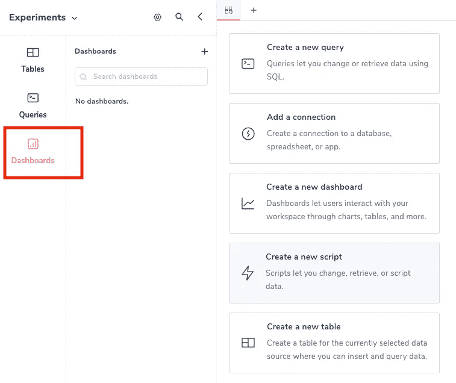

单击加号图标，创建一个名为— `Postgres Health Monitoring`的仪表板。

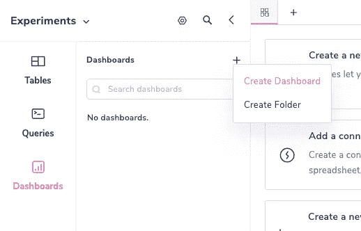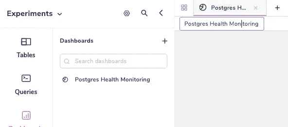

现在已经创建了仪表板，让我们创建一些组件。

# 从 Information_Schema 创建 PostgreSQL 表列表

添加表格组件/图表组件在我们之前的文章[中有所涉及。将`Table`拖放到空的仪表板窗格中。接下来，我们将使用一个简单的查询，该查询与底层数据库(PostgreSQL)对话，并获取所有表及其模式，不包括`information_schema`和系统表。](https://arctype.com/blog/analytics-dashboard-django/#creating-a-dashboard-for-your-database)

```
SELECT
  table_schema, table_name
FROM
  information_schema.tables
WHERE
  table_schema <> 'information_schema'
  AND table_name NOT LIKE 'pg_%'
ORDER BY
  table_schema,
  table_name;
```

# 可视化数据库模式中表的行数

让我们在使用以下查询的表组件旁边添加一个图表组件(类似于表):

```
SELECT
  relname as table_name,
  reltuples as rows
FROM
  pg_class C
  LEFT JOIN pg_namespace N ON (N.oid = C .relnamespace)
WHERE
  nspname NOT IN ('pg_catalog', 'information_schema')
  AND relkind = 'r'
ORDER BY
  reltuples DESC;
```

这个查询只是对数据库中所有表的记录进行计数。在右窗格中，为 X 轴选择`table_name`，为 Y 轴选择`rows`。

# 向 Arctype 仪表盘添加图像

添加完表格和图表后，让我们从 [PostgreSQL 网站](https://www.postgresql.org/media/img/about/press/elephant.png)添加一张图片到我们的仪表板上，同时添加一个文本字段进行解释。添加完上述所有步骤后，我们的仪表板将如下所示:

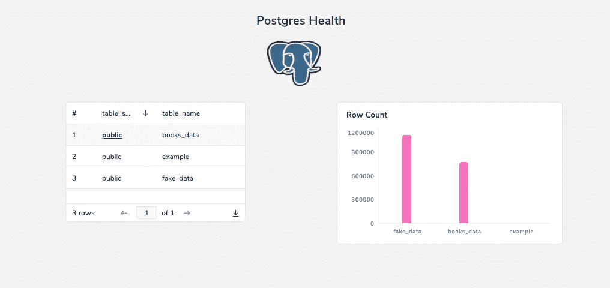

至此，您应该对仪表板有了相当好的感觉，所以现在，让我们构建一个真正的健康仪表板，看看它如何帮助我们可视化我们的数据库健康状况。

# 识别 PostgreSQL 数据库中的关键区域

为了了解数据库的健康状况，PostgreSQL 有许多我们可以关注的领域。在下面的章节中，我们将会看到其中的一小部分，并演示如何使用 Arctype 来可视化它们。

# 查询以检查 PostgreSQL 开放连接

监视数据库集群中当前有多少个打开的连接总是一个好主意。我们可以从`pg_stat_activity`表中得到这一点:

```
SELECT
  COUNT(*) as connections,
  backend_type
FROM
  pg_stat_activity
GROUP BY
  backend_type
ORDER BY
  connections DESC
```

# 确定 PostgreSQL 数据库的大小

随着数据库的不断扩展，控制数据库的大小是非常重要的。我们可以使用下面的查询获得数据库列表及其各自的大小:

```
SELECT
  datname as database_name,
  pg_database_size(datname)/1024/1024 as size
FROM
  pg_database
WHERE
  datistemplate = false;
```

我们可以使用`pg_size_pretty`来代替直接计算 MB，但是我们想把它绘制成一个条形图来查看和比较大小。记录单个数据库的大小有助于我们了解全局。

注意:这些大小可能与磁盘大小不同，因为 PostgreSQL 在后台进行了大量压缩。

# 在 PostgreSQL 中计算数据库缓存命中率

任何关系数据库/操作数据库都从其缓存中提供大部分流量。如果这种情况没有发生，我们肯定需要调查一下。PostgreSQL 缓存区域被称为`[shared_buffers](https://www.postgresql.org/docs/current/runtime-config-resource.html)`，它在操作系统提供的缓存之上充当数据库层缓存。我们可以使用下面的查询来了解缓存命中率:

```
SELECT
  sum(heap_blks_read) as reads,
  sum(heap_blks_hit) as hits,
  ROUND(
    sum(heap_blks_hit) / (sum(heap_blks_hit) + sum(heap_blks_read)),
    4
  ) as hit_ratio
FROM
  pg_statio_user_tables;
```

在[查询计划博客](https://arctype.com/blog/postgresql-query-plan-anatomy/#what-are-buffers-and-caches-in-a-database)中，有几个元组来自堆读取和堆命中。`pg_statio_user_tables`有这方面的信息。在上面的查询中，我们只是获得命中和读取的值(来自磁盘)并计算四舍五入到四位数的比率。值得注意的是，在一个健康的生产数据库中，这一比率应该达到 97%或接近 97 %, 97%的命中来自缓存。

# 扫描未使用的索引

PostgreSQL 中的统计信息收集器记录了哪些索引被访问的频率。我们可以从一个叫做`pg_stat_all_indexes`的统计表中构造一个查询。

```
SELECT
  COUNT(*) as count,
  relname as table_name
FROM
  pg_stat_all_indexes
WHERE
  idx_scan = 0
  and schemaname = 'public'
GROUP BY
  table_name
```

这给了我们一个具有最大数量未使用索引的表的指示。`idx_scan=0`给了我们从未使用过的索引。我们可以根据数据库流量模式定制这个值。

# 检查 PostgreSQL 数据库缓存

为了从缓存中获得更多信息，我们需要启用另一个名为`[pg_buffercache](https://www.postgresql.org/docs/current/pgbuffercache.html)`的 contrib 模块。启用它并运行一些查询后，我们现在可以检查缓存:

```
SELECT
  c .relname AS entity_name,
  count(*) AS buffers
FROM
  pg_buffercache b
  INNER JOIN pg_class c ON b.relfilenode = pg_relation_filenode(c .oid)
  AND b.reldatabase IN (
    0,
    (
      SELECT
        oid
      FROM
        pg_database
      WHERE
        datname = current_database()
    )
  )
WHERE
  c .relname NOT LIKE 'pg_%'
GROUP BY
  c .relname
ORDER BY
  2 DESC;
```

这个查询取自[官方文档](https://www.postgresql.org/docs/current/pgbuffercache.html)，然后稍加修改。它显示了`shared_buffers`中有多少页面被不同的表和索引占用。您可以假设页面是与行数成正比的指标——被查询的表越大，移动到缓存中的页面就越多。这也意味着可以将一些表移动到应用程序缓存或快速键值存储(如 Redis)中，以便进行更快的查询，并为索引释放数据库缓存。

# 监控平均 Postgres 查询性能

对于这一部分，我们需要启用`[pg_stat_statements](https://www.postgresql.org/docs/current/pgstatstatements.html)`扩展。它是一个内置的扩展/贡献模块，在一些云提供商中，它是默认启用的。如果没有，可以使用`shared_preload_libraries`轻松启用。这个扩展帮助我们捕获大量关于查询性能的信息。使用这个扩展，我们将构建一个查询，根据查询扫描的行数输出查询性能:

```
SELECT
  mean_time as "timing in ms",
  rows
FROM
  pg_stat_statements
ORDER BY
  mean_time DESC
LIMIT
  100;
```

限制行数并执行`order by`会给出前 100 个消耗最多的查询，而`rows`列表示语句检索或影响的*总行数。我们还可以使用上表通过运行时间获得前 10 个最差的查询。这可以作为慢速日志分析的替代方法，因为它更加实时。*

# 使用 PostgreSQL 指标构建仪表板

如果我们将提到的图表类型中的所有查询结合起来，它应该看起来像一个可以轻松可视化/消费的适当的分析仪表板:

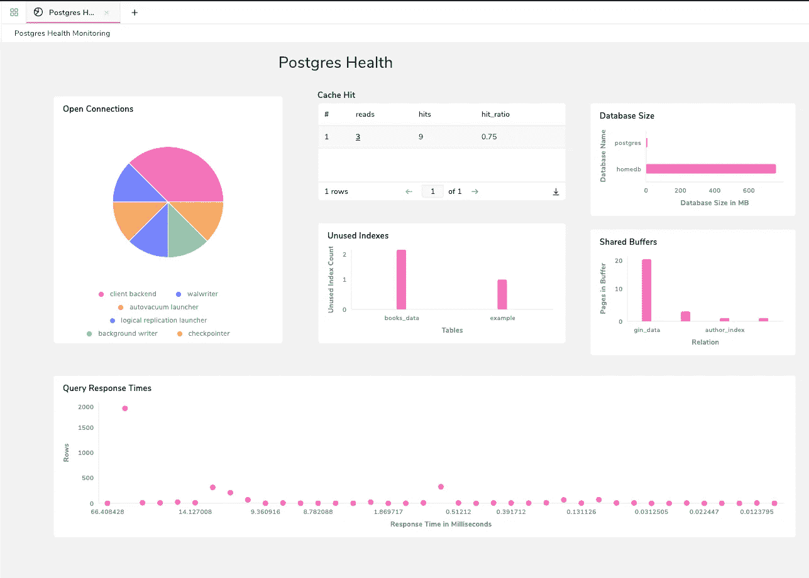

下表显示了每个组件的映射。Arctype 并不局限于下面的图表，它有一个功能极其丰富的平台，我们可以在这个平台上展示我们的可视化。

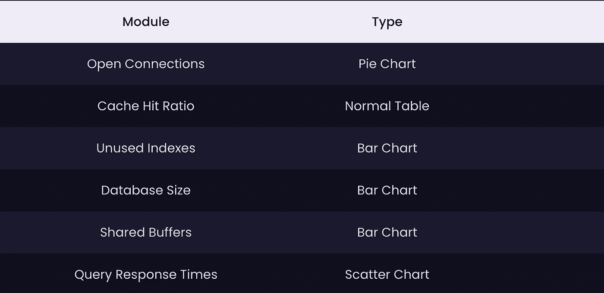

这里的每个小部件都有自己的描述，图表中有 X 轴和 Y 轴上的详细信息。仪表盘不言自明很重要，毕竟一图胜千言。根据基础数据的不同，这些图表可能看起来有所不同。在编辑模式下，只需拖动它们的边框就可以放大和缩小它们，如果数据集较大，这将非常有用，因为图表可能会溢出。

上面的仪表板是在我以前使用的示例数据库中创建的。让我们在一个更真实的数据库上创建仪表板，比如 Arctype 内置的`Covid DB`(在注册流程中可用)。由于数据集很大，我创建了两个部分的仪表板:

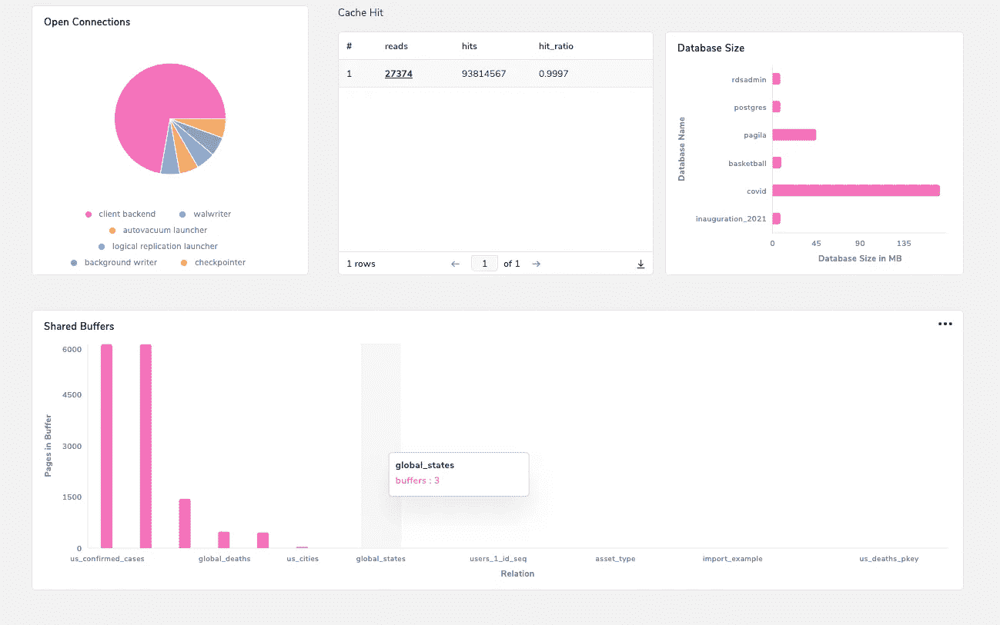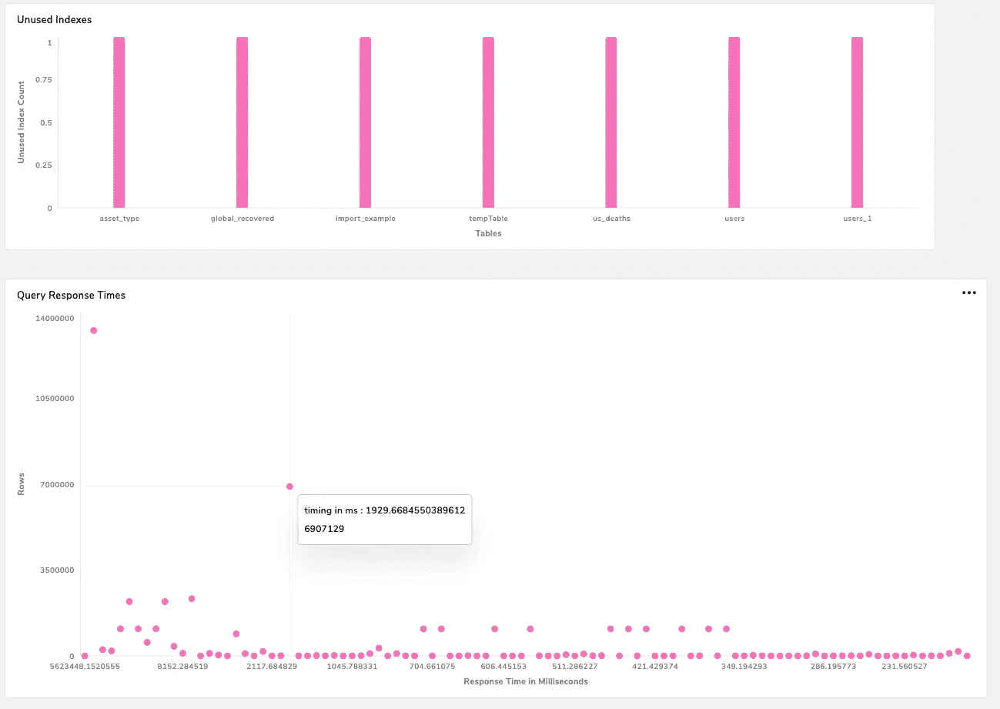

随着数据点越来越多，仪表盘看起来更加丰富，也更有意义。我们的目标不是成为一个“银弹”解决方案，而是提供一些关于运营数据库的潜在关注领域的观点。有很多工具可以提供不同的功能，但最终，我相信数据库开发人员应该更深入地了解他们的数据库。有什么工具能让我们轻松地将查询转换成非常好的图表，而且几乎不需要额外的学习呢？回答:大概不多。

# 来自健康仪表板的见解和情报

这个仪表板允许我们实时监控数据库，并帮助我们更全面地了解 PostgreSQL 独有的一些特性。在进行数据库优化时，通常的规则是“您不能改进您不能度量的东西”，这个仪表板解决了第一步(但经常被忽略)，这实际上是度量东西。`Covid DB`演示数据库具有 99%的缓存命中率，这意味着几乎所有的流量都由缓存(shared_buffers)提供服务，并且响应速度非常快。这是数据库优化良好的一个好迹象。

在交通高峰期监控我们的数据库将使我们深入了解哪些方面可以改进，以及如何衡量这种改进。我们可以根据这些指标提高数据库性能的一些方法有:

*   使用客户端/服务器端连接池。
*   代码优化，以便在工作完成后将连接释放回池/关闭连接。
*   进行适当的数据库建模，并在不同的集群之间划分流量。
*   增加共享缓冲区的大小，以便在内存中容纳更多的数据/索引。
*   通过添加索引或完全重写来优化写得不好的查询。
*   删除未使用的索引以加快写入速度。

到目前为止，我们所看到的只是冰山一角。数据库维护和改进是一门艺术，需要几年的实践经验。但是使用友好的、经济的、能帮助我们轻松实现目标的工具链总是很重要的。

# 保持仪表板最新

构建完成后，保持仪表板最新是很重要的。这可以根据我们的需要通过各种方式来实现。

# 手动刷新 Arctype 仪表盘

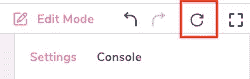

在编辑模式按钮的右上方，有一个重新加载按钮，我们可以单击它来重新加载整个仪表板。

# 自动刷新整个仪表板

我们还可以将整个仪表板配置为定期刷新。

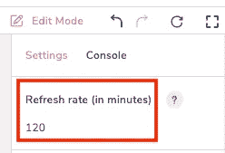

# 自动刷新单个组件

通过单击单个组件并单击`Advanced`，我们可以配置该组件，使其在指定的时间间隔自动刷新。

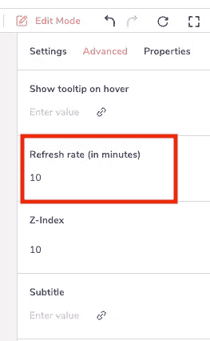

我们可以选择我们想要的刷新类型，但是请记住，监视数据库本身的查询可能会占用大量资源，因此会降低性能。

# 共享仪表板(和总结想法)

许多数据库工具缺少的另一个非常重要的功能是共享仪表盘的能力，但 Arctype 提供了这一功能。

通过点击仪表板查看器右上方屏幕上的`Share`按钮，我们可以共享各种选项。

# 通过电子邮件共享 Arctype 工作空间

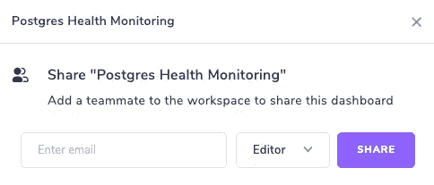

这将邀请用户成为工作空间的一部分。对于更高级的控制，请查看[团队功能](https://docs.arctype.com/ogranizations/create-a-new-organization)。

# 链接到您的工作区


这和上面的一样，除了任何有链接的人都可以加入工作区。

# 创建公共只读链接


这将发送一个也可以在浏览器中查看的只读链接。这对于与团队中不同的(可能是非技术的)涉众共享仪表板来说非常方便。

注意:您不能共享本地托管的数据库(或任何附属的仪表板)

# 结论

这些仪表板在以下情况下非常有用:

*   运行性能测试。
*   在指定时间段内监视实时数据库。
*   常规数据库监控。

Arctype 提供的细粒度控制使该仪表盘可以在同事、团队甚至整个互联网上轻松共享。如果您还没有下载 Arctype，请继续下载，并开始创建这些仪表盘-了解数据库健康状况并对其进行监控不应再局限于某些工具或人员！