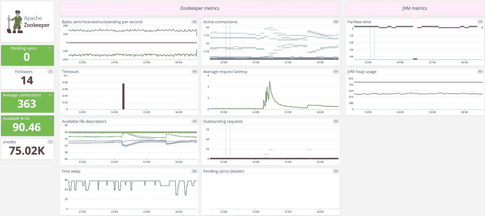

# 用 DataDog 监控 Kubernetes 动物园管理员

> 原文：<https://medium.com/codex/monitor-zookeeper-in-kubernetes-with-datadog-bf1995529998?source=collection_archive---------5----------------------->

ZooKeeper 作为一个集中式服务，对于为分布式系统提供同步和维护命名和配置数据非常有用。因此，对于依赖它的服务的其他服务来说，它可能是一个关键的依赖项。

DataDog 是一款流行的云基础设施监控和分析工具，提供仪表盘、警报、指标可视化等功能