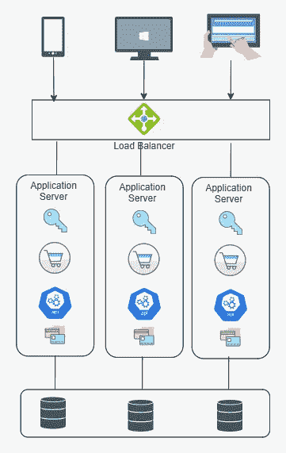
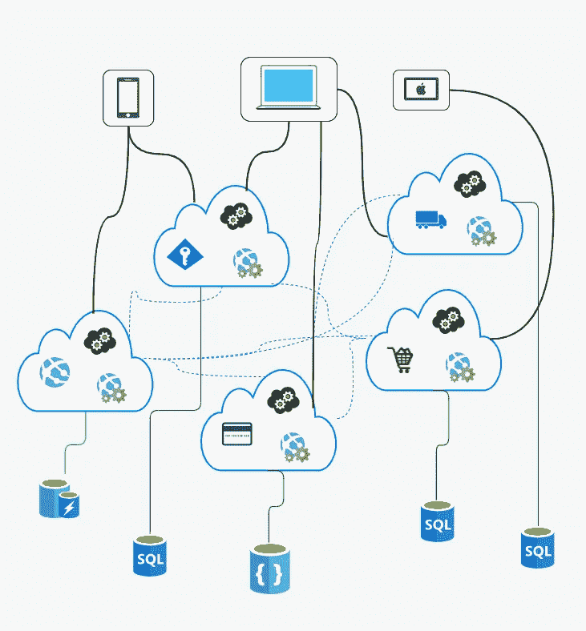

# 整体服务 vs 微服务；选哪个？

> 原文：<https://medium.com/codex/monolith-vs-microservices-which-one-to-choose-8c2a0c939b7a?source=collection_archive---------3----------------------->

打造高质量的产品并不意味着你必须总是从微服务开始

微服务在几年前刚刚出现，今天仍然受到很多关注。我相信你可能听说过*微服务*如何帮助击败和克服单片应用中固有的问题。通过聆听数百次会议讨论、技术会议和大型组织的证明，解释他们如何通过从整体架构过渡到微服务架构最终克服了大多数问题，这似乎是当今世界的首选解决方案。

虽然从 monolith 到 micro services market architecture 的这种过渡对于拥有完善产品/解决方案的大型组织来说是有意义的，但这是否意味着它对初创公司或小型企业总是有好处的呢？这是整体建筑的终结吗？

# **巨石**

单片应用

*单片应用*也被称为*单片*是那些巨大的系统，它只是一台运行整个系统的计算机。连接到应用程序的所有客户端都必须连接到一台计算机。

这些是我在这里强调的一些误解。

整块不需要是一台计算机，可能有多个相同整块的水平缩放实例，这些客户端可以将它们与一个或多个数据库连接。

所以，你可以水平扩展，或者你可以横向扩展，即使是一个整体。

它们是大型代码库，包含运行应用程序所需的所有逻辑，同时部署在一起，并在相同的服务器上一起运行。换句话说，monolith 是一种架构，其中应用程序的所有组件都被打包成一个可部署的单元。

## 独石有几个好处，

开发简单:一切都将使用相同的语言和相同的框架。交流更加清晰和明确。

**更容易调试和测试**。与微服务架构相比，单片应用程序更容易调试和测试。由于单片应用程序是单个不可分割的单元，我们可以更快地运行端到端测试。

**部署和扩展应用程序非常简单:**只需部署一个应用程序，即可轻松扩展到负载均衡器后面的新实例。

**延迟更低:**因为您没有通过网络进行任何呼叫。所有的逻辑和代码都在同一台电脑上。

**更高的吞吐量:** Monolith 没有图像和编排的开销

## 我们已经讨论了整体建筑的优点，现在，整体建筑的缺点，

每个实例的责任太大:如果有一个错误会导致服务器崩溃，那么所有这些服务器都会崩溃。

**当规模扩大时，理解起来很复杂:**当一块巨石规模扩大时，理解和处理起来就变得复杂了。新开发人员的学习曲线会很高。

**伸缩性。**您不能独立扩展应用程序的组件，只能扩展整个应用程序。

# 微服务

微服务架构

让我们来看看微服务，微服务没有什么微的。

微服务代表了一个由功能和数据组成的垂直业务，这些功能和数据由相关的业务关注点进行分组。

> ***微服务架构风格是一种将单个应用程序开发为一套小服务的方法，每个小服务运行在自己的进程中，并与轻量级机制通信，通常是 HTTP 资源 API*** *。马丁·福勒*

微服务架构比整体架构有几个优点，

**微服务架构的优势**

**可伸缩性，**每项服务都可以独立伸缩。

**敏捷。**微服务应用中的任何故障只会影响特定的服务，而不会影响整个解决方案。

**良好的关注点分离**

**灵活选择技术，**借助微服务，我们可以混合使用多种语言和多种技术。

## 但是这些好处会带来一些代价；

**测试:**大量独立部署的服务使得测试基于微服务的应用程序变得困难。

最终一致性:在分布式系统中，每个系统都必须管理最终一致性。

**额外的复杂性:**基于微服务的应用很难开发，具有高延迟，并且总是有失败的风险。

此外，微服务需要深厚的专业知识来开发它们并从中获得实际利益。

# 决定选择什么:

在我个人看来，从微服务架构入手并不是一刀切的策略。尽管微服务是一个流行的时髦词，但 monolith 有其长处和持久的优势，在许多情况下更好地工作。

当你需要验证你的价值百万美元的新想法时，你应该从一个单一的应用程序开始。当一个小的开发团队计划一个简单的解决方案时，我看不到实现微服务的理由。单一的应用程序将更容易构建、更改、部署和测试。

简而言之，如果你可以用单片设计管理系统的复杂性，那么你就不应该使用微服务。

微服务架构对于复杂和不断发展的应用程序更有用。它将有助于提供有效的解决方案，在单一应用程序中处理不同功能和服务的复杂系统。当涉及到复杂的领域，有许多用户旅程和工作流时，微服务是理想的。但是如果团队中没有适当的微服务专业知识，应用这个模型会很麻烦。

请记住，我们可能在主题演讲中听到的大多数微服务成功故事都是从一个过于庞大的整体开始的，然后被分解并迁移到微服务中。