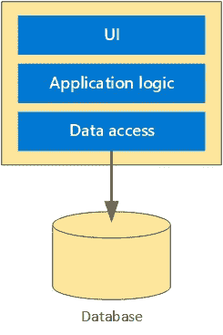
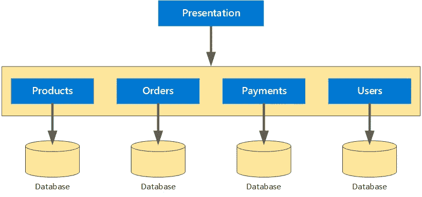

# 单片还是微服务？应用程序架构方法之间的关键区别是什么？

> 原文：<https://medium.com/codex/monoliths-or-microservices-the-critical-differences-between-approaches-to-application-architecture-adb6a8e93aa?source=collection_archive---------11----------------------->

有两种流行的应用设计方法——整体架构或依赖微服务的架构。各有利弊，各适合具体项目。在这个系列中，我们将广泛讨论这个话题，并希望能对此有所启发。

三思而后行。这句老话总结了你在任何项目的初始阶段应该做的事情——计划、大纲和研究。熟悉所有的上下文，并描述应用程序所需的功能以及在开发过程中需要的可用资源。坚实的基础将帮助您构建可伸缩、健壮和可扩展的服务。

上下文发现过程的初始阶段包含应用程序应向最终用户提供的功能要求或规范。详细阐述以下内容，你会从优秀的领域开始:

*   利益相关者
*   最终用户
*   功能
*   输入输出过程
*   工程小组

其次，你应该回顾一下那些有助于项目实施的资源。从以下内容开始:

*   工程资源
*   财政资源
*   时间框架
*   内部知识

清楚了解功能需求和可用资源后，在单片和基于微服务的设计之间做出选择可能会容易得多。在公司设计产品之前，工程团队必须选择最佳的应用程序架构。正如我们提到的，有两种主要的模式——整体式和微服务式。无论你选择哪种方法，请记住，我们的目标是创建一个能为消费者提供价值，并能轻松适应新功能的应用。

此外，每种架构都封装了应用程序的三个主要方面:

*   用户界面负责处理来自用户的 HTTP 请求并返回响应。
*   向用户交付服务的编程称为业务逻辑。
*   数据层负责数据项的访问和存储。

**什么是独石？**
在整体架构中，应用程序层共享以下特征:

*   他们是同一个单位的一部分
*   一切都在一个存储库中管理
*   它们共享现有资源(例如，CPU 和内存)
*   它们是用一种编程语言开发的
*   它们是使用单个二进制文件发布的

*展示如何使用整体架构实现预订应用的图表:*

资料来源:docs.microsoft.com

让我们想象一下，团队使用单一的方法来创建预订应用程序。这个应用程序看起来怎么样？

用户界面是用户与之交互的网站。提供搜索、预订、支付等功能的代码是业务逻辑的一部分。所有组件都存储在单个存储库中，并用单种编程语言(例如 Java 或 Go)编写。数据层包括存储和检索客户信息的功能。所有这些组件都作为一个单元来处理，发布只需要一个二进制文件。

**什么是微服务？**
在微服务架构中，应用层作为独立组件单独管理，它们具有以下共同特征:

*   每个单元都在单独的存储库中进行管理
*   每个单元都有自己分配的资源(例如，CPU 和内存)
*   每个单元都使用定义良好的 API(应用程序编程接口)来连接其他单元
*   每个单元都是使用选择的编程语言实现的
*   每个单元都是使用它的二进制文件发布的

*展示如何使用微服务架构实现应用的图表:*

资料来源:docs.microsoft.com

让我们回到预订应用程序的例子。如果团队选择微服务架构而不是整体架构，会有什么不同？

用户界面保持不变。它仍然是一个用户互动的网站。另一方面，业务逻辑被分解成更小的独立部分，如登录、支付、确认等。这些单元有它们自己的存储库，它们的编程语言可以不同(例如，Go 用于支付服务，Python 用于登录服务)。每个单元都有一个定义好的 API，用于与其他服务进行交互。最后，数据层包括存储和检索客户和订单信息的方法。每个单元都按照计划使用其二进制文件发布。

**新术语**
- Monolith:所有应用程序层作为一个单元管理的应用程序设计。
-微服务:应用程序设计，其中应用程序层作为独立的较小单元进行管理。

好了，我们讨论了单片和微服务之间的主要区别。在即将到来的第二部分。，我们将讨论每种方法的优缺点。

寻求更多信息。
[Artyom](https://www.linkedin.com/in/artyom-koshko-87629985/) ，高级软件工程师