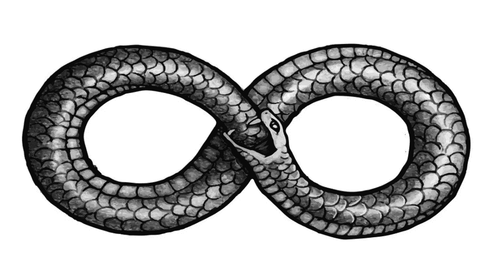

# 越来越多的软件会自己编写

> 原文：<https://medium.com/codex/more-and-more-software-will-write-itself-e507f2b06bc6?source=collection_archive---------9----------------------->

## 抄本尾段

图片:来自[vectorstock.com](http://vectorstock.com/royalty-free-vector/infinity-snake-vector-29220489)的免版税无限蛇矢量图

6 月 29 日星期二是人工智能领域的一个大日子，GitHub、微软和 OpenAI 宣布了一个新的人工智能代码工具 Copilot。

它被定位为“虚拟结对程序员”，并在微软的源代码编辑器 Visual Studio Code 中提供人工智能支持的自动完成功能。我很兴奋，因为现在越来越多的开发人员将接触到人工智能辅助编码，因为我们分享了软件编写软件的未来愿景。

由 [K .米奇·霍奇](https://unsplash.com/@kmitchhodge?utm_source=medium&utm_medium=referral)在 [Unsplash](https://unsplash.com?utm_source=medium&utm_medium=referral) 上拍摄的照片

要编写的代码比开发人员的时间还要多。未来将会有工具将编码中的苦差事去掉，这样开发人员就可以更快地完成更多的艰苦工作。

Copilot 允许开发人员开始键入代码，该工具会建议如何完成它。演示表明它特别擅长编写调用云服务 API 的代码。这对于开发人员来说非常耗时，因为他们通常需要搜索文档，查看一些关于堆栈溢出的代码示例，并进行一些反复试验来获得正确的调用。

当然，自动完成工具并不新鲜:Tabnine、Sourcery.ai 和其他人已经开发出了人工智能驱动的自动完成工具。Tabnine 的产品基于 OpenAI 的 GPT-2，正如你可能猜到的那样，它是 GPT-3 的前身机器学习模型，而-3 是 Copilot 的基础。GPT 的意思是“生成性预训练”——这些模型旨在根据他们在训练中看到的其他文本来合成文本。

GPT-3 被人工智能研究人员描述为“随机鹦鹉”，因为它“鹦鹉”(重复)它在训练中看到的文本块，其顺序受用户输入的影响。“随机”在这个上下文中意味着可能结果的分布——GPT 允许你得到多个可能的完成。

GPT-3 的一些威力在于它巨大的尺寸:它是一个 1750 亿参数的模型。训练它本质上计算 1750 亿个数字(“参数”)，这些数字形成一个统计模型，将用户键入的输入与输出文本相关联。相比之下，微软的 ResNet，一个在识别图像方面比人类更好的机器学习模型，仅仅是一个 0.6 亿参数模型。

Copilot 基于 GPT-3，但训练集不同:GitHub 上公共存储库源代码和文本的混合。OpenAI 称这个模型为 Codex，它是一个 600 亿参数的模型。OpenAI 的研究人员尝试使用 GPT-3，但发现它真的不擅长编写代码，所以他们对该模型进行了一些修改，并使用了定制的训练数据集。

Copilot 使用 Codex 来查看开发人员键入的内容，并在此基础上组装之前在 GitHub 上看到的代码块，以提供可能有用的完成(您可以要求它生成几个可能的完成，并选择最佳的一个)。

这听起来可能有点像“货物邪教编程”，这在开发社区是被瞧不起的。但它要精细得多:代码块要小得多，Copilot 很少直接引用以前见过的大块代码。

它通常在没什么可做的时候这样做——例如，当开发人员刚开始一个新文件，并在最顶端键入内容时。副驾驶合成代码:GitHub 的[输出](https://docs.github.com/en/github/copilot/research-recitation)在 99.9%的时间里是唯一的。

照片由[阿米拉里·米尔哈西米安](https://unsplash.com/@amir_v_ali?utm_source=medium&utm_medium=referral)在 [Unsplash](https://unsplash.com?utm_source=medium&utm_medium=referral) 上拍摄

规模也有它的缺点。在 ImageNet 上在今天的 GPU 上训练一个 6000 万参数的模型大约需要 [$40](https://www.fast.ai/2018/08/10/fastai-diu-imagenet) 。但是 Codex 要大 1000 倍，估计训练费用为 300-500 万美元。

600 亿个参数也意味着运行 Codex 的计算成本很高，它需要的处理能力是典型的开发人员笔记本电脑上所没有的——所以它必须作为云服务来运行。

这带来了一些实际问题，因为代码必须被运送到 Copilot 来运行分析，而许多组织不喜欢这样做。它还可以在 GitHub 存储库中已经存在的代码上运行，从而避免了这些问题。Diffblue Cover 被设计和打包为任何开发人员都可以在笔记本电脑上运行的软件的原因之一是为了避免这种摩擦。

对 Copilot 来说，任何类型的代码都可以自动完成——包括测试。因此，您可以获得自动完成功能，它还会建议测试代码。顾名思义，Copilot 尽了最大努力，但是让开发人员选择符合他们意图的最佳自动完成，修复任何问题或错误，并完成代码。它是为交互式工作而设计的。

这种交互检查很重要:生成模型擅长关联，但不擅长序列处理。例如，让 GPT-3 产生包含错误算术的句子相对容易。

在 Codex 中，您可能会得到有问题的代码，其中数组或缓冲区不够大，无法容纳操作的结果。在一项使用 C 编程语言的实证研究中，作者声称 40%的副驾驶完成包含[漏洞](https://arxiv.org/abs/2108.09293)。为 Copilot 说句公道话，C 让编写安全漏洞代码变得非常容易！净是人的审查和选择是必不可少的。

相比之下，Diffblue Cover 使用强化学习来编写测试:它编写一个测试，然后运行它，看看它的性能如何，然后迭代测试代码，直到它尽可能好。这意味着它可以 100%自主地工作，并编写一套完整的测试，始终编译和运行(这是它如何搜索可能的测试程序空间的直接结果)。

OpenAI 的研究人员试图创建一个特殊版本的 Codex，训练它编写一大块生成的代码做什么的摘要(也就是 Python 中的“docstring”)以及单元测试，称为 Codex-D。研究人员指出，“Codex-D 经常生成不正确的单元测试”。

最后，围绕版权以及 Copilot 编写的代码是否侵犯了无数对复制和衍生作品有限制性许可的免费和开源许可证，如 GPL 和 AGPL，存在一些争议。

[廷杰律师事务所](https://unsplash.com/@tingeyinjurylawfirm?utm_source=medium&utm_medium=referral)在 [Unsplash](https://unsplash.com?utm_source=medium&utm_medium=referral) 上拍摄的照片

GitHub 的服务条款明确允许他们解析和分析你的代码。也就是说，一个核心问题是，在食品法典委员会的训练和推理过程中，版权是否受到侵犯。

所有自由和开源许可都依赖于版权法(是的，甚至是“版权所有”)以及版权法和法院提供的强制执行和补救措施。如果没有侵犯版权，有什么事情需要法院来裁决吗？

GitHub 说 Copilot 是“合理使用”，这是美国联邦版权法中的“肯定性辩护”。这意味着复制是被承认的，并且被告声明复制属于“合理使用”条款的范围。

一位受人尊敬的英国知识产权律师认为，没有侵犯版权，因为 Copilot 没有做大量的复制。另一位律师说，这并没有侵犯版权，因为没有作者身份。我不是律师；我唯一要注意的是，Diffblue Cover 不复制任何代码(因为它不需要离线培训),而是自己编写代码，Cover 的公司许可订阅包括对合成代码的全部补偿。

我仍然对人工智能在代码方面的潜力感到非常兴奋，看到像 Copilot 这样解决各种编码问题的不同方法非常棒。让软件承担更多压力对所有开发人员都有好处。