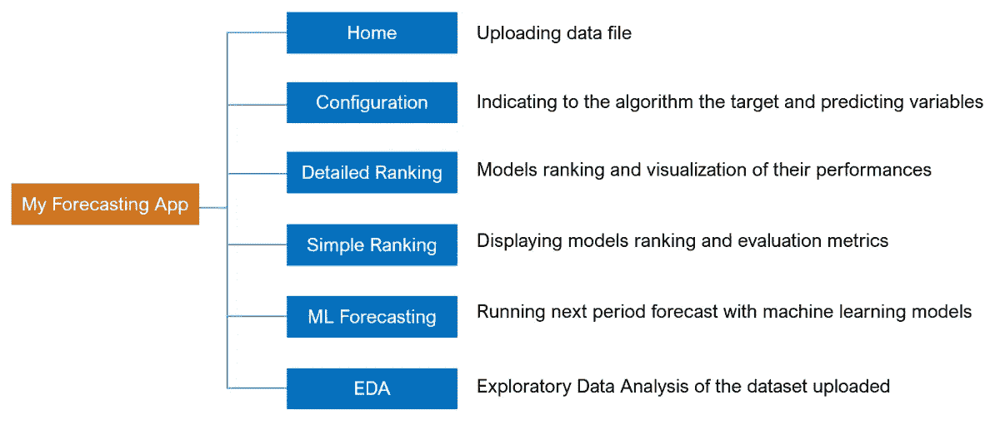
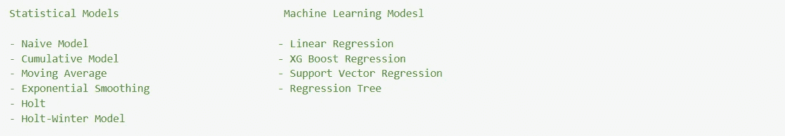
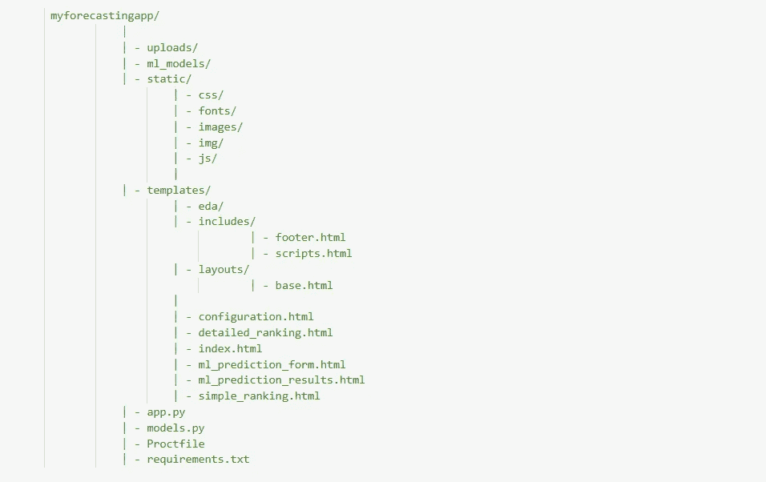

# 作为 Flask App 的最精确预测模型推荐系统

> 原文：<https://medium.com/codex/most-accurate-forecasting-model-recommender-system-deployed-as-a-flask-app-on-heroku-ab06ea7e4894?source=collection_archive---------2----------------------->

图片来自走向数据科学

> 这个 web 应用程序接收一个包含时序数据的文件，并根据 RMSE 对用于预测下一个周期值的预测模型进行排序。
> 
> [在 Github 上访问项目。](https://github.com/joseph-josh/My_Forecasting_App/tree/main)

# 1.介绍

在从事一些需求预测项目时，我意识到我花了相当多的时间实现各种模型来预测下一个时期的需求，然后才选择一个性能最好的模型。如果我想对另一个需求数据集做同样的事情，我需要返回代码并修改其中的许多部分，这也很耗时。因此，我想到了创建一个预测 web 应用程序的想法，它的目标是自动推荐最具性能的模型，用于下一个时期的需求预测，并且对于任何类型的数据，同时最小化执行时间。至于被预测的变量，除了产品的需求之外，它可以是按时间顺序变化的任何指标，例如销售、股票价格、天气、移民和地震。在本文中，我将介绍用 Flask 构建的预测模型推荐系统的功能。

# 2.应用程序界面

该应用程序由 6 个用户友好的界面组成:

## **首页**

这是应用程序的第一页，用户在这里上传包含时间数据的文件。

## **配置**

当文件成功上传后，用户将被重定向到配置页面，在该页面上，用户将显示目标变量、预测值、分类变量和记录的时间规则时间间隔。

## 详细排名

通过点击 but“运行模型”，运行 20+个模型，然后根据均方根误差(RMSE)从最精确到最不精确排列。对于每个模型，都会显示一个图表，说明其在数据上的表现以及使用的其他评估指标，包括平均绝对误差(MSE)和平均误差(ME)以及下一期预测。

## **简单排名**

在此页面上，用户只能查看模型的排名、它们的评估指标以及对下一阶段的预测。不显示可视化效果。

## ML 预测

之后，可以访问“ML 预测”页面，使用之前运行的机器学习算法预测下一个周期值。要做到这一点，所有预测值的字段都应该填入它们各自的下一个周期的值。对于其他模型，没有必要这样做，因为它们是单变量的-预测只是基于目标变量随时间的可变性。

## 电子设计自动化(Electronic Design Automation)

最后，使用 Pandas-profiling 创建的探索性数据分析报告允许用户深入了解上传数据的许多方面，包括数据质量、相关性以及预测值和目标变量之间的相互作用。

# 3.应用程序结构

应用程序的结构如下所示:

代码由 4 个主要文件夹组成，包括“上传”、“静态”和“模板”，以及 4 个其他文件。

*   **上传:**上传的文件将存放在该文件夹中。
*   **静态:**该文件夹包含模板的所有静态文件，如 CSS 和 JS 文件。
*   **模板:**所有代表应用页面的 HTML 文件都存放在这个文件夹中。在开发前端时，对 Colorlib 仪表板模板进行了修改。
*   **ml_models:** 当预测模型运行时，机器学习模型保存在该文件夹中，以便以后用于机器学习预测。
*   **app.py:** 该文件包含管理应用程序路由和启动 web 服务器的代码。
*   **models.py:** 该文件中实现了预测模型。
*   **Proctfile:** 它包含 Heroku 的配置。
*   **requirements.txt:** 该文件包含创建应用程序时安装在开发环境中的所有 Python 库及其版本。这是为了在部署期间将它们安装在 Heroku 上。

# 4.结论

执行这个项目是一次丰富的经历，因为我学会了如何通过用 Flask 创建的 web 应用程序让用户访问数据科学项目的结果，以及如何在 Heroku 上部署它。

通过 Github 访问预测推荐应用[，了解更多信息。我很高兴得到您的反馈。](https://github.com/joseph-josh/My_Forecasting_App/tree/main)