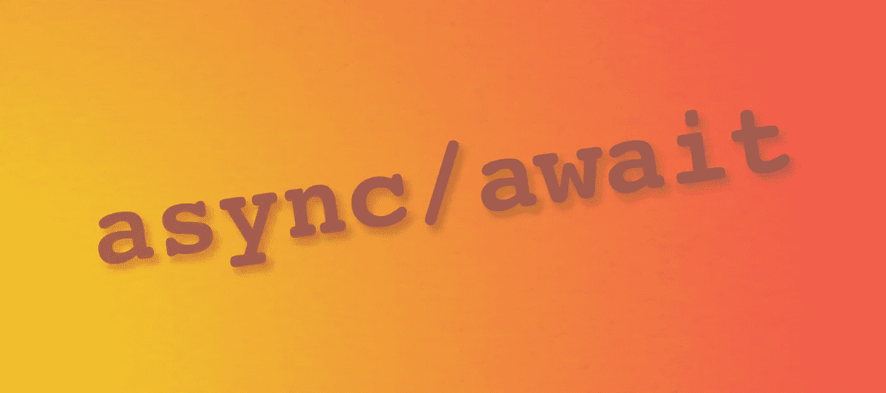

# 大多数现代编程语言都有异步和等待

> 原文：<https://medium.com/codex/most-modern-programming-languages-will-have-async-and-await-27979fd74db2?source=collection_archive---------10----------------------->

## JavaScript 拥有 Async/Await 已经有几年了，但是越来越多的语言拥有这些特性

David Fekke 的图片说明

*最初发布于*[*https://fek . io*](https://fek.io/blog/most-modern-programming-languages-will-have-async-and-await/)*。*