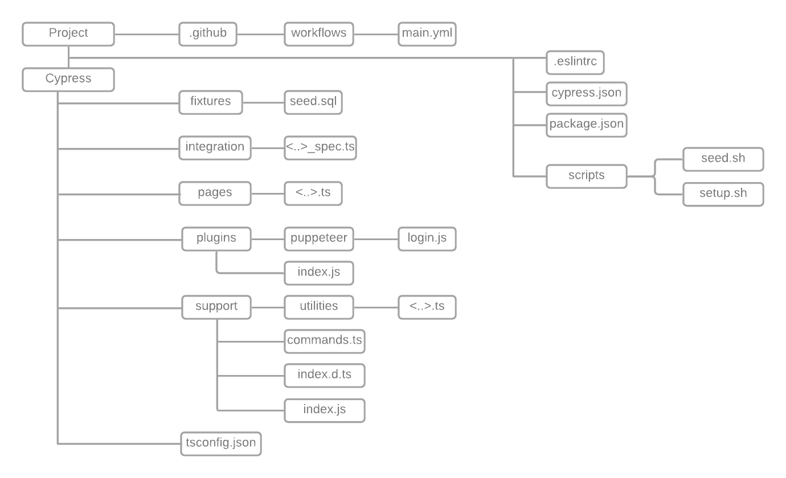

# 一起塑造柏树和打字稿。

> 原文：<https://medium.com/codex/moulding-cypress-typescript-together-5c66437b454b?source=collection_archive---------5----------------------->

## 想知道如何在 Cypress 中使用 Typescript？

## 我们成功实施的片段。


在 [Unsplash](https://unsplash.com/?utm_source=unsplash&utm_medium=referral&utm_content=creditCopyText) 上由 [SwapnIl Dwivedi](https://unsplash.com/@momentance?utm_source=unsplash&utm_medium=referral&utm_content=creditCopyText) 拍摄的照片

[Typescript](https://www.typescriptlang.org/) (TS)是 JS 的严格扩展。

## 在 Cypress 中配置 TS:

将其作为依赖项添加到项目中，然后

## ***使用 TS 时柏树框架的结构:***



我仍然喜欢使用类似 POM 的结构。依我看，这是组织代码的好方法。让我们看看这个结构是什么样子的:

*柏树文件夹内:*

*fixtures :* 它包含类似 seed.sql 的文件，用于插入测试数据。
必须避免使用此文件夹存储机密的常见误解。

*集成:*这包含了所有的规格文件。每个规格文件都有一个“测试套件”，即一个用于特定功能的*描述*块。它们依次包含描述性的“测试用例”——即 *it* 模块。

页面:这包含了所有的文件，这些文件包含了定位元素、对元素执行操作或者验证元素某些方面的方法。

*插件:*

*   它包含了一个用于登录的木偶脚本。它将实际登录并在成功登录后获取本地存储。
*   *index.js :* 登录脚本(如上)是作为 Cypress 的任务创建的。它还负责将环境变量捕获为 config，并最终将它们作为登录参数传递。

*支持:*

*   *实用程序(文件夹):*应用程序中使用的常用方法。
*   *commands.ts :* 创建登录命令。它还在 Cypress 使用的浏览器中设置和保存本地存储数据。
*   *index.d.ts :* 顾名思义，它声明了一个可公开访问的类型。在我们的例子中，我们用它来声明登录功能的类型。由于是在 Cypress 的命名空间中，所以这个类型可以作为 *cy.login* 使用。
*   *index.js :* 导入 xpath 插件和 *commands.ts* 文件。
*   *tsconfig.json :* 配置类型脚本。

*项目级文件:*

*   。eslintrc，。用于配置 linter 和代码结构。
*   seed.sh，用于运行 seed.sql 文件。
*   cypress.json 来配置 cypress。
*   package.json 来定义框架中的依赖关系。

## 实施与 ts 的共同要求:

***等等:*** 我们知道，自动化需要被教会耐心，让它能够密切模拟用户行为。
Cypress 提供了一个强大的命令 *cy.intercept* 用于嘲讽和存根。这个命令也在[中出现，便于在命令之间等待](/technogise/adopting-cypress-again-97eddcdc4ea2#ce0b)。

正如 Cypress 所建议的，我们需要拦截指定请求的网络调用。执行所需的操作，以便触发呼叫。然后等待 API 调用。
我们通过传递一个方法作为参数来实现这一点:

***方法参数:*** 提供默认值与其他语言类似。在这种情况下，由于默认值为零，因此会自动检测该变量的类型—整数。

```
export function methodName(variable = 0): void {
    ***cy***.get('[data-testid="locator"]').eq(variable).click();
}
```

可选参数的定义方式与大多数情况下相同，即提供一个问号。这里年龄是一个可选参数。

```
export function verify(name: string, age?: string): void {
    if (age) {
        ***cy***.get(`${age}`).should('be.visible');
    }
```

***TS 中的 forEach 循环:*** 如果你想执行一个重复的动作那么实现和其他语言类似:

```
export function verifyDetails(name: string, birthDate: string,  state: string): void {
    [name, birthDate, state].forEach(assertVisibilityOf);
}
```

***函数的导出和导入:*** 我更喜欢导出单个的命名函数，并将其作为命名文件导入。这些方法随后被用作“namedFile.namedFunction”。把它们想象成 component.action.
这些函数在范围上是全局的，类似于链式命令“ *cy* ”。这个策略让我对测试的外观有了更多的控制——它们提供了测试到底在做什么的信息。

使用此设置，您可以轻松地[配置插件](/geekculture/integrate-puppeteer-as-a-plugin-in-cypress-1f0912d8e265)。我希望这篇文章减轻了你使用 Cypress 和 Typescript 的恐惧！

也可以看看这篇[文章](https://filiphric.com/starting-with-typescript-in-cypress)。