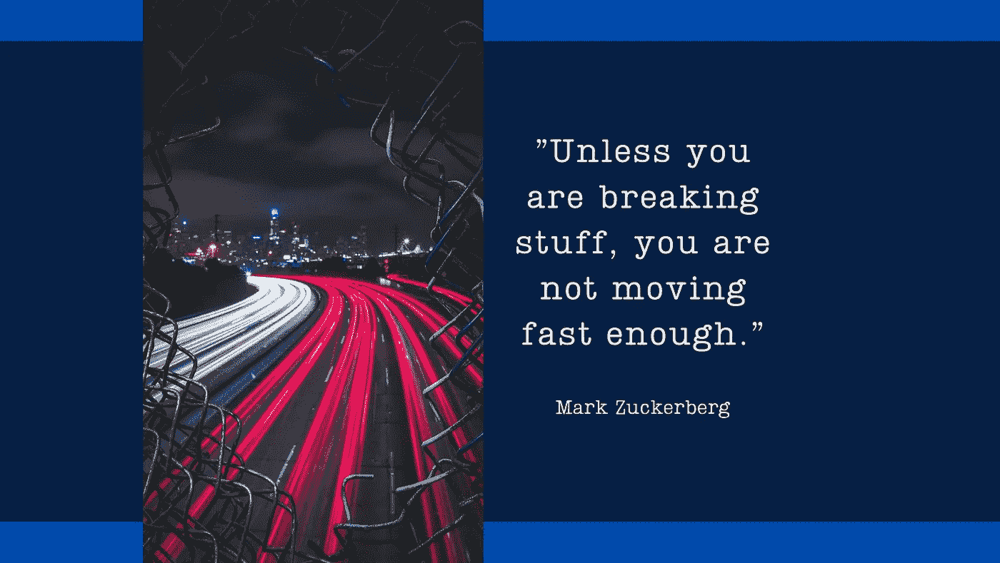

# 快速移动和打破东西是可悲的误解

> 原文：<https://medium.com/codex/move-fast-and-break-things-is-sadly-misunderstood-f6684a55661a?source=collection_archive---------4----------------------->

## 也许甚至由脸书自己来决定。否则为什么抛弃这么好的口号？

照片由 [Pexels](https://www.pexels.com/sv-se/foto/ljus-stad-bilar-vag-1454253/?utm_content=attributionCopyText&utm_medium=referral&utm_source=pexels) 的 [Mohamed Almari](https://www.pexels.com/sv-se/@maoriginalphotography?utm_content=attributionCopyText&utm_medium=referral&utm_source=pexels) 拍摄，作者使用 Canva 合成。

我最近分享了一个我和一个前端架构师讨论的故事。我们谈论的是两个不同团队中的开发人员，(为了简单起见，称为团队 A 和团队 B)。两个团队都选择了“仅限暴徒”的方法…