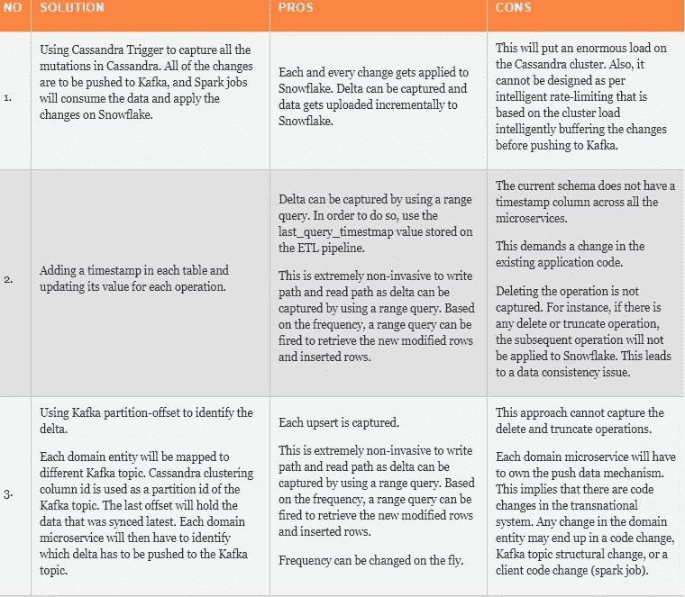
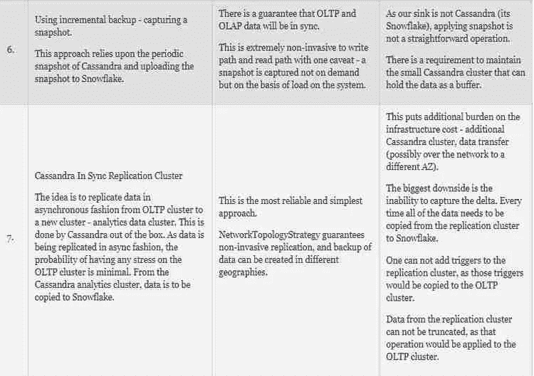
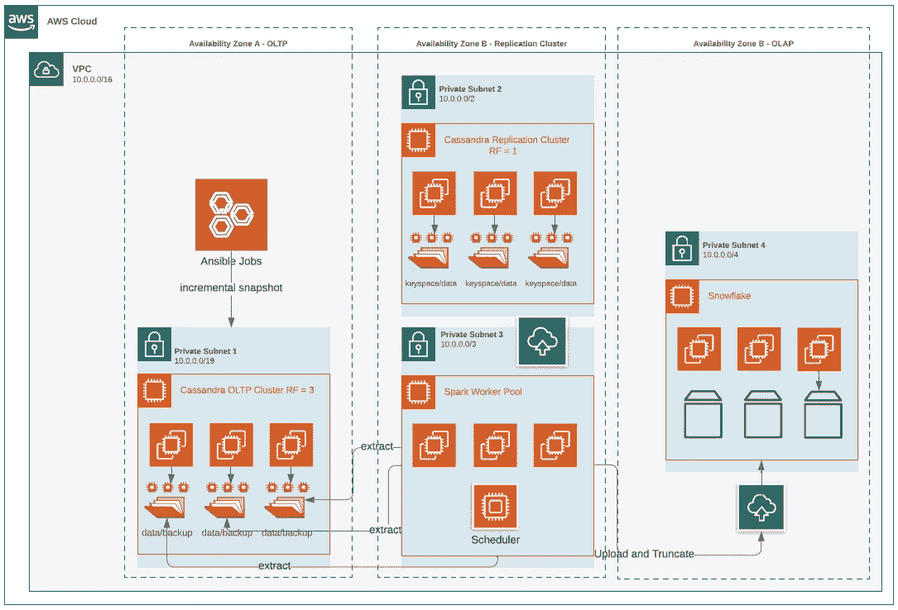
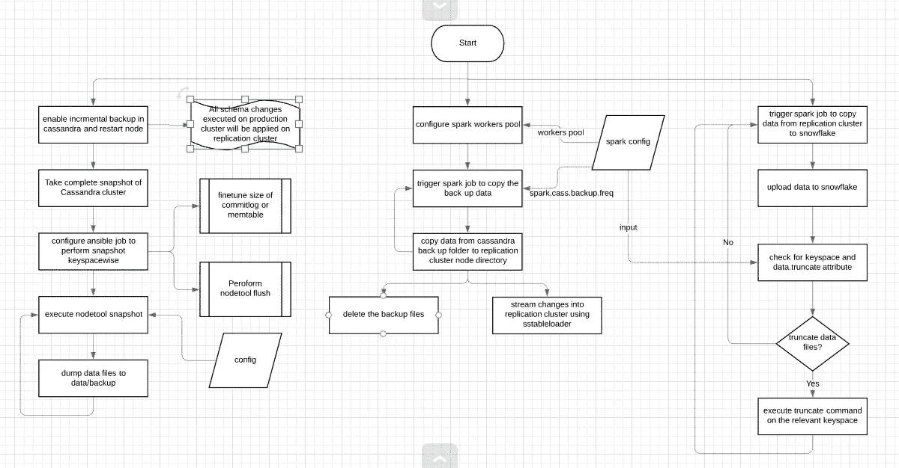

# 将数据从 Cassandra (OLTP)移动到数据仓库

> 原文：<https://medium.com/codex/moving-data-from-cassandra-oltp-to-data-warehouse-6af1de724fac?source=collection_archive---------3----------------------->

# 概观

数据应该实时或接近实时地流向分析引擎，以便将跨国数据增量上传到数据仓库系统。在我的例子中，我的 OLTP 是卡珊德拉，OLAP 是雪花。OLAP 系统要求 Cassandra 定期提供数据。与此场景相关的要求是:

1.  需要大幅降低数据复制的频率。
2.  数据必须一致。卡珊德拉和雪花应该同步。
3.  在少数情况下，所有的突变都必须被捕获
4.  目前，生产集群数据大小以 Pb 为单位；每小时至少生成 100 千兆字节的数据。

有了这样的粒度要求，就不应该将数据从 OLTP 系统拷贝到 OLAP，因为读取路径会造成入侵，而写入 Cassandra 的路径会导致对 TPS 的影响。因此，我们需要提供不同的解决方案来将 Cassandra 数据复制到 Snowflake。

复制整个数据(以 TB 为单位)将是非常低效的，并且不会提供任何好处，因为唯一的期望是在雪花上应用所有新的 Cassandra 突变。

# OLTP 生态系统

*   整个 OLTP 遵循微服务架构。
*   我们已经实施了一种“每个服务一个数据库”的方法。
*   在 OLTP 端，GraphQL 用于从 Cassandra 传输数据。
*   每个微服务都遵循存储库设计模式。

# 潜在的解决方案

我们考虑了以下解决方案。这是总结。

如果你的分析引擎是基于 Cassandra 的，使用方法五到八。如果 OLTP 系统是从头开始设计的，请使用方法一、二或四。

然而，当您拥有现有的运行中的 OLTP 和 OLAP 系统时，许多解决方案会彻底消失。我们需要一个通用的非侵入式解决方案，不需要对现有系统(包括微服务实施和领域数据模型)进行任何更改。我们缩小了 CDC 和增量备份加快照的方法范围。实际上，这些是在 OLAP 上应用 OLTP 突变的通用选项。一般来说，CDC 方法是可行的，因为它在数据复制方面提供了精确的粒度级别，因为每个操作都会被捕获并可以在目标系统上执行。这适用于整个 RDBMS 世界和 NoSQL 解决方案，如 MongoDB 和 InfluxDB。然而，卡珊德拉的 CDC 非常基础，目前有许多开放的问题。

# 卡珊德拉疾病控制中心

变更数据捕获(CDC)日志记录捕获并跟踪已更改的数据。CDC 日志记录是按表配置的，对存储 CDC 日志所消耗的磁盘空间量有限制。CDC 日志使用与提交日志相同的二进制格式。通用架构包括作为 CDC 审计复制日志的 Kafka 和像 Debezium 这样的 CDC 连接器。然而，根据当前的 Cassandra 实现，CDC 功能有许多问题，如事件重复和事件无序。因为这些问题，CDC 的可靠性不是 100%。Cassandra 的文档明确指出，客户端程序/CDC 日志消费者必须处理这些问题，并要求采用 Cassandra 使用的技术来实现可靠性，如上次写入成功、时间戳冲突等技术。目前，没有第三方工具提供这样的功能。Debezium 和优步的 DBEvents 是两个很有前途的项目，可以满足 CDC 的需求；然而，卡珊德拉 CDC 连接器仍处于培育阶段。根据 Cassandra 4.x 路线图，没有提高 CDC 功能可靠性的计划。CDC 的当前问题需要复杂的工程设计，并且需要付出巨大的努力来保证高数据质量和新鲜度。这就是这种方法被抛弃的原因。

# 同步复制群集中的 Cassandra

这种方法是通用的。该方法启动了另一个 Cassandra 集群(OLAP)，并使用 Cassandra 的多 DC 复制功能将数据实时复制到该集群。该集群应该非常小，复制因子应该为 1，因为该集群充当中间数据存储。这两个群集将保持同步，并且在复制因子和节点方面有所不同。OLTP 集群将使用 local.quorum 的一致性级别，微服务应用程序实例将只知道这些 Cassandra 节点。所以，现状没有改变。

使用 OLTP 集群将数据复制到雪花的 Spark 作业将指向一个复制集群。对我们来说，这种方法最大的缺点是这两个集群是彼此的镜像副本。因此，用户在复制群集上执行的任何操作都会应用到生产群集；这样就不能截断复制群集数据，也不能添加触发器。

这也意味着复制群集将保留生产数据的整个拷贝。例如，如果生产群集上的 RF 为 3，复制群集 RF 为 1，则复制群集的大小将是生产群集的三分之一。就成本而言，这一比例大致保持不变。另一个缺点是，每次使用时都必须将数据的整个副本上传到数据仓库。

这是一种开销，因为一般分析数据是仅附加的。因此，复制如此大的数据存储库并不是明智的做法。久而久之，数据的大小将会是 Pb——想象一下复制这些数据所需的计算能力。这就是为什么尽管这种方法很吸引人并且易于采用，维护开销也很少，但它有很大的缺点。

# 增量备份加快照

最后，我们只剩下这种方法。在 Cassandra 中，快照和增量备份功能非常可靠。这些功能的最初目的是支持备份。如果磁盘或系统硬件出现故障，即使整个活动站点离线，也不需要从备份中恢复。只要有一个节点有复制的数据，Cassandra 就可以恢复该数据，而不需要依赖任何外部源。在 Cassandra 中，捕获快照不是写入或读取入侵操作。Cassandra 通过节点工具命令提供了一个本地节点级快照选项。快照创建了到现有 Cassandra 数据文件的硬链接。这与提供时间点恢复功能的增量备份功能一起使用。粒度可以微调到 10 到 15 分钟。然而，这不是接近实时的数据复制。使用这种方法，您无法达到几秒钟或两到五分钟的精确度和粒度。如果这是要求，那么我建议以基础架构开销为代价，继续使用以前的同步复制方法。

通常，分析引擎要求定期从生产集群接收增量。这就是大多数数据仓库解决方案的工作方式。我们的业务需求目前表明，我们每天都从生产集群接收增量。将来，我们希望支持每小时一次的频率。考虑到成本因素和业务需求，这种方法轻而易举地胜出。

以下小节解释了该方法的高级设计。

数据文件夹包含每个键空间的子文件夹。每个子文件夹包含三种文件:

**数据文件:**SSTable(排序字符串表)是一个键值字符串对(按键排序)的文件。

**索引文件:** (Key，offset)对(指向数据文件)

**Bloom filter:** 数据文件中的所有键

增量备份操作捕获所有的突变，包括删除。按照我们的要求，我们只需要在代理键空间的情况下捕获删除突变。对于其他关键空间，我们不关心删除。事实上，在大多数键空间上，我们不必删除数据。对于复制集群，不必保留所有数据。一旦 Spark 作业被触发，您就可以查询键空间来获取数据，然后将数据上传到 Snowflake。

上传完成后，您可以在 keyspace 上执行 truncate 命令，以确保数据大小保持在一定的限制之下。对于增量备份，只需要一个模式。因此，如果模式是完整的，那么增量备份可以简单地继续加载增量，并且 Spark 作业将继续将键空间中的全部数据复制到雪花。

在需要捕获所有突变的情况下，需要旧数据。这在下面的流程图中有详细说明。Spark 作业将需要复制和截断数据。从那里，很容易对每个键空间进行配置。在需要缺失突变的情况下，必须保留所有数据。所以将 keyspace 数据复制到 Snowflake 的奇怪情况仍然存在。但是，这个问题很容易解决，就像在这个集群中一样，对于有问题的键空间，可以启用触发器。一旦触发器被启用，每一批突变都会触发一个事件。Cassandra 触发器可以在程序中实现的事实也有所帮助。

一个重要的设计决策是确保 Spark 作业将数据从生产集群复制到复制集群，然后将数据从复制集群迁移到雪花作业，这些作业不会并行执行。在这种情况下，可能会出现数据争用问题，因为会出现多个写入者和突变。为了避免这种情况，必须使用 Spark 调度程序。Spark 调度器配置将确保这两个作业不会并行执行。

AWS 部署如下:

*AWS 部署*

下面的流程图总结了整个方法。

*进场总结*