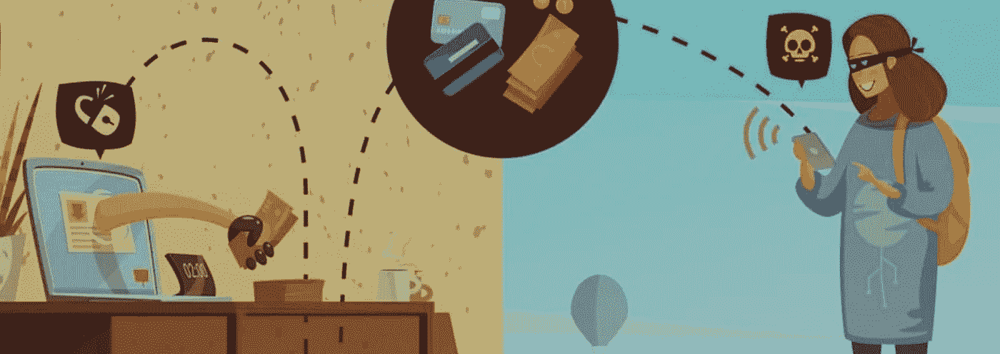
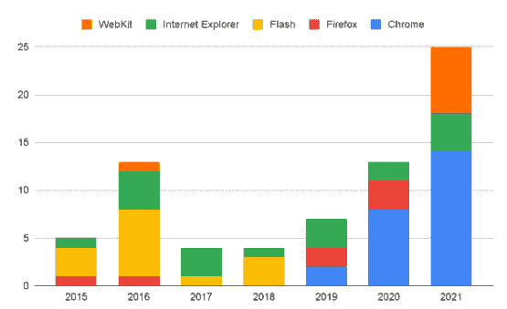
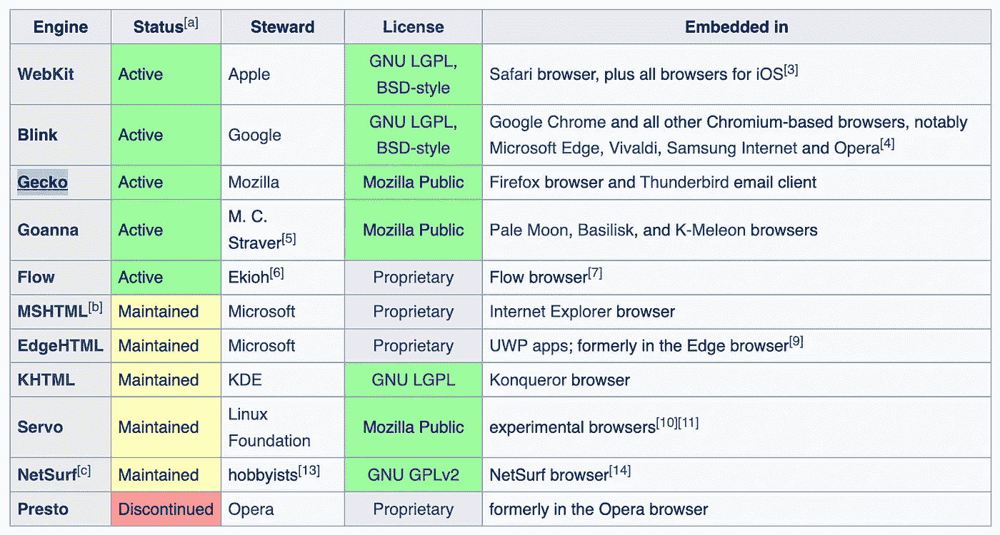
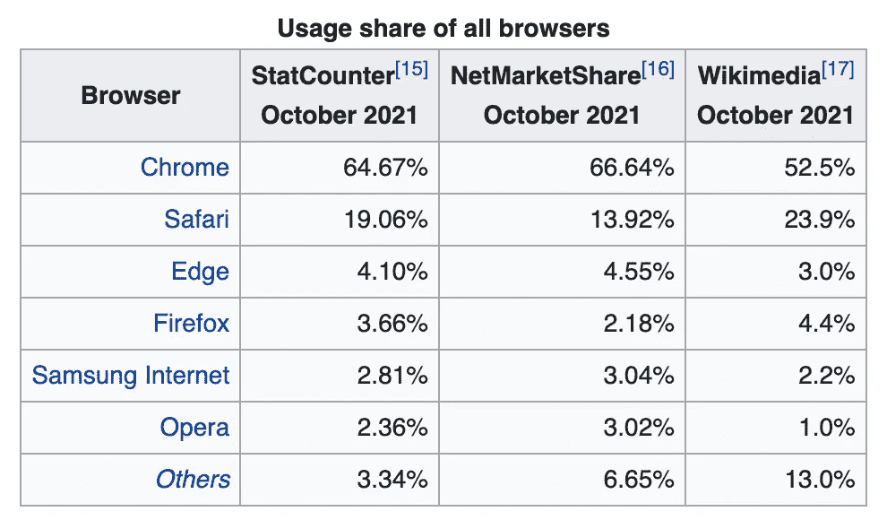
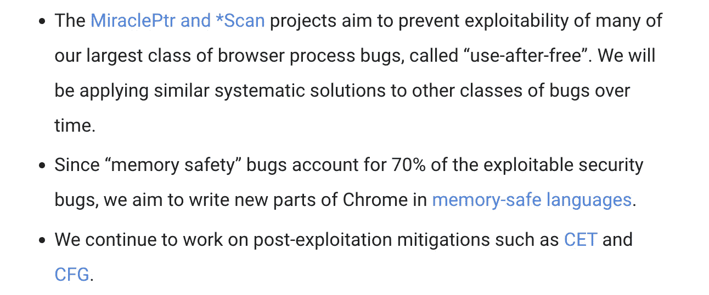
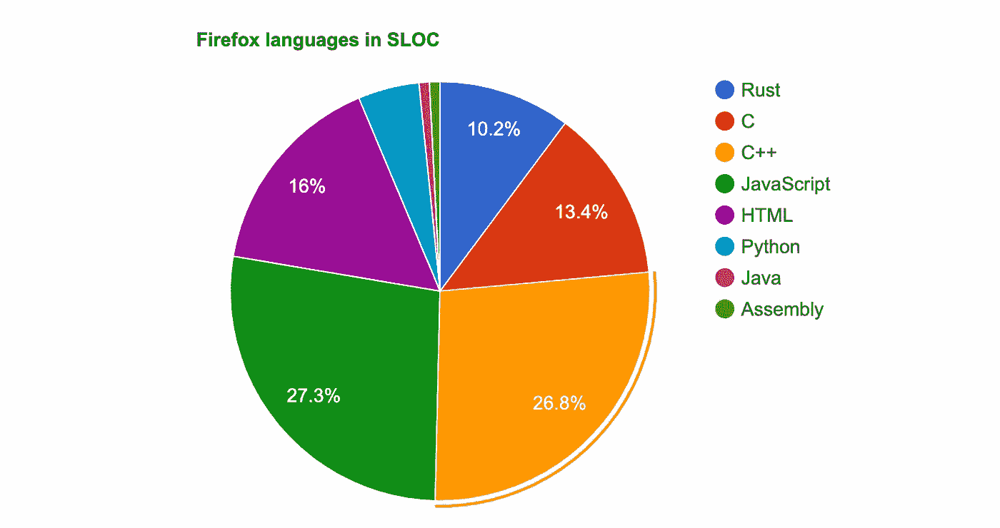
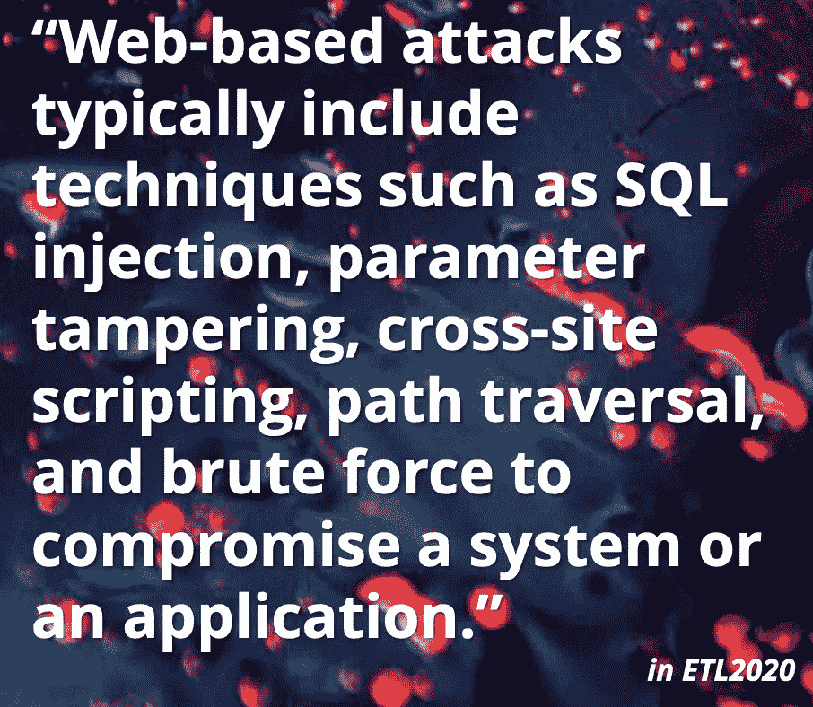
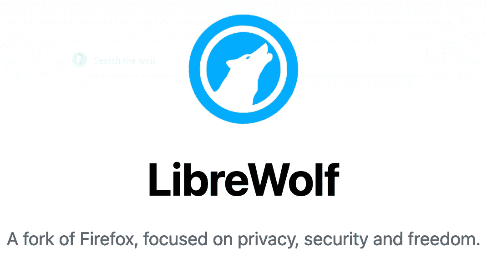

# 新威胁环境中的 Mozilla Firefox 和 Chromium:电子、浏览器安全、分叉和 Rust

> 原文：<https://medium.com/codex/mozilla-firefox-and-chromium-in-the-new-threat-landscape-electron-browser-security-forks-and-cbf8de716dfd?source=collection_archive---------0----------------------->

*tldr；Mozilla Firefox 是最安全的桌面浏览器。如果你担心，* [*在安装*](https://chrisx.xyz/blog/yet-another-firefox-hardening-guide/) [*异国情调的 Firefox forks*](https://www.reddit.com/r/firefox/comments/ak57w8/what_do_you_think_about_forks/) *之前，自己做研究加固 Mozilla Firefox* *，因为 Firefox 仍然是最安全的“开箱即用”浏览器，没有 V8 JavaScript 引擎的问题。从安全角度看最相关的 Firefox fork 是*[*libre wolf*](https://librewolf.net/)*，用* [*硬化 Firefox profiler*](https://ffprofile.com/#start)*和* [*user.js 修改*](https://github.com/pyllyukko/user.js/) *将是你能得到的最高安全。*

你可以阅读并贡献给我的列表“[为游牧书呆子提供的工具和服务](https://github.com/z3cko/digital-services/blob/main/README.md)”，在那里你也可以支持这样的研究和写作。

# 最坏的时代:身份盗窃和网络威胁是真实的

我们生活在令人担忧的时代——新冠肺炎、战争和全球网络威胁不断见诸报端。随着数字化的兴起和日常生活的在线化，新一波在线“网络威胁”正在兴起。《福布斯》描述称[金钱是攻击者](https://www.forbes.com/sites/theyec/2022/02/01/cybersecurity-trends-for-2022-why-staying-ahead-of-the-threat-has-never-been-so-critical/)的动机，被针对的有价值数据是银行账户、在线凭证和比特币或以太坊等加密货币。但即使你不喜欢加密，你也是一个目标。在“[我被 pwned 了吗](https://haveibeenpwned.com/)”平台上，你可以检查你的数据是否是通过泄露获得的——你很可能是从一个有后门的浏览器上阅读这篇文章的。

在艾特集团发布的[报告中，2021 年，47%的美国公民遭遇过金融身份盗窃。另一项统计表明](https://feedzai.com/aptopees/2021/04/20210305_U.S.-Identity-Theft_The-Stark-Reality_Report.pdf)[每年有 1500 万美国人成为身份盗窃的受害者](https://fortunly.com/statistics/identity-theft-statistics/)。

你可能应该开始考虑浏览器的安全性。

# 获得更安全的浏览器

浏览器通常是链条中最薄弱的一环，零计划[公开跟踪了 2015 年至 2021 年浏览器中所有已知的“零日”漏洞](https://docs.google.com/spreadsheets/d/1lkNJ0uQwbeC1ZTRrxdtuPLCIl7mlUreoKfSIgajnSyY/edit#gid=1123292625)。图表中显而易见的是:只研究了最常见的浏览器(和 Flash)。反过来，你不能断定这里没有列出的浏览器和技术更安全。

[2015-2018 年间浏览器的开拓](https://security.googleblog.com/2022/03/whats-up-with-in-wild-exploits-plus.html)。

# WebKit、Blink 和 Gecko

Safari 和苹果 iOS 浏览器基于 [WebKit](https://events.static.linuxfound.org/sites/events/files/slides/slides.pdf) 。Chrome、Chromium、微软 Edge、Vivaldi 和 Opera 都是基于 Blink(技术上来说 [Blink 是 WebKit 的一个分支，但是已经分化了](https://news.softpedia.com/news/This-Is-How-Google-s-Chrome-s-New-Engine-Blink-Is-Different-from-WebKit-342891.shtml))。火狐使用 [*壁虎*](https://en.wikipedia.org/wiki/Gecko_(software)) 引擎。

[浏览器引擎对比，en.wikipedia.org](https://en.wikipedia.org/wiki/Comparison_of_browser_engines)。

## 世界运行在 Blink 上，V8 JavaScript 引擎

全球超过 85%运行 Blink (Chromium、Opera 和微软 Edge，根据[最新浏览器市场份额报告](https://kinsta.com/browser-market-share/)，这是一个相当高的攻击面。剩下的由 Safari 和 Firefox 瓜分。

Nick @ The Linux Experiment 在 2019 年写了一篇很棒的文章“[为什么每个浏览器都切换到 Blink 可能是网络的坏消息](/@stouff.nicolas/why-every-browser-switching-to-blink-could-be-bad-news-for-the-web-aea773059e84)”，概述了这种垄断的风险。他认为 Vivaldi 和 Epiphany，以及其他基于 Chromium 的浏览器经常被忽视。

Chromium 主要是用 C++编写的，包括 [V8 JavaScript 引擎](https://en.wikipedia.org/wiki/V8_(JavaScript_engine))。V8 也是 [node.js 运行时系统](https://www.infoworld.com/article/3210589/what-is-nodejs-javascript-runtime-explained.html)的一部分，后者又是[电子框架](https://github.com/electron/electron)的一部分，也被称为“JavaScript 桌面”。

问题是:如果 V8 JavaScript 引擎中存在漏洞，浏览器和应用程序都会受到影响。所以你的桌面实际上很容易受到攻击:[电子应用](https://www.electronjs.org/apps)比如 Slack、WhatsApp、Skype、Slack、Discord、Tusk 和 Visual Studio Code (VS Code)都是基于电子的(因此也是 NodeJS/v8)。

[网络浏览器使用份额(2021)，en.wikipedia.](https://en.wikipedia.org/wiki/Usage_share_of_web_browsers)

V8 JavaScript 引擎多次遭到漏洞攻击，下面是 2021 年的漏洞列表，以及 2022 年 3 月的[CVE-2022–1096](https://cve.mitre.org/cgi-bin/cvename.cgi?name=CVE-2022-1096)。

*   [CVE-2022–1364](https://chromereleases.googleblog.com/2022/04/stable-channel-update-for-desktop_14.html?m=1):V8 中的类型混淆。(2022 年 4 月 13 日由谷歌威胁分析小组的 [Clément Lecigne](https://twitter.com/ShaneHuntley/status/1514719656619114506) 报道。)
*   CVE-2022–1096:V8 引擎出现类型混乱。*2022–03–23*
*   CVE-2021–4102:V8 的一个释放后使用的错误。*2021–12–13*
*   CVE-2021–38003:V8 中的一个不适当的实现。 *2021 年 10 月 28 日*
*   [CVE-2021–37975](https://threatpost.com/google-emergency-update-chrome-zero-days/175266/):V8 版本的免后使用错误。 *2021 年 9 月 30 日*
*   [CVE-2021–30633](https://threatpost.com/google-chrome-zero-day-exploited/169442/):V8 中的越界写入。*2021–09–13*
*   CVE-2021–30563:V8 的另一个类型混淆错误。 *2021 年 7 月 15 日*
*   [CVE-2021–30551](https://threatpost.com/chrome-browser-bug-under-attack/166804/):V8 内部的一个类型混淆 bug(作为零日也受到主动攻击)。*2021–06–09*
*   [CVE-2021–21224](https://cve.mitre.org/cgi-bin/cvename.cgi?name=CVE-2021-21224):V8 中的类型混淆问题，该问题可能允许远程攻击者通过特制的 HTML 页面在沙箱中执行任意代码。 *2021 年 4 月 20 日*
*   CVE-2021–21148:V8 引擎中一种未命名的错误。*2021–02–04*

谷歌知道这些问题，并声明“内存安全”漏洞占可利用安全漏洞的 70%。]我们的目标是在他们的[谷歌安全博客](https://security.googleblog.com/2022/03/whats-up-with-in-wild-exploits-plus.html)上用内存安全语言编写 Chrome 的新部分。

主要信息汇集在 2021 年 9 月发布的名为“[Chrome 内存安全更新](https://security.googleblog.com/2021/09/an-update-on-memory-safety-in-chrome.html)”的谷歌博客中。那里描述了很多资源投入到使 Chromium 的 C++部分更安全——对他们的尝试有不同的描述。他们还直接提到了 Mozilla(这并不少见，因为[谷歌是 Mozilla 基金会](https://www.reddit.com/r/firefox/comments/n8cxll/what_will_happen_if_google_stops_funding_mozilla/#)的主要赞助商)。

> “与此同时，我们将探索未来能否在 Chrome 的某些部分使用内存安全语言。领先的竞争者是我们在 Mozilla 的朋友发明的 Rust T1。([谷歌，2021](https://security.googleblog.com/2021/09/an-update-on-memory-safety-in-chrome.html) )

# Firefox，Rust 和内存安全。

Rust 出现在 Mozilla 和 Firefox 中已经有一段时间了:在 Firefox 56 中，第一个主要的 Rust 组件已经与 Firefox 56 ( [encoding_rs](https://crates.io/crates/encoding_rs) )和 57 ( [Stylo](https://www.joshmatthews.net/rbr17/) )一起发布了。Mozilla 项目 [Oxidation](https://wiki.mozilla.org/Oxidation) 保留了 Firefox 内部和周围的 Rust 代码的历史。Rust 于 2010 年首次出现，由 Mozilla Research 的 Graydon Hoare 设计，Mozilla 是 Rust 的第一个投资者。

2020 年 8 月[Mozilla 削减了一些工作](https://www.reddit.com/r/rust/comments/i7stjy/how_do_mozilla_layoffs_affect_rust/)，并停止了[伺服渲染引擎](https://ubunlog.com/en/las-cosas-continuan-mal-para-mozilla-pues-despidio-a-todos-los-ingenieros-que-trabajaban-en-el-renderizador-servo/)的开发。到 2022 年，仍然有超过 10%的 Mozilla Firefox 基于 Rust，它使浏览器更加安全，捕获了大多数漏洞。

[火狐有多锈？2022 年 3 月 mozilla/gecko-dev 库统计数据](https://4e6.github.io/firefox-lang-stats/)。2022 年 3 月，Mozilla Firefox 中有 3415930 行代码是用 Rust 编写的。这占了火狐全部代码的 10.2%。来源: [/r/rust](https://www.reddit.com/r/rust/comments/8uqi73/how_much_rust_in_firefox/)

## 为什么 Firefox 是安全的

除了超过十分之一的代码是用 Rust 编写的，Firefox 没有使用 V8 JavaScript 引擎，但是它有自己的 JavaScript 和 WebAssembly 引擎，名为 [SpiderMonkey](https://spidermonkey.dev/) 。用于[火狐](https://www.mozilla.org/en-US/firefox/)、[伺服](https://servo.org/)和[各种](https://discourse.mozilla.org/t/survey-where-are-you-embedding-spidermonkey/77988)其他项目，用 C++、Rust 和 JavaScript 编写。

2019 年蜘蛛猴只出现过一次类型混淆漏洞([CVE-2019–11750](https://cve.mitre.org/cgi-bin/cvename.cgi?name=CVE-2019-11750))。

## 不要把你的安全感建立在默默无闻上！

有很多其他浏览器都是基于 Firefox 的——这是可能的，因为 Mozilla Firefox 是在 Mozilla 公共许可证下发布的。通过网络搜索可以找到很多叉子:Cyberfox、PXCFirefox、Librefox、IceWeasel、IceCat、CometBird 等等。维基百科上只列出了 18 种基于 Mozilla Firefox 的浏览器，而现在只有 5 种与此相关:

*   [Tor 浏览器](https://en.wikipedia.org/wiki/Tor_Browser)
*   [幽灵黎明](https://www.ghostery.com/dawn)(原 [Cliqz](https://en.wikipedia.org/wiki/Cliqz) )
*   [TenFourFox](https://en.wikipedia.org/wiki/TenFourFox)(Power Macintosh PPC 浏览器)
*   [Waterfox](https://en.wikipedia.org/wiki/Waterfox) (it [从 System1](https://avoidthehack.com/review-waterfox-browser#finalthoughts)[收购后收到了很多批评](https://system1.com/what-we-do)，system 1 也运营 Startpage )
*   [苍白的月亮](https://en.wikipedia.org/wiki/Pale_Moon)

一个常见的说法是，如果您使用的系统是外来的，攻击面会减少。基本原理是考虑到恶意软件作者为没有多少人使用的系统编写代码的成本更高。这是真的，但是不要忘记软件中还有其他的错误——仅仅因为它们没有被报告并不意味着它们不存在。软件[供应链攻击在 2021 年增加了两倍](https://www.securityweek.com/software-supply-chain-attacks-tripled-2021-study)，你还记得 [Log4Shell](https://en.wikipedia.org/wiki/Log4Shell) 吗？

2022 年，流行的开源 NPM 库 [colors.js](https://github.com/Marak/colors.js) on 和 faker.js 背后的开发者故意在库中引入恶作剧行为，以[抗议开源革命](https://www.bleepingcomputer.com/news/security/dev-corrupts-npm-libs-colors-and-faker-breaking-thousands-of-apps/)(以及大企业对开源的剥削)。

但不仅仅是供应链攻击，通过浏览器的其他攻击还有代码执行漏洞(在浏览器中和通过插件)、高级持续威胁、中间人攻击、DNS 中毒、SQL 注入、跨站脚本(XSS)、UI 补救攻击、广告软件、基于浏览器的加密挖掘等。

【2019 年 1 月至 2020 年 4 月:基于网络的攻击，ENISA 威胁形势

## **安全浏览器**

主流浏览器是安全的，直到它们不再安全。寻找零日漏洞有很多动机，在最近关于 [Pegasus 间谍软件和 NSO 集团](https://www.vice.com/en/topic/nso-group)的讨论中，已经清楚地表明这些漏洞利用的市场正在蓬勃发展。零日价格可能高达 300，000 美元，这取决于漏洞的严重性、利用的复杂性、漏洞保持不公开的时间、涉及的供应商产品以及买家。

不过，你应该尽可能使用主流浏览器，即[**ungoogled-Chromium**](https://github.com/Eloston/ungoogled-chromium)(Google Chromium，[sans dependency on Google web services](https://www.reddit.com/r/linuxmasterrace/comments/5mk5m0/ungoogled_chromium_chromium_without_google_botnet/))或[**libre wolf**](https://librewolf.net/)(Firefox 去除了遥测功能，包括 uBlock origin 和增强隐私)。

LibreWolf 是 Firefox 的一个独立分支，主要目标是隐私、安全和用户自由。这是唯一被积极维护的相关分支。基于 Firefox 的其他网络浏览器也有[，但这些浏览器通常会遭遇更新，并带来新的安全风险。](https://en.wikipedia.org/wiki/Category:Web_browsers_based_on_Firefox)

# 结论:去除电子，尽可能使用强化版 Firefox

我强烈建议你尽可能使用 Firefox，用运行在 LibreWolf 标签页中的 web 版本取代电子应用，如 Slack 和 Whatsapp。你可以利用[Firefox profiler](https://ffprofile.com/#start)并检查 [user.js 修改](https://github.com/pyllyukko/user.js/)来匹配你的常规 Firefox 安装的威胁等级。

*   [最佳实践:Firefox 强化](https://wevpn.com/support/hc/en-us/articles/360051778833-Best-Practices-Firefox-Hardening)
*   [维基百科上的浏览器安全和加固文章](https://en.wikipedia.org/wiki/Browser_security)
*   [火狐配置:Fastfox、SecureFox、PeskyFox、SmoothFox 和其他 user . js essentials](https://github.com/yokoffing/Better-Fox)(yokoffing)
*   [五个 EFF 工具帮助你在网上保护自己](https://www.eff.org/deeplinks/2016/09/five-eff-tools-help-you-protect-yourself-online)

**你可以阅读并贡献给我的列表“** [**为游牧书呆子提供的工具和服务**](https://github.com/z3cko/digital-services/blob/main/README.md) **”，在那里你也可以支持这样的研究和写作。**

*请在 twitter @audiores* *上关注我的 medium**&*[*如果你对这篇文章有任何其他反馈或补充，请在评论中告诉我。*](https://twitter.com/audiores) [*请通过此链接*](https://shop.trezor.io/product/trezor-one-black?offer_id=35&aff_id=6069) *订购您的 Trezor 2FA 和密码助手来支持我。*