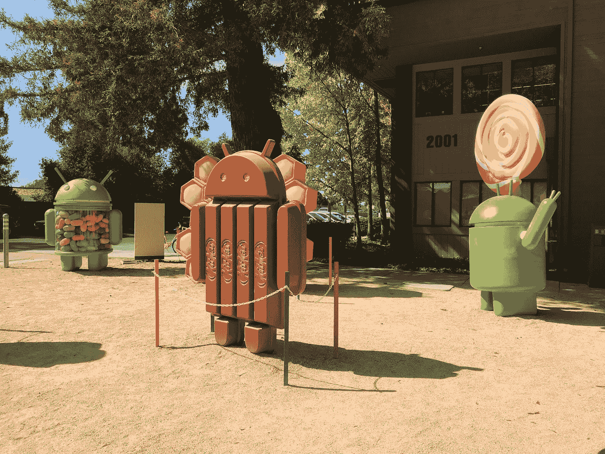
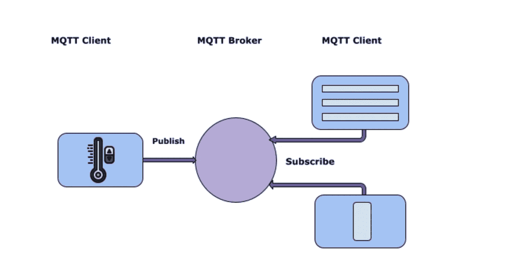
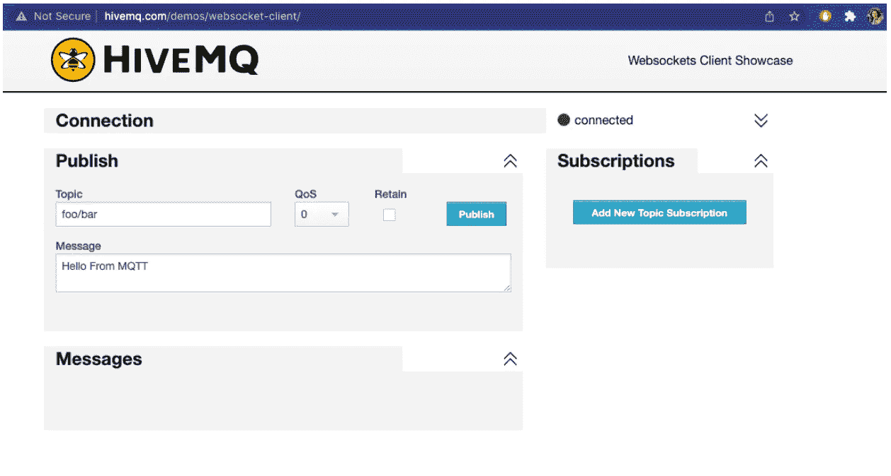
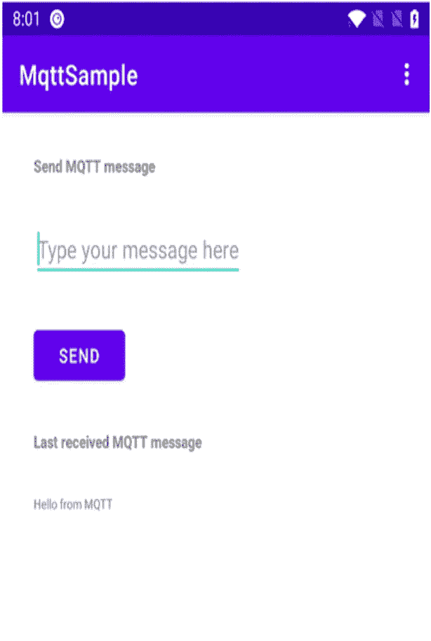
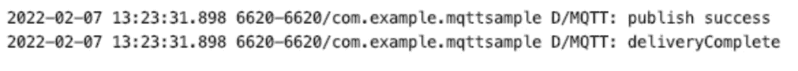
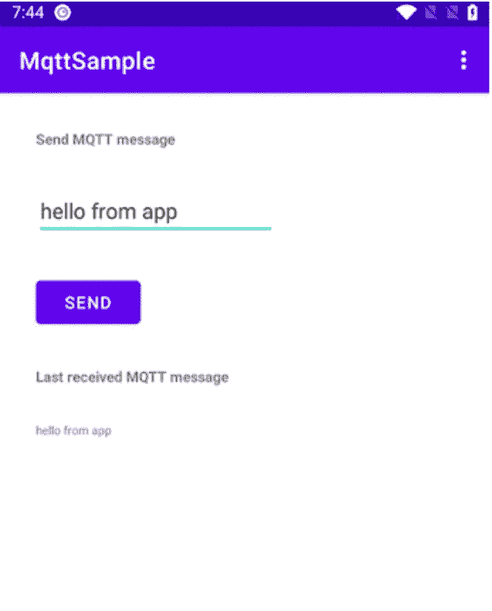
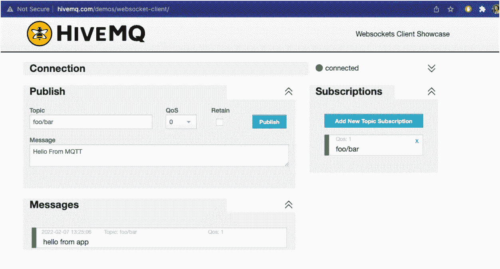

# Android 中的 MQTT

> 原文：<https://medium.com/codex/mqtt-in-android-ff3b083f2221?source=collection_archive---------5----------------------->



圭多·科帕在 [Unsplash](https://unsplash.com?utm_source=medium&utm_medium=referral) 上的照片

MQTT 在最近几年得到了广泛的关注，尤其是在 IOT 和 M2M 通信领域。

MQTT 是一个客户端服务器发布/订阅消息传输协议。它是轻量级的，开源的，易于实现。

MQTT 特别适合 IOT 的要求，因为它具有以下特征:

I)重量轻，带宽效率高

ii)数据不可知

iii)持续会话意识

iv)构建在 TCP 之上

v)不可靠信道上的可靠通信

vi)可扩展

vii)构建推送通信

viii)双向通信



**发布订阅模式**

与其他流行的协议(如遵循客户机服务器架构的 HTTP)相比，MQTT 遵循发布/订阅模式。

一旦设备(发布者)向代理发送数据，代理就将数据发布给所有其他订阅了该主题的客户机(订阅者)。

这种空间和时间的解耦有助于 MQTT 真正可伸缩。

缺点是代理是单点故障，所以我们必须使用代理集群。

**MQTT 主题**

MQTT broker 使用主题为每个连接的客户机过滤消息。主题通常是分层的，由一个或多个级别组成:

我的家/底层/客厅

我的家/一楼/书房

可以在主题名称中使用通配符

+通配符:my home/ground floor/+/temperature—这与 my home/ground floor/living room/temperature 或 my home/ground floor/kitchen/temperature 匹配

#通配符:我的家/底层/#-这匹配我的家/底层/客厅/，我的家/底层/厨房/，我的家/底层/厨房/温度，我的家/底层/客厅/灯光/亮度

**实施细节**

我们可以使用任何 MQTT 客户端库，比如 Eclipse 的 Paho。

对于经纪人，我们可以在后端使用 HiveMQ、Mosquitto 等。

让我们看看如何在 Android 应用程序中实现 MQTT，使用 HiveMQ 作为代理。

我们将使用公共 HiveMQ 代理:**端口为 1883 的 broker.hivemq.com**

[](https://www.hivemq.com/public-mqtt-broker/)****和题目 foo/bar****

****第一步:****

**在 build.gradle 文件中添加 Eclipse Paho 库的以下依赖项。**

```
implementation **‘org.eclipse.paho:org.eclipse.paho.client.mqttv3:1.2.4’**implementation **‘org.eclipse.paho:org.eclipse.paho.android.service:1.1.1’**
```

**第二步:**

**在 AndroidManifest 文件中包含以下服务。**

```
<**service android:name=”org.eclipse.paho.android.service.MqttService”/**>
```

****第三步:****

**为主题和 mqttClient 定义成员变量。**

```
**lateinit var mqttClient**:MqttAndroidClient**val topic**=**”foo/bar”**
```

****第四步:****

**在 onStart()中连接到 MQTT 代理**

```
**fun** connectMqtt() { **var** clientId = MqttClient.generateClientId() **mqttClient** = MqttAndroidClient(*applicationContext*,       **"tcp://broker.hivemq.com:1883"**, clientId) **try** { **var** token: IMqttToken = **mqttClient**.connect() token.*actionCallback* = **object** : IMqttActionListener { **override fun** onSuccess(asyncActionToken: IMqttToken?) { Log.d(**"MQTT"**, **"connection success"**) subscribe() } **override fun** onFailure(asyncActionToken: IMqttToken?,    exception: Throwable?) { Log.d(**"MQTT"**, **"connection failure"**) } } **mqttClient**.setCallback( **object**:MqttCallback { **override fun** connectionLost(cause: Throwable?) { Log.d(**"MQTT"**,**"connection lost"**) } **override fun** messageArrived(topic: String?, message:  MqttMessage?) { Log.d(**"MQTT"**, **"message arrived on topic "**+topic+ **"  message:"**+message?.toString()) } **override fun** deliveryComplete(token: IMqttDeliveryToken?) { Log.d(**"MQTT"**, **"deliveryComplete"**) } }) } **catch** (e: MqttException) { }}
```

**正如我们所看到的，这段代码涉及 2 个回调，一个是 MQTT 连接成功/失败的回调，另一个是 MQTT 传递和消息到达的回调。**

**注意，我们在成功连接时调用 subscribe()方法。**

****第五步:****

**添加订阅方法。**

```
**fun** subscribe(){ **var** token=**mqttClient**.subscribe(**topic**,1) token.*actionCallback*=**object**:IMqttActionListener{ **override fun** onSuccess(asyncActionToken: IMqttToken?) { Log.d(**"MQTT"**, **"subscribe success"** } **override fun** onFailure(asyncActionToken: IMqttToken?, exception: Throwable?) { Log.d(**"MQTT"**, **"subscribe failed"**) } }}
```

****第六步:****

**添加发布方法:**

```
**fun** publish(payload:String){ **val** message = MqttMessage() message.*payload* = payload.*toByteArray*() message.*qos* = 1 message.*isRetained* = **false** **mqttClient**.publish(**topic**, message, **null**,  **object**:IMqttActionListener{ **override fun** onSuccess(asyncActionToken: IMqttToken?) { Log.d(**"MQTT"**, **"publish success"**) } **override fun** onFailure(asyncActionToken: IMqttToken?, exception: Throwable?) { Log.d(**"MQTT"**, **"publish failed"**) } })}
```

****第七步:****

**需要时取消订阅()。**

```
**fun** unsubscribe(){ **mqttClient**.unsubsribe(**topic**)}
```

****第八步:****

**在 onStop()中添加一个断开方法**

```
**fun** disconnectMqtt(){ **try**{ **var** token= **mqttClient**.disconnect() token?.*actionCallback*=**object**:IMqttActionListener{ **override fun** onSuccess(asyncActionToken: IMqttToken?) { Log.d(**"MQTT"**,**"disconnect success"**) } **override fun** onFailure(asyncActionToken: IMqttToken?, exception: Throwable?) { Log.d(**"MQTT"**, **"disconnect failed"**); } } }**catch** (e:MqttException){ }}
```

****第九步:****

**测试**

**I)打开以下 HiveMQ 代理**

**[http://www.hivemq.com/demos/websocket-client/](http://www.hivemq.com/demos/websocket-client/)**

**ii)连接并将主题设置为 foo/bar(与应用程序中使用的相同)**

**键入任何消息，然后单击发布**

****

**iii)应用程序收到相同的消息**

****

**iv)在 MQTT broker 中订阅相同的主题**

**v)从应用程序发布消息，例如来自应用程序的问候**

********

**vi)代理收到相同的消息**

****

**这是一个非常简单的例子，可以理解发布者可以发布任何消息，然后由代理接收，一旦代理发布了消息，所有订阅者都会收到。我们可以很容易地在两部手机上运行这个应用程序，看看这是怎么回事。**

**这可以在 IOT 应用程序中扩展，其中温度传感器或门传感器发布关于某个主题的消息，所有订阅者(例如，应用程序接收最新的温度，而无需轮询温度)。**

****其他术语:****

****QoS****

**这是参与者之间保证的服务质量。**

****QoS 0** :这也叫‘最多一次’或者‘一发了之’。我们可以在不使用消息队列的时候使用它，如果一些消息丢失了，比如高频率的消息，比如温度。**

****QoS1** :这个也叫“至少一次”。这通常是默认的，是保证和带宽之间的一个很好的折衷。**

**这是一次“恰好一次”的递送。即使设备之间失去连接并重新连接，它也能保证传输。**

****持续会话****

**在持久会话中，代理会记住客户端和以下信息**

*   **会话数据**
*   **签署**
*   **未确认的 QoS 消息**
*   **排队的消息**

****清洁会话****

**在干净会话中，代理会在客户端断开连接后立即删除所有信息。**

****消息队列****

**这是 MQTT 独有的特性。**

**如果会话是持久的，当客户端脱机时，Broker 将所有 QoS1/2 消息排队。只要客户端重新连接，消息就会再次传递。**

****保留的消息****

**任何主题的最后一条消息都由代理保存，这样任何新的订阅者只要连接上就可以获得新的值。**

**在发布命令中设置为布尔值。每个主题只保留 1 条消息。**

****保持活力****

**如果代理在保持活动期间没有从客户端接收到任何消息，代理将断开客户端。默认值为 60 秒。**

**这有助于避免半开 TCP 问题。**

**如果客户端使用相同的客户端 ID 重新连接，旧的连接将被清除并删除，新的连接将被建立。这被称为客户接管。**

****遗嘱****

**如果一个客户端由于网络故障或在保持活动期间没有消息而断开连接，则通知所有其他客户端。**

**最后一条消息由客户端在连接数据包中设置，详细信息如下:**

**lastWillTopic，lastWillQos，LastWillMessage，lastWillRetain。**

****原博夫****

**Protobuf 指定了一种语言中立的机制，以一种简单的结构序列化数据，这种结构对于设备之间的传输是有效的。因此，在 MQTT 实现中通常使用 Protobuff，其中客户机代码可以用 C++编写，服务器代码可以用 Java 编写，数据可以通过 MQTT 使用 Protobuff 传输。**

**完整的源代码可以从下面的链接下载:**

**[https://github.com/sonika-srivastava/MqttSample](https://github.com/sonika-srivastava/MqttSample)**

**参考资料:**

**[https://www.hivemq.com/mqtt-essentials/](https://www.hivemq.com/mqtt-essentials/)**