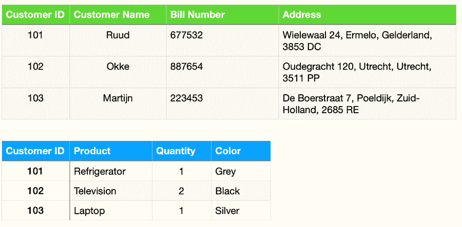

# MSQL 和 MySQL 的异同

> 原文：<https://medium.com/codex/msql-and-mysql-differences-and-similarities-1f0566d9fa69?source=collection_archive---------17----------------------->

大多数企业选择关系数据库来存储大量数据，因为与平面文件数据库相比，关系数据库具有强大的可伸缩性和易于检索。事实上，当前绝大多数 IT 系统和应用程序都是基于关系型 DBMS(数据库管理系统)的。

关系数据库是存储和提供对彼此相关的数据点的访问的数据库类型。它们通常基于一种关系模型，同时这种模型直观而简单。

在关系数据库中，每一行都是一条记录，有一个唯一的 ID，称为键。表中的每一列保存属性，每一行保存这些属性的值，从而使连接表中的数据点变得更加容易。

在这篇文章中，我们将通过一个简单的关系数据库的例子，看看现代最流行的两个关系数据库 MSSQL 和 MySQL 之间的异同。

**目录**

1.  关系数据库的例子
2.  MSSQL 和 MySQL:相似之处
3.  MSSQL 和 MySQL:区别
4.  最后的想法

# 关系数据库的例子

下面是一个简单的例子，一家企业可能使用两个表来处理订单。

假设第一个表是一个客户存储库表，其中每条记录都包含客户的姓名、账单信息和地址。数据库为每一行分配一个唯一的键。第二个表是客户订单表。该表构成了客户 ID，即下订单的客户、产品名称、数量和其他杂项信息(尺寸或颜色)，但不是客户信息。

在这种情况下，常见的桥接组件是客户 ID。这用于从第二个表中提取信息。当公司的订单处理应用程序请求数据库时，数据库可以转到 customer 表，获取有关产品信息的详细信息，并可以使用 Customer ID 获取客户的详细信息，如姓名和地址。然后，仓库正确提取正确的产品，并将其与客户匹配，确保正确交付。

RDBMS 和 SQL(结构化查询语言)经常互换使用。但是有一点小小的不同。SQL 基本上是一种在 RDBMS 中检索、操作和存储记录的编程语言。RDBMS 构成了 SQL 的基础，并使用 SQL 来检索和处理数据库中的记录。

RDBMS 数据库的支柱是 MSSQL 和 MySQL，它们在结构上是关系型的，为用户提供了方便的访问。

# MSSQL 和 MySQL:相似之处

微软 SQL Server(MSSQL)和 MySQL 都被广泛用作企业数据库系统。MySQL 是一个开放的 RDBMS 系统，而 MSSQL 是微软开发的 RDBMS。因为 MSSQL 和 MySQL 是关系数据库，所以它们有一些相似的特性。

## 桌子

MSSQL 和 MySQL 都使用标准的关系表数据库来存储行和列中的数据。

## 高性能

数据库是应用程序检索和操作数据的大本营。MSSQL 和 MySQL 都提供了不受约束的高性能操作。

## 键

这两个数据库都使用主键和外键来建立多个表之间的关系。

## 可量测性

这两个数据库都可以随着应用程序的增长而扩展。它们适用于大型企业项目，每天能够处理数百万笔交易。

## 句法

MSSQL 和 MySQL 除了在 CRUD(创建、读取、更新和删除)操作上有一些小的不同之外，都有相同的语法。

## 司机

幸运的是，您可以使用在 web 上很容易找到的连接驱动程序将 MSSQL 和 MySQL 连接到其他编程语言。

## 基于网络的流行

MSSQL 和 MySQL 都是 web 上同样流行的数据库。每当你注册托管时，通常会给你两个选择——MSSQL 和 MySQL。

了解了相似之处之后，让我们来探索 MSSQL 和 MySQL 之间的不同之处。

# MSSQL 和 MySQL:区别

MSSQL 和 MySQL 在接口和关系数据库标准方面有所不同，它们的操作非常不同。这些差异大部分是由经常在后台发生的底层架构造成的。这意味着普通用户不会意识到这些差异。但是这些差异对于 DBA(数据库管理员)来说是不可或缺的，因为他们在决策过程中扮演着重要的角色。

## 本机兼容性

SQL Server 最初是专门为 Microsoft Windows 用户开发的。微软最近在 Mac OS 和 Linux 上推出了 MSSQL。这使得企业在三种不同的平台上运行 SQL server 时占据了上风。然而，用户在 Mac OS 和 Linux 中运行 SQL servers 时仍然缺乏某些功能。

另一方面，MySQL 可以在不同的操作系统中流畅运行，无论是 Mac OS、Linux 还是 Windows。

## 语言支持

MSSQL 和 MySQL 都支持多种编程语言。这包括 Java、C++、Ruby、Python、Go 和 r。MySQL 支持其他编程语言，如 TCL、Perl 和 Haskell。它在语言支持方面非常通用，因此受到许多开发人员社区的追捧。

另一方面，与 MySQL 相比，MSSQL 的语言覆盖面较小。

## 成本效率

MySQL 是免费和开源的，尽管如果需要的话，你需要为支持付费。MSSQL 的运行成本更高，因为您还必须为运行该软件的服务器获取许可证。

如果您使用 MySQL，可以通过提取 SQL 语句来备份数据。MySQL 提供了一个在备份数据时阻止数据库的工具。当在不同的 MySQL 版本之间切换时，这个特性可以最小化数据损坏的可能性。缺点是在 MySQL 中，恢复是一个耗时的过程。

另一方面，MSSQL 在备份数据时不会阻塞数据库。这使得用户可以轻松地备份和恢复数据..

## 终止查询的选项

一旦查询开始运行，MySQL 就不能终止或取消查询。要停止 SQL 查询的执行，您必须终止整个进程。MSSQL 的优点是可以截断特定的 SQL 查询，而不会取消整个过程。此外，MSSQL 使用事务引擎来维护稳定的状态。这使得 MSSQL 在执行查询方面明显优于 MySQL。

# 最后的想法

您选择的数据库通常取决于您选择的托管环境。Linux 主机提供商通常提供 MySQL。由于 MySQL 是免费和开源的，您可以为自己的数据库创建任意多的数据库。但是查询执行的优势在于 MSSQL。所以根据你使用的编程语言和你的主机环境来选择你的数据库是很重要的。

*原载于*[*https://www . partech . nl*](https://www.partech.nl/nl/publicaties/2021/07/msql-and-mysql---differences-and-similarities)*。*