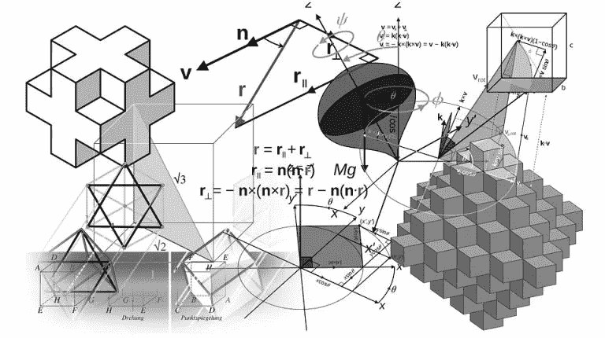

# Java 中的多元函数

> 原文：<https://medium.com/codex/multi-arity-functions-in-java-7bd71350e6cd?source=collection_archive---------11----------------------->



让我提醒你:arity 是一个函数的参数个数。因此，多元函数是具有几个参数的函数。在 Java 8 中，函数引入了一个和两个输入参数。但是如果有更多的参数呢？

# 当你需要大量的输入参数时

Java 中有一个函数<x r="">和双函数<x y="" r="">，其中 X 和 Y 是输入参数的类型，R 是输出参数的类型。但是三个及三个以上输入参数的函数必须自己决定。但是怎么做呢？</x></x>

例如，要进一步定义带有三个输入参数的函数，必须首先确定接口:

```
@FunctionalInterfacepublic interface Function3Arity<A, B, C, R> {R apply(A a, B b, C c);}
```

之后，您可以确定三元函数的具体变化。例如，像这样:

```
private static Function3Arity<Integer, String, Integer, String>f3 = (a, op, b) ->{return “” + a + op + b + “=” + (a+b);};
```

让我们来看看它是如何工作的:

```
 @Testpublic void testFunction3Arity() {String result = f3.apply(2, “+”, 3);assertEquals(“2+3=5”, result);}
```

# 当你需要大量的输出参数时

我们考虑了一个有许多输入参数的例子。如果我们有很多输出参数呢？

众所周知，Java 只允许使用返回一个原始元素或对象。我希望能够在函数的签名级别区分输入和输出参数。那些。具有类型签名:

***(c，d) = f(a，b)***

不幸的是，你不能直接这样做。输出参数必须以某种方式构造。为此，您可以创建一个临时对象或将参数写入列表(List >)。第一种方式是重量级的，第二种方式是不愉快的，如果这些类型不同，会失去对输出参数类型的静态控制。

在我看来，使用<tuplen x2="" ..xn="">更优雅。</tuplen>

例如，Tuple2 类如下所示:

```
public class Tuple2<A, B> {public final A a1;public final B a2;public Tuple2(A t, B u) {a1 = Objects.requireNonNull(t);a2 = Objects.requireNonNull(u);}@Overridepublic boolean equals(Object o) {…}@Overridepublic int hashCode() {…}}
```

使用这个类，具有三个输入和两个输出参数的函数可以这样定义:

```
private static Function3Arity<Integer, String, Integer, Tuple2<Integer, String>> f3And2 =(a, op, b) ->{int intValue = a + b;String sValue = “” + a + op + b + “=” + (a+b);return new Tuple2<>(intValue, sValue);};
```

让我们来看看它是如何工作的:

```
@Testpublic void testFunction3And2Arity() {Tuple2<?,?> result = f2And2.apply(2, "+", 3);assertEquals(5, result.a1);assertEquals(“2+3=5”, result.a2);}
```

# 最终规则

1.如果您的函数有 3 个或更多的输入参数，您需要定义一个新的 N 元接口，并使用它来进一步定义特定的函数。

2.如果您的函数有两个或更多输出参数，请定义 TupleN 类，并在使用 return 从函数返回之前将参数打包到其中。

你可以在我的 GitHub 项目中找到代码示例[这里](https://github.com/vsirotin/Smartenesse-Java)

插图:[杰勒特](https://pixabay.com/de/geometrie-mathematik-w%C3%BCrfel-1023844/)

*最初发表于:*[*https://smartenesse.sirotin.eu/multi-arity-functions-java*](https://smartenesse.sirotin.eu/multi-arity-functions-java)