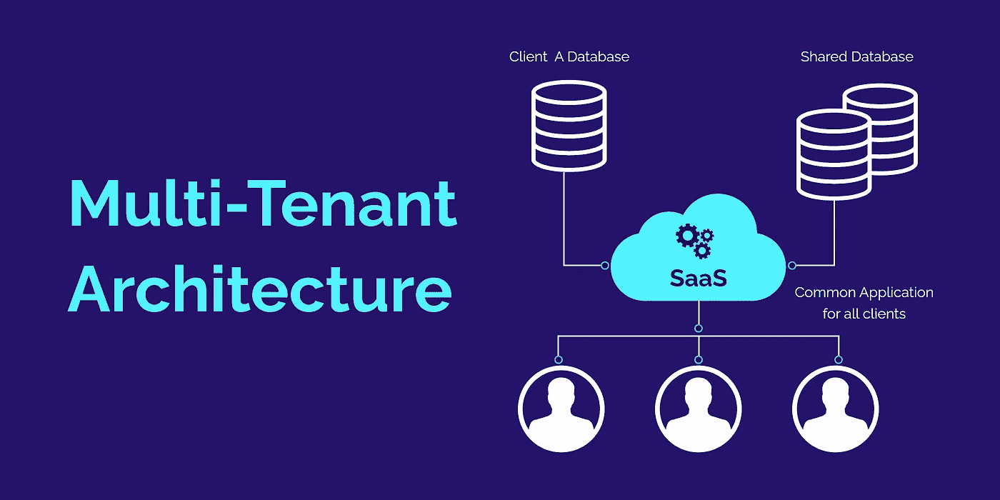
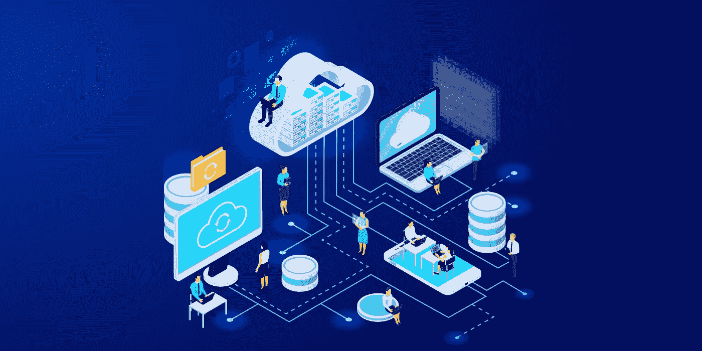
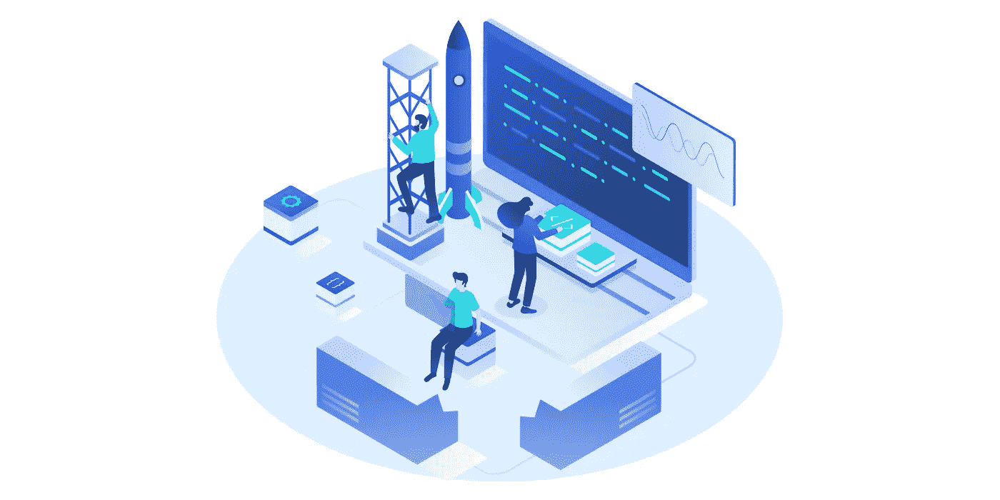
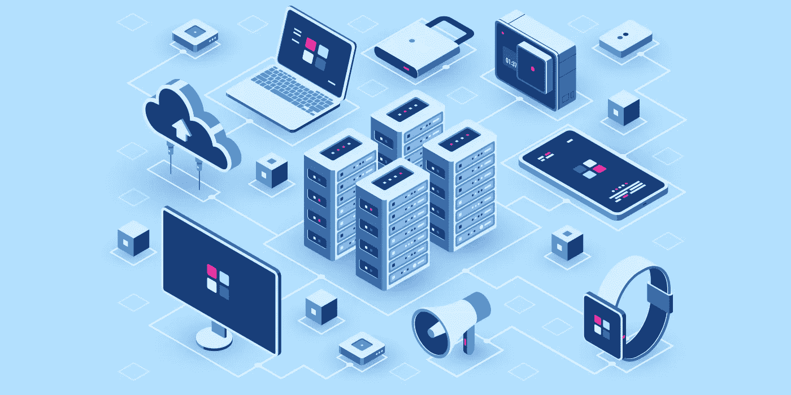
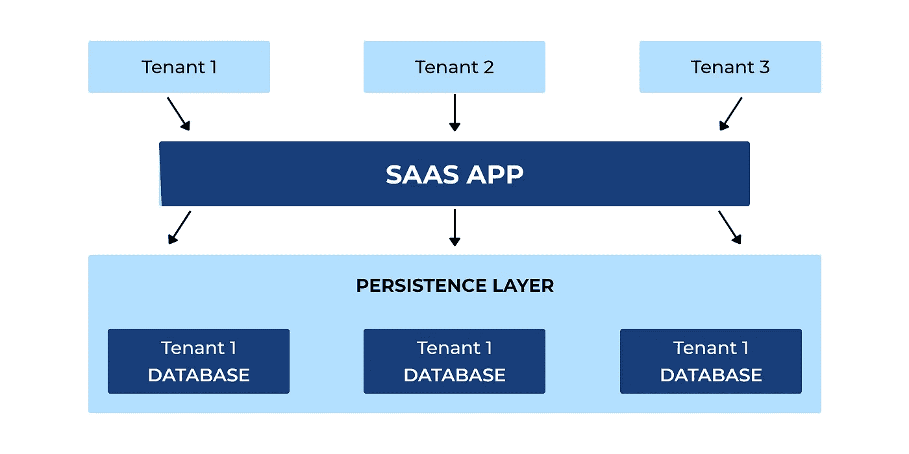
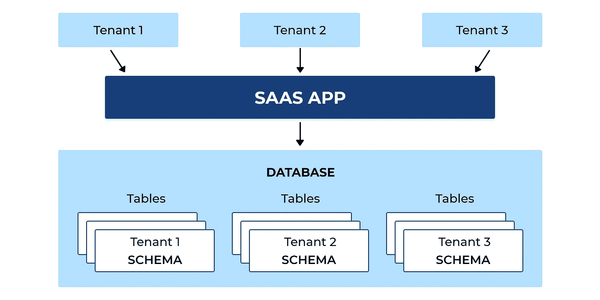
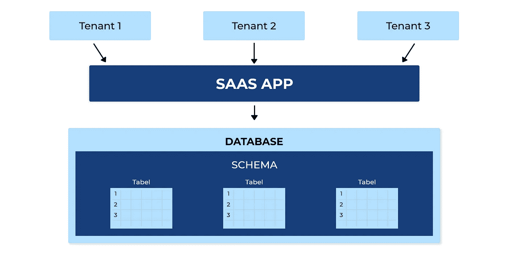

# 多租户

> 原文：<https://medium.com/codex/multi-tenancy-1c31c181cc41?source=collection_archive---------3----------------------->

## **什么是多租户架构**

在这个竞争异常激烈的世界里，公司都在试图最大化整个组织的效率。无论是提升员工技能、更新传统基础设施，还是调整最佳生产/开发流程，企业都在不断寻求自我完善。好吧，至少那些打算长期留在游戏中的人肯定是这样的！因此，不同规模和不同垂直行业的公司采用云计算来满足其基础设施需求也就不足为奇了。内部部署基础架构和自有 IT 硬件的旧方式正在让位于通过云访问、配置和实施基础架构的更简单方式。规模经济，再加上更高的安全性和操作便利性，是企业接受云的主要原因。如果基础设施/硬件被视为光谱的一端，那么软件就是另一端。云也成功地重新定义了用户与软件的关系。

## **云计算和多租户**

很明显，随着移动性的到来，桌面应用已经让位于基于云的 SaaS。如果桌面、移动设备可以被认为是消费软件的媒介，那么硬盘和云基础设施就是软件交付的媒介。人们不再使用 USB 或 CD 在他们的系统上安装/更新软件。而是通过浏览器之类的瘦客户端登录，使用他们最重要和最喜欢的软件。SaaS 应用程序种类繁多。*电子邮件、生产力工具、企业应用、存储等*。云基础设施帮助企业管理规模经济。基础设施的成本只与所需的一样多。不需要昂贵的高端计算节点，其使用价格只是其价格的一小部分。在有 100 个用户的云上运行的 SaaS 应用程序可以很容易地过渡到 1000 个用户。有了云，更新和配置可以在最短的停机时间内完成。

# **软件架构**

软件架构的一个简单定义是 ***“作为部分或整体设计软件系统的艺术或科学或两者兼而有之。”*** 在 SaaS 交付模式中，一个客户被称为一个租户。SaaS 应用程序最常用的架构是单租户或多租户。让我们快速看一下什么是单租户架构

## **单租户架构**

为每个客户提供一个唯一的、有状态运行的应用程序实例

> 单一数据库。与其他应用程序和数据完全隔离
> 
> 专用基础设施
> 
> 可以部署在内部或云环境中
> 
> 备份是隔离的、安全的。
> 
> 无限定制。支持法律和合规要求

正如我们所见，单租户应用程序顾名思义。应用程序的单个有状态实例为本地安装的每个客户运行。因为它是内部部署的，所以有一个专用的数据库，并且数据是隔离的。这导致了更高的数据安全性。客户端或租户对配置、设置、更新和升级拥有完全控制权。成为基础设施的 ***【受控】*** 的好处是更容易迁移、定制和灵活。但不全是阳光和彩虹！

对于单租户系统，尤其是在云上，规模经济已经不复存在。想象一下，为几千条记录运行整个 EC2 实例。资源不会被充分利用，因此成本将是巨大的。类似地，成为 ***【受控】*** 特别是在内部，意味着客户必须自己管理整个系统。这导致需要更多时间来更新、升级或管理。

## **多租户架构**

多租户架构以不同的方式推进了单租户架构。因为我们讨论的是一个 SaaS 应用程序，所以假设该应用程序将有多个客户或租户。换句话说，有几组属于不同组织的用户可以访问相同的软件。对于多租户应用程序，部署在一个地方完成。同样，运营和基础架构团队只需要在一个地方支持部署。在这方面，

> 即部署、维护和升级，多租户架构简化了开发过程。

## **架构问题**

显然，根据定义，在多租户架构中，数据不再是孤立的。由于多个租户或用户使用应用程序的同一个实例，数据库访问也是共享的。数据隔离对任何客户都很重要。原因可能是安全性、合规性、升级等。

> 多租户架构如何支持数据隔离？

要为多租户应用程序实现数据库，我们必须考虑数据的隔离程度。

> 筒仓中需要多少信息？
> 
> 共享存储中有多少？

# **数据库架构**

基于这一需求，我们可以为多租户应用程序提供三种不同的数据库架构。

## **每个用户一个数据库(数据库级租用)**

数据库级租用与单租户架构非常相似。数据隔离在这里是最大的。只有租户的数据驻留在该数据库实例中。数据库位于单独的服务器上。他们实际上是分开的。这种架构的优点和缺点与我们上面讨论的类似。由于数据完全隔离，管理员可以快速轻松地更新记录、备份数据和加密数据。不会影响其他租客。但是每个用户拥有一个唯一的数据库实例是很昂贵的。

## **所有用户一个数据库，每个用户有唯一的模式(模式级租用)**

在这种架构下，每个租户或用户都可以访问同一个数据库。每个用户没有单独的数据库，也没有专用的服务器。这样，降低了与单个数据库相关的成本。在这种体系结构下，数据隔离优于每个用户一个数据库的体系结构，因为在同一个数据库中每个租户都有单独的模式。通过拥有不同的模式，租户可以根据他们的业务需求定制他们的模式。这种方法的缺点或挑战是只备份特定的模式集是有挑战性的。想象一下，如果一个租户的数据被破坏，整个数据库不需要也不应该被重写。应该只更新特定租户的数据或模式。

## **所有用户使用一个数据库和一个模式(记录级租用)**

这是第三种方法，可能也是最容易实现的方法。在这种方法下，所有租户的数据都在同一个数据库中，并且具有相同的模式。为每个租户分配了唯一的 id，这将租户的记录彼此分开。这些唯一的 id 有助于查询、索引和搜索。在这种架构下，不需要单独的服务器和基础设施。一切都驻留在一个物理数据库中。但是在很大程度上，数据隔离丢失了。同样，随着租户数量的增长，搜索和查询变得越来越困难。

# **结论**

正如我们所看到的，多租户架构有多种实现方式。对于什么是最好的多租户架构，没有固定的模型。根据业务需求，多租户架构的选择可能会有所不同。总而言之，多租户是现代云架构的核心。随着云计算的广泛采用，多租户将会继续存在。无论是在 ***AWS、Azure 还是 Google Cloud 上的应用，多租户*** 都有助于应用快速扩展。