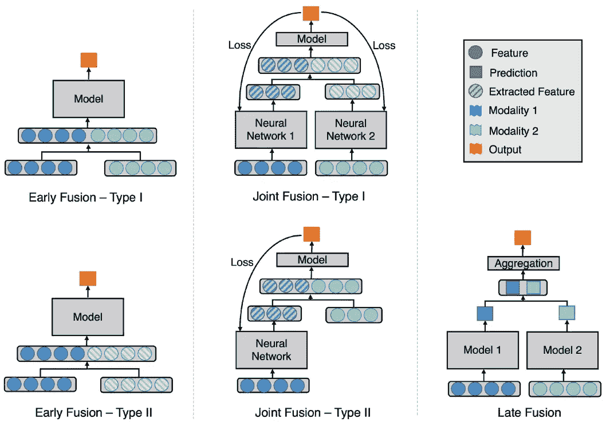
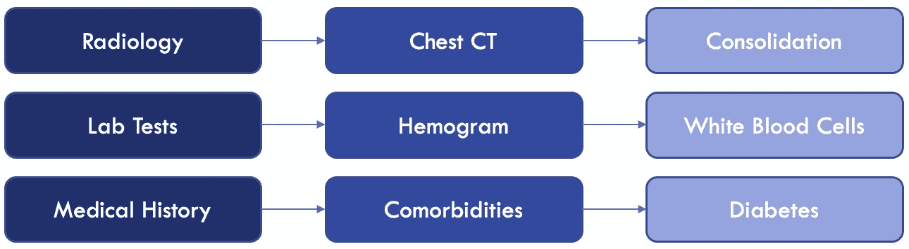

# 医疗保健中的多模态人工智能:缩小差距

> 原文：<https://medium.com/codex/multimodal-ai-in-healthcare-1f5152e83be2?source=collection_archive---------2----------------------->

医疗保健专业人员在日常工作中会利用多种数据源。为了做出诊断并决定患者管理，他们依赖于几种类型和来源的数据的组合:成像(例如，放射学、病理学、眼科)、时间序列(例如，心电图 ECG)、结构化临床数据(例如，生命体征、实验室结果)和非结构化数据(例如，临床记录)。

考虑到深入理解一种数据类型所需的专业知识水平，单个医疗保健专业人员几乎不可能掌握所有领域。放射科医生接受过阅读放射图像的专业培训，但对内科或外科了解不多。心脏病专家对心电图有深刻的理解，但通常不知道如何评估病理切片。这就是为什么医疗保健变得越来越多学科化，不同的专业人员(例如，多专业的医生、理疗师、药剂师、护士)从不同的角度为改善患者护理做出贡献。

但是人工智能(AI)能帮助我们完成这项任务吗？在本文中，我们将讨论这些模型在医疗保健领域的潜在影响，合并来自多个来源和形式的信息的方法，以及与此类策略的开发和实施相关的一些挑战。

图表显示了人工智能在整合医疗保健领域多个来源的数据方面的潜力

## 潜在影响

在过去的几年里，已经使用医疗保健数据开发了几种机器学习模型，在骨龄评估和乳腺癌检测等任务中取得了令人印象深刻的结果。然而，这些模型中的大多数集中在单一模态/数据类型中(例如，放射图像中的分割和检测任务)。

通过使用不同的模态和数据类型来开发人工智能解决方案，该模型可以找到不同变量/特征之间的关系，这些变量/特征对于医疗保健专业人员来说不是清晰可见或已知的。与此同时，通过对患者的全面了解，该模型可以用于解决更多“抽象”的结果(与分割图等更直接的结果相比)。例如，可以开发模型来预测外科手术后的住院时间，并预测急诊期间的住院风险。但是，在构建模型时，我们如何融合这些多样化的数据呢？

## 创建多模态人工智能解决方案

有几种策略可以使用人工智能来组合来自不同模态的数据。黄等人详细描述了一些最常见的策略。一种可能的解决方案是通过连接两个不同的数据集并训练单个模型来创建一个更大的特征向量(早期融合-I 型，如下图所示)。另一个想法是创建一个模型，该模型从一种类型的数据中提取特征(例如，卷积神经网络来提取成像特征)，然后将提取的特征与另一种数据类型相结合，然后类似于前一个示例(联合融合-下面的类型 1)来训练模型。第三种可能的解决方案是开发单独的模型来处理来自每个模态的数据，然后组合这些输出(例如，平均、投票系统)以达到最终结果(后期融合，如图所示)。有许多策略，选择在很大程度上取决于被处理的数据类型和特定的用例。

[采用深度学习的融合策略](https://www.nature.com/articles/s41746-020-00341-z/figures/2)，作者[黄](https://www.nature.com/articles/s41746-020-00341-z)，转载于 [CC BY 4.0](https://creativecommons.org/licenses/by/4.0/)

## 挑战

通常，模型开发会在离线环境下使用追溯数据进行，数据科学家可以完全控制数据。在这种情况下，更容易执行数据处理、预处理，并创建一个完全符合模型设计方式的群组。下一步将是在真正的临床实践中实现该算法，这是大多数挑战可能出现的步骤。

让我们考虑一个简单的场景，其中我们正在开发一个机器学习模型，该模型将使用患者数据来进行预测:以胸部计算机断层扫描(CT)形式评估肺部病变(如实变)的成像数据，基本血液测试的结果(如血象中的白细胞计数)以及关于既往病史(如糖尿病)的信息。在真实的临床环境中实施这种框架的主要障碍是什么？

*   ***数据来源:*** 放射影像通常存储在医院影像存档与通信系统(PACS)中，而实验室检查和临床记录存储在电子健康记录(EHR)系统中。您的应用程序将如何连接和检索这两个来源的数据？如何匹配患者标识符以确保数据确实来自同一个患者？
*   ***数据验证:*** 即使正确识别了不同的数据源，检索到了数据，接下来的步骤还是要确保数据有效，可以使用。胸部 CT 通常包括不同的系列(例如，不同的重建内核、不同的重建计划)。如何确保选择正确的系列？实验室值通常是浮点数或整数，但是这个特定医院使用的测量单位与模型开发期间使用的测量单位相同吗？病史通常从临床记录中检索。你如何找到共病的信息？会使用自然语言处理(NLP)工具吗？正则表达式搜索？所有这些问题都是相关的，以确保模型在做出预测之前具有有效且有意义的输入。
*   ***时间性:*** 每条信息很有可能在不同的时间点被捕获和记录。与胸部 CT 前或后一个月采集的血象相比，胸部 CT 后一小时采集的血象具有完全不同的临床意义。如何定义一个合理的可接受时差阈值，以最大限度地利用可用数据点进行预测，同时保持变量之间的临床关系？
*   ***缺失值:*** 并非所有患者都会接受相同的血液检查或相同的放射扫描。一个患者可能没有胸部 CT，但是其他患者可能没有关于他们先前病史信息。你的算法将如何处理这些情况？这些特征中的一个会作为运行算法的触发器吗？在没有这个功能的情况下，算法会不会不运行？缺失数据会被估算吗？在损害模型性能之前，您会为模型可以接受的缺失数据百分比建立一个阈值吗？所有的特性都同样重要吗？(很可能不是…)
*   ***可解释性:*** 对胸部 CT 中的实变病灶进行分割的机器学习模型的输出可以被放射科医师容易地理解和解释。很容易评估结果，如果表现令人印象深刻，就可以建立对模型的信任。然而，当模型使用多种数据类型进行更抽象的预测时，解释这一结果背后的基本原理并在医生之间建立信任就更加困难了。

## 结论

由于收集和存储的数据越来越多，计算能力越来越强且越来越便宜，医疗系统的集成度越来越高，因此在多模式医疗数据中使用人工智能变得可行。在临床环境中，这种解决方案的实际部署和使用存在一些挑战。然而，这种模式在病人护理中的潜在影响不能被削弱。一旦这些困难被克服，我们将朝着个性化医疗迈出重要的一步。

*【1】Huang，S. C .，Pareek，a .，Seyyedi，s .，Banerjee，I. & Lungren，M. P .使用深度学习融合医学成像和电子健康记录:系统综述和实施指南。npj 数字。医学。3, (2020).*

[2] *达罗拉·阿尔、安德伯格·P、克维斯特·O、门德斯·E、迪亚兹·鲁伊斯·S、桑马丁·贝里隆德·j .用各种机器学习技术进行骨龄评估:一项系统的文献综述和荟萃分析。公共科学图书馆一号。2019 年 7 月 25 日；14(7):e0220242。doi:10.1371/journal . pone . 0220242 . PMID:31344143；PMCID: PMC6657881。*

[3] *革剌斯·KJ，曼恩·RM，莫伊·l .用于乳房 x 线照相术和数字化乳房断层摄影的人工智能:当前概念和未来前景。放射科。2019 年 11 月；293(2):246–259.doi:10.1148/radiol . 2019182627 . Epub 2019 9 月 24 日。PMID:31549948；PMCID: PMC6822772。*