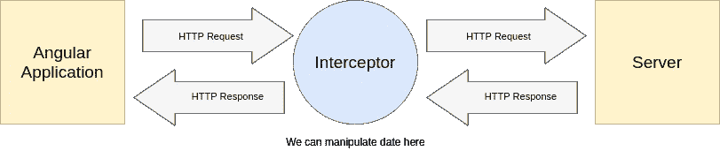

# 如何在 Angular 中实现拦截器

> 原文：<https://medium.com/codex/multiple-interceptors-in-angular-e0880b2f7d91?source=collection_archive---------0----------------------->

Angular 提供的奇妙特性之一是**拦截器，**但是拦截器能做什么，我们能在 Angular 项目中实现多个拦截器吗？


[都铎·巴休](https://unsplash.com/@baciutudor?utm_source=medium&utm_medium=referral)在 [Unsplash](https://unsplash.com?utm_source=medium&utm_medium=referral) 上的照片

**什么是截击机？**

我们可以使用拦截器来拦截传入和传出的 HTTP 请求，并使用 Angular `HttpClient`来操纵它们。



拦截器位于 Angular 应用程序和服务器的中间(使用 [draw.io](http://draw.io) 创建的图像)

向我们的 Angular 应用程序添加拦截器的一个最常见的用例是将**令牌**添加到传出 HTTP 请求的头部。

## 让我们在 Angular 应用程序中实现一个拦截器！

我们需要在我们的`app.module`中从`@angular/common/http`导入`HTTP_INTERCEPTORS`,以确保它能满足我们所有的请求。那么我们应该在我们的`providers`中提供。我们还应该导入我们的拦截器和模块，并为其设置`useClass`的值。

```
import { HTTP_INTERCEPTORS } from '@angular/common/http';
import { Interceptor } from './interceptor';

@NgModule({
  providers: [
    { provide: HTTP_INTERCEPTORS, useClass: Interceptor, multi:true},
  ]
})
```

在提供了`HTTP_INTERCEPTORS`之后，我们需要通知这个类我们将通过使用`useClass.`来实现我们的拦截器

> 将 **multi** *设置为 true，确保您的项目中可以有多个拦截器。*

现在我们在`/src/app`中创建`interceptor.ts`，由于拦截器是服务，我们需要在文件中使用`@Injectable()`装饰器:

> 请记住，拦截器是**服务。**

在每个 HTTP 请求之后，拦截器调用`intercept()`方法。在`Intercept()`方法中，我们克隆将要发送的 HttpRequest，并将令牌添加到它的 HttpHeaders 中，一旦完成，我们调用`next.handle`将被操作的请求返回给应用程序。

## 添加第二个拦截器

如果有一个用于整个项目的加载组件包装器就好了，一旦来自服务器的请求得到解决，我们就可以从项目的布局中删除加载。

首先，我们需要创建如下所示的`loadingInterceptor.ts`文件:

我们稍后将讨论`LoadingService`，但是现在，让我们先检查一下`loadingInterceptor`。我们正在创建一个`Subscription`，然后在每个 HTTP 请求被处理并且*完成之后，*我们正在取消订阅`spinnerSubscription`，我们将在 out `loadingService`中使用它来指示 spinner 加载。

现在我们来看看`loadingService.ts`

我们可以在带有上述服务的 Angular 应用程序中添加和删除带有 spinner 组件的覆盖图(第 22 行),直到订阅没有被取消。`loadingComponent`可以是你想要的任何东西，GIF，旋转器，或者进度条。我把它设置成这样的一个`mat-progress-bar`:

```
<mat-progress-bar color="warn" mode="indeterminate"></mat-progress-bar>
```

不要忘记在您的`app.module.ts`文件中导入第二个拦截器:

```
providers: [
  { provide: HTTP_INTERCEPTORS, useClass: Interceptor, multi: true },
  { provide: HTTP_INTERCEPTORS, useClass: LoadingInterceptor, multi:true }
]
```

> **重要提示:**提供拦截器的顺序很重要。例如，如果您按顺序提供三个拦截器 A、B、C，正如 Angular 文档所说:“……请求流入 A- > B- > C，响应流出 C- > B- > A。”

> **该项目的源代码可以在**[**GitHub**](https://github.com/hossein13m/angular-multiple-interceptors)**获得。**

# 分享给你的朋友！拍手声👏最多 50 次。

如果你在实现角度拦截器时有任何问题，请在下面评论。你也可以在 [Twitter](https://twitter.com/Hossein13M) 或 [GitHub](https://github.com/hossein13m) 上联系我，或者访问我的作品集。

[](https://hmousavi.dev/) [## 侯赛因穆萨维-软件开发人员

### 你好。👋🏻发现侯赛因穆萨维的空间，找出我的作品。请随时与我联系，还有更多！

hmousavi.dev](https://hmousavi.dev/) 

> ***阅读更多来自我:***

[](/angular-in-depth/angular-forms-reactive-form-including-angular-material-and-custom-validator-9ef324cc3b08) [## 角形(反应式)包括角形材料和自定义验证器

### 表单是每个角度项目的主要部分，在这篇文章中，我们想实现一个反应式的角度表单，带有一个…

medium.com](/angular-in-depth/angular-forms-reactive-form-including-angular-material-and-custom-validator-9ef324cc3b08) [](/angular-in-depth/husky-6-lint-prettier-eslint-and-commitlint-for-javascript-project-d7174d44735a) [## git Hook Husky 6 Lint(beauty+eslint)和用于 JavaScript 项目的 commitlint

### 编程是一项团队工作，所以我们必须确保我们的代码库是干净的，对团队中的每个人都是可用的…

medium.com](/angular-in-depth/husky-6-lint-prettier-eslint-and-commitlint-for-javascript-project-d7174d44735a) [](https://itnext.io/a-complete-guide-to-the-api-first-approach-ecd796dd0f10) [## API-优先方法完全指南

### 在您的软件开发生涯中，开发应用程序可能采用的许多方法之一是…

itnext.io](https://itnext.io/a-complete-guide-to-the-api-first-approach-ecd796dd0f10) [](https://javascript.plainenglish.io/how-to-implement-dark-light-themes-in-a-next-js-app-using-context-hook-tailwindcss-336558dd4579) [## 如何使用上下文挂钩在 Next.js 应用程序中实现暗/亮主题

### 初始化一个 Next.js 应用程序，然后使用上下文钩子和 TailwindCSS 实现暗/亮主题切换

javascript.plainenglish.io](https://javascript.plainenglish.io/how-to-implement-dark-light-themes-in-a-next-js-app-using-context-hook-tailwindcss-336558dd4579) [](https://javascript.plainenglish.io/take-a-good-look-at-filter-map-and-reduce-in-javascript-18d72f483ada) [## 详细了解 JavaScript 中的 filter()、map()和 reduce()

### 深入了解 JavaScript 中的 filter()、map()和 reduce()方法。

javascript.plainenglish.io](https://javascript.plainenglish.io/take-a-good-look-at-filter-map-and-reduce-in-javascript-18d72f483ada)