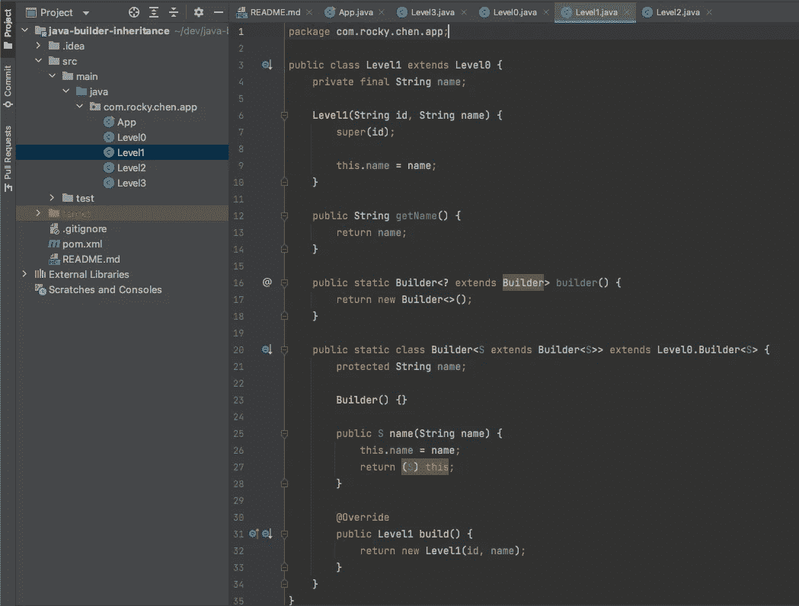

# Java 中 Builder 模式的多级继承

> 原文：<https://medium.com/codex/multiple-level-inheritance-for-builder-pattern-in-java-7809c1d3fa7b?source=collection_archive---------0----------------------->

**Builder** 是一种创造性的设计模式，它使用逐步的方法从一个简单的对象构建一个复杂的对象。

在 Java 中，builder 模式非常流行，你可能每天都会看到并使用它。然而，在 Java 中继承一个具体的类和它的 builder 类有点棘手，尤其是在多级继承时。