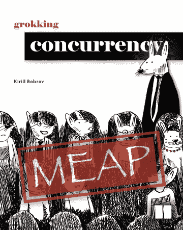

# 多级并行硬件

> 原文：<https://medium.com/codex/multiple-levels-of-parallel-hardware-manning-34dde1e0d3b1?source=collection_archive---------35----------------------->

> 摘自基里尔·博布罗夫著 [*探索并发*](https://www.manning.com/books/grokking-concurrency?utm_source=luminousmen&utm_medium=affiliate&utm_campaign=book_bobrov_grokking_5_18_22&a_aid=luminousmen&a_bid=4e810762)

在本节选中，您将:

*   了解执行你的程序的硬件的细节
*   学习计算机系统的结构和常见问题

> 了解如何选择适合您问题的硬件
> 
> 享受七五折优惠 [*搜索并发*](https://www.manning.com/books/grokking-concurrency?utm_source=luminousmen&utm_medium=affiliate&utm_campaign=book_bobrov_grokking_5_18_22&a_aid=luminousmen&a_bid=4e810762) 由…