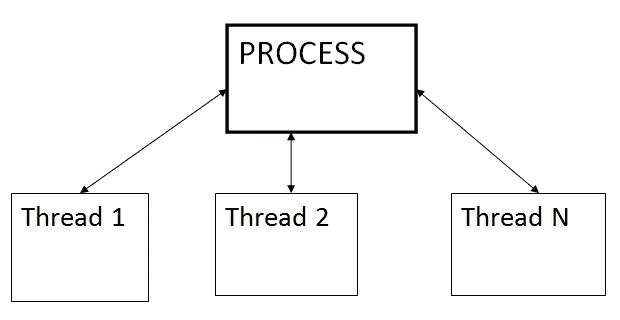
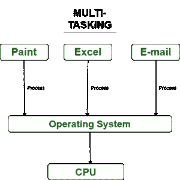
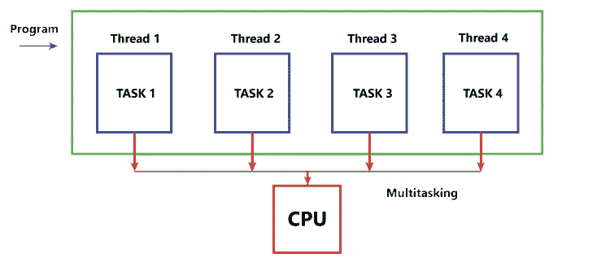
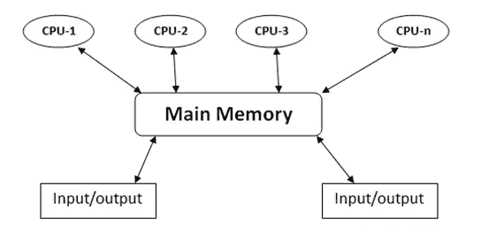

# 多任务 vs 多线程 vs 多重处理

> 原文：<https://medium.com/codex/multitasking-vs-multithreading-vs-multiprocessing-2b0087c861ae?source=collection_archive---------5----------------------->

现在的计算机非常智能，可以同时执行多项操作。计算机同时运行多个任务的这种能力叫做**多任务**。

单核计算机永远不能同时运行多个程序。它的作用是给每个正在执行的程序一点时间，制造一种多任务处理的假象。例如，如果我们在一个内核上运行两个不同的程序或同一程序的多个实例，它将运行 1 个实例/程序几秒/毫秒，然后切换到正在执行的另一个程序，并给它一些时间的资源，等等。这被称为多任务处理，计算机利用其上下文切换能力在多个程序之间来回切换。这肯定会增加程序的执行时间，因为多个程序共享相同的 CPU 资源和时间。

geeksforgeeks.com

***一个正在执行的程序有多线程怎么办？***

一个**线程**是一个大程序中最小的指令。如果单个程序/进程需要同时执行多个任务，它会将这些任务分成线程。例如，应用程序必须下载数据并更新进度条，它可以在一个线程中下载数据，在另一个线程中更新 UI。螺纹的一些重要属性是:

*   主程序的子任务
*   彼此共享 CPU 资源
*   可以暂停、停止和恢复

这种执行单个进程/程序的多个线程/任务的方式叫做**多线程。**

> 多线程是一种多任务处理，其中正在执行的多个任务是同一程序的一部分。

现在，让我们假设我们有一台双核计算机，我们试图运行一个单线程程序，CPU 将在一个内核中执行该程序，并提供其所有资源，而另一个内核将空闲。当我们试图在多核 CPU 上运行多个非线程程序时，计算机将再次利用其多任务处理能力，并从其内核中为每个程序提供资源。一个程序将完全在一个内核上运行，而另一个程序将在第二个内核上运行，依此类推。CPU 会给每个在所有内核上执行的程序一些时间。这叫做**多重处理。**

> 多个非线程程序共享 CPU 内核，但是它们总是在一个内核上完成它们的执行，在该内核上执行是第一次开始的。

当我们尝试在多核 CPU 上运行多线程程序时，CPU 将利用其内核并在所有可用的内核上运行线程。这是多核 CPU 上的多线程，也称为**多处理。**

总而言之，多线程和多处理利用了计算机的多任务处理能力，这反过来又利用了**上下文切换**。

*   在多任务处理中，多个程序和线程共享同一个 CPU 内核。
*   在多线程中，同一个程序的不同线程共享同一个 CPU 内核，并发执行。
*   在多处理中，多个程序甚至同一个程序的多个线程利用所有可用的 CPU 内核，这是最真实的**并行处理**形式，其中 CPU 在其不同的内核上并行执行多个程序或线程。