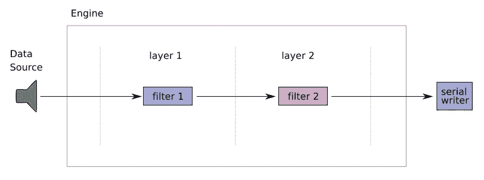
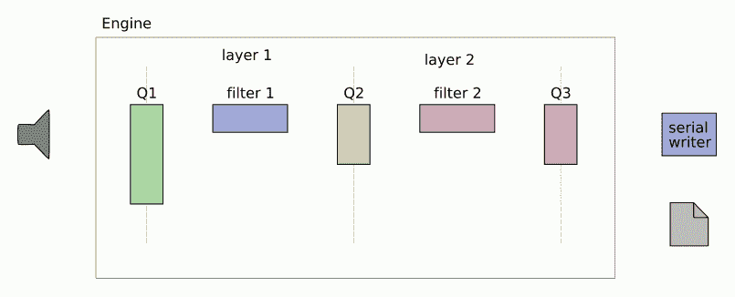
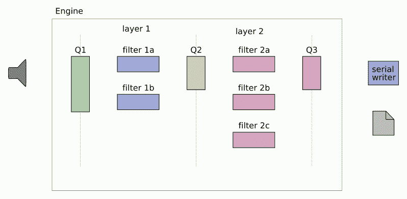
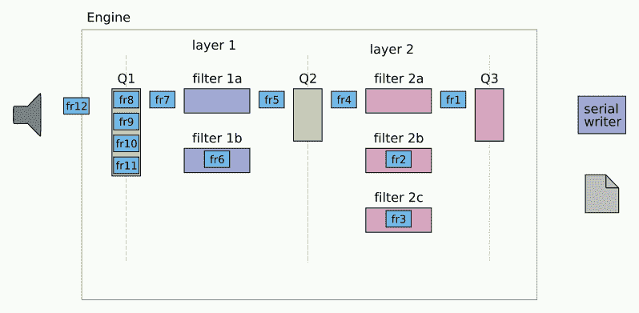

# Java 中具有有序输出的多线程处理流水线

> 原文：<https://medium.com/codex/multithread-processing-pipeline-with-ordered-output-in-java-843643af4aae?source=collection_archive---------1----------------------->

最近，我面临一个挑战:给定一个音频流作为输入，我怎样才能接近实时地处理它？如果这个过程包括几个阶段呢？我用 Java 开发了一个简单的解决方案，这里描述了我选择的理由..好好享受吧！


由[凯利·西克玛](https://unsplash.com/@kellysikkema?utm_source=medium&utm_medium=referral)在 [Unsplash](https://unsplash.com?utm_source=medium&utm_medium=referral) 上拍摄的照片

# 问题是

在软件工程的所有问题中，我们必须开始问:我们的用例是什么，我们想要完成什么？

# 要求

我们的系统是生产者/消费者模式的一个例子，其中音频源(生产者)将数据注入我们的系统(消费者)。

让我们做一些假设，这些假设在大多数情况下可能是有意义的。他们将帮助我们定义需求。

## 音频源

音源以固定的时间间隔产生**原始数据**(即字节数组)。让我们假设音频被分成固定大小的**帧**，并且每个帧包含一个**序列号**。如果不是这种情况，我们总是可以用一些逻辑来装饰音频源，以将数据分成帧。

另一个要求是我们的系统是线性的。每一帧的输出取决于它自己，而不是之前或之后的帧(我们将看到这如何影响我们的设计)。

来自数据源的最后要求是隐含的，并且是多媒体信号的特征:在处理之后，音频源的帧必须保持相同的顺序(**顺序保持**)。将最后两个需求放在一起，我们不关心如何处理每个帧，只要在输出中，处理后的帧保持它们在输入中的相同顺序。

在下面的代码片段中，您可以看到我定义的框架的 API(一些方法将在接下来的部分中更有意义)。

## 发动机

通常，在音频处理流程中有两个、三个或更多步骤(**滤波器**)，例如，增强音频、压缩音频等。为简单起见，假设我们只有两个步骤(同样的推理可以应用于更多步骤)。



两步音频处理引擎

发动机的最后一个要求是**会自动停止**。对于我们讨论的目标来说，这不是强制性的，但是这样做很好，并且会使实现更有趣。

## 概括一下

以下是我们的要求:

*   数据流应分割成**编号的帧。**
*   系统应为**线性。**
*   系统应自动关闭。
*   输出中过滤后的音频信号应包含按序列号排序的帧**。**

# 建筑

在这里，我将描述系统的三种可选架构，从最简单的(和性能较差的)到最复杂的(和最快的)。

## 串行处理

下图显示了可能是最简单的实现:


引擎的串行实现

发动机由两个过滤器组成；在应用第二个过滤器之前，我们将第一个过滤器应用于所有帧(想象两个循环，一个接一个)。这种解决方案最容易实现，但也需要更多时间来处理我们的音频源。

如果我们分别称 *t1* 和 *t2* 为第一和第二滤波器处理一帧的平均时间，那么由 *n* 帧组成的信号的总处理时间将为: *n*(t1 + t2)*

## 并行处理

由于我们的系统是线性的，我们可以通过在两个独立的线程中运行过滤器来提高它的性能。



引擎的并行实现

例如，当第二滤波器正在处理帧 *i* 时，第一滤波器正在处理帧 *i+1* 。同时，帧 *i+2* 被放入队列中，一旦空闲就由第一滤波器获取，等等。

通过这样做，我们减少了处理整个音频流所需的时间。使用与前面相同的符号，总处理时间将是: *n*max(t1，t2) + min(t1，T2)。*如果两个加工时间相似，并且 *n* 是一个很大的数字，那么这大概等于*串行加工时间*的一半。

## 并行处理—多线程

让我们来点刺激的吧！如今，我们的大部分硬件(笔记本电脑、智能手机等..)有**多 CPU 核心**；我们可以利用这一点，在多个线程中运行同一个过滤器。在前面的例子中，我们可以分别在两个和三个并行线程中运行这两个过滤器。



引擎的并行多线程实现

为了计算处理时间，让我们使用与前面相同的符号，加上 *f1* 和 *f2* 作为我们分别运行第一个和第二个过滤器的线程数。处理时间变成: *n*(t1/f1 + t2/f2)*

如果 *f1* 和 *f2* 都至少为 2，并且如果 *t1* 与 *t2* 相似，对于 *n* 的较大值，我们可以将加工时间至少再减少一半*，*这意味着串行加工时间的四分之一*(我将这个和前面的计算留给您作为作业)。*

## 选择的建筑

我们将使用最后一种架构，**并行多线程**，它是性能最好的。

发动机由几个**层**组成；每一层对应于音频处理的一个步骤，并且以一个**滤波器**和该滤波器将运行的**线程数量**为特征。在每层的输入和输出都有一个**队列**。

# 队列及其 API

到目前为止，我们已经讨论了其中的两个要求:音频源被分成编号为**的帧**和系统的**线性度**。这使我们能够分析少量架构，并决定使用具有并行和多线程过滤器的引擎。

缺少的是分析其他两个需求的结果:

*   输出中滤波后的音频信号应包含正确排序的帧**；**
*   系统应**自动关闭。**

这两个需求驱动我们选择我们使用的队列类型。

## 多线程队列

处理多线程时，最好的入手点是 java 中的[**Java . util . concurrent**](https://docs.oracle.com/en/java/javase/11/docs/api/java.base/java/util/concurrent/package-summary.html)包。在那里您可以找到[**PriorityBlockingQueue**](https://docs.oracle.com/en/java/javase/11/docs/api/java.base/java/util/concurrent/PriorityBlockingQueue.html)类，它之所以有趣，有两个原因:

*   它实现了 [**阻塞队列**](https://docs.oracle.com/javase/7/docs/api/java/util/concurrent/BlockingQueue.html) 接口。这意味着每一次插入或提取都用一个 [**锁**](https://docs.oracle.com/javase/7/docs/api/java/util/concurrent/locks/Lock.html) 来管理，以防止出现竞争情况。此外，还有一个 [**条件**](https://docs.oracle.com/javase/7/docs/api/java/util/concurrent/locks/Condition.html) 与锁相关联；当一个线程要提取一个元素时，如果队列为空，那么它会一直等待，直到队列中插入一个新元素；
*   您可以通过实现一个**比较器**来配置它，以便通过一些自定义逻辑对其元素进行排序。在我们的例子中，我们可以根据帧的序列号对它们进行排序；这样，当队列中插入多个帧时，它们将被自动排序。

虽然使用 **PriorityBlockingQueue** 可以解决**竞争条件**和**帧排序**，但它无法帮助我们实现自动关闭所需的层、队列和输出之间的**同步**。

我是这样解决这个问题的。

# 自动关机(我称之为“滚动最后一帧”技术)

自动关机的逻辑基于几条规则:

*   当源或任何其他滤波器**完成**其处理时，它将发出特定帧，姑且称之为**最后一帧**。该帧的**序列号**将被设置为无穷大(`**Long.MAX_VALUE**` )，因此它将被自动插入队列的最后一个。最后一帧将包含一个名为 **layerSize** 的计数器，最初设置为发射器层的大小。在我们的示例中，源的大小为 1，第一层的大小为 2，第二层的大小为 3。
*   当最后一帧**进入**队列时，该队列将检查是否已经存在最后一帧(最终由不同线程的前一个过滤器发出)。如果是，它将**减少**最后一帧的层大小。
*   当从队列中**请求**一帧时，如果第一帧是数据帧，则提取该帧；如果是最后一帧，那么它的引用**将被返回，但是最后一帧将保留在队列中，可供其他线程使用。**
*   当最后一帧被下一层中的过滤器**取为**时，如果最后一帧的**层大小**等于 1，则该过滤器将停止其处理，并因此将最后一帧发送到下一队列。如果最后一帧包含一个大于 1 的 **layerSize** ，它将被忽略。

下图显示了**在滚动最后一帧**时自动关闭。最后一帧将在系统中传播(滚动)。只要任何过滤器接收到 layerSize 等于 1 的最后一帧，它就会关闭(用灰色表示)。



使用滚动最后帧技术自动关闭引擎

这个逻辑必须在两个地方实现:队列和过滤器。

## 过滤器

这个片段显示了过滤器的逻辑。

从队列中提取出一个帧(我将条件作为谓词传递，因为我想将队列的实现与帧的内部逻辑分离)。如果该帧是一个**数据帧**(不是最后一帧)，它将被处理并插入**输出队列**。否则，过滤器检查该帧是否是前一层的最后一个(即 **layerSize** 是否等于 1)。如果是，过滤器将**向输出队列发送**最后一帧，并将其自身设置为**无效**；否则，过滤器将**忽略**帧。

## 长队

逻辑的另一部分在队列中实现。我扩展了 PriorityBlockingQueue 的逻辑，实现了我所谓的**ConditionalPriorityBlockingQueueImpl**(我知道，我本可以找到一个更好的名字)。

**提取**帧的方法相对简单:队列获取第一帧(让我们记住它们是按序列号排序的)。队列应用**谓词**，用于检查是否提取帧，作为参数传递给帧。根据谓词的结果，帧被**提取**并且**队列被更新**，或者只是**返回**作为参考。

**插入**最后一帧的方法稍微复杂一点。在这里，我再次将队列的逻辑从帧中分离出来。首先，队列检查队列中是否已经有最后一帧。如果是，调用上面的`**editFunction**`(减少**层大小**)。如果没有，它将**创建**一个新的帧(静态构造函数`**elementCreatorMethod**`不在此讨论范围内)并将**插入到队列中。**

## 多线程引擎

由于引擎自动关闭，它的 API 变得非常简单。此外，每个过滤器都包含其输入和输出队列作为属性，因此我可以将引擎设计为这些过滤器的简单包装器，并将其构造委托给工厂，这也不在范围之内。

# 测试

为了测试引擎，我使用了之前描述的配置:1 个源，第一层中的 2 个线程，第二层中的 3 个线程，1 个串行写入器。
为了这个测试，每一层**中的**过滤器**将**输入帧复制到输出，**在控制台中打印一个日志**并有一个**随机延迟**来模拟一个真实的情况场景，其中我们无法预测每一帧的准确处理时间。

**写入器**实现了与过滤器类似的逻辑，唯一的区别是它将有一个**内部计数器**来知道它必须等待哪个帧并从队列中提取，以保持输出中所需的顺序。它的`**getFrameList**`方法在返回处理过的帧之前会一直等到处理完成。

下面是我写的单元测试，用来验证数据源发出 10 帧时系统的行为。

这是输出日志。如您所见，帧在两层中的处理顺序并不总是相同，但它们会按顺序到达输出。

```
Frame 1 processed in layer 1Frame 2 processed in layer 1Frame 0 processed in layer 2Frame 3 processed in layer 1Frame 2 processed in layer 2Frame 4 processed in layer 1Frame 1 processed in layer 2Frame 5 processed in layer 1Frame 3 processed in layer 2Writing frame 0Writing frame 1Writing frame 2Frame 4 processed in layer 2Frame 6 processed in layer 1Writing frame 3Frame 7 processed in layer 1Writing frame 4Frame 5 processed in layer 2Frame 8 processed in layer 1Frame 6 processed in layer 2Writing frame 5Frame 9 processed in layer 1Frame 7 processed in layer 2Frame 8 processed in layer 2Writing frame 6Writing frame 7Frame 9 processed in layer 2Writing frame 8Writing frame 9
```

# 结论

我在这里描述了我对一个常见问题的解决方案:如何实现一个多线程并行数据处理引擎，记住被处理数据的最终顺序；所有这些都用一个简单的 Java 实现(不使用任何消息代理或事件驱动架构)。我在代码片段中展示了我认为最有趣的代码部分，并省略了其他部分，如工厂或框架的实现细节。

在我的解决方案中，我更关注**抽象**(例如，使用**泛型**或**谓词**和**函数**作为参数)，这使得代码更加可重用，但牺牲了可读性。

另一个**选择**将是一个更耦合但更简单的实现，可能会有一些代码重复，但可读性更好，同时推迟了泛化的需要。这也是一个有效的选择。

*一如既往，看情况*！这取决于情况，取决于我们的用例，取决于我们目前对*的了解，如果/如何/何时*我们的系统会在未来发展，当然，还取决于你的个人品味和审美感！