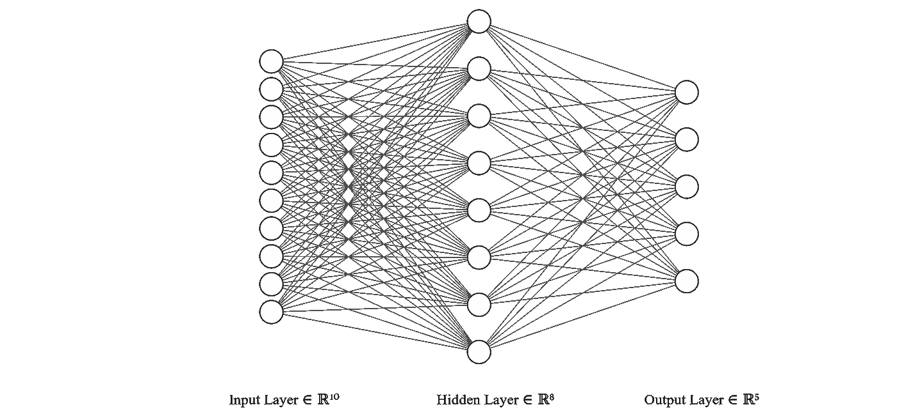
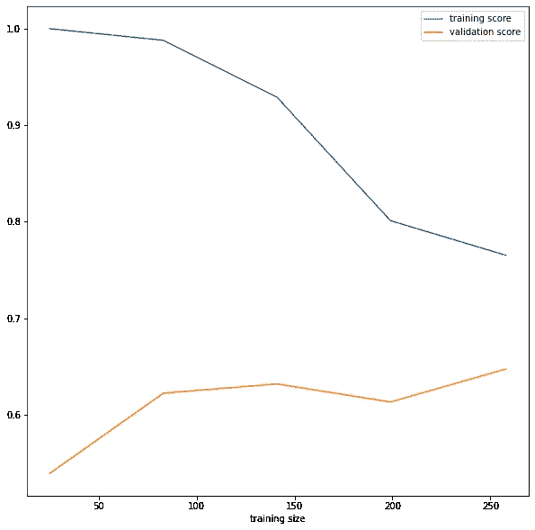
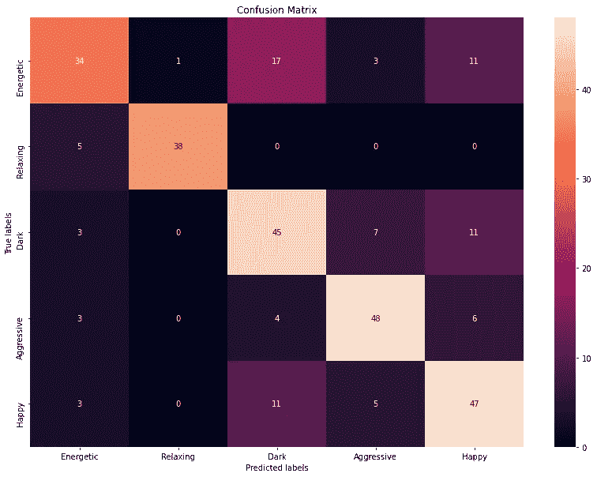

# 使用神经网络和 Spotify 的 Web API 进行音乐情绪分类

> 原文：<https://medium.com/codex/music-mood-classification-using-neural-networks-and-spotifys-web-api-d73b391044a4?source=collection_archive---------5----------------------->

## 理解多类分类机器学习工作流中的最佳实践


[Rachit 坦克](https://unsplash.com/@rachitank?utm_source=medium&utm_medium=referral)在 [Unsplash](https://unsplash.com?utm_source=medium&utm_medium=referral) 上拍照

音乐和情感之间的关系已经有了很好的证明，但是如果你不仅仅是一个普通的音乐听众，你可能已经知道这两个概念有多么紧密的联系。无论是在早上听充满活力的音乐开始新的一天，还是在工作时听周围的音乐，或者在经历心碎时在谷歌上搜索悲伤的歌曲，我们中的许多人都曾在生活中的某个时候用音乐来引发一种情感或找到现有情感的终结。

在本文中，我们将创建一个分类模型来预测歌曲引发的情感，该模型将以歌曲的**音频特征**作为输入，并输出相应的情绪或情感标签。 **Spotify 的 Web API** 为我们提供了音频功能，其中以下功能将用作输入(对这些功能的解释来自其 API 文档):

*   能量:代表强度和活动的感知度量
*   活跃度:检测录音中是否有观众
*   速度:轨道的整体估计速度，单位为每分钟节拍数(BPM)
*   语音:检测音轨中是否存在语音单词
*   声学:音轨是否声学的置信度
*   乐器性:预测音轨是否不包含人声
*   可跳舞性:描述一条赛道适合跳舞的程度
*   持续时间:音轨的持续时间，以毫秒为单位
*   响度:轨道的整体响度，单位为分贝(dB)
*   效价:描述一首曲目所传达的音乐积极性

所有这些属性的值都在 0.0 和 1.0 之间。我们将要用到的情绪有:**精力充沛、放松、阴郁、好斗和快乐。**`scikit-learn`库将帮助我们创建和分析模型，并拆分数据。

这篇文章的灵感来自于[丁尼奥](https://neokt.github.io/projects/audio-music-mood-classification/)和[克里斯托巴尔韦亚](https://towardsdatascience.com/predicting-the-music-mood-of-a-song-with-deep-learning-c3ac2b45229e)各自关于音乐情绪分类的作品。**我** **希望本教程能帮助初学者更清楚地了解 ML 工作流程**，至少是关于在具有数字输入特征的多类分类问题的各种模型选择之间进行切换。

我希望这篇文章的主要观点是，ML 并不总是关于运行模型和评估准确性。解释和分析我们的分类器将为我们提供重要的见解，告诉我们如何改变数据集以满足我们的需求。

# 获取数据

这些数据是使用`spotipy` Python 库从 Spotify 的用户创建的基于情绪的播放列表中获得的。首先，让我们为每种情绪获取 1 个播放列表的歌曲的音频特征。目前，我们的数据集有 **484 首曲目**。

现在，我们将数据分成**训练集和**测试集。稍后，我们将使用训练集来交叉验证。在交叉验证中优化模型后，测试集将用于评估我们的模型。**训练集有 324 首曲目，测试集有 160 首曲目。**

```
trainx, testx, trainy, testy = train_test_split(data, moods, test_size = 0.33, random_state = 42, stratify=moods)
```

使用`stratify`参数确保我们的训练和测试数据的类别分布是相同的。

# 探索性分析

让我们看看我们的训练和测试集中的类分布。

```
Train class distribution:Dark          67
Relaxing      67
Energetic     67
Happy         66
Aggressive    56Test class distribution:Relaxing      33
Happy         33
Dark          33
Energetic     33
Aggressive    28
```

在我们的训练和测试集中，我们似乎有几乎相等的所有情绪分布。

现在让我们来看看每种情绪的所有属性的平均值:

正如所料，激进和充满活力的歌曲能量高，而放松的歌曲能量低。放松音乐的节奏也慢得多，而且比其他情绪更倾向于器乐化。当你继续向右滚动时，你会注意到**放松是一种很容易与其他情绪区分开来的情绪。但是我们将不得不更加努力去区别对待其他人。**

因此，探索我们的数据给了我们一个有趣的视角，我们以后可以用它来调整我们的预测。例如，如果我们的模型给出的放松歌曲的结果很差，我们可以添加启发式方法来将歌曲分类为“放松”，而不是依赖于我们的分类器的预测。

# 创建我们的第一个模型

最好从简单开始，在优化之前，先建立一个基线模型。所以让我们试试**逻辑回归**。对于预处理，我们将把数据缩放到标准的正态分布。

```
train_scaled = scaler.fit_transform(trainx)
logreg = LogisticRegression(max_iter=2000)
scores = cross_val_score(logreg, train_scaled, trainy, cv=5)
print (scores.mean())0.65
```

通过交叉验证，我们得到了 65%的准确率**。这里，我们早先的 324 首曲目的“训练”集已经被分割，使得其中的 **260** 用于交叉验证的特定迭代中的训练，而 **64** 用于验证。逻辑回归有一个称为`C`的**正则化**参数，可以使用`GridSearchCV`对其进行优化。这使**的精确度略微提高了 66%****

## **解释模型**

**我们可以通过查看赋予每个特征的重要性来解释我们的模型。这可以通过计算我们的逻辑回归系数的欧拉数的幂来获得。下面向我们展示了对我们每种情绪最重要的变量。**

```
Aggressive    speechiness
Dark          acousticness
Energetic     energy
Happy         valence
Relaxing      instrumentalness
```

**“能量”属性是一首歌曲是否“有活力”的良好鉴别器，这似乎不足为奇。**攻击性的歌往往语速比较高**(器乐歌要做到攻击性有点难)。高水平的听觉最容易辨别黑暗歌曲。对于快乐的歌曲，配价是决定情绪的主要特征(这与配价对音轨的音乐积极性的表示一致)，而**器乐歌曲更有可能是“放松的”**。**

**注意，这个解释是针对我们当前的 484 首歌曲的数据集的。虽然这似乎与我们对音乐的一般直觉一致，但通过增加我们数据集的大小，可以获得更准确和更普遍的预测。**

# **第二个模型——神经网络**

**使用交叉验证，我们现在有了一个基线准确度(66%)，并且可以转移到神经网络。我们必须做出的第一个决定是关于我们神经网络的**架构**。根据 [**NN 从业者**](https://stats.stackexchange.com/a/1097) 的说法，一个好的近似就是从 1 个隐藏层开始。**这个隐层的神经元个数可以取输入输出层单元个数的平均值**。我们的输入层有 10 个单元，输出层有 5 个单元。所以我们的隐层从 8 个单位开始比较合适。**

****

**使用 [NN SVG](http://alexlenail.me/NN-SVG/index.html) 生成的 NN 架构**

**这种特殊的架构为我们提供了 **66%** 的 CV 准确度，与逻辑回归分类器的准确度相同。**

**我们可以优化表示正则化量的**超参数**“阿尔法”和我们的 NN 的唯一隐藏层中的神经元数量。我们得到的交叉验证精度为 **67%** ，隐含层中有 10 个神经元，`alpha`为 0.1**

# **分析我们的模型**

**为了搞清楚接下来的步骤，当我们改变数据集的大小时，绘制训练和验证准确性是有意义的。这被称为**学习曲线**，它帮助我们确定增加更多数据是否有助于提高精确度。**

****

**基于学习曲线，我们可以得出结论，添加更多数据似乎会有所帮助，因为训练分数和验证分数曲线尚未收敛。**

**现在让我们为每种情绪获取 2 个播放列表的曲目数据。这给了我们总共 **914 首曲目**，其中 **490 首用于训练，122 首用于验证，301 首用于测试**。超参数优化在 alpha=1.0 和 100 个隐藏层的情况下为我们提供了 69%的准确性。**

**然而，**我们的模型有 100 个隐藏层，这让我们质疑我们是否在数据集**上过度拟合。通过比较训练和验证的准确性，我们发现事实确实如此。**

```
Train      : 79%
Validation : 69%
```

**让我们切换回一个有 8 个隐藏神经元的模型。**

```
Train      : 71%
Validation : 66%
```

**由于间隙较小，这是一个更通用的分类器。**

**另一点需要注意的是，尽管我们当前的 CV 准确度(66%)低于在较小数据集上获得的准确度(67%)，但我们可以预期当前模型具有更好的泛化能力，因为它是在大小几乎两倍的数据集上训练的。我们可以通过比较测试集上的结果来验证这一点:70%使用我们当前的模型，61%使用早期的模型。**

****所以我们最终的分类器在测试集上有 70%的准确率。****

****误差指标****

**除了准确性之外，查看其他错误度量(如精确度和召回率)也是有用的，在多类分类的情况下，这些度量可以表示为混淆矩阵。**

****

**感兴趣的主要领域是被分类为“黑暗”的能量轨迹，因为这些轨迹有最多的错误分类。**另一方面，最明显的问题是“快乐”被归类为“黑暗”,反之亦然。****

# ****结论与未来工作****

**在本文中，我们经历了一个 ML 过程的工作流程。我们首先探索我们的数据，并找出哪些属性有助于区分情绪。在建模过程中，我们采用了简单的逻辑回归分类器，然后转向神经网络。执行超参数优化后，我们观察到它有时会导致过度拟合。最后，我们分析了我们的模型，以确定添加更多的数据是否有助于更好地推广。**

**有许多可以改进的地方:**

1.  **改变我们的训练数据集，加入更多“有活力”的歌曲，因为它们是被错误分类最多的。**
2.  **尝试其他模型，如支持向量机和随机森林。**
3.  **执行特征工程以创建更善于辨别情绪的特征。**

**我希望这篇文章能帮助你更好地理解多类分类。相关代码可在 Github 库的[处获得。](https://github.com/kvsingh/music-mood-classification)**

# ****参考文献:****

*   **[https://neokt . github . io/projects/audio-music-mood-class ification/](https://neokt.github.io/projects/audio-music-mood-classification/)**
*   **[https://developer.spotify.com/documentation/](https://developer.spotify.com/documentation/)**
*   **[https://stats . stack exchange . com/questions/181/how-to-choose-the-number-of-hidden-layers-and-nodes-in-a-forward-neural-netw/1097 # 1097](https://stats.stackexchange.com/questions/181/how-to-choose-the-number-of-hidden-layers-and-nodes-in-a-feedforward-neural-netw/1097#1097)**
*   **[https://towards data science . com/predicting-the-music-mood of-a song-with-deep-learning-c3ac2b 45229 e](https://towardsdatascience.com/predicting-the-music-mood-of-a-song-with-deep-learning-c3ac2b45229e)**
*   **[http://alexlenail.me/NN-SVG/index.html](http://alexlenail.me/NN-SVG/index.html)**