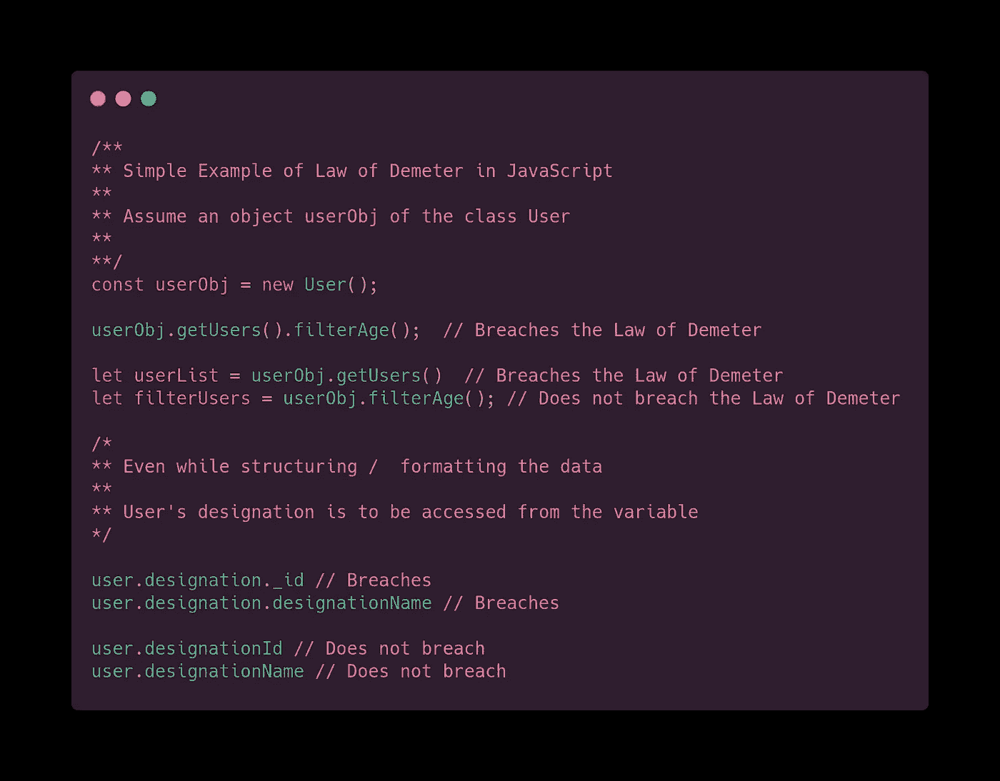

# 必知:编程的基本工程原理

> 原文：<https://medium.com/codex/must-know-basic-engineering-principles-for-programming-908dbb252a52?source=collection_archive---------0----------------------->

大家好！这是我从我的[博客<oh myscript>中修改的文章。](http://www.ohmyscript.com)

本文将涵盖所有基本的工程编程原则，以便成为更好的开发人员，或者遵循和维护干净的代码。

我们总是需要不断提醒自己的一件非常重要的事情是，我们编写的代码也会被另一个人/开发人员使用。并且，请不要让另一个人的生活变得困难，因此，写一个容易理解的代码是非常重要的，足够整洁以至于一个人不会发疯，而不是一个让另一个人处理的混乱的地方。

大多数程序员和开发人员不断地通过学习新的堆栈或学习新的技术、工具并掌握它们来提高自己。但是有一些基本规范，我们在编程或解决和处理问题陈述时经常忽略。

> 是什么让你成为一名优秀的程序员？

如果你问 10 个开发者同样的问题，你肯定会得到 10 个不同的答案。尽管答案用不同的语言表达出来，但它们很可能传达了相同的意思。作为一名专业的开发人员，一年来，我学到了很多东西，我希望这些东西在我大学期间能够非常方便地维护一个大型代码库。

***PS:我 UG 时期建的项目烂透了。*不符合我在这里解释的所有原则**

从我的个人经历和我所经历的问题来说，我相信成为一名优秀的程序员是一种理解某个问题并提出最可行的解决方案的技能，不是暂时的，而是从长远来看是最好的。我相信随着技术的更新，所有开发人员都应该遵守以下基本原则:

# 1.不要复制自己(干原理)

顾名思义，**‘不要复制你自己’原则**，或者称为**干原则**，简单地向我们建议，不要跨项目或代码库复制代码。

编写代码时，请确保避免代码重复。这个原理简单的提示我们，“ ***写一次，用两次”*** 。

*不要重复自己*

从长远来看，重复的代码将很难管理和维护，因为新的需求将会出现。

下面是一个简单的例子，如果巧克力少于 5 块，你至少可以想象非干燥方法。随着巧克力的大小/数量增加，用非 DRY 方法管理这样的代码会非常困难。

除了避免重复之外，这还使您的代码更具可读性，并允许在项目的任何其他组件/部分中重用特定的功能。而 DRY 最大的 pro 就是可维护性。如果确实有一个你需要修复的 bug，在一个地方打补丁，而不是在多个地方。

***注:***

1.  有时候，我们需要非常小心地遵循 ***干*** 的原则。因为有时，一对代码片段可能看起来很相似，但只有细微的差别
2.  避免过早 ***干*** 优化。

# 2.得墨忒耳定律

***德米特里*** 定律是一个设计原理，也称为 ***最小知识原理*** 。该法律最初规定

> *对于所有的 C 类，对于所有 M 附加到 C 的方法，M 发送消息的所有对象必须是 M 的参数对象，包括 C 的 self 对象或实例变量对象*
> 
> *(由 M 创建的对象，或由 M 调用的函数或方法创建的对象，全局变量中的对象被认为是 M 的自变量)*

最初，当 Simula 进入市场时，第一种语言具有面向对象原则的特征；对象只是被用作从一种方法向另一种方法传输数据的媒介。

“对象”背后的基本思想是相互传输数据，也就是说，它们相互通信。现在如果你阅读最初的法律，它简单地暗示了下面一般的东西:

*   对象应该只处理它们的直接邻居(邻居->方法或数据)
*   对象永远不应该依赖于另一个邻居
*   对象应该只公开其他实体使用的信息

让我解释一下这个简单的例子；

该定律确保系统具有解耦的系统设计。

# 3.亲吻(保持简单，笨蛋)

我坚信 ***吻*** 当它是“ ***保持简单&***”的首字母缩写时更有意义。

*哈哈哈！！！保持简单，愚蠢是一个伟大的生活帮！！！*

正如引用的那样，

> “一切都应该尽可能简单，而不是更简单”
> 
> -阿尔伯特·爱因斯坦

作为一个程序员，你写的代码或者设计应该被简化。它应该是最简单的。有时我们会遇到复杂的问题陈述或需求。大多数时候，解决方法很简单，我们不知道如何处理它。

在开始解决问题之前，先学习问题陈述。通常解决方案是可用的，但是我们不能计划如何写解决方案；一旦我们得到了解决方案，几乎不会去检查这是不是最好的，最佳的解决方法。

最简单的例子，当我们作为开发人员开始时，我们总是不能遵循，

甚至节点的异步操作也是 KISS 原则的最好例子。想知道怎么做？最初，我们使用回调来处理异步函数。为了使它更容易，节点开发人员跳到了承诺。为了进一步简化，节点开发人员最终提出了 async / await。有意义吗？当然，从事 Javascript 框架或库工作的人一定理解这一点(处理回调背后的痛苦)😭还必须理解 KISS 原则有多重要(异步/等待之后的生活有多简单)😎

# 4.YAGNI(你不会需要它)

作为开发人员，我们试图想得太远，对项目的未来考虑得太多。试图根据假设编写一些额外的特性，“我们可能稍后会需要它”**“或者“**我们最终会需要它们**”。**

答案是“***”YAGNI——你不会需要它的***”；设计和开发需要的东西，避免不想要的或简单预见的需求和特性。

每个开发者一定都经历过这个阶段，我自己也犯过这个错误。我开发了其他没有被问到的额外功能，假设这些功能在未来可能会有用，但最终，客户想要的最终系统与我预想的完全不同。

为什么 ***YAGNI*** ？很可能你将来根本不需要它，你在浪费时间。如果你在一个敏捷的或者增量的软件开发模型中工作，你不会一次得到完整的需求。避免给项目增加负担。

*构建所需！不要做巫师*

简单来说，活在当下，而不是未来；确保你为未来做好准备。
我只举一个简单的例子，可能听起来有点模糊，但你可以理解。

# 5.关注点分离

作为开发人员或人类，我们总是无法实现的主要和最基本的原则之一是 ***关注点分离*** 。

看看这看起来有多乱？
想象一下你的代码库会是什么样子，如果你不把它们按照关注点分开的话

作为开发人员，我们经常犯一个简单的错误，将太多的东西捆绑到一个类/函数中。我们设计功能的方式是，我们希望用一个函数、类或对象“做所有的事情”。这种为问题设计解决方案的方法是不正确的，而且从长远来看，维护起来会非常繁琐。

> *要做一件伟大的大事，就把它分解成微小的事情*
> 
> 匿名的

始终保持高度的抽象；最简单的例子是 MVP 设计(模型视图演示者设计)；其中设计分为三个部分:模型处理数据，另一个演示者处理用户界面，或者用户查看的内容。

*关注点分离:护士和医生*

就像上面的例子一样，医生和护士的职责是不同的、分开的和明确的，因此对每个人来说更容易管理和维护。

另一个简单的例子如下，

上面的例子显示了我们是如何分离样式和 HTML 内容的；基本上是将 CSS 文件外部化。

# 6.童子军规则(重构)

如果你是学校童子军的一员，你一定知道这样一个简单的规则:“离开营地的 ***比你发现它的*** ”更干净。

这个特殊的规则也可以应用到软件开发中。当实现新特性或处理遗留代码时，我们无法确保的一件事是它如何影响代码的现有质量。

我们不在现有的代码中寻找技术债务，而是在它的基础上构建新的特性。这最终会推翻整个系统，并在某个时候破坏代码，这是你绝对不希望发生的事情。

***重构*** 是关键。重构仅仅意味着改变结构，而不改变它的实现或最终结果。

最简单的例子:

***耳机*** 被重构为 ***耳机*** :携带方便，成本更低

类似地，我们应该重构我们的代码库，以获得更好的理解、可读性和易维护性，还可能提高效率和优化执行。

***注意:***
避免不必要的优化/重构

# 7.TDA(告诉不要问)

***告诉不要问*** 是一个基本原则，它提醒人们面向对象就是用处理数据的方法来封装数据。迷惑？

当你想从一个类中访问数据时，千万不要使用对象来访问它，而要通过一个请求数据的方法，用一种大家都听过的更简单的方式，一个 getter/setter。

TDA 建议执行一些操作总比直接访问数据要好。

TDA 的一个简单例子如下，

# 8.P3(正立方体原理)

这不是一个编程原则，而是一个我坚信的通用开发者原则，也是唯一能帮助你精通上述所有原则的东西。 ***练习-练习-练习*** 人靠自己完美。

有了经验，你的标准会越来越好

这些原则不是你可以学习和应用的。这与我们所听到的陈年葡萄酒非常相似。

这些是一些最重要的基本原则，在您作为开发人员的旅程中扮演着重要的角色。我很确定可能还有更多我可能错过的原则。

了解扎实原理的，敬请期待下篇文章。当谈到面向对象编程时，可靠的原则是非常重要的设计原则之一。我决定为此专门写一篇文章。

如果你喜欢这篇文章，点击“喜欢”按钮，分享文章并订阅博客。如果你想让我写一篇关于我所参与的特定领域/技术的文章，请随时给 shravan@ohmyscript.com 发邮件

请继续关注我的下一篇文章*。*

*目前就这些。感谢您的阅读。*

*下次再见。
快乐学习。*