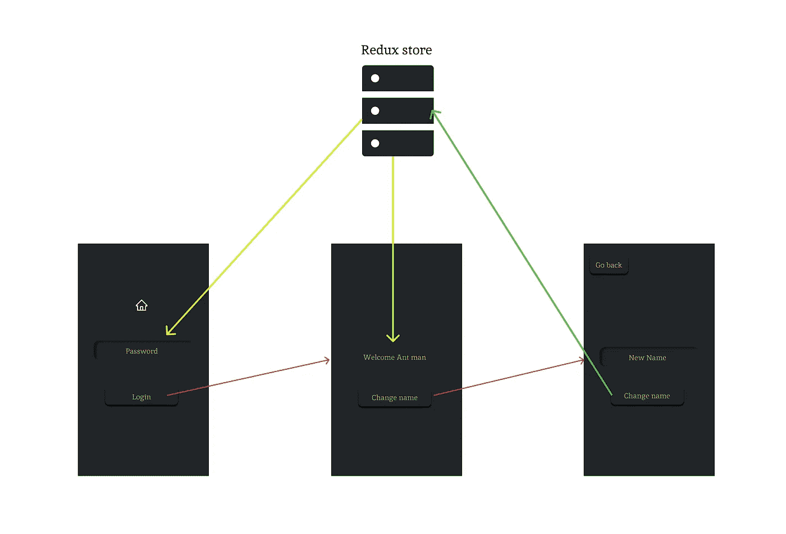
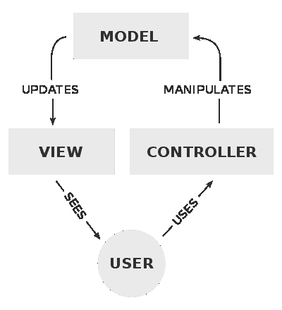

# react native 中的 MVC

> 原文：<https://medium.com/codex/mvc-in-react-native-733fe981d924?source=collection_archive---------1----------------------->

如果您使用过 React 或任何其他前端框架，或者任何足够大的 web 应用程序，您很可能遇到过 MVC 设计模式。但是如果您的应用程序不够大，您可能不需要这样组织您的代码。我想这就是我，直到现在。我从来没有尝试去深入钻研，去理解它。但是由于 react 生态系统的设计和我们最新应用程序的需求，我们最终意外地实现了 MVC 模式。我知道有很多文章在解释 MVC，但是这里是我的尝试。

在应用程序中，我们刚刚完成建设，我们需要跨多个页面跟踪可变的用户状态。这些变化是由用户动作触发的(比如表单提交、按钮点击等等)，这些动作会影响屏幕上的内容。而这个我的朋友就是 MVC 模式。

# 让我解释一下…

先说一些关键术语。

*   React (react-native)，本身被称为 MVC 中的 V，代表 View。它帮助您构建应用程序的可视组件。
*   如果您有不止一个屏幕，您可能需要跟踪全局数据，这可以用 Redux 之类的东西来完成。那将是 M，代表模型。我将解释为什么它可能被称为模型，但是在 React Native 的情况下，我发现将模型视为状态更容易。
*   最后，C 代表控制器。这些是您向用户公开来改变您的状态的接口。

因此，让我们从一个 react 本地应用程序示例中选取几页来演示这一点。这个 app 没必要完成。例如，我们要做的事情，你不会用 redux。但是概念是可以转移的。

你可以在这里找到预览[。](https://www.figma.com/proto/EWuRq2CV2iJQcGm0abNZXc/Untitled?node-id=7%3A67&scaling=scale-down&page-id=0%3A1&starting-point-node-id=2%3A2)

该应用程序有一个要求输入密码的主页。当用户点击登录时，密码会根据 redux-store 中的本地密码进行检查(不要在您的实际应用程序中做类似的事情，本地存储密码有安全风险)。在第二页上，从 redux-store 获取用户名，并显示一条`Welcome username`消息。用户可以选择通过转到第三页来更改用户名，这可以使用 change name 按钮来完成。一旦在第三页上，用户可以输入一个新名称并按下`change name`按钮，这将导致存储在 redux-store 中的数据改变，这将导致第二页上的显示被更新。最后，用户可以使用`go back`按钮返回第二页。

现在，这是 MVC 模式的完整循环。如您所见，有三个组件。首先，向用户显示视图。然后还有像`change name`按钮这样的控制器，它影响全局状态，即模型。最后，还有影响第二页视图的模型，这是控制器改变的结果。

图片来源:维基百科

现在，我们理解了控制器、模型和视图是如何交互的，我们可以继续这样组织我们的代码。我保证，那会让你的生活少一点压力。

这就是 MVC 模式。