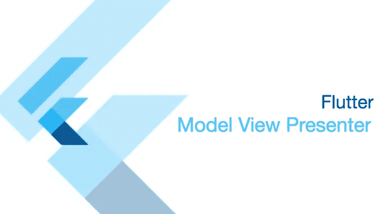
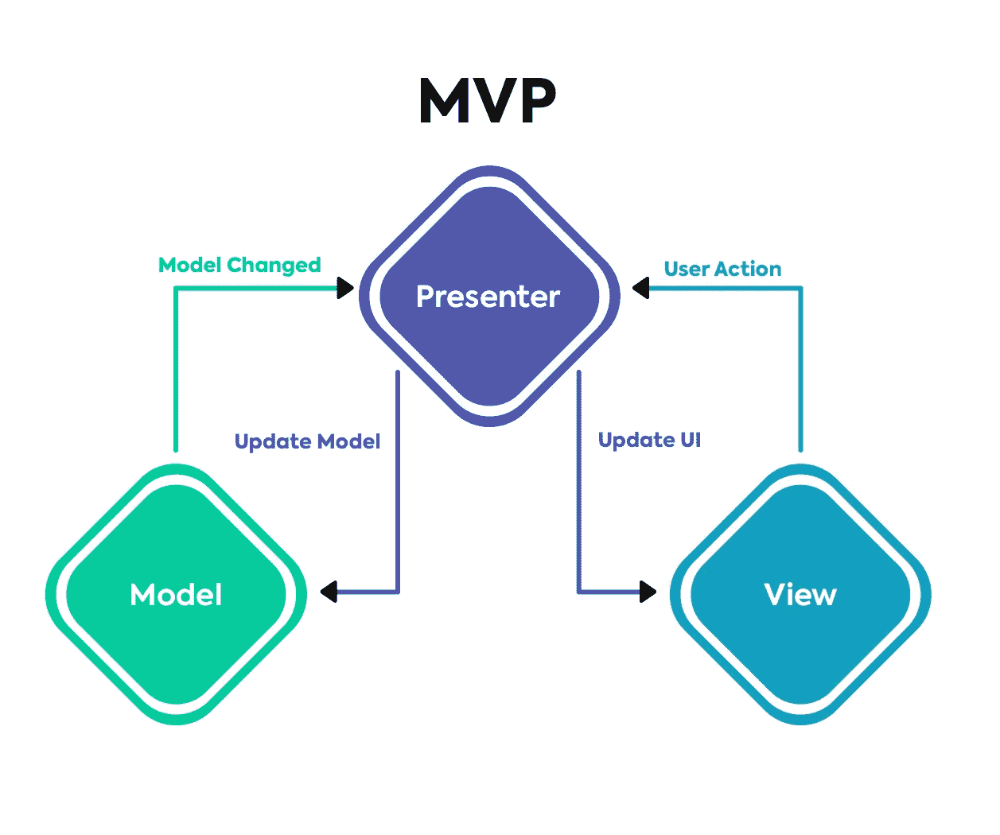

# 颤振 MVP 架构

> 原文：<https://medium.com/codex/mvp-architecture-pattern-in-flutter-b7bfe712a0ba?source=collection_archive---------4----------------------->



# 什么是 MVP？

> MVP 代表**模型视图演示者。**

> ***模型** *是定义要在用户界面中显示或以其他方式操作的数据的界面。**
> 
> ****视图** *是一个被动的界面，它显示数据(模型)并将用户命令(* [*事件*](https://en.wikipedia.org/wiki/Event_(computing)) *)发送给演示者，以便对数据进行操作。***
> 
> *****演示者** *作用于模型和视图。它从存储库(模型)中检索数据，并将其格式化以显示在视图中****

# **通信流程**

**从这个流程图中，我们将看到模型视图和表示器是如何连接的，以使我们的代码更具可读性，更易于测试。**

****

****MVP** 由**模型视图**和**展示者**组成，两者绑定在一起，最顶层的视图负责向用户展示数据，并从用户处获取数据。**

**presenter 包含视图的 UI 业务逻辑。视图中的所有调用都直接委托给演示者。**

**视图是体系结构的最顶层，它与用户交互，接受传递给演示者的输入，并从模型中获取数据，然后将数据发送回视图以呈现给用户。**

*   **视图与模型的耦合更加松散。演示者负责将模型绑定到视图。**
*   **更容易进行单元测试，因为与视图的交互是通过接口进行的。**
*   **通常视图与演示者一一对应。复杂视图可能有多个演示者。**

# **本库的使用**

**假设我们有我们喜欢的反样本:**

```
**class CounterExample extends StatefulWidget { *const* CounterExample({ Key? key,}) : super(key: key);@override_MyHomePageState *createState*() => _MyHomePageState();}class _MyHomePageState extends State<CounterExample>
implements Counter {*final* BasicCounterPresenter presenter = BasicCounterPresenter();CounterModel _viewModel = CounterModel(0);@overridevoid *initState*() {super.*initState*(); presenter.counterView = this;}@overridevoid *refreshCounter*(CounterModel viewModel) {*setState*(() { _viewModel = viewModel;});}@overrideWidget *build*(BuildContext context) { *return* Scaffold( appBar: AppBar( title: *const* Text('Mvp demo'), ), body: Center( child: Column( mainAxisAlignment: MainAxisAlignment.center, children: <Widget>[ *const* Padding(
                    padding: EdgeInsets.*only*(bottom: 30.0), child: Text("Click buttons to add and substract.",), ), Row( mainAxisAlignment: MainAxisAlignment.spaceEvenly, children: <Widget>[ FloatingActionButton( onPressed: () { presenter.*decrementCounter*(); }, child: *const* Icon(Icons.remove), ), Text("${_viewModel.counter}", ), FloatingActionButton( onPressed: () { presenter.*incrementCounter*(); }, child: *const* Icon(Icons.add), ), ], ), ], ), ),);}}**
```

**在这个简单的应用程序中，我们的模型是实际的计数器值，让我们将计数器 var 提取到一个专用的模型类中:**

```
****class** **MainModel** {
  MainModel({**this**.counter = 0});

  int counter;
}**
```

**我们需要一个 presenter，它将接收用户输入(单击 increment counter 按钮)，计算新的计数器值，然后将其应用于视图:**

```
**class BasicCounterPresenter { *final* CounterModel _counterViewModel = CounterModel(0); Counter _counterView = Counter();void *incrementCounter*() { _counterViewModel.counter++; _counterView.*refreshCounter*(_counterViewModel);}void *decrementCounter*() { _counterViewModel.counter--; _counterView.*refreshCounter*(_counterViewModel);}set *counterView*(Counter value) { _counterView = value; _counterView.*refreshCounter*(_counterViewModel); }}**
```

**最后，我们将视图从计算新计数器值的任务中释放出来，只接收用户输入并呈现当前视图模型:**

```
**class Counter {void *refreshCounter*(CounterModel viewModel) {}}**
```