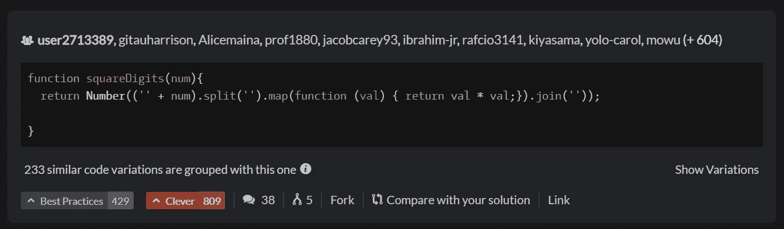

# 我最喜欢的 3 个解决编码挑战的网站

> 原文：<https://medium.com/codex/my-3-favorites-websites-to-solve-coding-challenges-1bd3b47c6fd0?source=collection_archive---------14----------------------->

你想在编码的时候改善你的逻辑吗？你是否正在学习一门新语言，但不喜欢跟随大型教程？你想在下一次科技面试中脱颖而出吗？

[内姆埃尔·塞莱蒂](https://www.pexels.com/es-es/foto/pantalla-codificando-primer-plano-lenguaje-de-programacion-6424586/)来自[派克斯](https://www.pexels.com)

如今，我正在进行 [#100DaysOfCode 挑战](https://twitter.com/jesuslagares_/status/1549136771467935747)。作为这个挑战的一部分，我已经**解决编码问题 30 天了**。当我开始的时候，我认为这将是一个非常无聊的练习。在我学习计算机科学的 4 年里，我讨厌算法和数据结构，我无法理解它们，每门课都很痛苦。然而，使用这些网站不仅让我很享受，也让我前所未有地理解了这些概念。此外，当我发现如何解决挑战时，我感到非常强大。

# 我应该尝试解决编码挑战吗？

是的。而且，如果你是一名开发人员或者你在技术领域，我推荐你很多。只尝试一下，因为当你开始练习编程时:

*   你将**改进你的逻辑**和你思考解决问题的方式。
*   你将**学习新的方法来改进你的代码**，减少你的代码行，并且**提高它的效率**。例如，我学会了如何使用*映射*而不是另一个循环将我的 O(n)算法传递给 O(n)。
*   你将会通过论坛和渠道认识很多对技术和编程感兴趣的人。
*   你将在页面的排行榜上参加**比赛。在许多页面上(首先我将向您展示)，如果招聘人员看到并喜欢您的个人资料，他们会向您发送录用通知。**
*   你将通过挑战学习新技术和语言。

# 解决编码难题的网站

你觉得怎么样？你准备好开始面对编程挑战了吗？这是我正在练习的三页纸:

## 1.[黑客排名](https://www.hackerrank.com/dashboard)

[**HackerRank**](https://www.hackerrank.com/dashboard) 是一个连接开发者和招聘者的平台。使用这个网站，你不仅可以提高自己的能力，还可以找到一份新工作。

HackerRank 仪表板

在 HackerRank 上，你可以解决问题，并在许多主题(例如解决问题)或语言(Python、SQL)中赢得一些装饰徽章和奖章..).此外，你可以通过一些免费考试，**获得免费认证**，这些都将添加到你的 LinkedIn 或简历中。

HackerRank 上的一些认证

这是我开始的网站，如果你开始编码或者你有一点经验，我建议你也从这个页面开始。原因是 HackerRank 有一些程序，如 [**30DaysOfCode**](https://www.hackerrank.com/domains/tutorials/30-days-of-code) 或[**10 daysofjavascript**](https://www.hackerrank.com/domains/tutorials/10-days-of-javascript)，在这些程序中你将从头开始学习如何编码。

## 2. [LeetCode](https://leetcode.com/)

你可能已经听说过 [**LeetCode**](https://leetcode.com/) (因为在媒体上每个人都写它)，这很正常。在 LeetCode 上，你可以找到真实的、经过验证的技术面试问题。所以，如果你在为未来的面试做准备，我建议你从 LeetCode 开始。

LeetCode 仪表板

在这个网页中，你不会像我们在 HackerRank 中那样找到免费的认证。不过， **LeetCode 有一些** [**的学习计划**](https://leetcode.com/study-plan/) **确实有趣**。这些学习计划是按照主题、数据结构(数组、队列、链表……)、算法等分类的。在技术面试中真正有用的复杂概念。

关于 LeetCode 的一些话题

练习按难度排序，如果你愿意支付额外费用，你可以访问[脸书](https://leetcode.com/problem-list/top-facebook-questions/)、[谷歌](https://leetcode.com/problem-list/top-google-questions/)或[亚马逊技术问题](https://leetcode.com/problem-list/top-amazon-questions/)。不过，如果你还不想付钱，你可以试试 [**顶级面试问题清单**](https://leetcode.com/explore/interview/card/top-interview-questions-easy/) 。

## 3.[代码大战](https://www.codewars.com/)

现在轮到最美的编码挑战网页: [**CodeWars**](https://www.codewars.com/) 。我在研究竞争性编程时发现了这个网站，CodeWars 就是基于这个网站。

CodeWars 仪表板

在**代码战**中，挑战被命名为**卡式**。你可以通过语言或使用这种语言的目的来过滤练习(例如，现在我正在用 JavaScript 通过“向上排序”来过滤问题)。

CodeWars 的奇妙之处在于，当你解决了一个问题**时，页面会显示其他用户的答案**。而你可以通过聪明或良好的做法投票给其他答案。这样你就能看到很多答案，并从中学习。其他用户也会为你的答案投票。

CodeWars 中的解决方案示例

它有一个论坛和一个非常活跃的 Discord 社区。所以，如果你想做网络，先从 [**CodeWars**](https://www.codewars.com/) 开始。

这些是我目前练习编码挑战的网站。我希望你能试一试，希望它们能像对我一样有用。

总之，如果你想**学得更快**，你可以将解决编码问题与好的实践结合起来，比如**当你解决它的时候，搜索挑战的其他解决方案**。或者你可以试着**给出问题的最优解决方案**。永远试着更进一步，你会发现你永远不会停止学习。

你以前知道这些网页吗？你用什么页面解决编程难题？

# 结论👋

谢谢大家！非常感谢您阅读这篇文章。我很想知道你对此的看法，所以不要写在评论里，我会读给你听。

反过来，如果这篇文章已经帮助你记住了，你可以为它鼓掌，并与你的同志分享。如果你不想错过我的任何一篇文章，别忘了关注我。

# 关于作者🤓

我的两个爱好是技术和交流，所以我抓住一切机会谈论或写关于技术的东西。

# 想要连接吗？📲

📩**jesuslagaresgalan@gmail.com**

📸 [**Instagram**](https://instagram.com/jesuslagares_)

💼 [**领英**](https://www.linkedin.com/in/jesus-lagares/)

📹[Youtube](https://www.youtube.com/c/Jes%C3%BAsLagares)

🐦 [**推特**](https://twitter.com/jesuslagares_)

谢谢！❣️